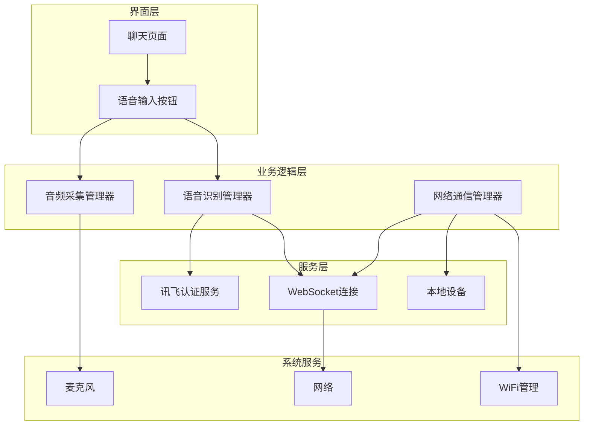
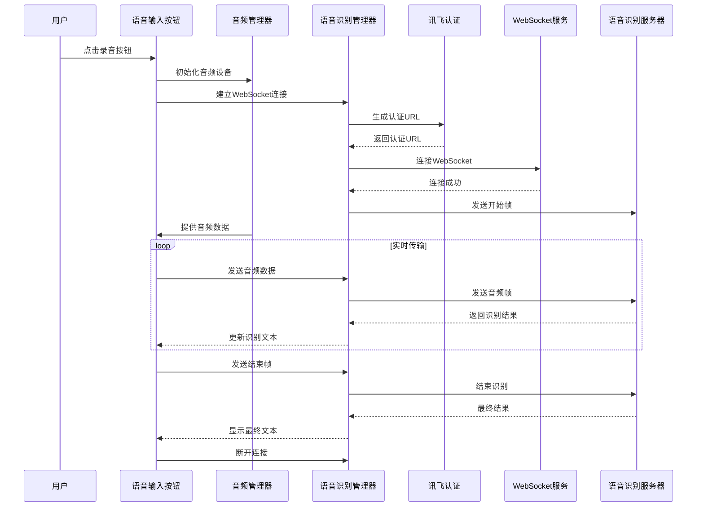
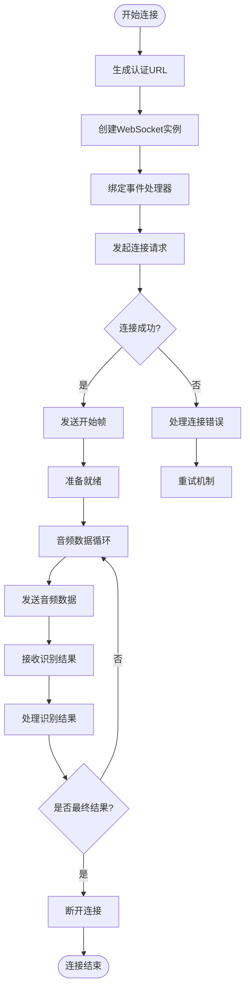
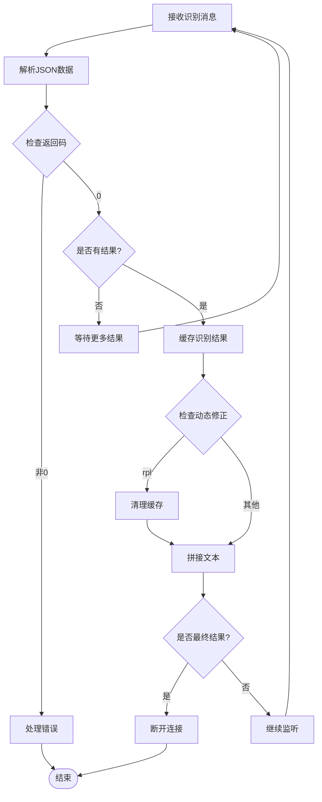
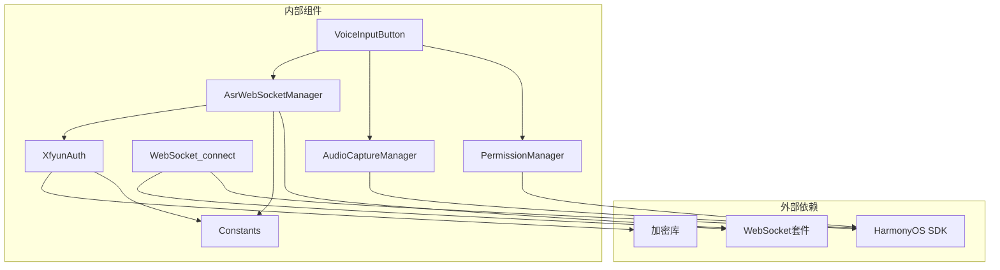

# WebSocket 语音服务集成

<cite>
**本文档引用的文件**
- [AsrWebSocketManager.ets](file://entry/src/main/ets/managers/AsrWebSocketManager.ets)
- [AudioCaptureManager.ets](file://entry/src/main/ets/managers/AudioCaptureManager.ets)
- [VoiceInputButton.ets](file://entry/src/main/ets/components/chat/VoiceInputButton.ets)
- [Constants.ets](file://entry/src/main/ets/common/Constants.ets)
- [XfyunAuth.ets](file://entry/src/main/ets/managers/XfyunAuth.ets)
- [PermissionManager.ets](file://entry/src/main/ets/managers/PermissionManager.ets)
- [network_connect.ets](file://entry/src/main/ets/pages/network_connect.ets)
- [ChatPage.ets](file://entry/src/main/ets/pages/ChatPage.ets)
- [Index.ets](file://entry/src/main/ets/pages/Index.ets)
</cite>

## 目录
1. [简介](#简介)
2. [项目结构](#项目结构)
3. [核心组件](#核心组件)
4. [架构概览](#架构概览)
5. [详细组件分析](#详细组件分析)
6. [依赖关系分析](#依赖关系分析)
7. [性能考虑](#性能考虑)
8. [故障排除指南](#故障排除指南)
9. [结论](#结论)

## 简介

本项目实现了基于 WebSocket 的语音识别服务集成，提供了完整的语音数据采集、传输和识别功能。系统采用讯飞语音识别服务，支持实时语音转文字，并集成了设备控制指令的自动发送功能。

该系统主要包含两个核心功能模块：
- **语音识别模块**：负责麦克风音频采集、WebSocket 连接管理和语音识别数据传输
- **设备通信模块**：负责与本地设备进行 WebSocket 通信，支持自动重连和状态同步

## 项目结构

项目采用基于功能模块的组织方式，主要分为以下层次：

**图表来源**
- [VoiceInputButton.ets:1-125](file://entry/src/main/ets/components/chat/VoiceInputButton.ets#L1-L125)
- [AsrWebSocketManager.ets:1-271](file://entry/src/main/ets/managers/AsrWebSocketManager.ets#L1-L271)
- [AudioCaptureManager.ets:1-80](file://entry/src/main/ets/managers/AudioCaptureManager.ets#L1-L80)
- [network_connect.ets:1-322](file://entry/src/main/ets/pages/network_connect.ets#L1-L322)

**章节来源**
- [Index.ets:1-115](file://entry/src/main/ets/pages/Index.ets#L1-L115)
- [ChatPage.ets:1-76](file://entry/src/main/ets/pages/ChatPage.ets#L1-L76)

## 核心组件

### 语音识别管理器 (AsrWebSocketManager)

语音识别管理器是整个系统的核心组件，负责与讯飞语音识别服务的交互。它实现了完整的 WebSocket 连接生命周期管理，包括连接建立、音频数据传输和结果处理。

**主要功能特性：**
- WebSocket 连接管理
- 音频数据分片传输
- 识别结果缓存和排序
- 错误处理和异常恢复

### 音频采集管理器 (AudioCaptureManager)

音频采集管理器负责从系统麦克风获取原始音频数据。它配置了标准的音频采集参数，确保与语音识别服务的要求相匹配。

**关键参数：**
- 采样率：16kHz
- 通道数：单声道
- 音频格式：16位PCM
- 编码类型：RAW

### 语音输入按钮组件 (VoiceInputButton)

语音输入按钮是用户交互的核心界面组件，提供了完整的语音识别操作流程。

**功能流程：**
1. 权限检查和申请
2. 音频设备初始化
3. WebSocket 连接建立
4. 实时音频数据传输
5. 识别结果显示和处理

**章节来源**
- [AsrWebSocketManager.ets:82-271](file://entry/src/main/ets/managers/AsrWebSocketManager.ets#L82-L271)
- [AudioCaptureManager.ets:6-80](file://entry/src/main/ets/managers/AudioCaptureManager.ets#L6-L80)
- [VoiceInputButton.ets:8-125](file://entry/src/main/ets/components/chat/VoiceInputButton.ets#L8-L125)

## 架构概览

系统采用分层架构设计，各组件职责明确，通过清晰的接口进行交互。

**图表来源**
- [VoiceInputButton.ets:71-89](file://entry/src/main/ets/components/chat/VoiceInputButton.ets#L71-L89)
- [AsrWebSocketManager.ets:92-144](file://entry/src/main/ets/managers/AsrWebSocketManager.ets#L92-L144)
- [XfyunAuth.ets:7-24](file://entry/src/main/ets/managers/XfyunAuth.ets#L7-L24)

## 详细组件分析

### WebSocket 连接建立流程

WebSocket 连接建立过程遵循严格的协议规范，确保与讯飞语音识别服务的兼容性。

**图表来源**
- [AsrWebSocketManager.ets:92-144](file://entry/src/main/ets/managers/AsrWebSocketManager.ets#L92-L144)
- [AsrWebSocketManager.ets:197-254](file://entry/src/main/ets/managers/AsrWebSocketManager.ets#L197-L254)

### 音频数据传输机制

音频数据采用分片传输的方式，每个音频片段都经过 Base64 编码后通过 WebSocket 发送。

**传输参数：**
- 音频格式：audio/L16;rate=16000
- 编码方式：raw
- 数据格式：Base64 字符串

**数据帧结构：**
- 开始帧：status=0，用于初始化识别会话
- 数据帧：status=1，包含编码后的音频数据
- 结束帧：status=2，通知识别服务结束音频传输

### 识别结果处理流程

系统实现了智能的结果缓存和排序机制，能够正确处理乱序到达的识别结果。

**图表来源**
- [AsrWebSocketManager.ets:197-254](file://entry/src/main/ets/managers/AsrWebSocketManager.ets#L197-L254)

### 设备通信模块

除了语音识别功能外，系统还集成了设备通信模块，支持与本地设备的双向通信。

**核心特性：**
- 自动重连机制：基于 WiFi 状态变化的智能重连
- 请求响应管理：使用 requestId 管理异步请求
- 状态同步：实时更新设备在线状态
- 错误恢复：网络异常时的自动恢复策略

**章节来源**
- [AsrWebSocketManager.ets:1-81](file://entry/src/main/ets/managers/AsrWebSocketManager.ets#L1-L81)
- [AsrWebSocketManager.ets:146-189](file://entry/src/main/ets/managers/AsrWebSocketManager.ets#L146-L189)
- [AsrWebSocketManager.ets:197-271](file://entry/src/main/ets/managers/AsrWebSocketManager.ets#L197-L271)
- [network_connect.ets:39-322](file://entry/src/main/ets/pages/network_connect.ets#L39-L322)

## 依赖关系分析

系统各组件之间的依赖关系清晰明确，遵循单一职责原则。

**图表来源**
- [VoiceInputButton.ets:2-6](file://entry/src/main/ets/components/chat/VoiceInputButton.ets#L2-L6)
- [AsrWebSocketManager.ets:2-5](file://entry/src/main/ets/managers/AsrWebSocketManager.ets#L2-L5)
- [AudioCaptureManager.ets:2-4](file://entry/src/main/ets/managers/AudioCaptureManager.ets#L2-L4)
- [network_connect.ets:1](file://entry/src/main/ets/pages/network_connect.ets#L1)

**章节来源**
- [Constants.ets:4-14](file://entry/src/main/ets/common/Constants.ets#L4-L14)
- [XfyunAuth.ets:1-34](file://entry/src/main/ets/managers/XfyunAuth.ets#L1-L34)
- [PermissionManager.ets:1-28](file://entry/src/main/ets/managers/PermissionManager.ets#L1-L28)

## 性能考虑

### 音频传输优化

系统在音频传输方面采用了多项优化策略：

**缓冲区管理：**
- 采样率：16kHz，确保语音质量
- 单声道配置，减少数据量
- 1280字节缓冲区大小，平衡延迟和效率

**传输策略：**
- Base64 编码确保数据完整性
- 流式传输避免大包阻塞
- 自动断开连接释放资源

### 网络连接优化

**连接池管理：**
- 单一连接复用多个音频片段
- 智能重连避免频繁断开
- 连接状态监控及时发现异常

**错误处理：**
- 重试机制防止临时网络问题
- 超时控制避免资源占用
- 异常恢复确保服务连续性

### 内存管理

系统实现了完善的内存管理策略：

**资源清理：**
- 组件销毁时自动释放音频资源
- WebSocket 连接断开时清理缓存
- 错误发生时及时释放占用的资源

**性能监控：**
- 实时监控连接状态
- 统计识别准确率
- 监控网络延迟和丢包率

## 故障排除指南

### 常见问题及解决方案

**权限问题：**
- 症状：无法启动录音功能
- 原因：缺少麦克风或网络访问权限
- 解决：检查并重新申请相关权限

**连接失败：**
- 症状：WebSocket 连接超时或认证失败
- 原因：网络不稳定或认证信息错误
- 解决：检查网络连接和认证配置

**音频传输异常：**
- 症状：识别结果不完整或延迟过高
- 原因：音频缓冲区配置不当或网络拥塞
- 解决：调整采样参数或改善网络环境

**识别准确率低：**
- 症状：语音识别结果与实际不符
- 原因：语言设置或方言配置不正确
- 解决：检查语言参数配置

### 调试工具和方法

**日志监控：**
- 启用详细的调试日志
- 监控 WebSocket 事件
- 跟踪音频数据传输

**性能分析：**
- 监控内存使用情况
- 分析网络延迟分布
- 统计识别成功率

**章节来源**
- [VoiceInputButton.ets:50-58](file://entry/src/main/ets/components/chat/VoiceInputButton.ets#L50-L58)
- [AsrWebSocketManager.ets:112-133](file://entry/src/main/ets/managers/AsrWebSocketManager.ets#L112-L133)
- [network_connect.ets:253-260](file://entry/src/main/ets/pages/network_connect.ets#L253-L260)

## 结论

本项目成功实现了基于 WebSocket 的语音识别服务集成，提供了完整的语音数据采集、传输和识别功能。系统具有以下特点：

**技术优势：**
- 遵循标准的 WebSocket 协议
- 实现了完整的连接生命周期管理
- 提供了智能的结果缓存和排序机制
- 集成了自动重连和异常恢复功能

**用户体验：**
- 简洁直观的语音输入界面
- 实时的识别结果显示
- 流畅的音频传输体验
- 稳定可靠的连接保障

**扩展性：**
- 模块化设计便于功能扩展
- 清晰的接口定义支持二次开发
- 完善的错误处理机制
- 良好的性能监控能力

该系统为语音控制和智能交互应用提供了坚实的技术基础，可以作为类似项目的参考实现。