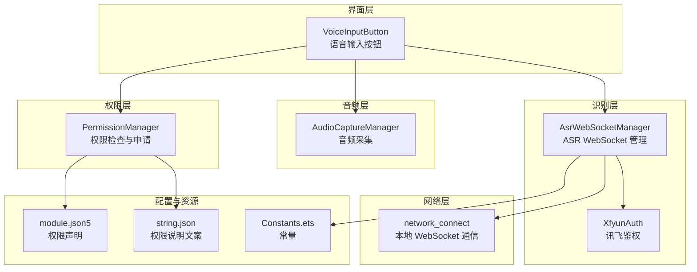
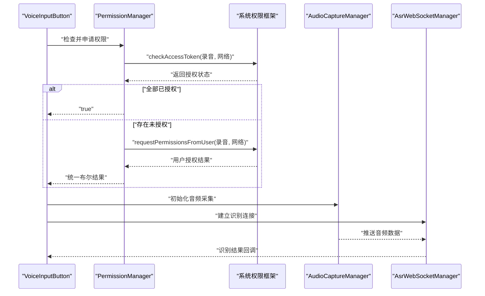
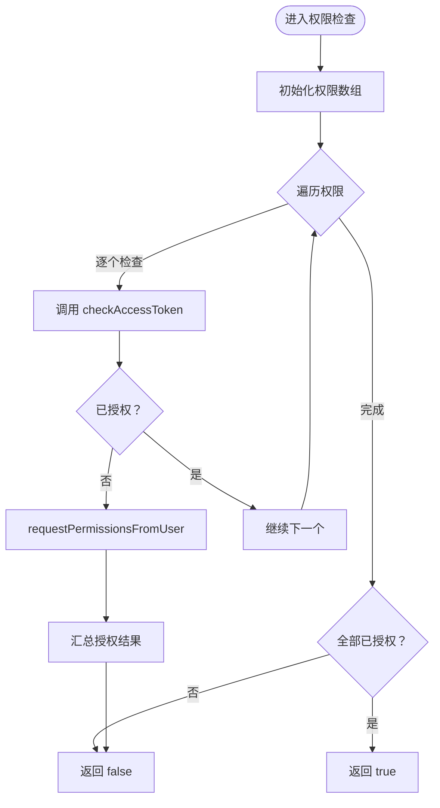
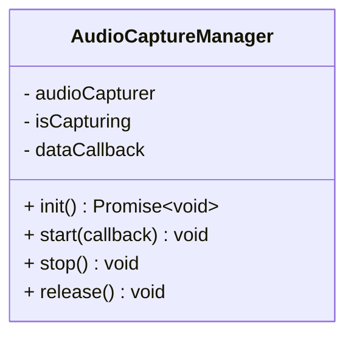
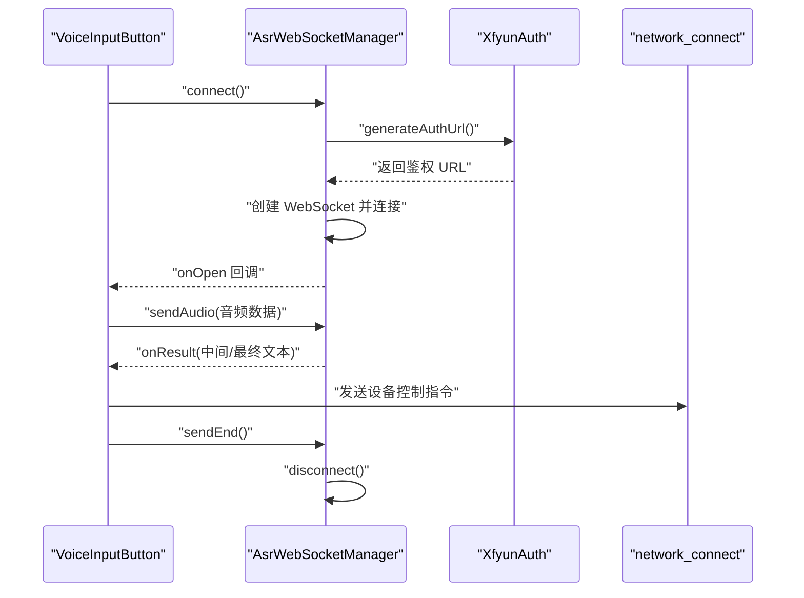
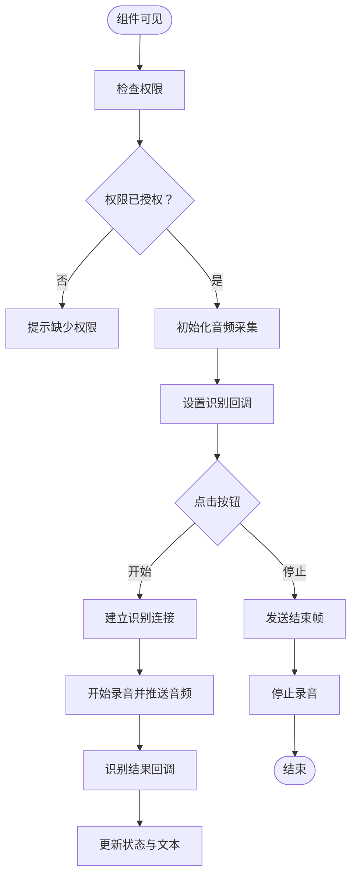
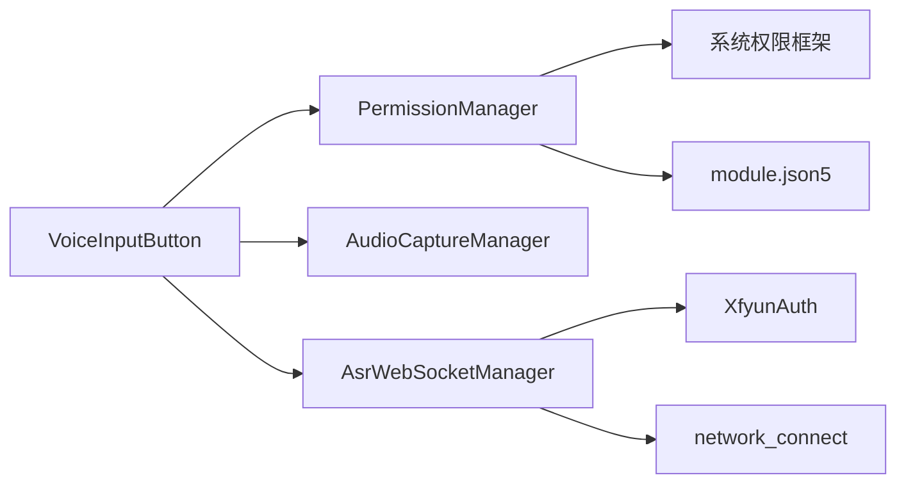

# 权限管理机制

<cite>
**本文引用的文件**
- [PermissionManager.ets](file://entry/src/main/ets/managers/PermissionManager.ets)
- [AudioCaptureManager.ets](file://entry/src/main/ets/managers/AudioCaptureManager.ets)
- [AsrWebSocketManager.ets](file://entry/src/main/ets/managers/AsrWebSocketManager.ets)
- [VoiceInputButton.ets](file://entry/src/main/ets/components/chat/VoiceInputButton.ets)
- [network_connect.ets](file://entry/src/main/ets/pages/network_connect.ets)
- [module.json5](file://entry/src/main/module.json5)
- [string.json](file://entry/src/main/resources/base/element/string.json)
- [Constants.ets](file://entry/src/main/ets/common/Constants.ets)
- [XfyunAuth.ets](file://entry/src/main/ets/managers/XfyunAuth.ets)
</cite>

## 目录
1. [简介](#简介)
2. [项目结构](#项目结构)
3. [核心组件](#核心组件)
4. [架构总览](#架构总览)
5. [详细组件分析](#详细组件分析)
6. [依赖关系分析](#依赖关系分析)
7. [性能考量](#性能考量)
8. [故障排查指南](#故障排查指南)
9. [结论](#结论)
10. [附录](#附录)

## 简介
本文件系统性梳理 OpenHarmony 平台上的权限管理机制，聚焦语音功能所需的关键权限（录音、网络访问、Wi-Fi 信息），并结合项目中的权限管理器、音频采集器、语音识别 WebSocket 管理器以及语音输入按钮组件，完整阐述权限检查与申请流程、权限状态维护、用户体验设计与最佳实践，并补充安全与合规建议。

## 项目结构
围绕权限管理与语音识别功能，关键模块分布如下：
- 权限管理：PermissionManager 负责权限检查与申请
- 音频采集：AudioCaptureManager 负责麦克风音频采集
- 语音识别：AsrWebSocketManager 负责与远端 ASR 服务建立 WebSocket 连接并传输音频
- 语音输入组件：VoiceInputButton 将权限、采集与识别串联，提供用户交互
- 网络连接：network_connect 提供本地 WebSocket 通信能力（与远端服务对接）
- 权限声明：module.json5 声明应用所需权限及用途说明
- 资源与常量：string.json 提供权限说明文案；Constants.ets 提供第三方服务常量
- 认证工具：XfyunAuth 生成讯飞 ASR 的鉴权 URL

图表来源
- [VoiceInputButton.ets:1-125](file://entry/src/main/ets/components/chat/VoiceInputButton.ets#L1-L125)
- [PermissionManager.ets:1-28](file://entry/src/main/ets/managers/PermissionManager.ets#L1-L28)
- [AudioCaptureManager.ets:1-80](file://entry/src/main/ets/managers/AudioCaptureManager.ets#L1-L80)
- [AsrWebSocketManager.ets:1-271](file://entry/src/main/ets/managers/AsrWebSocketManager.ets#L1-L271)
- [network_connect.ets:1-321](file://entry/src/main/ets/pages/network_connect.ets#L1-L321)
- [module.json5:37-55](file://entry/src/main/module.json5#L37-L55)
- [string.json:1-1](file://entry/src/main/resources/base/element/string.json#L1-L1)
- [Constants.ets:1-82](file://entry/src/main/ets/common/Constants.ets#L1-L82)
- [XfyunAuth.ets:1-34](file://entry/src/main/ets/managers/XfyunAuth.ets#L1-L34)

章节来源
- [module.json5:1-71](file://entry/src/main/module.json5#L1-L71)
- [string.json:1-1](file://entry/src/main/resources/base/element/string.json#L1-L1)

## 核心组件
- 权限管理器（PermissionManager）
  - 使用系统能力进行权限检查与申请，支持批量权限校验与用户授权弹窗
  - 返回统一布尔结果，便于上层组件快速判断是否具备执行条件
- 音频采集器（AudioCaptureManager）
  - 初始化音频采集器，配置采样率、声道、采样格式与编码类型
  - 提供启动、停止、释放生命周期管理，绑定数据回调以流式输出音频数据
- 语音识别 WebSocket 管理器（AsrWebSocketManager）
  - 与远端 ASR 服务建立 WebSocket 连接，发送起始帧、音频帧与结束帧
  - 解析服务端返回，维护乱序结果缓存，拼接中间与最终识别文本
- 语音输入按钮（VoiceInputButton）
  - 在组件可见时执行权限检查与初始化，负责录音状态与识别结果展示
  - 触发音频采集与识别流程，将最终识别文本写入对话列表并尝试发送设备控制指令
- 网络连接（network_connect）
  - 提供本地 WebSocket 通信能力，支持 WiFi 状态监听与自动重连
  - 与远端服务交互，接收 TTS 文本并回显至对话列表
- 权限声明与资源
  - module.json5 声明录音、网络、Wi-Fi 信息等权限，并提供权限用途说明
  - string.json 提供权限说明文案，用于向用户解释权限用途

章节来源
- [PermissionManager.ets:1-28](file://entry/src/main/ets/managers/PermissionManager.ets#L1-L28)
- [AudioCaptureManager.ets:1-80](file://entry/src/main/ets/managers/AudioCaptureManager.ets#L1-L80)
- [AsrWebSocketManager.ets:1-271](file://entry/src/main/ets/managers/AsrWebSocketManager.ets#L1-L271)
- [VoiceInputButton.ets:1-125](file://entry/src/main/ets/components/chat/VoiceInputButton.ets#L1-L125)
- [network_connect.ets:1-321](file://entry/src/main/ets/pages/network_connect.ets#L1-L321)
- [module.json5:37-55](file://entry/src/main/module.json5#L37-L55)
- [string.json:1-1](file://entry/src/main/resources/base/element/string.json#L1-L1)

## 架构总览
OpenHarmony 权限体系由“权限声明 + 运行时检查 + 用户授权 + 状态维护”构成。语音功能涉及录音与网络两类敏感权限，系统通过 AtManager 实现统一的权限检查与申请入口，应用在首次使用或交互前主动检查并引导授权。

图表来源
- [VoiceInputButton.ets:18-23](file://entry/src/main/ets/components/chat/VoiceInputButton.ets#L18-L23)
- [PermissionManager.ets:8-27](file://entry/src/main/ets/managers/PermissionManager.ets#L8-L27)
- [AudioCaptureManager.ets:11-34](file://entry/src/main/ets/managers/AudioCaptureManager.ets#L11-L34)
- [AsrWebSocketManager.ets:92-144](file://entry/src/main/ets/managers/AsrWebSocketManager.ets#L92-L144)

## 详细组件分析

### 权限管理器（PermissionManager）
- 设计要点
  - 单例封装 AtManager，集中处理权限检查与申请
  - 批量权限校验：任一未授权即触发用户授权弹窗
  - 统一返回值：所有权限均授权才返回真，简化上层分支逻辑
- 关键流程
  - 权限状态查询：遍历权限数组，逐项调用 checkAccessToken
  - 动态申请：若存在未授权，调用 requestPermissionsFromUser 并汇总结果
  - 错误处理：捕获异常并返回假，避免阻断后续流程
- 与模块声明的耦合
  - module.json5 中声明的权限集合与 PermissionManager 的检查集合需保持一致，确保覆盖所有使用场景

图表来源
- [PermissionManager.ets:8-27](file://entry/src/main/ets/managers/PermissionManager.ets#L8-L27)

章节来源
- [PermissionManager.ets:1-28](file://entry/src/main/ets/managers/PermissionManager.ets#L1-L28)
- [module.json5:37-55](file://entry/src/main/module.json5#L37-L55)

### 音频采集器（AudioCaptureManager）
- 设计要点
  - 采用固定采样率、单声道、16bit、原始 PCM 格式，满足 ASR 输入要求
  - 生命周期管理：init/start/stop/release 明确职责边界，避免资源泄漏
  - 数据回调：在 start 成功后订阅 readData 事件，实时推送音频缓冲
- 性能与稳定性
  - 启动/停止回调中处理错误日志，便于定位问题
  - 重复初始化与重复启动进行幂等保护

图表来源
- [AudioCaptureManager.ets:6-80](file://entry/src/main/ets/managers/AudioCaptureManager.ets#L6-L80)

章节来源
- [AudioCaptureManager.ets:1-80](file://entry/src/main/ets/managers/AudioCaptureManager.ets#L1-L80)

### 语音识别 WebSocket 管理器（AsrWebSocketManager）
- 设计要点
  - 严格遵循讯飞 ASR 协议：发送起始帧、音频帧、结束帧
  - 结果解析：缓存乱序结果，按序列号拼接中间与最终文本
  - 错误处理：对网络错误、消息解析错误、业务错误进行分类记录
- 与鉴权模块协作
  - 通过 XfyunAuth 生成带签名的鉴权 URL，确保连接安全性
- 与网络层协作
  - 与本地 network_connect 协同，形成“本地聊天 + 远端识别”的双通道

图表来源
- [AsrWebSocketManager.ets:92-144](file://entry/src/main/ets/managers/AsrWebSocketManager.ets#L92-L144)
- [XfyunAuth.ets:7-24](file://entry/src/main/ets/managers/XfyunAuth.ets#L7-L24)
- [VoiceInputButton.ets:71-89](file://entry/src/main/ets/components/chat/VoiceInputButton.ets#L71-L89)
- [network_connect.ets:263-298](file://entry/src/main/ets/pages/network_connect.ets#L263-L298)

章节来源
- [AsrWebSocketManager.ets:1-271](file://entry/src/main/ets/managers/AsrWebSocketManager.ets#L1-L271)
- [XfyunAuth.ets:1-34](file://entry/src/main/ets/managers/XfyunAuth.ets#L1-L34)
- [network_connect.ets:1-321](file://entry/src/main/ets/pages/network_connect.ets#L1-L321)

### 语音输入按钮（VoiceInputButton）
- 设计要点
  - 生命周期内执行权限检查与初始化，保证功能可用性
  - 录音状态与识别状态可视化，提升用户感知
  - 最终识别文本写入对话列表，并尝试发送设备控制指令
- 用户体验
  - 状态文案随录音阶段变化，提供即时反馈
  - 权限不足时明确提示“缺少必要权限”，引导用户前往设置授权

图表来源
- [VoiceInputButton.ets:18-89](file://entry/src/main/ets/components/chat/VoiceInputButton.ets#L18-L89)

章节来源
- [VoiceInputButton.ets:1-125](file://entry/src/main/ets/components/chat/VoiceInputButton.ets#L1-L125)

### 网络连接（network_connect）
- 设计要点
  - 提供本地 WebSocket 通信，支持 WiFi 状态监听与自动重连
  - 维护会话状态与请求队列，确保消息有序处理
- 与语音识别的协同
  - 作为本地聊天通道，与远端 ASR 识别结果形成互补

章节来源
- [network_connect.ets:1-321](file://entry/src/main/ets/pages/network_connect.ets#L1-L321)

## 依赖关系分析
- 权限依赖
  - PermissionManager 依赖系统权限框架，检查与申请录音与网络权限
  - module.json5 声明权限清单，与运行时检查保持一致
- 功能依赖
  - VoiceInputButton 依赖 PermissionManager、AudioCaptureManager、AsrWebSocketManager
  - AsrWebSocketManager 依赖 XfyunAuth 生成鉴权 URL
  - 识别结果与本地网络通道协同，形成完整的语音控制闭环

图表来源
- [PermissionManager.ets:1-28](file://entry/src/main/ets/managers/PermissionManager.ets#L1-L28)
- [module.json5:37-55](file://entry/src/main/module.json5#L37-L55)
- [VoiceInputButton.ets:1-125](file://entry/src/main/ets/components/chat/VoiceInputButton.ets#L1-L125)
- [AudioCaptureManager.ets:1-80](file://entry/src/main/ets/managers/AudioCaptureManager.ets#L1-L80)
- [AsrWebSocketManager.ets:1-271](file://entry/src/main/ets/managers/AsrWebSocketManager.ets#L1-L271)
- [XfyunAuth.ets:1-34](file://entry/src/main/ets/managers/XfyunAuth.ets#L1-L34)
- [network_connect.ets:1-321](file://entry/src/main/ets/pages/network_connect.ets#L1-L321)

章节来源
- [module.json5:37-55](file://entry/src/main/module.json5#L37-L55)
- [string.json:1-1](file://entry/src/main/resources/base/element/string.json#L1-L1)

## 性能考量
- 权限检查
  - 批量权限检查应尽量减少弹窗频率，可在组件初始化阶段一次性完成
  - 对于频繁切换的场景，可引入短期缓存策略（如在本次会话内缓存授权状态）
- 音频采集
  - 控制缓冲大小与回调频率，避免主线程阻塞
  - 合理释放资源，防止内存泄漏
- 识别连接
  - WebSocket 连接失败时采用指数退避与最大重试次数，降低抖动
  - 对乱序结果进行缓存与拼接，提高识别鲁棒性

## 故障排查指南
- 权限相关
  - 若提示“缺少必要权限”，检查 module.json5 中权限声明与 PermissionManager 检查集合是否一致
  - 用户拒绝授权后，再次触发授权弹窗需等待系统策略允许（部分设备策略不同）
- 音频采集
  - 初始化失败通常由权限不足或设备占用导致，优先检查权限与设备状态
  - 启动/停止回调报错时，查看错误码并结合日志定位
- 识别连接
  - WebSocket 连接失败多与网络环境有关，检查网络连通性与鉴权 URL 生成是否正确
  - 识别结果为空可能由于音频质量不佳或网络延迟，适当调整采样参数与重连策略

章节来源
- [PermissionManager.ets:23-26](file://entry/src/main/ets/managers/PermissionManager.ets#L23-L26)
- [AudioCaptureManager.ets:30-33](file://entry/src/main/ets/managers/AudioCaptureManager.ets#L30-L33)
- [AsrWebSocketManager.ets:135-142](file://entry/src/main/ets/managers/AsrWebSocketManager.ets#L135-L142)

## 结论
本项目在 OpenHarmony 平台上实现了清晰的权限管理与语音识别流程：通过 PermissionManager 完成权限检查与申请，借助 AudioCaptureManager 与 AsrWebSocketManager 实现高质量的音频采集与远端识别，配合 VoiceInputButton 提供直观的用户交互。整体设计遵循最小权限原则，结合模块声明与资源文案，兼顾了用户体验与合规要求。

## 附录

### 权限类型与用途
- 录音权限（MICROPHONE）
  - 用途：语音识别与设备控制
  - 声明位置：module.json5
  - 说明文案：string.json 中提供权限用途说明
- 网络访问权限（INTERNET）
  - 用途：与远端 ASR 服务通信
  - 声明位置：module.json5
- Wi-Fi 信息权限（GET_WIFI_INFO、GET_WIFI_LOCAL_MAC）
  - 用途：设备标识与网络状态监测
  - 声明位置：module.json5

章节来源
- [module.json5:37-55](file://entry/src/main/module.json5#L37-L55)
- [string.json:1-1](file://entry/src/main/resources/base/element/string.json#L1-L1)

### 权限检查与申请流程（代码路径）
- 权限检查与申请
  - [PermissionManager.checkAndRequestPermissions:8-27](file://entry/src/main/ets/managers/PermissionManager.ets#L8-L27)
- 音频采集初始化与回调
  - [AudioCaptureManager.init/start/stop/release:11-79](file://entry/src/main/ets/managers/AudioCaptureManager.ets#L11-L79)
- 语音识别连接与结果处理
  - [AsrWebSocketManager.connect/sendAudio/sendEnd/disconnect:92-195](file://entry/src/main/ets/managers/AsrWebSocketManager.ets#L92-L195)
  - [AsrWebSocketManager.handleMessage/onResult:197-254](file://entry/src/main/ets/managers/AsrWebSocketManager.ets#L197-L254)
- 语音输入按钮交互
  - [VoiceInputButton.aboutToAppear/toggleRecording/startRecording/stopRecording:18-89](file://entry/src/main/ets/components/chat/VoiceInputButton.ets#L18-L89)
- 本地网络通信与自动重连
  - [network_connect.connect/reconnect/bindEvents/send/close:149-316](file://entry/src/main/ets/pages/network_connect.ets#L149-L316)
- 讯飞鉴权 URL 生成
  - [XfyunAuth.generateAuthUrl:7-24](file://entry/src/main/ets/managers/XfyunAuth.ets#L7-L24)
- 常量定义（含讯飞服务地址）
  - [Constants:4-14](file://entry/src/main/ets/common/Constants.ets#L4-L14)