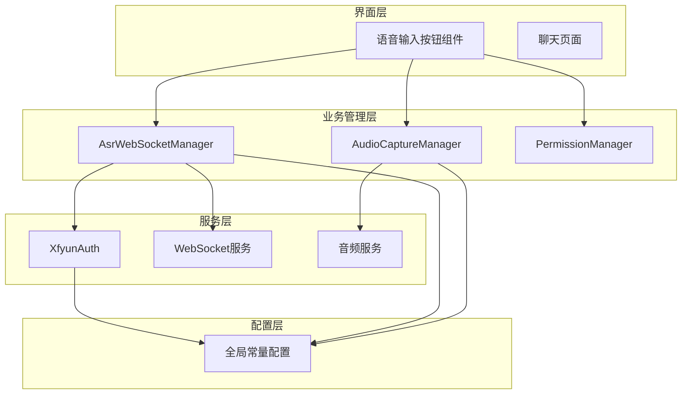
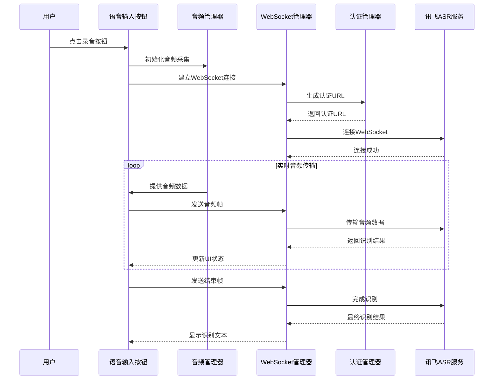
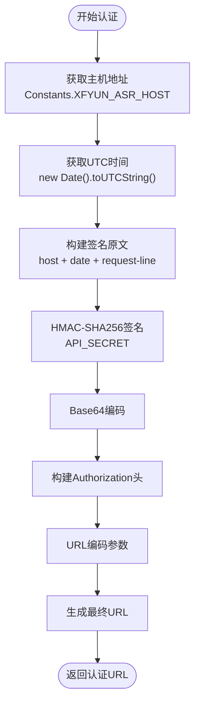
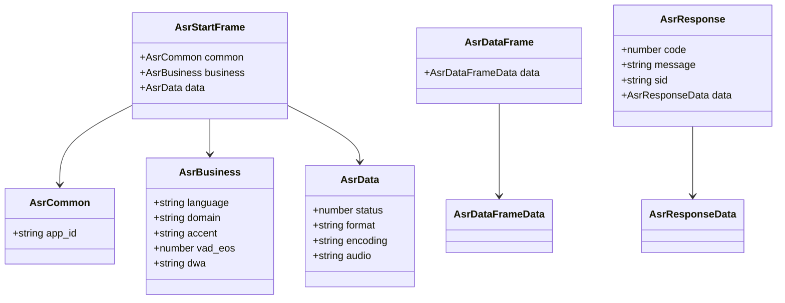
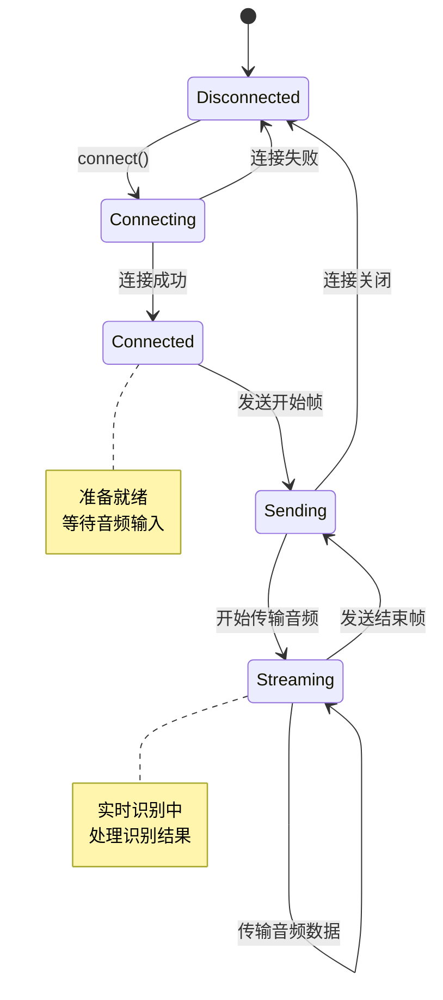
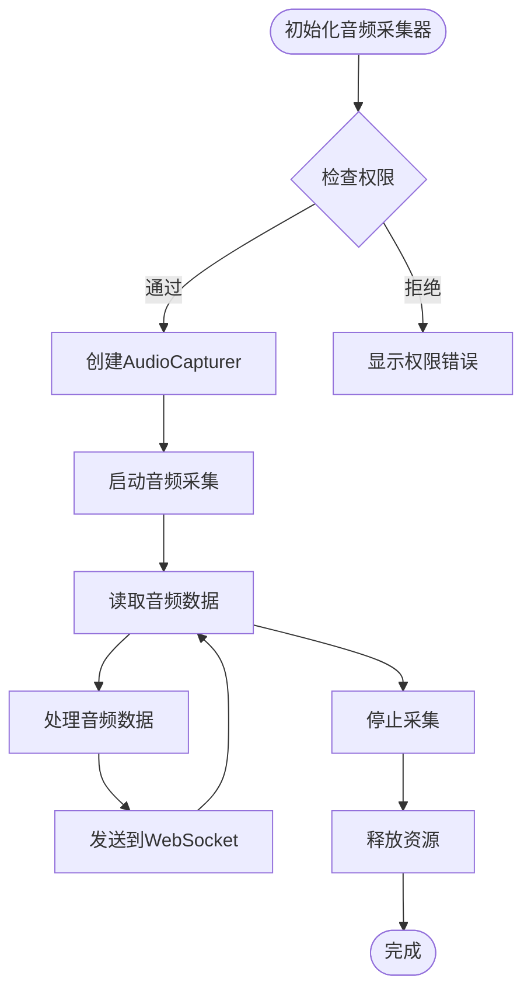
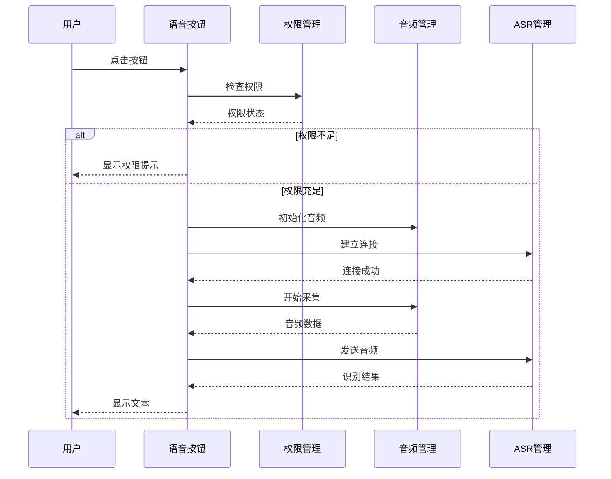
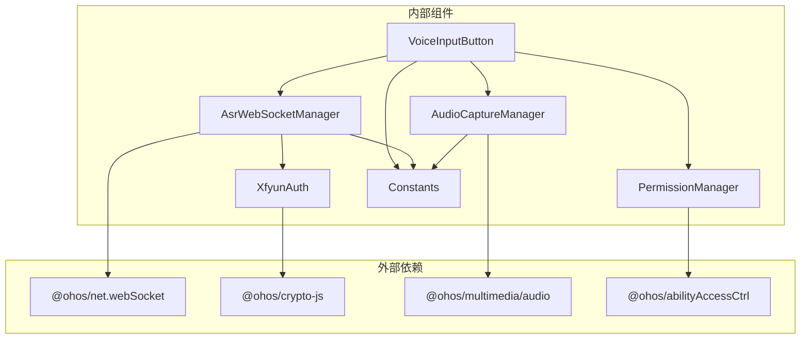
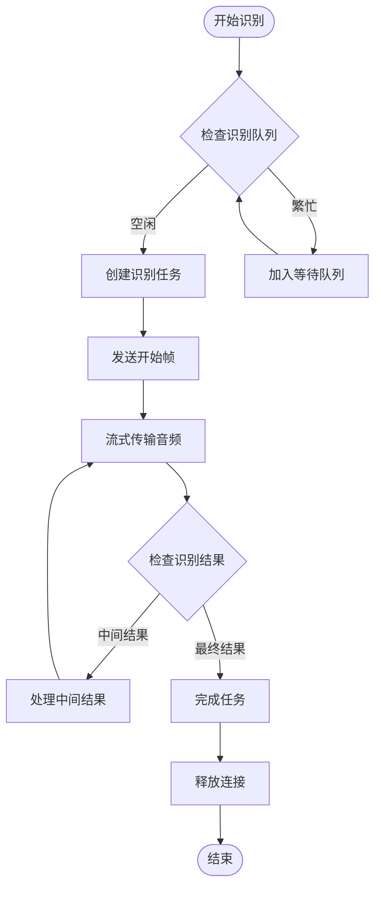
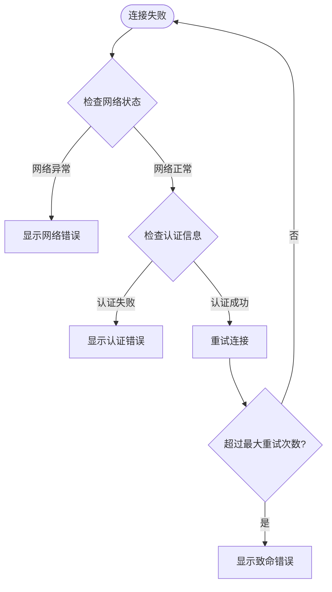

# 讯飞语音服务集成

<cite>
**本文档引用的文件**
- [XfyunAuth.ets](file://entry/src/main/ets/managers/XfyunAuth.ets)
- [AsrWebSocketManager.ets](file://entry/src/main/ets/managers/AsrWebSocketManager.ets)
- [AudioCaptureManager.ets](file://entry/src/main/ets/managers/AudioCaptureManager.ets)
- [Constants.ets](file://entry/src/main/ets/common/Constants.ets)
- [VoiceInputButton.ets](file://entry/src/main/ets/components/chat/VoiceInputButton.ets)
- [PermissionManager.ets](file://entry/src/main/ets/managers/PermissionManager.ets)
- [network_connect.ets](file://entry/src/main/ets/pages/network_connect.ets)
- [DateUtils.ets](file://entry/src/main/ets/utils/DateUtils.ets)
</cite>

## 目录
1. [简介](#简介)
2. [项目结构](#项目结构)
3. [核心组件](#核心组件)
4. [架构概览](#架构概览)
5. [详细组件分析](#详细组件分析)
6. [依赖关系分析](#依赖关系分析)
7. [性能考虑](#性能考虑)
8. [故障排查指南](#故障排查指南)
9. [结论](#结论)
10. [附录](#附录)

## 简介

本项目实现了基于讯飞语音服务的完整语音识别解决方案，集成了实时语音识别、音频采集、WebSocket通信和权限管理等功能。该系统采用ArkTS技术栈，通过WebSocket协议与讯飞ASR服务进行交互，支持实时语音转文字，并将识别结果与设备控制系统集成。

## 项目结构

项目采用模块化的架构设计，主要分为以下几个层次：

**图表来源**
- [VoiceInputButton.ets:1-125](file://entry/src/main/ets/components/chat/VoiceInputButton.ets#L1-L125)
- [AsrWebSocketManager.ets:1-271](file://entry/src/main/ets/managers/AsrWebSocketManager.ets#L1-L271)
- [AudioCaptureManager.ets:1-80](file://entry/src/main/ets/managers/AudioCaptureManager.ets#L1-L80)

**章节来源**
- [VoiceInputButton.ets:1-125](file://entry/src/main/ets/components/chat/VoiceInputButton.ets#L1-L125)
- [AsrWebSocketManager.ets:1-271](file://entry/src/main/ets/managers/AsrWebSocketManager.ets#L1-L271)
- [AudioCaptureManager.ets:1-80](file://entry/src/main/ets/managers/AudioCaptureManager.ets#L1-L80)

## 核心组件

### 讯飞认证管理器 (XfyunAuth)

负责生成符合讯飞API规范的认证URL，实现HMAC-SHA256签名算法和Base64编码。

### ASR WebSocket管理器 (AsrWebSocketManager)

实现完整的语音识别WebSocket通信流程，包括连接建立、音频数据传输、结果解析和连接管理。

### 音频采集管理器 (AudioCaptureManager)

封装音频采集功能，支持麦克风输入、实时音频流捕获和资源释放。

### 权限管理器 (PermissionManager)

处理应用所需的系统权限，包括麦克风权限和网络访问权限。

**章节来源**
- [XfyunAuth.ets:1-34](file://entry/src/main/ets/managers/XfyunAuth.ets#L1-L34)
- [AsrWebSocketManager.ets:1-271](file://entry/src/main/ets/managers/AsrWebSocketManager.ets#L1-L271)
- [AudioCaptureManager.ets:1-80](file://entry/src/main/ets/managers/AudioCaptureManager.ets#L1-L80)
- [PermissionManager.ets:1-28](file://entry/src/main/ets/managers/PermissionManager.ets#L1-L28)

## 架构概览

系统采用分层架构设计，实现了从用户交互到语音服务的完整数据流：

**图表来源**
- [VoiceInputButton.ets:62-89](file://entry/src/main/ets/components/chat/VoiceInputButton.ets#L62-L89)
- [AsrWebSocketManager.ets:92-144](file://entry/src/main/ets/managers/AsrWebSocketManager.ets#L92-L144)
- [AudioCaptureManager.ets:36-53](file://entry/src/main/ets/managers/AudioCaptureManager.ets#L36-L53)

## 详细组件分析

### 讯飞认证机制

#### 认证流程实现

**图表来源**
- [XfyunAuth.ets:7-24](file://entry/src/main/ets/managers/XfyunAuth.ets#L7-L24)

#### 认证参数配置

| 参数名称 | 配置值 | 说明 |
|---------|--------|------|
| APP_ID | 8d199df8 | 讯飞应用ID |
| API_KEY | dafaf8072a1e3534f96ebdcbf1f5c3e4 | API密钥 |
| API_SECRET | Njc4NDQ3NzJkN2I1NTRkMDkwMjJmZjA2 | API密钥密文 |
| 主机地址 | iat-api.xfyun.cn | ASR服务主机 |
| 服务URL | wss://iat-api.xfyun.cn/v2/iat | WebSocket服务地址 |

**章节来源**
- [XfyunAuth.ets:1-34](file://entry/src/main/ets/managers/XfyunAuth.ets#L1-L34)
- [Constants.ets:9-14](file://entry/src/main/ets/common/Constants.ets#L9-L14)

### ASR WebSocket通信管理

#### 数据结构定义

系统严格遵循讯飞官方示例定义了完整的数据结构：

**图表来源**
- [AsrWebSocketManager.ets:27-68](file://entry/src/main/ets/managers/AsrWebSocketManager.ets#L27-L68)

#### 连接生命周期管理

**图表来源**
- [AsrWebSocketManager.ets:92-144](file://entry/src/main/ets/managers/AsrWebSocketManager.ets#L92-L144)
- [AsrWebSocketManager.ets:167-189](file://entry/src/main/ets/managers/AsrWebSocketManager.ets#L167-L189)

**章节来源**
- [AsrWebSocketManager.ets:1-271](file://entry/src/main/ets/managers/AsrWebSocketManager.ets#L1-L271)

### 音频采集系统

#### 音频参数配置

| 参数 | 值 | 说明 |
|------|-----|------|
| 采样率 | 16000 Hz | 标准语音识别采样率 |
| 通道数 | 1 | 单声道采集 |
| 编码格式 | S16LE | 16位小端序整数 |
| 编码类型 | RAW | 原始音频数据 |
| 缓冲区大小 | 1280 字节 | 单次读取字节数 |

#### 音频采集流程

**图表来源**
- [AudioCaptureManager.ets:11-34](file://entry/src/main/ets/managers/AudioCaptureManager.ets#L11-L34)
- [AudioCaptureManager.ets:36-53](file://entry/src/main/ets/managers/AudioCaptureManager.ets#L36-L53)

**章节来源**
- [AudioCaptureManager.ets:1-80](file://entry/src/main/ets/managers/AudioCaptureManager.ets#L1-L80)
- [Constants.ets:5-8](file://entry/src/main/ets/common/Constants.ets#L5-L8)

### 用户界面集成

#### 语音输入按钮组件

VoiceInputButton组件实现了完整的语音识别交互流程：

**图表来源**
- [VoiceInputButton.ets:18-28](file://entry/src/main/ets/components/chat/VoiceInputButton.ets#L18-L28)
- [VoiceInputButton.ets:71-82](file://entry/src/main/ets/components/chat/VoiceInputButton.ets#L71-L82)

**章节来源**
- [VoiceInputButton.ets:1-125](file://entry/src/main/ets/components/chat/VoiceInputButton.ets#L1-L125)

## 依赖关系分析

系统各组件之间的依赖关系如下：

**图表来源**
- [VoiceInputButton.ets:2-6](file://entry/src/main/ets/components/chat/VoiceInputButton.ets#L2-L6)
- [AsrWebSocketManager.ets:2-5](file://entry/src/main/ets/managers/AsrWebSocketManager.ets#L2-L5)
- [XfyunAuth.ets:2-4](file://entry/src/main/ets/managers/XfyunAuth.ets#L2-L4)

**章节来源**
- [VoiceInputButton.ets:1-125](file://entry/src/main/ets/components/chat/VoiceInputButton.ets#L1-L125)
- [AsrWebSocketManager.ets:1-271](file://entry/src/main/ets/managers/AsrWebSocketManager.ets#L1-L271)
- [XfyunAuth.ets:1-34](file://entry/src/main/ets/managers/XfyunAuth.ets#L1-L34)

## 性能考虑

### 连接池管理

系统目前采用单连接管理模式，对于高并发场景建议：

1. **连接复用**：在多个识别任务间复用WebSocket连接
2. **连接超时**：设置合理的连接超时时间（建议30-60秒）
3. **心跳机制**：实现WebSocket心跳保活机制

### 并发控制

### 资源回收

1. **音频资源**：及时释放AudioCapturer实例
2. **WebSocket资源**：正确关闭连接并清理事件监听
3. **内存管理**：避免大对象长时间驻留内存

## 故障排查指南

### 常见错误类型及处理

#### 权限相关错误

| 错误类型 | 症状 | 解决方案 |
|----------|------|----------|
| 麦克风权限拒绝 | 录音按钮禁用 | 引导用户手动授权 |
| 网络权限缺失 | 连接失败 | 检查网络权限配置 |
| 权限检查异常 | 权限状态不确定 | 重新请求权限 |

#### WebSocket连接错误

#### 音频采集错误

| 错误类型 | 可能原因 | 处理方法 |
|----------|----------|----------|
| 音频初始化失败 | 设备不支持或被占用 | 检查设备状态，释放占用资源 |
| 音频数据为空 | 采样配置错误 | 验证采样率和编码格式 |
| 音频流中断 | 系统权限变化 | 重新申请权限并重启采集 |

**章节来源**
- [PermissionManager.ets:8-27](file://entry/src/main/ets/managers/PermissionManager.ets#L8-L27)
- [AsrWebSocketManager.ets:112-133](file://entry/src/main/ets/managers/AsrWebSocketManager.ets#L112-L133)
- [AudioCaptureManager.ets:30-33](file://entry/src/main/ets/managers/AudioCaptureManager.ets#L30-L33)

### 调试技巧

1. **启用详细日志**：在开发环境中增加详细的console输出
2. **网络抓包**：使用网络分析工具监控WebSocket通信
3. **音频监控**：验证音频数据流是否正常传输
4. **状态监控**：跟踪各个组件的状态变化

## 结论

本项目成功实现了讯飞语音服务的完整集成，包括认证机制、WebSocket通信、音频采集和用户界面集成。系统具有以下特点：

- **模块化设计**：清晰的组件分离和职责划分
- **完整的错误处理**：覆盖了主要的异常场景
- **良好的扩展性**：便于添加新的功能和优化性能
- **用户友好**：直观的界面和及时的状态反馈

建议后续改进方向：
1. 添加连接池和重连机制
2. 实现更完善的错误恢复策略
3. 增加性能监控和日志分析功能
4. 优化音频处理算法以提高识别准确率

## 附录

### 配置参数说明

所有配置参数均定义在Constants类中，便于统一管理和修改。

### API调用示例

系统提供了完整的API调用链路，从用户交互到语音服务的每个环节都有相应的处理逻辑。

### 扩展建议

1. **添加更多语音服务**：如语音合成、语义理解等
2. **实现离线识别**：减少对网络的依赖
3. **增强错误处理**：添加更多异常情况的处理逻辑
4. **性能优化**：实现连接复用和资源池管理