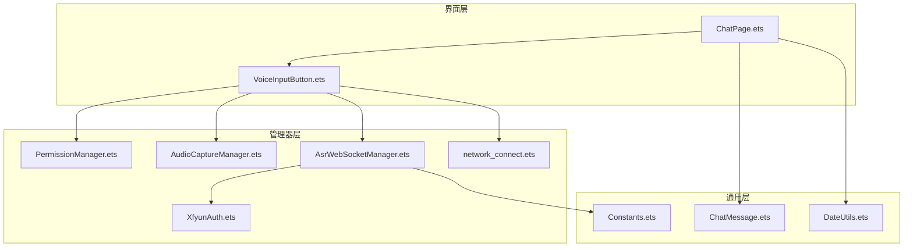
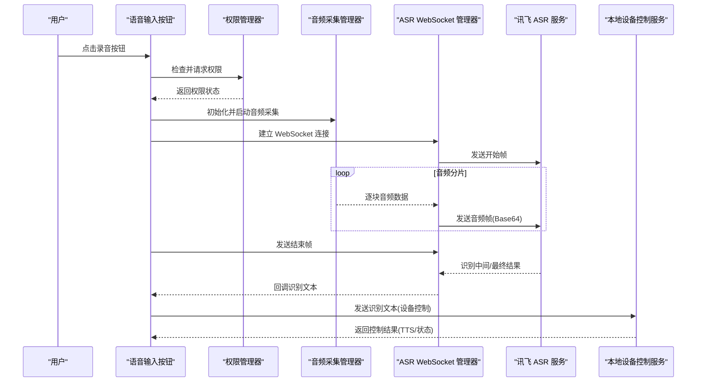
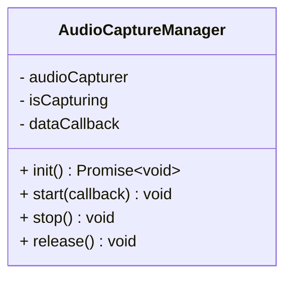
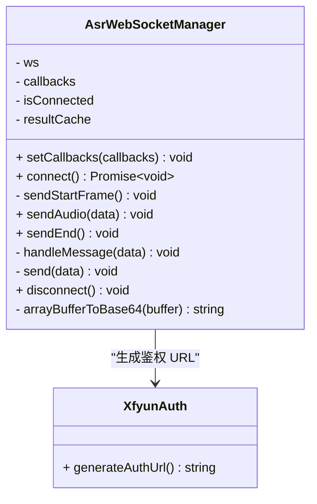
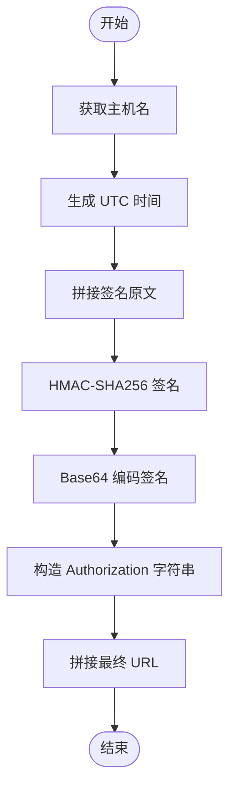
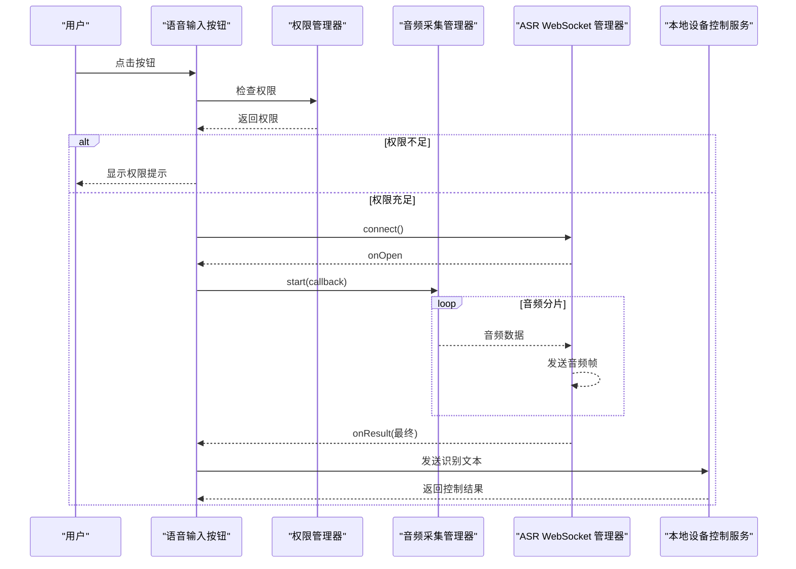
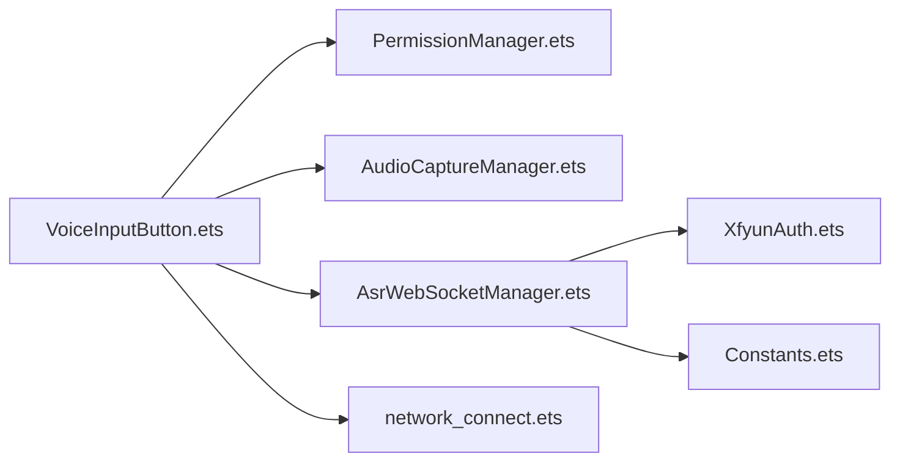

# 语音控制系统

<cite>
**本文引用的文件**
- [AudioCaptureManager.ets](file://entry/src/main/ets/managers/AudioCaptureManager.ets)
- [AsrWebSocketManager.ets](file://entry/src/main/ets/managers/AsrWebSocketManager.ets)
- [XfyunAuth.ets](file://entry/src/main/ets/managers/XfyunAuth.ets)
- [VoiceInputButton.ets](file://entry/src/main/ets/components/chat/VoiceInputButton.ets)
- [PermissionManager.ets](file://entry/src/main/ets/managers/PermissionManager.ets)
- [Constants.ets](file://entry/src/main/ets/common/Constants.ets)
- [network_connect.ets](file://entry/src/main/ets/pages/network_connect.ets)
- [ChatPage.ets](file://entry/src/main/ets/pages/ChatPage.ets)
- [ChatMessage.ets](file://entry/src/main/ets/models/ChatMessage.ets)
- [DateUtils.ets](file://entry/src/main/ets/utils/DateUtils.ets)
</cite>

## 目录
1. [简介](#简介)
2. [项目结构](#项目结构)
3. [核心组件](#核心组件)
4. [架构总览](#架构总览)
5. [详细组件分析](#详细组件分析)
6. [依赖关系分析](#依赖关系分析)
7. [性能考虑](#性能考虑)
8. [故障排查指南](#故障排查指南)
9. [结论](#结论)
10. [附录](#附录)

## 简介
本项目是一个基于 OpenHarmony 的语音控制系统，实现了从麦克风采集音频、通过 WebSocket 实时传输到讯飞语音识别服务进行语音转文本，并将识别结果与设备控制指令联动的完整链路。系统包含以下关键能力：
- 音频采集管理器：负责麦克风初始化、音频流读取、状态管理与资源释放
- WebSocket 语音服务集成：封装讯飞 ASR WebSocket 连接、鉴权、消息编解码与结果拼接
- 语音输入按钮组件：提供用户交互、权限检查、状态指示与错误处理
- 讯飞鉴权：生成符合官方规范的鉴权 URL
- 设备控制联动：将识别结果作为设备控制指令发送至本地 WebSocket 服务

## 项目结构
项目采用模块化组织，主要目录与职责如下：
- entry/src/main/ets/managers：业务管理器层，包含音频采集、WebSocket 管理、权限管理、讯飞鉴权等
- entry/src/main/ets/components：ArkTS 组件层，包含语音输入按钮等 UI 组件
- entry/src/main/ets/pages：页面层，包含聊天页与网络连接管理
- entry/src/main/ets/common：通用常量与工具
- entry/src/main/ets/models：数据模型
- entry/src/main/ets/utils：工具类

图表来源
- [ChatPage.ets:1-76](file://entry/src/main/ets/pages/ChatPage.ets#L1-L76)
- [VoiceInputButton.ets:1-125](file://entry/src/main/ets/components/chat/VoiceInputButton.ets#L1-L125)
- [PermissionManager.ets:1-28](file://entry/src/main/ets/managers/PermissionManager.ets#L1-L28)
- [AudioCaptureManager.ets:1-80](file://entry/src/main/ets/managers/AudioCaptureManager.ets#L1-L80)
- [AsrWebSocketManager.ets:1-271](file://entry/src/main/ets/managers/AsrWebSocketManager.ets#L1-L271)
- [XfyunAuth.ets:1-34](file://entry/src/main/ets/managers/XfyunAuth.ets#L1-L34)
- [network_connect.ets:1-318](file://entry/src/main/ets/pages/network_connect.ets#L1-L318)
- [Constants.ets:1-82](file://entry/src/main/ets/common/Constants.ets#L1-L82)
- [ChatMessage.ets:1-9](file://entry/src/main/ets/models/ChatMessage.ets#L1-L9)
- [DateUtils.ets:1-28](file://entry/src/main/ets/utils/DateUtils.ets#L1-L28)

章节来源
- [ChatPage.ets:1-76](file://entry/src/main/ets/pages/ChatPage.ets#L1-L76)
- [VoiceInputButton.ets:1-125](file://entry/src/main/ets/components/chat/VoiceInputButton.ets#L1-L125)
- [Constants.ets:1-82](file://entry/src/main/ets/common/Constants.ets#L1-L82)

## 核心组件
- 音频采集管理器：负责创建与配置 AudioCapturer，启动/停止音频流读取，以及资源释放
- WebSocket 语音服务管理器：负责与讯飞 ASR 建立 WebSocket 连接、发送开始帧、音频帧、结束帧，解析识别结果
- 讯飞鉴权：生成符合官方规范的 Authorization 参数与鉴权 URL
- 语音输入按钮组件：封装权限检查、录音状态切换、识别结果展示与设备控制指令发送
- 权限管理器：检查并申请麦克风与网络权限
- 网络连接管理：与本地设备控制服务建立 WebSocket 连接，发送识别文本以触发控制

章节来源
- [AudioCaptureManager.ets:1-80](file://entry/src/main/ets/managers/AudioCaptureManager.ets#L1-L80)
- [AsrWebSocketManager.ets:1-271](file://entry/src/main/ets/managers/AsrWebSocketManager.ets#L1-L271)
- [XfyunAuth.ets:1-34](file://entry/src/main/ets/managers/XfyunAuth.ets#L1-L34)
- [VoiceInputButton.ets:1-125](file://entry/src/main/ets/components/chat/VoiceInputButton.ets#L1-L125)
- [PermissionManager.ets:1-28](file://entry/src/main/ets/managers/PermissionManager.ets#L1-L28)
- [network_connect.ets:1-318](file://entry/src/main/ets/pages/network_connect.ets#L1-L318)

## 架构总览
系统整体工作流分为“本地语音识别”和“设备控制”两条主线：
- 本地语音识别：麦克风采集音频 -> WebSocket 发送到讯飞 -> 识别结果回传 -> 展示与发送设备控制指令
- 设备控制：将识别文本通过本地 WebSocket 发送，服务端根据文本执行控制动作

图表来源
- [VoiceInputButton.ets:62-89](file://entry/src/main/ets/components/chat/VoiceInputButton.ets#L62-L89)
- [AudioCaptureManager.ets:36-53](file://entry/src/main/ets/managers/AudioCaptureManager.ets#L36-L53)
- [AsrWebSocketManager.ets:92-144](file://entry/src/main/ets/managers/AsrWebSocketManager.ets#L92-L144)
- [AsrWebSocketManager.ets:146-189](file://entry/src/main/ets/managers/AsrWebSocketManager.ets#L146-L189)
- [network_connect.ets:260-295](file://entry/src/main/ets/pages/network_connect.ets#L260-L295)

## 详细组件分析

### 音频采集管理器
- 职责：创建 AudioCapturer，配置采样率、通道、采样格式与编码类型；监听 readData 事件推送音频数据；提供 start/stop/release 生命周期管理
- 关键点：
  - 使用常量配置采样率、通道数、采样格式与编码类型
  - 通过回调将原始音频数据传递给上层（如 WebSocket 管理器）
  - 错误处理与日志记录，确保资源正确释放

图表来源
- [AudioCaptureManager.ets:6-80](file://entry/src/main/ets/managers/AudioCaptureManager.ets#L6-L80)

章节来源
- [AudioCaptureManager.ets:1-80](file://entry/src/main/ets/managers/AudioCaptureManager.ets#L1-L80)
- [Constants.ets:4-14](file://entry/src/main/ets/common/Constants.ets#L4-L14)

### WebSocket 语音服务管理器（讯飞 ASR）
- 职责：与讯飞 ASR 建立 WebSocket 连接，发送开始帧、音频帧、结束帧；解析识别结果；处理错误与连接关闭
- 关键点：
  - 遵循讯飞官方数据结构定义，严格匹配字段
  - 识别结果缓存与乱序处理，支持动态修正（rpl）
  - Base64 编码音频数据，统一发送 JSON 文本帧
  - 回调 onOpen/onResult/onError/onClose，供上层组件消费

图表来源
- [AsrWebSocketManager.ets:82-271](file://entry/src/main/ets/managers/AsrWebSocketManager.ets#L82-L271)
- [XfyunAuth.ets:6-34](file://entry/src/main/ets/managers/XfyunAuth.ets#L6-L34)

章节来源
- [AsrWebSocketManager.ets:1-271](file://entry/src/main/ets/managers/AsrWebSocketManager.ets#L1-L271)
- [XfyunAuth.ets:1-34](file://entry/src/main/ets/managers/XfyunAuth.ets#L1-L34)

### 讯飞鉴权
- 职责：生成符合官方规范的 Authorization 参数，构造带签名的鉴权 URL
- 关键点：
  - 使用 HMAC-SHA256 对签名原文进行签名
  - 将签名与原始字符串进行 Base64 编码
  - 拼接最终 URL，包含 authorization、date、host 参数

图表来源
- [XfyunAuth.ets:7-24](file://entry/src/main/ets/managers/XfyunAuth.ets#L7-L24)
- [Constants.ets:9-13](file://entry/src/main/ets/common/Constants.ets#L9-L13)

章节来源
- [XfyunAuth.ets:1-34](file://entry/src/main/ets/managers/XfyunAuth.ets#L1-L34)
- [Constants.ets:1-14](file://entry/src/main/ets/common/Constants.ets#L1-L14)

### 语音输入按钮组件
- 职责：封装用户交互、权限检查、录音状态切换、识别结果显示与设备控制指令发送
- 关键点：
  - 生命周期内检查权限并初始化音频采集
  - 录音过程中将音频数据推送给 ASR 管理器
  - 识别完成后将文本加入对话列表，并尝试发送设备控制指令
  - 提供状态文本与颜色变化，直观反馈录音状态

图表来源
- [VoiceInputButton.ets:18-89](file://entry/src/main/ets/components/chat/VoiceInputButton.ets#L18-L89)
- [PermissionManager.ets:8-27](file://entry/src/main/ets/managers/PermissionManager.ets#L8-L27)
- [AudioCaptureManager.ets:36-53](file://entry/src/main/ets/managers/AudioCaptureManager.ets#L36-L53)
- [AsrWebSocketManager.ets:92-144](file://entry/src/main/ets/managers/AsrWebSocketManager.ets#L92-L144)
- [network_connect.ets:260-295](file://entry/src/main/ets/pages/network_connect.ets#L260-L295)

章节来源
- [VoiceInputButton.ets:1-125](file://entry/src/main/ets/components/chat/VoiceInputButton.ets#L1-L125)
- [PermissionManager.ets:1-28](file://entry/src/main/ets/managers/PermissionManager.ets#L1-L28)

### 权限管理器
- 职责：检查并申请麦克风与网络权限，确保录音与网络通信可用
- 关键点：
  - 使用 abilityAccessCtrl 检查权限状态
  - 若未授予，向用户发起权限请求
  - 统一错误处理与日志记录

章节来源
- [PermissionManager.ets:1-28](file://entry/src/main/ets/managers/PermissionManager.ets#L1-L28)

### 设备控制 WebSocket 管理
- 职责：与本地设备控制服务建立 WebSocket 连接，发送识别文本触发控制，接收 TTS/状态消息
- 关键点：
  - 自动重连与 WiFi 状态监听
  - 请求/响应管理，存储未完成请求并超时处理
  - 将服务端消息写入对话列表

章节来源
- [network_connect.ets:1-318](file://entry/src/main/ets/pages/network_connect.ets#L1-L318)

## 依赖关系分析
- 组件耦合：
  - 语音输入按钮同时依赖权限管理器、音频采集管理器与 WebSocket 管理器
  - WebSocket 管理器依赖讯飞鉴权与常量配置
  - 语音输入按钮与设备控制服务通过网络连接管理器交互
- 外部依赖：
  - OpenHarmony 多媒体与网络能力（音频采集、WebSocket、权限管理）
  - 讯飞 ASR 服务（WebSocket 协议与鉴权）

图表来源
- [VoiceInputButton.ets:1-125](file://entry/src/main/ets/components/chat/VoiceInputButton.ets#L1-L125)
- [PermissionManager.ets:1-28](file://entry/src/main/ets/managers/PermissionManager.ets#L1-L28)
- [AudioCaptureManager.ets:1-80](file://entry/src/main/ets/managers/AudioCaptureManager.ets#L1-L80)
- [AsrWebSocketManager.ets:1-271](file://entry/src/main/ets/managers/AsrWebSocketManager.ets#L1-L271)
- [XfyunAuth.ets:1-34](file://entry/src/main/ets/managers/XfyunAuth.ets#L1-L34)
- [network_connect.ets:1-318](file://entry/src/main/ets/pages/network_connect.ets#L1-L318)
- [Constants.ets:1-82](file://entry/src/main/ets/common/Constants.ets#L1-L82)

## 性能考虑
- 音频分片大小与延迟：合理设置采样率与分片大小，平衡实时性与识别准确率
- 连接稳定性：WebSocket 管理器具备错误处理与自动重连机制，建议在网络波动场景下启用
- 资源释放：在组件销毁或录音结束时及时停止音频采集与关闭 WebSocket，避免资源泄漏
- UI 响应：识别过程中的状态更新与错误提示应异步处理，避免阻塞主线程

## 故障排查指南
- 权限问题：若录音按钮显示“缺少必要权限”，检查麦克风与网络权限是否授予
- 连接失败：查看 WebSocket 连接日志与错误码，确认鉴权 URL 生成是否正确
- 识别无结果：确认音频采集正常、WebSocket 连接成功、开始帧与音频帧发送顺序正确
- 设备控制无效：检查本地 WebSocket 服务是否在线，消息格式是否符合预期

章节来源
- [PermissionManager.ets:1-28](file://entry/src/main/ets/managers/PermissionManager.ets#L1-L28)
- [AsrWebSocketManager.ets:92-144](file://entry/src/main/ets/managers/AsrWebSocketManager.ets#L92-L144)
- [network_connect.ets:146-177](file://entry/src/main/ets/pages/network_connect.ets#L146-L177)

## 结论
该语音控制系统通过模块化的管理器与组件，实现了从音频采集到语音识别再到设备控制的完整闭环。系统遵循讯飞官方协议，具备良好的可扩展性与健壮性。开发者可在现有基础上增加更多语音指令、优化识别参数与 UI 体验，并结合本地服务实现更丰富的智能控制场景。

## 附录
- 最佳实践
  - 在组件生命周期内正确初始化与释放资源
  - 对网络异常与权限异常进行统一处理与用户提示
  - 合理设置音频分片大小与识别参数，提升识别准确率
- 扩展建议
  - 增加语音指令词典与意图识别，支持更复杂的控制命令
  - 引入本地降噪与 VAD（语音活动检测），减少无效音频传输
  - 支持多语言与方言配置，满足国际化需求
- 自定义选项
  - 可通过常量配置调整采样率、通道数、编码格式等
  - 可修改讯飞鉴权参数与 ASR 业务参数，适配不同场景