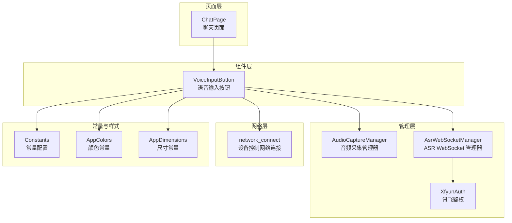
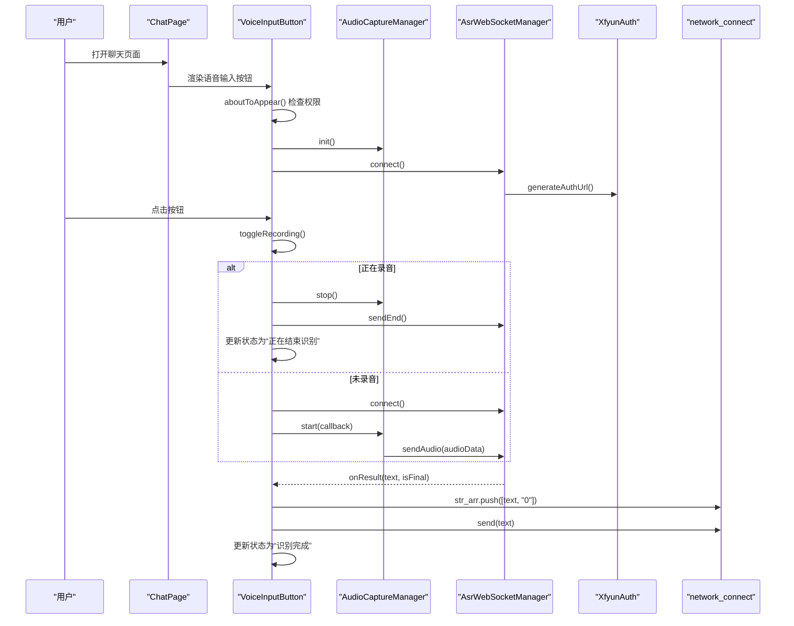
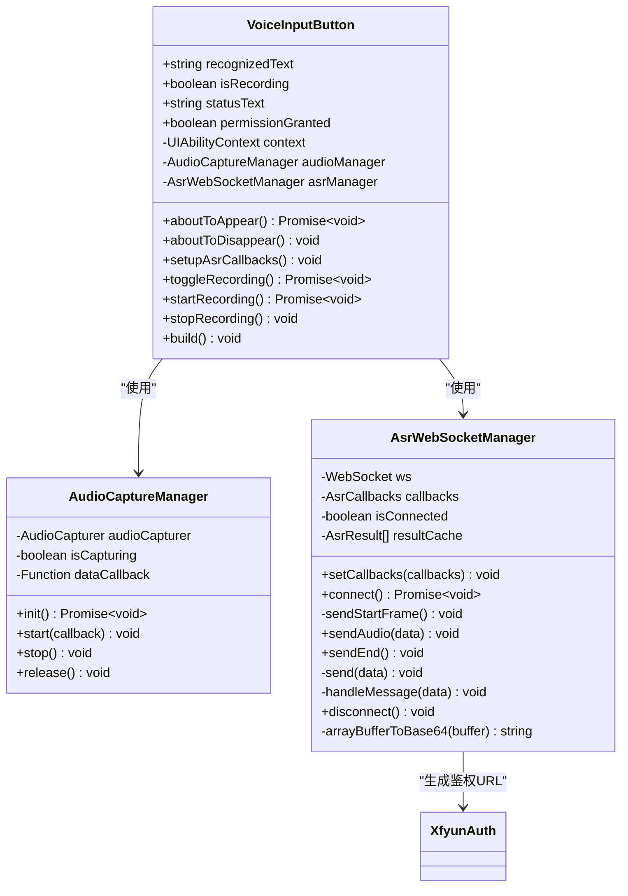
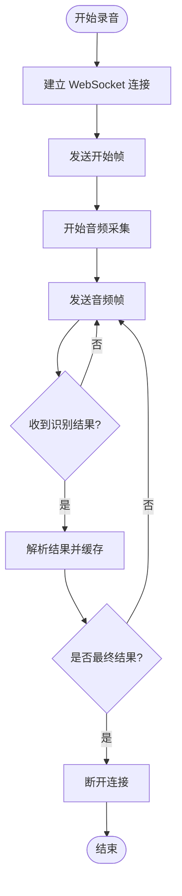
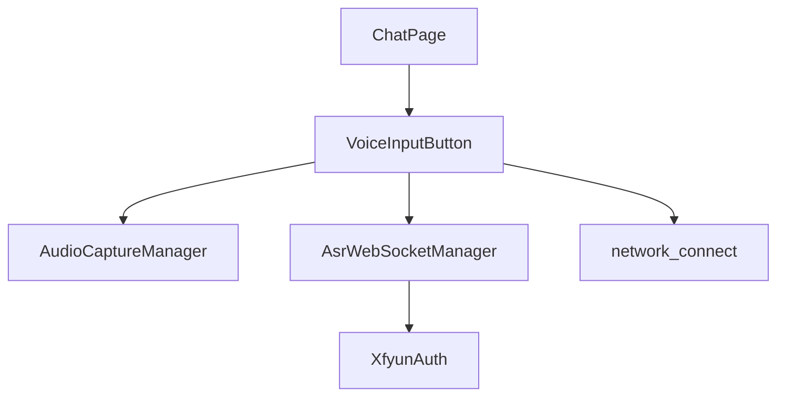

# 语音界面组件

<cite>
**本文档引用的文件**
- [VoiceInputButton.ets](file://entry/src/main/ets/components/chat/VoiceInputButton.ets)
- [AudioCaptureManager.ets](file://entry/src/main/ets/managers/AudioCaptureManager.ets)
- [AsrWebSocketManager.ets](file://entry/src/main/ets/managers/AsrWebSocketManager.ets)
- [XfyunAuth.ets](file://entry/src/main/ets/managers/XfyunAuth.ets)
- [network_connect.ets](file://entry/src/main/ets/pages/network_connect.ets)
- [ChatPage.ets](file://entry/src/main/ets/pages/ChatPage.ets)
- [Constants.ets](file://entry/src/main/ets/common/Constants.ets)
- [AppColors.ets](file://entry/src/main/ets/constants/AppColors.ets)
- [AppDimensions.ets](file://entry/src/main/ets/constants/AppDimensions.ets)
- [ChatMessageBubble.ets](file://entry/src/main/ets/components/chat/ChatMessageBubble.ets)
</cite>

## 目录
1. [简介](#简介)
2. [项目结构](#项目结构)
3. [核心组件](#核心组件)
4. [架构概览](#架构概览)
5. [详细组件分析](#详细组件分析)
6. [依赖关系分析](#依赖关系分析)
7. [性能考量](#性能考量)
8. [故障排除指南](#故障排除指南)
9. [结论](#结论)
10. [附录](#附录)

## 简介
本文件详细阐述了语音输入按钮组件的设计理念、交互模式与技术实现。该组件采用圆形按钮设计，结合状态指示与视觉反馈机制，支持点击触发与长按识别功能，并通过 WebSocket 实时传输音频数据至讯飞语音识别服务，实现从语音到文本的转换。组件具备完善的错误处理、权限检查与生命周期管理，确保在不同设备与系统环境下稳定运行。

## 项目结构
语音输入按钮组件位于聊天模块中，与页面、网络连接管理器以及音频采集和语音识别管理器协同工作：
- 组件层：VoiceInputButton 负责 UI 呈现与用户交互
- 管理层：AudioCaptureManager 负责音频采集；AsrWebSocketManager 负责与讯飞 ASR 服务通信
- 页面层：ChatPage 展示消息列表与底部输入区域
- 网络层：network_connect 提供设备控制指令发送能力
- 常量与样式：Constants、AppColors、AppDimensions 提供统一配置

**图表来源**
- [ChatPage.ets:13-75](file://entry/src/main/ets/pages/ChatPage.ets#L13-L75)
- [VoiceInputButton.ets:8-28](file://entry/src/main/ets/components/chat/VoiceInputButton.ets#L8-L28)
- [AudioCaptureManager.ets:6-34](file://entry/src/main/ets/managers/AudioCaptureManager.ets#L6-L34)
- [AsrWebSocketManager.ets:82-144](file://entry/src/main/ets/managers/AsrWebSocketManager.ets#L82-L144)
- [XfyunAuth.ets:6-24](file://entry/src/main/ets/managers/XfyunAuth.ets#L6-L24)
- [network_connect.ets:39-71](file://entry/src/main/ets/pages/network_connect.ets#L39-L71)
- [Constants.ets:4-14](file://entry/src/main/ets/common/Constants.ets#L4-L14)
- [AppColors.ets:5-47](file://entry/src/main/ets/constants/AppColors.ets#L5-L47)
- [AppDimensions.ets:5-40](file://entry/src/main/ets/constants/AppDimensions.ets#L5-L40)

**章节来源**
- [ChatPage.ets:13-75](file://entry/src/main/ets/pages/ChatPage.ets#L13-L75)
- [VoiceInputButton.ets:8-28](file://entry/src/main/ets/components/chat/VoiceInputButton.ets#L8-L28)

## 核心组件
- 语音输入按钮组件：负责用户交互、状态管理与视觉反馈，集成权限检查、音频采集与 ASR 通信
- 音频采集管理器：封装音频捕获的初始化、启动、停止与释放流程
- ASR WebSocket 管理器：负责与讯飞 ASR 服务建立连接、发送音频数据、接收识别结果与错误处理
- 讯飞鉴权：生成 WebSocket 连接所需的鉴权 URL
- 设备控制网络连接：在识别完成后向设备发送控制指令

**章节来源**
- [VoiceInputButton.ets:9-28](file://entry/src/main/ets/components/chat/VoiceInputButton.ets#L9-L28)
- [AudioCaptureManager.ets:6-80](file://entry/src/main/ets/managers/AudioCaptureManager.ets#L6-L80)
- [AsrWebSocketManager.ets:82-271](file://entry/src/main/ets/managers/AsrWebSocketManager.ets#L82-L271)
- [XfyunAuth.ets:6-24](file://entry/src/main/ets/managers/XfyunAuth.ets#L6-L24)
- [network_connect.ets:39-321](file://entry/src/main/ets/pages/network_connect.ets#L39-L321)

## 架构概览
语音输入按钮组件的交互流程如下：
- 页面加载时检查并申请麦克风权限，初始化音频采集与 ASR 连接
- 用户点击按钮触发录音流程，组件根据状态切换视觉反馈
- 音频数据通过 WebSocket 实时发送至 ASR 服务，识别结果以流式方式返回
- 识别完成后，组件更新状态文本与按钮样式，并向设备发送控制指令

**图表来源**
- [VoiceInputButton.ets:18-89](file://entry/src/main/ets/components/chat/VoiceInputButton.ets#L18-L89)
- [AudioCaptureManager.ets:36-53](file://entry/src/main/ets/managers/AudioCaptureManager.ets#L36-L53)
- [AsrWebSocketManager.ets:92-144](file://entry/src/main/ets/managers/AsrWebSocketManager.ets#L92-L144)
- [XfyunAuth.ets:7-24](file://entry/src/main/ets/managers/XfyunAuth.ets#L7-L24)
- [network_connect.ets:263-298](file://entry/src/main/ets/pages/network_connect.ets#L263-L298)

## 详细组件分析

### 语音输入按钮组件（VoiceInputButton）
- 设计理念
  - 圆形按钮设计：采用圆角矩形与阴影效果，突出交互元素
  - 状态指示：通过状态文本与按钮颜色变化直观反映录音状态
  - 视觉反馈：录音时按钮变为红色并带有阴影，非录音时为蓝色
- 状态管理
  - 空闲状态：显示“点击开始识别”，按钮为蓝色
  - 录音状态：显示“连接成功，请说话...”，按钮变为红色并带阴影
  - 结束状态：显示“正在结束识别...”，随后回到空闲状态
  - 错误状态：显示具体错误信息，按钮恢复空闲样式
- 用户交互流程
  - 点击触发：toggleRecording 切换录音状态
  - 长按识别：通过音频采集回调持续发送音频数据
  - 录音控制：startRecording 初始化连接与音频采集；stopRecording 发送结束帧并停止采集
  - 结果展示：识别完成后将用户消息推送到消息数组并尝试发送设备控制指令
- 样式设计与主题适配
  - 颜色方案：按钮主色与状态文本颜色随状态变化；支持深色主题下的对比度优化
  - 阴影效果：根据状态动态调整阴影半径与透明度
  - 动画过渡：通过状态切换实现平滑的颜色与文本变化
- 可定制性
  - 尺寸调整：按钮宽度、高度与圆角半径可通过样式属性配置
  - 颜色配置：按钮主色、阴影颜色与文本颜色可基于 AppColors 与 AppDimensions 统一管理
  - 图标替换：按钮内图标资源可替换为自定义图标

**图表来源**
- [VoiceInputButton.ets:9-125](file://entry/src/main/ets/components/chat/VoiceInputButton.ets#L9-L125)
- [AudioCaptureManager.ets:6-80](file://entry/src/main/ets/managers/AudioCaptureManager.ets#L6-L80)
- [AsrWebSocketManager.ets:82-271](file://entry/src/main/ets/managers/AsrWebSocketManager.ets#L82-L271)
- [XfyunAuth.ets:6-24](file://entry/src/main/ets/managers/XfyunAuth.ets#L6-L24)

**章节来源**
- [VoiceInputButton.ets:9-125](file://entry/src/main/ets/components/chat/VoiceInputButton.ets#L9-L125)
- [AppColors.ets:5-47](file://entry/src/main/ets/constants/AppColors.ets#L5-L47)
- [AppDimensions.ets:5-40](file://entry/src/main/ets/constants/AppDimensions.ets#L5-L40)

### 音频采集管理器（AudioCaptureManager）
- 实现模式
  - 使用多媒体音频 API 创建音频捕获器，配置采样率、通道与编码格式
  - 通过回调函数持续读取音频缓冲区数据并传递给 ASR 管理器
- 数据结构与复杂度
  - 初始化与释放操作为 O(1)，音频读取为持续事件驱动
- 依赖链
  - 依赖 Constants 中的采样率与音频格式配置
  - 与 VoiceInputButton 的生命周期耦合（初始化、启动、停止、释放）
- 性能与优化
  - 通过事件驱动避免轮询，降低 CPU 占用
  - 错误处理确保异常状态下的资源释放

**章节来源**
- [AudioCaptureManager.ets:6-80](file://entry/src/main/ets/managers/AudioCaptureManager.ets#L6-L80)
- [Constants.ets:4-14](file://entry/src/main/ets/common/Constants.ets#L4-L14)

### ASR WebSocket 管理器（AsrWebSocketManager）
- 实现模式
  - 基于 WebSocket 与讯飞 ASR 接口协议，发送开始帧、音频帧与结束帧
  - 使用 Base64 编码音频数据，解析服务端返回的识别结果
- 数据结构与复杂度
  - 结果缓存采用数组索引映射，支持乱序结果的拼接与动态修正
  - 时间复杂度与音频帧数量成正比，空间复杂度与缓存长度相关
- 依赖链
  - 依赖 XfyunAuth 生成鉴权 URL
  - 与 VoiceInputButton 的回调接口对接，提供连接、结果与错误通知
- 错误处理与性能
  - 统一错误码处理与日志记录，确保异常状态下的连接清理
  - 自动断开最终结果后连接，减少资源占用

**图表来源**
- [AsrWebSocketManager.ets:92-144](file://entry/src/main/ets/managers/AsrWebSocketManager.ets#L92-L144)
- [AsrWebSocketManager.ets:167-189](file://entry/src/main/ets/managers/AsrWebSocketManager.ets#L167-L189)
- [AsrWebSocketManager.ets:197-254](file://entry/src/main/ets/managers/AsrWebSocketManager.ets#L197-L254)

**章节来源**
- [AsrWebSocketManager.ets:82-271](file://entry/src/main/ets/managers/AsrWebSocketManager.ets#L82-L271)
- [XfyunAuth.ets:6-24](file://entry/src/main/ets/managers/XfyunAuth.ets#L6-L24)

### 讯飞鉴权（XfyunAuth）
- 实现模式
  - 生成 HMAC-SHA256 签名，构造 Authorization 头部并通过 Base64 编码
  - 返回带鉴权参数的 WebSocket URL
- 依赖链
  - 依赖 Constants 中的 APP ID、API Key、API Secret 与主机地址
- 安全性
  - 鉴权过程遵循讯飞官方协议，确保连接安全性

**章节来源**
- [XfyunAuth.ets:6-34](file://entry/src/main/ets/managers/XfyunAuth.ets#L6-L34)
- [Constants.ets:9-14](file://entry/src/main/ets/common/Constants.ets#L9-L14)

### 设备控制网络连接（network_connect）
- 实现模式
  - 管理 WebSocket 连接，处理设备控制指令的发送与响应
  - 维护消息数组，区分用户与系统消息
- 依赖链
  - 与 VoiceInputButton 协作，在识别完成后推送用户消息并发送控制指令
- 错误处理
  - WiFi 状态监听与自动重连机制，提升连接稳定性

**章节来源**
- [network_connect.ets:39-321](file://entry/src/main/ets/pages/network_connect.ets#L39-L321)
- [VoiceInputButton.ets:36-48](file://entry/src/main/ets/components/chat/VoiceInputButton.ets#L36-L48)

## 依赖关系分析
- 组件耦合
  - VoiceInputButton 与 AudioCaptureManager、AsrWebSocketManager 存在直接依赖
  - AsrWebSocketManager 依赖 XfyunAuth 生成鉴权 URL
  - ChatPage 作为容器页面，负责渲染 VoiceInputButton 并管理消息列表
- 外部依赖
  - 多媒体音频 API、WebSocket API、加密与工具库
- 循环依赖
  - 未发现循环依赖，模块职责清晰

**图表来源**
- [VoiceInputButton.ets:15-16](file://entry/src/main/ets/components/chat/VoiceInputButton.ets#L15-L16)
- [AsrWebSocketManager.ets:83](file://entry/src/main/ets/managers/AsrWebSocketManager.ets#L83)
- [XfyunAuth.ets:7](file://entry/src/main/ets/managers/XfyunAuth.ets#L7)
- [ChatPage.ets:5](file://entry/src/main/ets/pages/ChatPage.ets#L5)
- [network_connect.ets:320](file://entry/src/main/ets/pages/network_connect.ets#L320)

**章节来源**
- [VoiceInputButton.ets:15-16](file://entry/src/main/ets/components/chat/VoiceInputButton.ets#L15-L16)
- [AsrWebSocketManager.ets:83](file://entry/src/main/ets/managers/AsrWebSocketManager.ets#L83)
- [XfyunAuth.ets:7](file://entry/src/main/ets/managers/XfyunAuth.ets#L7)
- [ChatPage.ets:5](file://entry/src/main/ets/pages/ChatPage.ets#L5)
- [network_connect.ets:320](file://entry/src/main/ets/pages/network_connect.ets#L320)

## 性能考量
- 音频采集
  - 采用事件驱动读取音频缓冲区，避免轮询带来的 CPU 占用
  - 合理设置采样率与通道数，平衡音质与性能
- WebSocket 通信
  - 使用 Base64 编码音频数据，注意内存与带宽开销
  - 最终结果后主动断开连接，减少资源占用
- UI 响应
  - 状态切换与文本更新采用局部刷新，避免不必要的重绘
  - 按钮阴影与颜色变化采用轻量级动画，保证流畅体验

## 故障排除指南
- 权限问题
  - 若状态文本显示“缺少必要权限”，需引导用户授予麦克风权限
  - 组件会在首次点击时尝试重新检查权限
- 连接失败
  - 检查网络连接与 WebSocket URL 鉴权参数
  - 查看控制台输出的错误日志，定位具体失败原因
- 识别错误
  - ASR 服务端返回错误码时，组件会显示错误信息并停止录音
  - 建议重试或检查音频质量与网络状况
- 资源释放
  - 组件销毁时会释放音频捕获器与关闭 WebSocket 连接
  - 如出现资源泄漏，检查回调函数是否正确清理

**章节来源**
- [VoiceInputButton.ets:18-28](file://entry/src/main/ets/components/chat/VoiceInputButton.ets#L18-L28)
- [VoiceInputButton.ets:50-58](file://entry/src/main/ets/components/chat/VoiceInputButton.ets#L50-L58)
- [AsrWebSocketManager.ets:112-134](file://entry/src/main/ets/managers/AsrWebSocketManager.ets#L112-L134)
- [AudioCaptureManager.ets:68-79](file://entry/src/main/ets/managers/AudioCaptureManager.ets#L68-L79)

## 结论
语音输入按钮组件通过清晰的分层架构与完善的错误处理机制，实现了从用户交互到语音识别再到设备控制的完整闭环。组件在视觉反馈、状态管理与性能优化方面均体现了良好的工程实践，适合在多设备与多场景下部署使用。

## 附录
- 最佳实践
  - 在页面可见时才初始化音频与 WebSocket，避免后台资源占用
  - 对识别结果进行去噪与过滤，提升用户体验
  - 提供明确的错误提示与重试机制
- 可访问性
  - 为按钮提供可读的标签与状态描述
  - 在深色主题下确保颜色对比度满足可访问性标准
- 响应式适配
  - 按钮尺寸与字体大小可根据屏幕密度与方向动态调整
- 跨设备兼容性
  - 针对不同设备的麦克风与网络环境进行降级处理
  - 在低端设备上适当降低采样率与帧率