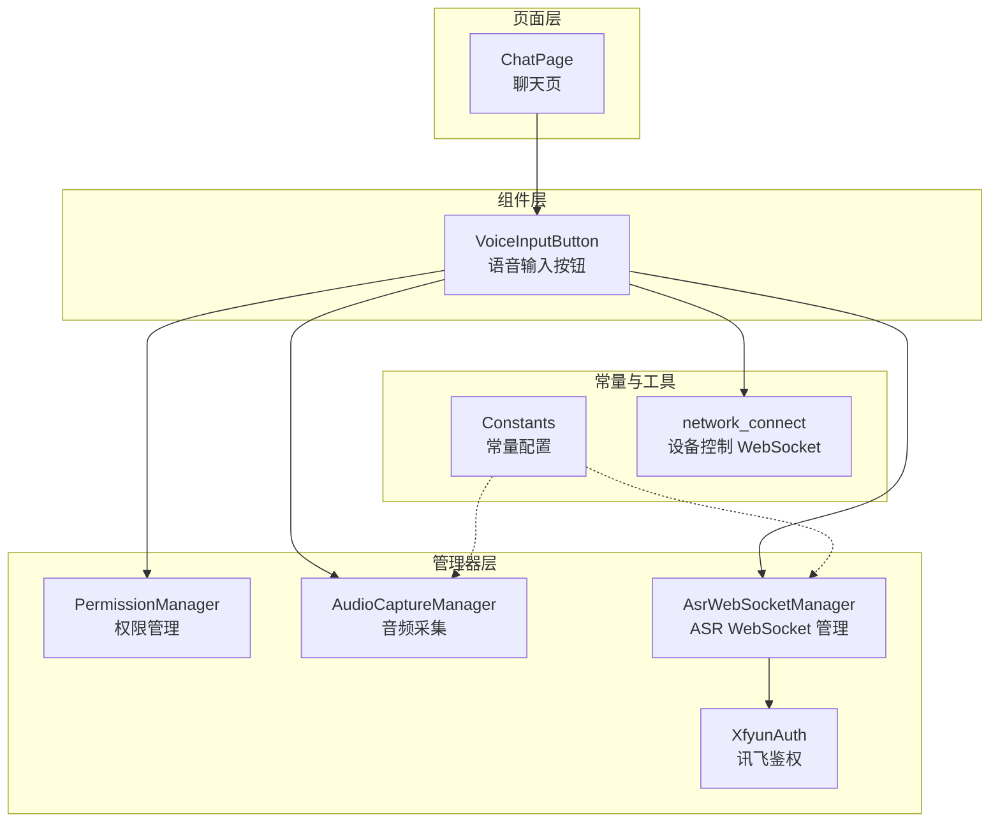
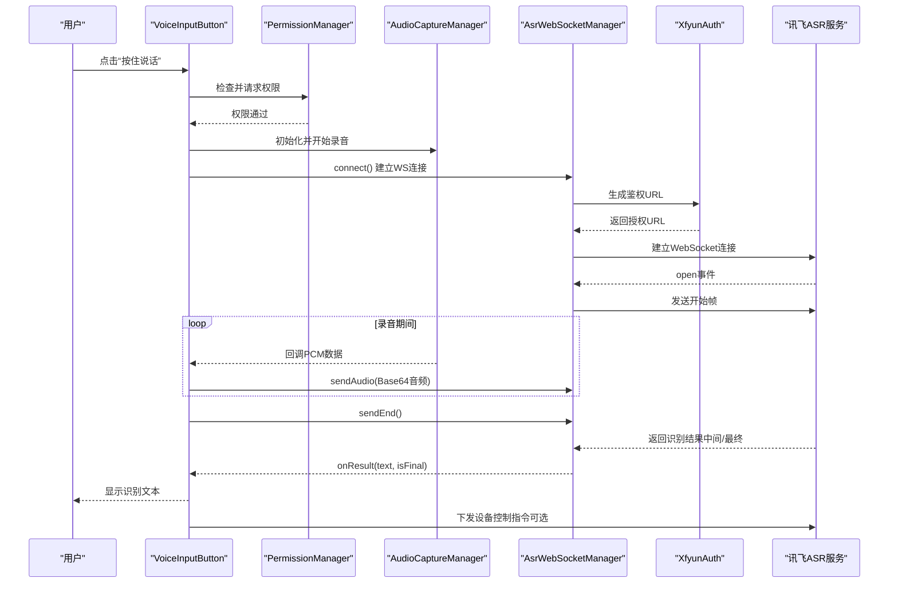
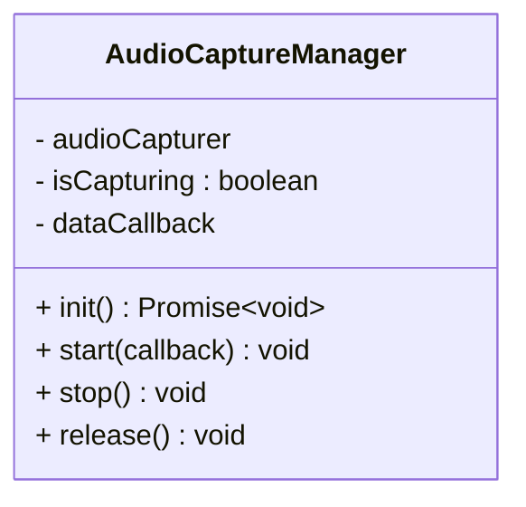
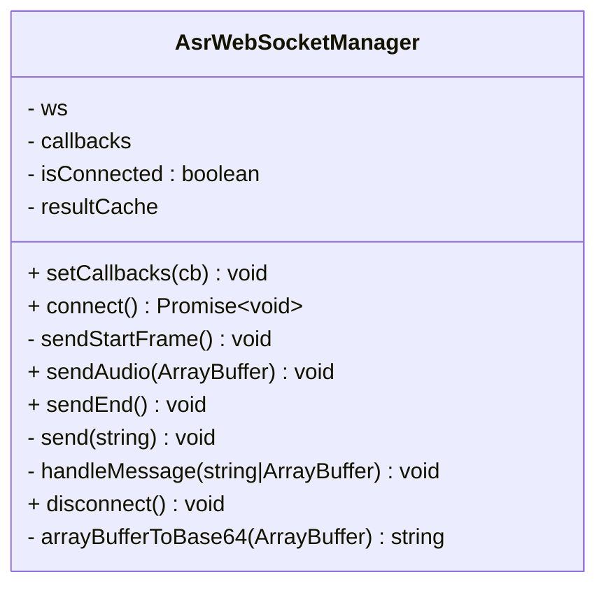
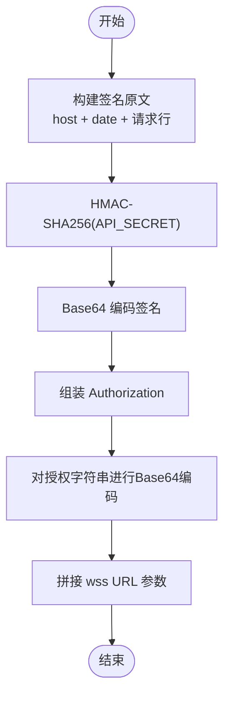
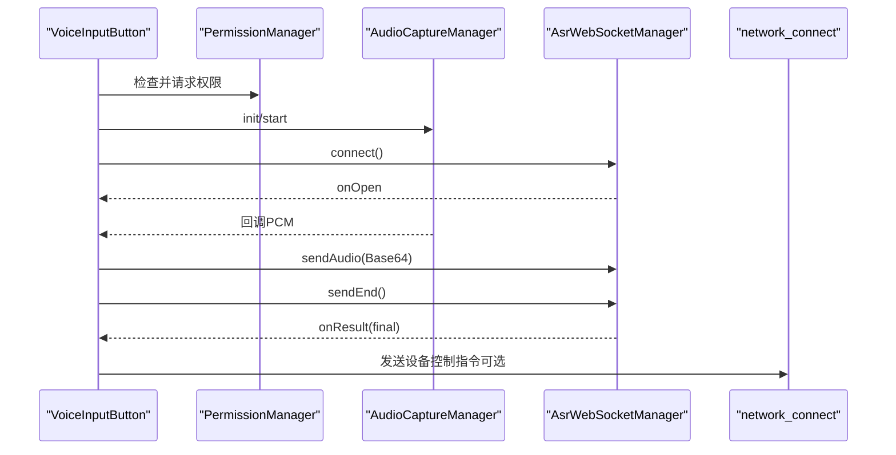
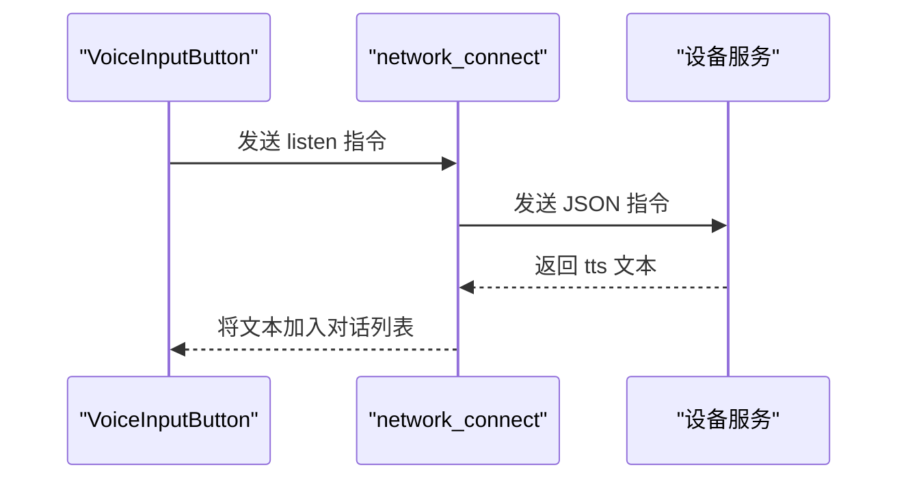
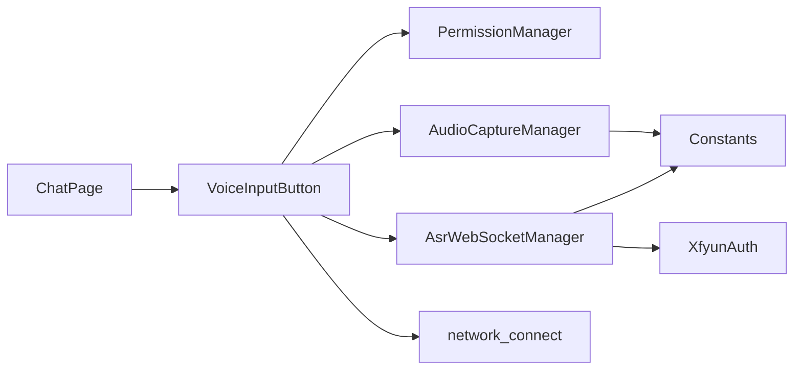

# 语音识别技术原理

<cite>
**本文引用的文件**
- [AsrWebSocketManager.ets](file://entry/src/main/ets/managers/AsrWebSocketManager.ets)
- [AudioCaptureManager.ets](file://entry/src/main/ets/managers/AudioCaptureManager.ets)
- [VoiceInputButton.ets](file://entry/src/main/ets/components/chat/VoiceInputButton.ets)
- [XfyunAuth.ets](file://entry/src/main/ets/managers/XfyunAuth.ets)
- [Constants.ets](file://entry/src/main/ets/common/Constants.ets)
- [PermissionManager.ets](file://entry/src/main/ets/managers/PermissionManager.ets)
- [network_connect.ets](file://entry/src/main/ets/pages/network_connect.ets)
- [ChatPage.ets](file://entry/src/main/ets/pages/ChatPage.ets)
</cite>

## 目录
1. [简介](#简介)
2. [项目结构](#项目结构)
3. [核心组件](#核心组件)
4. [架构总览](#架构总览)
5. [详细组件分析](#详细组件分析)
6. [依赖关系分析](#依赖关系分析)
7. [性能考量](#性能考量)
8. [故障排查指南](#故障排查指南)
9. [结论](#结论)
10. [附录](#附录)

## 简介
本文件系统性阐述本项目中的语音识别技术原理与实现路径，覆盖从音频采集、数字信号处理、特征提取到语音识别算法的完整链路；重点解析 WebSocket 实时语音传输机制（编码、传输协议、实时响应）；梳理从音频采集到文本输出的完整调用流程；说明状态管理（连接建立、音频传输、结果返回、错误处理）；并给出质量优化建议与局限性、性能考量及最佳实践。

## 项目结构
本项目采用基于模块化的前端架构，语音识别相关能力主要分布在以下层次：
- 页面层：负责用户交互与展示（如聊天页、语音输入按钮）
- 组件层：封装可复用的 UI 组件（如语音输入按钮）
- 管理器层：封装业务能力（音频采集、WebSocket 连接、鉴权等）
- 常量与工具：统一配置与通用工具（如采样率、鉴权参数）

图表来源
- [ChatPage.ets:1-76](file://entry/src/main/ets/pages/ChatPage.ets#L1-L76)
- [VoiceInputButton.ets:1-125](file://entry/src/main/ets/components/chat/VoiceInputButton.ets#L1-L125)
- [PermissionManager.ets:1-28](file://entry/src/main/ets/managers/PermissionManager.ets#L1-L28)
- [AudioCaptureManager.ets:1-80](file://entry/src/main/ets/managers/AudioCaptureManager.ets#L1-L80)
- [AsrWebSocketManager.ets:1-271](file://entry/src/main/ets/managers/AsrWebSocketManager.ets#L1-L271)
- [XfyunAuth.ets:1-34](file://entry/src/main/ets/managers/XfyunAuth.ets#L1-L34)
- [Constants.ets:1-82](file://entry/src/main/ets/common/Constants.ets#L1-L82)
- [network_connect.ets:1-318](file://entry/src/main/ets/pages/network_connect.ets#L1-L318)

章节来源
- [ChatPage.ets:1-76](file://entry/src/main/ets/pages/ChatPage.ets#L1-L76)
- [VoiceInputButton.ets:1-125](file://entry/src/main/ets/components/chat/VoiceInputButton.ets#L1-L125)
- [Constants.ets:1-82](file://entry/src/main/ets/common/Constants.ets#L1-L82)

## 核心组件
- 音频采集管理器：负责麦克风初始化、开始/停止录音、回调推送原始 PCM 数据
- ASR WebSocket 管理器：负责与讯飞 ASR 服务建立 WebSocket 连接、发送开始帧/音频帧/结束帧、解析识别结果
- 讯飞鉴权：生成带签名的 WebSocket URL，确保连接安全
- 权限管理：检查并申请麦克风与网络权限
- 设备控制 WebSocket：与本地/远程设备通信，实现语音指令的执行与反馈

章节来源
- [AudioCaptureManager.ets:1-80](file://entry/src/main/ets/managers/AudioCaptureManager.ets#L1-L80)
- [AsrWebSocketManager.ets:1-271](file://entry/src/main/ets/managers/AsrWebSocketManager.ets#L1-L271)
- [XfyunAuth.ets:1-34](file://entry/src/main/ets/managers/XfyunAuth.ets#L1-L34)
- [PermissionManager.ets:1-28](file://entry/src/main/ets/managers/PermissionManager.ets#L1-L28)
- [network_connect.ets:1-318](file://entry/src/main/ets/pages/network_connect.ets#L1-L318)

## 架构总览
语音识别端到端流程如下：
- 权限校验与初始化
- 音频采集（PCM/S16LE，单声道，16kHz）
- 建立 ASR WebSocket 连接（带鉴权）
- 发送开始帧（声明编码格式与能力）
- 循环发送音频帧（Base64 编码）
- 发送结束帧，等待识别结果
- 解析结果（支持动态修正与乱序缓存）
- 将最终文本回显，并尝试下发设备控制指令

图表来源
- [VoiceInputButton.ets:1-125](file://entry/src/main/ets/components/chat/VoiceInputButton.ets#L1-L125)
- [AudioCaptureManager.ets:1-80](file://entry/src/main/ets/managers/AudioCaptureManager.ets#L1-L80)
- [AsrWebSocketManager.ets:1-271](file://entry/src/main/ets/managers/AsrWebSocketManager.ets#L1-L271)
- [XfyunAuth.ets:1-34](file://entry/src/main/ets/managers/XfyunAuth.ets#L1-L34)

## 详细组件分析

### 音频采集管理器（AudioCaptureManager）
职责与行为：
- 初始化音频捕获器，设置采样率、通道数、采样格式与编码类型
- 启动录音，将原始 PCM 数据以回调形式传递给上层
- 提供停止与释放接口，避免资源泄漏

关键技术点：
- 采样率固定为 16kHz，单声道，S16LE 格式，RAW 编码
- 使用 readData 事件驱动回调，保证低延迟
- 错误处理与状态标志，避免重复启动/停止

图表来源
- [AudioCaptureManager.ets:1-80](file://entry/src/main/ets/managers/AudioCaptureManager.ets#L1-L80)

章节来源
- [AudioCaptureManager.ets:1-80](file://entry/src/main/ets/managers/AudioCaptureManager.ets#L1-L80)
- [Constants.ets:1-82](file://entry/src/main/ets/common/Constants.ets#L1-L82)

### ASR WebSocket 管理器（AsrWebSocketManager）
职责与行为：
- 与讯飞 ASR 服务建立 WebSocket 连接，发送开始帧、音频帧、结束帧
- 解析服务端返回的 JSON 结果，支持动态修正与乱序缓存
- 提供回调接口：连接成功、识别结果、错误、连接关闭

关键技术点：
- 开始帧包含 app_id、language/domain/accent、vad_eos、wpgs 等参数
- 音频帧采用 Base64 编码，遵循讯飞官方帧结构
- 结果解析支持中间结果与最终结果，动态修正通过 pgs/rg 字段处理
- 连接生命周期管理：connect/onOpen/sendStartFrame/sendAudio/sendEnd/disconnect

图表来源
- [AsrWebSocketManager.ets:1-271](file://entry/src/main/ets/managers/AsrWebSocketManager.ets#L1-L271)

章节来源
- [AsrWebSocketManager.ets:1-271](file://entry/src/main/ets/managers/AsrWebSocketManager.ets#L1-L271)

### 讯飞鉴权（XfyunAuth）
职责与行为：
- 依据 Host、Date、HTTP 请求行生成签名
- 将签名与 API Key 组装为 Authorization
- 生成最终 WebSocket URL（wss://...）

关键技术点：
- 使用 HMAC-SHA256 生成签名
- Base64 编码授权字符串
- 严格遵循讯飞 WebSocket 协议要求

图表来源
- [XfyunAuth.ets:1-34](file://entry/src/main/ets/managers/XfyunAuth.ets#L1-L34)
- [Constants.ets:1-82](file://entry/src/main/ets/common/Constants.ets#L1-L82)

章节来源
- [XfyunAuth.ets:1-34](file://entry/src/main/ets/managers/XfyunAuth.ets#L1-L34)
- [Constants.ets:1-82](file://entry/src/main/ets/common/Constants.ets#L1-L82)

### 语音输入按钮（VoiceInputButton）
职责与行为：
- 在页面加载时检查并申请权限
- 初始化音频采集与 ASR WebSocket 管理器
- 管理录音状态与 UI 文案
- 将最终识别文本加入对话列表，并尝试下发设备控制指令

关键技术点：
- 录音开始：connect -> start -> sendAudio
- 录音结束：sendEnd -> stop -> 关闭连接
- 错误处理：显示错误文案并清理状态
- 与设备控制 WebSocket 的集成：识别完成后尝试发送指令

图表来源
- [VoiceInputButton.ets:1-125](file://entry/src/main/ets/components/chat/VoiceInputButton.ets#L1-L125)
- [network_connect.ets:1-318](file://entry/src/main/ets/pages/network_connect.ets#L1-L318)

章节来源
- [VoiceInputButton.ets:1-125](file://entry/src/main/ets/components/chat/VoiceInputButton.ets#L1-L125)
- [network_connect.ets:1-318](file://entry/src/main/ets/pages/network_connect.ets#L1-L318)

### 设备控制 WebSocket（network_connect）
职责与行为：
- 与设备侧 WebSocket 服务建立连接，发送“listen”指令
- 接收服务端“tts”消息并回显到对话列表
- 自动重连与 WiFi 状态监听

关键技术点：
- 连接参数包含 Protocol-Version、device-id、client-id
- 支持 hello 握手与会话 ID 管理
- 重连策略与异常处理

图表来源
- [network_connect.ets:1-318](file://entry/src/main/ets/pages/network_connect.ets#L1-L318)

章节来源
- [network_connect.ets:1-318](file://entry/src/main/ets/pages/network_connect.ets#L1-L318)

## 依赖关系分析
- VoiceInputButton 依赖 PermissionManager、AudioCaptureManager、AsrWebSocketManager、network_connect
- AsrWebSocketManager 依赖 XfyunAuth 与 Constants
- AudioCaptureManager 依赖 Constants
- ChatPage 作为入口页面承载 VoiceInputButton

图表来源
- [ChatPage.ets:1-76](file://entry/src/main/ets/pages/ChatPage.ets#L1-L76)
- [VoiceInputButton.ets:1-125](file://entry/src/main/ets/components/chat/VoiceInputButton.ets#L1-L125)
- [AsrWebSocketManager.ets:1-271](file://entry/src/main/ets/managers/AsrWebSocketManager.ets#L1-L271)
- [AudioCaptureManager.ets:1-80](file://entry/src/main/ets/managers/AudioCaptureManager.ets#L1-L80)
- [XfyunAuth.ets:1-34](file://entry/src/main/ets/managers/XfyunAuth.ets#L1-L34)
- [Constants.ets:1-82](file://entry/src/main/ets/common/Constants.ets#L1-L82)

章节来源
- [ChatPage.ets:1-76](file://entry/src/main/ets/pages/ChatPage.ets#L1-L76)
- [VoiceInputButton.ets:1-125](file://entry/src/main/ets/components/chat/VoiceInputButton.ets#L1-L125)

## 性能考量
- 采样率与带宽：16kHz 单声道 S16LE，适合普通话识别且带宽适中
- 帧大小与延迟：根据缓冲区大小与网络状况调整发送频率，避免阻塞
- Base64 编码开销：音频数据经 Base64 编码后体积增大约 33%，需平衡实时性与稳定性
- 动态修正与乱序缓存：服务端可能返回动态修正与乱序结果，客户端需正确合并
- 连接稳定性：网络抖动时建议增加重连与退避策略
- 资源释放：录音与 WS 连接需在组件销毁时及时释放，避免内存泄漏

## 故障排查指南
常见问题与定位思路：
- 权限不足：检查麦克风与网络权限是否授予
- 连接失败：查看鉴权 URL 生成与签名是否正确
- 无音频数据：确认音频采集器初始化与 start 成功
- 识别结果为空：检查开始帧参数与编码格式是否匹配
- 乱序/修正异常：确认 pgs/rg 字段处理逻辑
- 设备控制指令未生效：检查网络连接状态与指令格式

章节来源
- [PermissionManager.ets:1-28](file://entry/src/main/ets/managers/PermissionManager.ets#L1-L28)
- [XfyunAuth.ets:1-34](file://entry/src/main/ets/managers/XfyunAuth.ets#L1-L34)
- [AudioCaptureManager.ets:1-80](file://entry/src/main/ets/managers/AudioCaptureManager.ets#L1-L80)
- [AsrWebSocketManager.ets:1-271](file://entry/src/main/ets/managers/AsrWebSocketManager.ets#L1-L271)
- [network_connect.ets:1-318](file://entry/src/main/ets/pages/network_connect.ets#L1-L318)

## 结论
本项目实现了从音频采集到语音识别再到设备控制的完整链路，采用 WebSocket 实时传输与讯飞 ASR 服务，具备良好的实时性与可扩展性。通过合理的状态管理、错误处理与资源释放，能够满足工业场景下的语音交互需求。后续可在采样率优化、噪声抑制、动态修正策略等方面进一步提升识别准确率与用户体验。

## 附录

### 技术要点与最佳实践
- 采样率与格式：优先使用 16kHz 单声道 S16LE，兼顾识别精度与带宽
- 鉴权与连接：严格遵循讯飞 WebSocket 协议，确保签名与时间戳有效
- 实时性保障：合理设置音频帧大小与发送节奏，避免阻塞
- 结果解析：正确处理中间/最终结果与动态修正，保证文本一致性
- 容错与重试：在网络异常时启用重连与退避策略
- 资源管理：录音与 WS 连接在组件生命周期内及时释放

### 语音识别质量优化建议
- 采样率设置：在设备能力范围内尽量使用 16kHz，避免过高导致带宽压力
- 噪声抑制：在采集层引入降噪算法或使用定向麦克风
- 识别准确率：优化语言模型、方言与口音参数；结合上下文进行后处理
- 传输稳定性：在网络波动时采用自适应帧大小与重传机制
- 用户体验：提供清晰的状态提示与错误反馈，引导用户改善录音环境