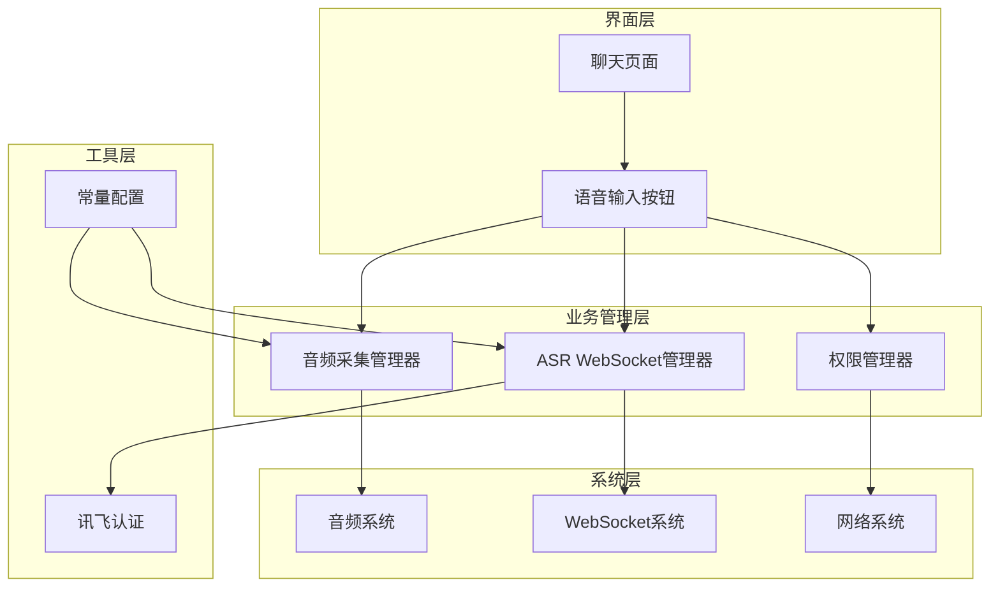
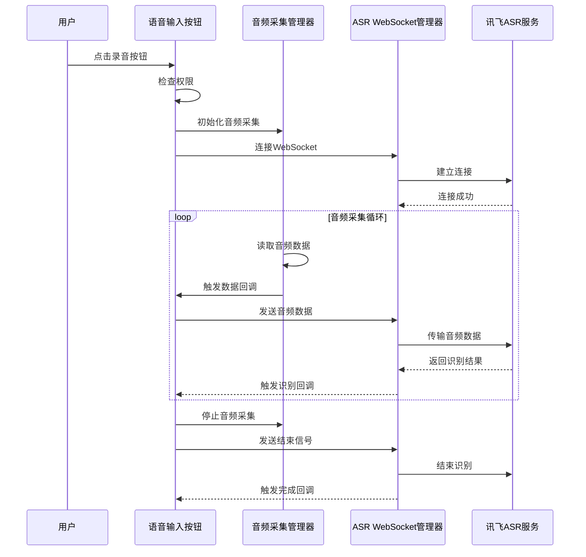
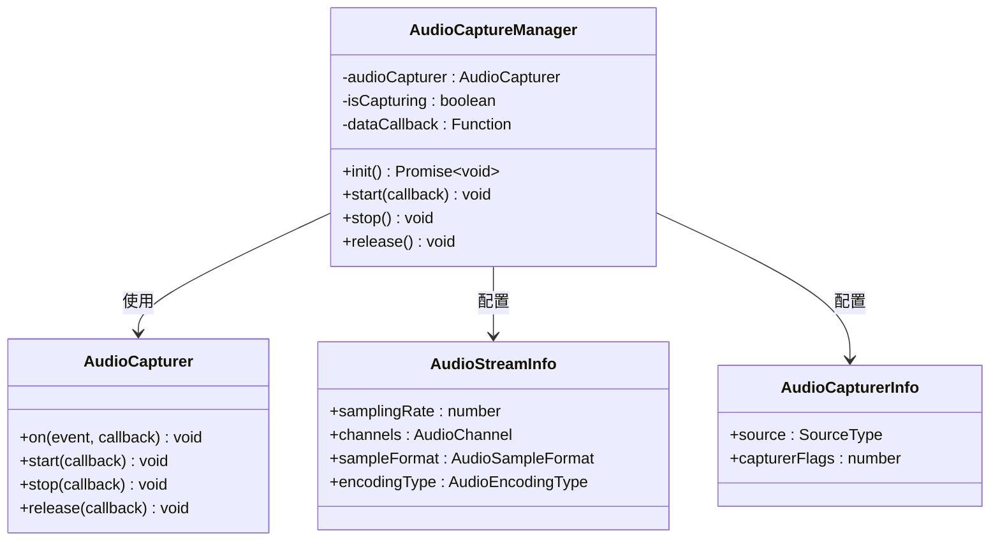
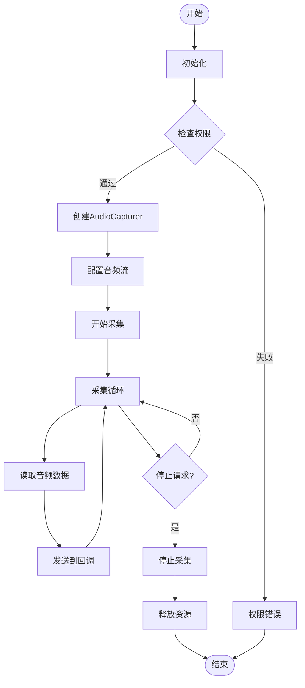
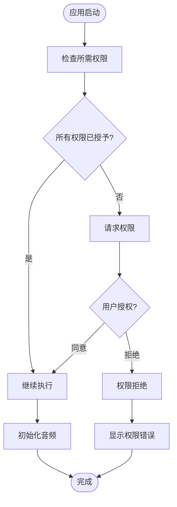
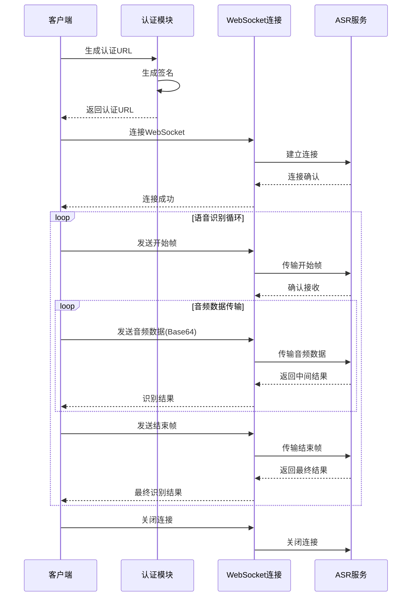
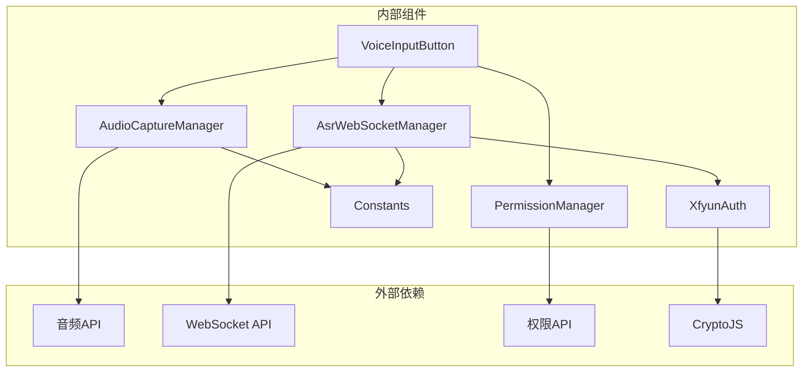

# 音频采集管理

<cite>
**本文档引用的文件**
- [AudioCaptureManager.ets](file://entry/src/main/ets/managers/AudioCaptureManager.ets)
- [PermissionManager.ets](file://entry/src/main/ets/managers/PermissionManager.ets)
- [Constants.ets](file://entry/src/main/ets/common/Constants.ets)
- [VoiceInputButton.ets](file://entry/src/main/ets/components/chat/VoiceInputButton.ets)
- [AsrWebSocketManager.ets](file://entry/src/main/ets/managers/AsrWebSocketManager.ets)
- [network_connect.ets](file://entry/src/main/ets/pages/network_connect.ets)
- [XfyunAuth.ets](file://entry/src/main/ets/managers/XfyunAuth.ets)
- [ChatPage.ets](file://entry/src/main/ets/pages/ChatPage.ets)
</cite>

## 目录
1. [简介](#简介)
2. [项目结构](#项目结构)
3. [核心组件](#核心组件)
4. [架构概览](#架构概览)
5. [详细组件分析](#详细组件分析)
6. [依赖关系分析](#依赖关系分析)
7. [性能考虑](#性能考虑)
8. [故障排除指南](#故障排除指南)
9. [结论](#结论)

## 简介

本项目实现了一个基于HarmonyOS的音频采集管理系统，集成了麦克风音频采集、实时语音识别和WebSocket通信功能。系统采用模块化设计，通过AudioCaptureManager管理音频设备，PermissionManager处理权限验证，AsrWebSocketManager负责与讯飞语音识别服务的通信，VoiceInputButton提供用户交互界面。

该系统支持完整的音频采集生命周期管理，包括设备初始化、音频流配置、数据捕获、实时处理和资源释放。同时实现了完善的错误处理机制，确保在设备不可用、权限不足、网络异常等情况下能够优雅降级。

## 项目结构

项目采用分层架构设计，主要分为以下层次：

**图表来源**
- [AudioCaptureManager.ets:1-80](file://entry/src/main/ets/managers/AudioCaptureManager.ets#L1-L80)
- [VoiceInputButton.ets:1-125](file://entry/src/main/ets/components/chat/VoiceInputButton.ets#L1-L125)
- [AsrWebSocketManager.ets:1-271](file://entry/src/main/ets/managers/AsrWebSocketManager.ets#L1-L271)

**章节来源**
- [AudioCaptureManager.ets:1-80](file://entry/src/main/ets/managers/AudioCaptureManager.ets#L1-L80)
- [VoiceInputButton.ets:1-125](file://entry/src/main/ets/components/chat/VoiceInputButton.ets#L1-L125)
- [AsrWebSocketManager.ets:1-271](file://entry/src/main/ets/managers/AsrWebSocketManager.ets#L1-L271)

## 核心组件

### 音频采集管理器 (AudioCaptureManager)

AudioCaptureManager是音频采集系统的核心组件，负责管理音频设备的完整生命周期：

- **设备初始化**: 创建AudioCapturer实例，配置采样率、通道数、采样格式和编码类型
- **音频流配置**: 设置麦克风源类型，配置音频流信息
- **数据捕获**: 监听readData事件，实时获取音频数据缓冲区
- **状态管理**: 维护采集状态，支持启动、停止、暂停和释放操作

### 权限管理器 (PermissionManager)

负责处理应用所需的系统权限：

- **权限检查**: 验证麦克风和网络访问权限
- **权限申请**: 动态向用户申请必要的权限
- **权限状态管理**: 跟踪权限授予状态

### ASR WebSocket管理器 (AsrWebSocketManager)

实现与讯飞语音识别服务的WebSocket通信：

- **连接管理**: 建立和维护WebSocket连接
- **认证机制**: 生成签名URL，处理认证流程
- **数据传输**: 将音频数据转换为Base64格式并通过WebSocket发送
- **结果处理**: 解析识别结果，支持实时和最终结果

**章节来源**
- [AudioCaptureManager.ets:6-80](file://entry/src/main/ets/managers/AudioCaptureManager.ets#L6-L80)
- [PermissionManager.ets:5-28](file://entry/src/main/ets/managers/PermissionManager.ets#L5-L28)
- [AsrWebSocketManager.ets:82-271](file://entry/src/main/ets/managers/AsrWebSocketManager.ets#L82-L271)

## 架构概览

系统采用事件驱动的架构模式，通过回调函数实现组件间的解耦：

**图表来源**
- [VoiceInputButton.ets:71-89](file://entry/src/main/ets/components/chat/VoiceInputButton.ets#L71-L89)
- [AudioCaptureManager.ets:36-53](file://entry/src/main/ets/managers/AudioCaptureManager.ets#L36-L53)
- [AsrWebSocketManager.ets:92-144](file://entry/src/main/ets/managers/AsrWebSocketManager.ets#L92-L144)

## 详细组件分析

### 音频采集管理器类图

**图表来源**
- [AudioCaptureManager.ets:6-34](file://entry/src/main/ets/managers/AudioCaptureManager.ets#L6-L34)

### 音频采集生命周期流程

**图表来源**
- [AudioCaptureManager.ets:11-80](file://entry/src/main/ets/managers/AudioCaptureManager.ets#L11-L80)

### 权限管理流程

**图表来源**
- [PermissionManager.ets:8-27](file://entry/src/main/ets/managers/PermissionManager.ets#L8-L27)

### ASR WebSocket通信流程

**图表来源**
- [AsrWebSocketManager.ets:92-144](file://entry/src/main/ets/managers/AsrWebSocketManager.ets#L92-L144)
- [XfyunAuth.ets:7-24](file://entry/src/main/ets/managers/XfyunAuth.ets#L7-L24)

**章节来源**
- [AudioCaptureManager.ets:6-80](file://entry/src/main/ets/managers/AudioCaptureManager.ets#L6-L80)
- [PermissionManager.ets:5-28](file://entry/src/main/ets/managers/PermissionManager.ets#L5-L28)
- [AsrWebSocketManager.ets:82-271](file://entry/src/main/ets/managers/AsrWebSocketManager.ets#L82-L271)
- [XfyunAuth.ets:6-34](file://entry/src/main/ets/managers/XfyunAuth.ets#L6-L34)

## 依赖关系分析

系统各组件之间的依赖关系如下：

**图表来源**
- [AudioCaptureManager.ets:2-4](file://entry/src/main/ets/managers/AudioCaptureManager.ets#L2-L4)
- [AsrWebSocketManager.ets:2-5](file://entry/src/main/ets/managers/AsrWebSocketManager.ets#L2-L5)
- [PermissionManager.ets:2-3](file://entry/src/main/ets/managers/PermissionManager.ets#L2-L3)
- [XfyunAuth.ets:2-4](file://entry/src/main/ets/managers/XfyunAuth.ets#L2-L4)

**章节来源**
- [AudioCaptureManager.ets:1-80](file://entry/src/main/ets/managers/AudioCaptureManager.ets#L1-L80)
- [AsrWebSocketManager.ets:1-271](file://entry/src/main/ets/managers/AsrWebSocketManager.ets#L1-L271)
- [PermissionManager.ets:1-28](file://entry/src/main/ets/managers/PermissionManager.ets#L1-L28)
- [XfyunAuth.ets:1-34](file://entry/src/main/ets/managers/XfyunAuth.ets#L1-L34)

## 性能考虑

### 采样率和音频质量配置

系统采用16kHz采样率，单声道，16位深度的音频格式，这种配置在保证语音识别准确率的同时，有效平衡了计算资源消耗：

- **采样率**: 16000Hz，满足普通话识别需求
- **通道数**: 单声道，减少数据传输量
- **采样格式**: S16LE，标准PCM格式
- **编码类型**: RAW，无压缩，保证音频质量

### 内存管理策略

- **缓冲区大小**: 1280字节，适中的缓冲区大小平衡延迟和内存占用
- **数据流处理**: 采用流式处理，避免大块内存分配
- **回调机制**: 通过事件回调处理音频数据，减少内存拷贝

### 网络传输优化

- **Base64编码**: 音频数据转换为Base64字符串传输
- **WebSocket长连接**: 减少连接建立开销
- **批量发送**: 连续音频片段合并发送

**章节来源**
- [Constants.ets:4-14](file://entry/src/main/ets/common/Constants.ets#L4-L14)
- [AudioCaptureManager.ets:14-27](file://entry/src/main/ets/managers/AudioCaptureManager.ets#L14-L27)

## 故障排除指南

### 常见问题及解决方案

#### 设备不可用问题
- **症状**: 音频采集初始化失败
- **原因**: 麦克风设备被占用或损坏
- **解决方案**: 
  - 检查设备可用性
  - 重启音频服务
  - 验证设备权限

#### 权限不足问题
- **症状**: 应用无法访问麦克风
- **原因**: 用户拒绝了麦克风权限
- **解决方案**:
  - 重新申请权限
  - 在系统设置中手动开启权限
  - 提示用户授权的重要性

#### 网络连接问题
- **症状**: WebSocket连接失败或频繁断开
- **原因**: 网络不稳定或认证失败
- **解决方案**:
  - 检查网络连接状态
  - 验证认证信息
  - 实现自动重连机制

#### 音频质量差问题
- **症状**: 识别准确率低
- **原因**: 音频干扰或设备问题
- **解决方案**:
  - 调整采样参数
  - 优化音频环境
  - 检查设备硬件

### 调试技巧

#### 日志记录
系统在关键节点添加了详细的日志输出，便于问题诊断：
- 初始化过程日志
- 状态变化日志  
- 错误信息日志

#### 性能监控
- 监控音频数据传输延迟
- 跟踪内存使用情况
- 分析网络连接稳定性

#### 用户体验优化
- 实时状态反馈
- 清晰的错误提示
- 自动重试机制

**章节来源**
- [AudioCaptureManager.ets:30-33](file://entry/src/main/ets/managers/AudioCaptureManager.ets#L30-L33)
- [AsrWebSocketManager.ets:112-134](file://entry/src/main/ets/managers/AsrWebSocketManager.ets#L112-L134)
- [PermissionManager.ets:23-26](file://entry/src/main/ets/managers/PermissionManager.ets#L23-L26)

## 结论

本音频采集管理系统实现了完整的语音识别功能，具有以下特点：

**技术优势**:
- 模块化设计，职责清晰
- 完善的错误处理机制
- 实时音频处理能力
- 良好的用户体验

**系统特性**:
- 支持完整的音频采集生命周期管理
- 集成权限管理和网络通信
- 实现流式音频数据处理
- 提供丰富的调试和监控能力

**应用场景**:
- 语音助手应用
- 语音控制设备
- 实时语音转文字
- 语音交互系统

该系统为后续的功能扩展和性能优化提供了良好的基础，可以根据具体需求进行定制和改进。