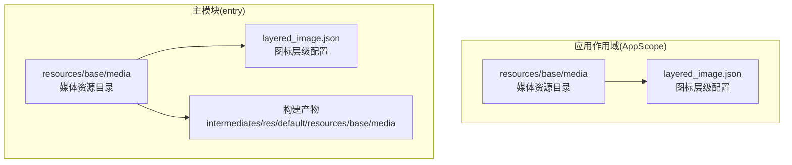
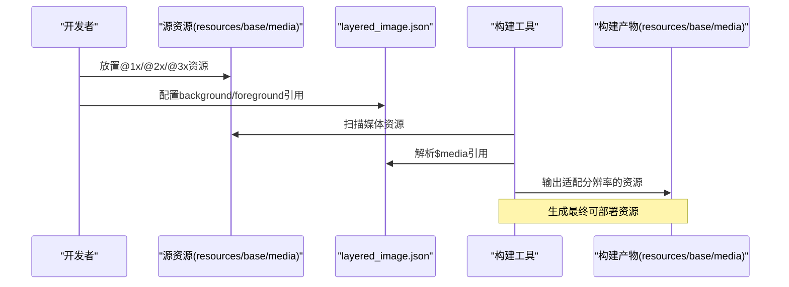
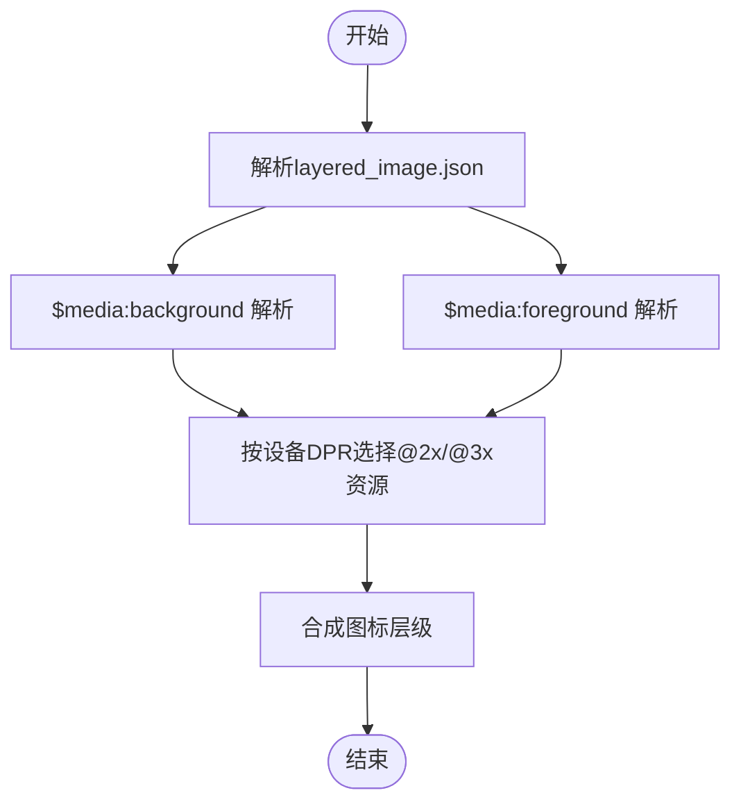
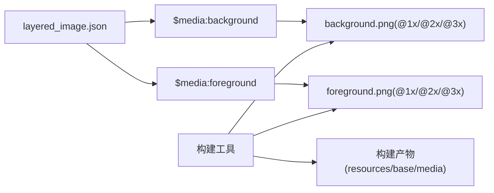

# 媒体资源管理

<cite>
**本文引用的文件**
- [AppScope 资源配置](file://AppScope/resources/base/media/layered_image.json)
- [Entry 模块资源配置](file://entry/src/main/resources/base/media/layered_image.json)
- [构建压缩配置](file://entry/build/default/intermediates/res/default/opt-compression.json)
- [资源配置索引](file://entry/build/default/intermediates/res/default/resConfig.json)
- [背景图片](file://entry/src/main/resources/base/media/background.png)
- [前景图片](file://entry/src/main/resources/base/media/foreground.png)
- [控制器图片](file://entry/src/main/resources/base/media/controller.png)
- [启动图标图片](file://entry/src/main/resources/base/media/startIcon.png)
- [PromptAsset 数据图片](file://PromptAsset/data.png)
- [PromptAsset 设备页面图片](file://PromptAsset/devicePage.png)
</cite>

## 目录
1. [简介](#简介)
2. [项目结构](#项目结构)
3. [核心组件](#核心组件)
4. [架构概览](#架构概览)
5. [详细组件分析](#详细组件分析)
6. [依赖关系分析](#依赖关系分析)
7. [性能考虑](#性能考虑)
8. [故障排除指南](#故障排除指南)
9. [结论](#结论)
10. [附录](#附录)

## 简介
本文件系统性地阐述 SmartController 项目的媒体资源管理体系，重点围绕 layered_image.json 的配置结构与使用方式，解析图标层级定义、多分辨率适配策略以及动态图标切换机制；同时总结图片资源的组织原则（SVG 矢量图、PNG 位图、WebP 格式选择）、命名规范与文件夹结构（@1x/@2x/@3x 分辨率适配），并给出加载优化（懒加载、预加载、缓存策略）、压缩与格式转换最佳实践、版本管理与热更新机制，以及性能监控与调试方法。

## 项目结构
项目采用模块化资源组织方式，主模块 entry 与应用作用域 AppScope 各自维护资源目录。媒体资源主要位于 resources/base/media 目录下，并通过 layered_image.json 进行统一配置与引用。

**图表来源**
- [AppScope 资源配置:1-7](file://AppScope/resources/base/media/layered_image.json#L1-L7)
- [Entry 模块资源配置:1-7](file://entry/src/main/resources/base/media/layered_image.json#L1-L7)
- [资源配置索引:1-2](file://entry/build/default/intermediates/res/default/resConfig.json#L1-L2)

**章节来源**
- [AppScope 资源配置:1-7](file://AppScope/resources/base/media/layered_image.json#L1-L7)
- [Entry 模块资源配置:1-7](file://entry/src/main/resources/base/media/layered_image.json#L1-L7)
- [资源配置索引:1-2](file://entry/build/default/intermediates/res/default/resConfig.json#L1-L2)

## 核心组件
- 图标层级配置：通过 layered_image.json 定义 background 与 foreground 层级，使用 $media 引用资源标识符，实现图标合成与动态切换。
- 多分辨率适配：基于 @1x/@2x/@3x 的资源命名约定，配合构建工具自动选择匹配分辨率的资源。
- 动态图标切换：在运行时根据业务状态或主题变化，切换不同层级组合或替换资源标识符，实现图标动态更新。
- 资源组织：PNG 位图为当前项目主要格式，辅以 WebP 提升压缩效率；SVG 矢量图用于可缩放场景但需评估平台支持与体积平衡。

**章节来源**
- [AppScope 资源配置:1-7](file://AppScope/resources/base/media/layered_image.json#L1-L7)
- [Entry 模块资源配置:1-7](file://entry/src/main/resources/base/media/layered_image.json#L1-L7)
- [背景图片](file://entry/src/main/resources/base/media/background.png)
- [前景图片](file://entry/src/main/resources/base/media/foreground.png)

## 架构概览
媒体资源从开发阶段到构建产物的流转路径如下：

**图表来源**
- [AppScope 资源配置:1-7](file://AppScope/resources/base/media/layered_image.json#L1-L7)
- [Entry 模块资源配置:1-7](file://entry/src/main/resources/base/media/layered_image.json#L1-L7)
- [资源配置索引:1-2](file://entry/build/default/intermediates/res/default/resConfig.json#L1-L2)

## 详细组件分析

### 图标层级配置与动态切换
- 配置结构：layered_image.json 使用 "layered-image" 对象定义 background 与 foreground 两个层级，分别通过 $media: 前缀引用具体资源标识符。
- 动态切换机制：在运行时可通过替换资源标识符或调整层级顺序实现图标动态切换；建议在业务层抽象统一的图标管理器，集中处理层级与标识符映射。
- 资源绑定：确保 background 与 foreground 对应的实际 PNG/WebP 文件存在且命名符合 @1x/@2x/@3x 规范，以便构建工具正确打包。

**图表来源**
- [AppScope 资源配置:1-7](file://AppScope/resources/base/media/layered_image.json#L1-L7)
- [Entry 模块资源配置:1-7](file://entry/src/main/resources/base/media/layered_image.json#L1-L7)

**章节来源**
- [AppScope 资源配置:1-7](file://AppScope/resources/base/media/layered_image.json#L1-L7)
- [Entry 模块资源配置:1-7](file://entry/src/main/resources/base/media/layered_image.json#L1-L7)

### 多分辨率适配策略
- 命名规范：@1x（基础分辨率）、@2x（高密度屏）、@3x（超高密度屏）。建议为每张图标提供完整分辨率集，避免运行时缩放导致模糊。
- 资源放置：在 resources/base/media 下按名称分组存放 @1x/@2x/@3x 版本，构建工具会根据目标设备 DPI 自动选择最优资源。
- 位图优先：当前项目主要使用 PNG 位图；如需进一步压缩，可在满足质量要求的前提下引入 WebP。

**章节来源**
- [背景图片](file://entry/src/main/resources/base/media/background.png)
- [前景图片](file://entry/src/main/resources/base/media/foreground.png)
- [控制器图片](file://entry/src/main/resources/base/media/controller.png)
- [启动图标图片](file://entry/src/main/resources/base/media/startIcon.png)

### 图片资源组织与格式选择
- PNG 位图：适合图标、线框图等需要透明背景的场景；当前项目广泛使用，便于跨平台兼容。
- WebP：具备更好的压缩比与透明度支持，适合大图或背景图；需评估平台支持与解码性能。
- SVG 矢量图：适合可无限缩放的简单图形；需权衡文件大小与渲染性能，复杂矢量可能影响首帧时间。
- 统一命名：建议以语义化前缀区分用途（如 icon_、bg_、avatar_），并在同一目录下按 @1x/@2x/@3x 存放对应版本。

**章节来源**
- [构建压缩配置:1-2](file://entry/build/default/intermediates/res/default/opt-compression.json#L1-L2)

### 加载优化策略
- 懒加载：仅在可见区域或交互触发时加载图标资源，减少初始内存占用。
- 预加载：对即将展示的页面或高概率使用的图标进行预取，降低首帧等待时间。
- 缓存策略：利用系统级缓存与应用内缓存双重保障；对高频图标设置长缓存，低频图标设置短缓存。
- 渲染优化：优先使用位图而非实时矢量渲染；必要时对 SVG 进行编译或预光栅化。

**章节来源**
- [构建压缩配置:1-2](file://entry/build/default/intermediates/res/default/opt-compression.json#L1-L2)

### 压缩与格式转换最佳实践
- WebP 压缩：在保证视觉质量前提下尽可能降低文件体积；对纯色或大面积渐变的图标收益显著。
- PNG 压缩：使用无损压缩工具去除冗余元数据；对半透明边缘使用合适的抖动算法。
- 批量处理：建立自动化脚本对资源进行批量压缩与格式转换，确保一致性与可追溯性。
- 质量阈值：设定 PSNR 或 SSIM 阈值，避免过度压缩导致的细节丢失。

**章节来源**
- [构建压缩配置:1-2](file://entry/build/default/intermediates/res/default/opt-compression.json#L1-L2)

### 版本管理与热更新机制
- 版本号：在资源文件名中加入版本后缀（如 icon_home_v2@2x.png），或通过清单文件记录资源版本。
- 热更新：通过增量包下发新增或替换的媒体资源；在应用启动时校验资源完整性，失败则回滚至上一个稳定版本。
- 兼容性：热更新需考虑不同 DPI 与语言环境下的资源差异，确保覆盖所有目标设备。

**章节来源**
- [资源配置索引:1-2](file://entry/build/default/intermediates/res/default/resConfig.json#L1-L2)

### 性能监控与调试方法
- 监控指标：首帧时间、内存占用峰值、网络下载耗时、解码耗时、缓存命中率。
- 工具链：利用构建日志查看资源打包情况；通过性能分析工具定位瓶颈。
- 调试技巧：启用资源加载日志，核对 $media 引用是否正确解析；验证 @1x/@2x/@3x 资源是否存在及命名是否规范。

**章节来源**
- [资源配置索引:1-2](file://entry/build/default/intermediates/res/default/resConfig.json#L1-L2)

## 依赖关系分析
媒体资源的依赖关系主要体现在 layered_image.json 对具体资源的引用，以及构建工具对多分辨率资源的选择与打包。

**图表来源**
- [AppScope 资源配置:1-7](file://AppScope/resources/base/media/layered_image.json#L1-L7)
- [Entry 模块资源配置:1-7](file://entry/src/main/resources/base/media/layered_image.json#L1-L7)
- [背景图片](file://entry/src/main/resources/base/media/background.png)
- [前景图片](file://entry/src/main/resources/base/media/foreground.png)

**章节来源**
- [AppScope 资源配置:1-7](file://AppScope/resources/base/media/layered_image.json#L1-L7)
- [Entry 模块资源配置:1-7](file://entry/src/main/resources/base/media/layered_image.json#L1-L7)
- [背景图片](file://entry/src/main/resources/base/media/background.png)
- [前景图片](file://entry/src/main/resources/base/media/foreground.png)

## 性能考虑
- 资源体积：优先采用 WebP 对大图进行压缩，PNG 保留给需要透明度的图标。
- 加载策略：结合懒加载与预加载，避免阻塞主线程；对高频图标启用缓存。
- 渲染效率：尽量减少实时矢量渲染，使用位图并确保分辨率匹配，降低缩放成本。
- 构建优化：关闭不必要的压缩选项，或仅对特定类型启用压缩，以平衡体积与性能。

**章节来源**
- [构建压缩配置:1-2](file://entry/build/default/intermediates/res/default/opt-compression.json#L1-L2)

## 故障排除指南
- 资源缺失：检查 layered_image.json 中 $media 引用的资源是否存在；确认 @1x/@2x/@3x 版本齐全。
- 构建错误：查看构建日志中的资源扫描与打包信息，定位重复或冲突的资源文件。
- 显示异常：验证 DPI 选择逻辑，确保目标设备选择了正确的 @2x/@3x 资源。
- 压缩问题：若启用压缩导致显示异常，临时禁用相关压缩选项并逐步排查。

**章节来源**
- [AppScope 资源配置:1-7](file://AppScope/resources/base/media/layered_image.json#L1-L7)
- [Entry 模块资源配置:1-7](file://entry/src/main/resources/base/media/layered_image.json#L1-L7)
- [构建压缩配置:1-2](file://entry/build/default/intermediates/res/default/opt-compression.json#L1-L2)

## 结论
本项目的媒体资源管理以 layered_image.json 为核心配置，结合 @1x/@2x/@3x 多分辨率策略与 PNG/WebP 格式选择，实现了图标层级化与动态切换能力。通过合理的加载优化、压缩策略与版本管理，能够在保证视觉质量的同时提升性能与可维护性。建议持续完善资源命名规范与自动化流程，强化性能监控与热更新机制，确保在多设备与多环境下的一致体验。

## 附录
- 参考资源文件示例：[背景图片](file://entry/src/main/resources/base/media/background.png)、[前景图片](file://entry/src/main/resources/base/media/foreground.png)、[控制器图片](file://entry/src/main/resources/base/media/controller.png)、[启动图标图片](file://entry/src/main/resources/base/media/startIcon.png)
- PromptAsset 示例：[数据图片](file://PromptAsset/data.png)、[设备页面图片](file://PromptAsset/devicePage.png)