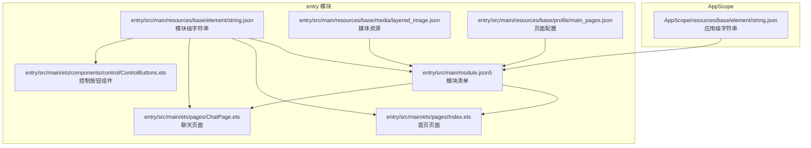
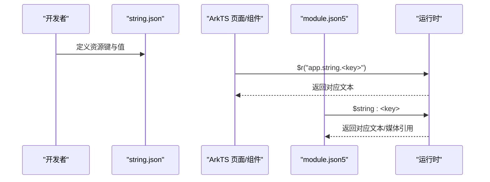
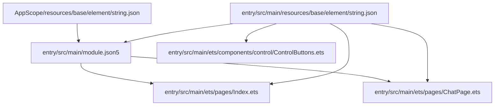
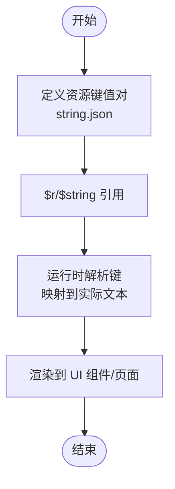

# 字符串资源管理

<cite>
**本文档引用的文件**
- [AppScope/resources/base/element/string.json](file://AppScope/resources/base/element/string.json)
- [entry/src/main/resources/base/element/string.json](file://entry/src/main/resources/base/element/string.json)
- [entry/src/main/module.json5](file://entry/src/main/module.json5)
- [entry/src/main/ets/pages/Index.ets](file://entry/src/main/ets/pages/Index.ets)
- [entry/src/main/ets/pages/ChatPage.ets](file://entry/src/main/ets/pages/ChatPage.ets)
- [entry/src/main/ets/components/control/ControlButtons.ets](file://entry/src/main/ets/components/control/ControlButtons.ets)
- [entry/src/main/ets/common/Constants.ets](file://entry/src/main/ets/common/Constants.ets)
- [entry/src/main/resources/base/media/layered_image.json](file://entry/src/main/resources/base/media/layered_image.json)
- [entry/src/main/resources/base/profile/main_pages.json](file://entry/src/main/resources/base/profile/main_pages.json)
</cite>

## 目录
1. [引言](#引言)
2. [项目结构](#项目结构)
3. [核心组件](#核心组件)
4. [架构总览](#架构总览)
5. [详细组件分析](#详细组件分析)
6. [依赖关系分析](#依赖关系分析)
7. [性能考虑](#性能考虑)
8. [故障排查指南](#故障排查指南)
9. [结论](#结论)
10. [附录](#附录)

## 引言
本文件系统性梳理本项目的字符串资源管理体系，覆盖以下主题：
- string.json 的组织结构与命名规范：应用名称、界面文本、提示信息、权限说明等的分类管理
- 资源引用机制：$r 占位符的使用与动态文本替换
- 多语言本地化策略：语言包组织、文本翻译与 RTL 适配建议
- 版本管理与更新策略：资源键变更与兼容性维护
- 命名约定与最佳实践：语义化命名、避免硬编码
- 性能优化与内存管理：缓存、懒加载与资源复用

## 项目结构
项目采用模块化资源目录，主模块 entry 下包含两套字符串资源：
- AppScope/resources/base/element/string.json：应用级基础字符串（如应用名称）
- entry/src/main/resources/base/element/string.json：模块级字符串（页面标签、权限说明、界面文案等）

此外，模块清单 module.json5 中通过 $string: 键引用字符串资源，实现从资源文件到 UI、图标、描述文本的解耦。

**图表来源**
- [AppScope/resources/base/element/string.json:1-9](file://AppScope/resources/base/element/string.json#L1-L9)
- [entry/src/main/resources/base/element/string.json:1-1](file://entry/src/main/resources/base/element/string.json#L1-L1)
- [entry/src/main/module.json5:1-71](file://entry/src/main/module.json5#L1-L71)
- [entry/src/main/resources/base/media/layered_image.json:1-7](file://entry/src/main/resources/base/media/layered_image.json#L1-L7)
- [entry/src/main/resources/base/profile/main_pages.json:1-5](file://entry/src/main/resources/base/profile/main_pages.json#L1-L5)
- [entry/src/main/ets/pages/Index.ets:1-115](file://entry/src/main/ets/pages/Index.ets#L1-L115)
- [entry/src/main/ets/pages/ChatPage.ets:1-76](file://entry/src/main/ets/pages/ChatPage.ets#L1-L76)
- [entry/src/main/ets/components/control/ControlButtons.ets:1-48](file://entry/src/main/ets/components/control/ControlButtons.ets#L1-L48)

**章节来源**
- [AppScope/resources/base/element/string.json:1-9](file://AppScope/resources/base/element/string.json#L1-L9)
- [entry/src/main/resources/base/element/string.json:1-1](file://entry/src/main/resources/base/element/string.json#L1-L1)
- [entry/src/main/module.json5:1-71](file://entry/src/main/module.json5#L1-L71)

## 核心组件
- 字符串资源文件
  - AppScope/resources/base/element/string.json：定义应用级字符串，如应用名称
  - entry/src/main/resources/base/element/string.json：定义模块级字符串，如页面标签、权限说明、界面文案
- 资源引用机制
  - ArkTS 中使用 $r('app.string.<key>') 引用字符串资源
  - 模块清单 module.json5 中通过 $string:<key> 引用字符串资源，用于描述、标签、图标等
- 组件与页面
  - Index 页面：底部导航标签文本通过 $r 引用
  - ChatPage 页面：标题栏文本通过 $r 引用
  - ControlButtons 组件：按钮文本为硬编码字符串（存在优化空间）

**章节来源**
- [entry/src/main/ets/pages/Index.ets:19-22](file://entry/src/main/ets/pages/Index.ets#L19-L22)
- [entry/src/main/ets/pages/ChatPage.ets:16-18](file://entry/src/main/ets/pages/ChatPage.ets#L16-L18)
- [entry/src/main/ets/components/control/ControlButtons.ets:19-21](file://entry/src/main/ets/components/control/ControlButtons.ets#L19-L21)
- [entry/src/main/module.json5:5-21](file://entry/src/main/module.json5#L5-L21)

## 架构总览
字符串资源在项目中的流转路径如下：
- 定义阶段：在 AppScope 与 entry 模块的 string.json 中定义键值对
- 引用阶段：ArkTS 页面与组件通过 $r 引用；模块清单通过 $string 引用
- 渲染阶段：运行时解析 $r/$string，将资源键映射为实际文本或媒体资源

**图表来源**
- [entry/src/main/resources/base/element/string.json:1-1](file://entry/src/main/resources/base/element/string.json#L1-L1)
- [entry/src/main/ets/pages/Index.ets:19-22](file://entry/src/main/ets/pages/Index.ets#L19-L22)
- [entry/src/main/ets/pages/ChatPage.ets:16-18](file://entry/src/main/ets/pages/ChatPage.ets#L16-L18)
- [entry/src/main/module.json5:5-21](file://entry/src/main/module.json5#L5-L21)

## 详细组件分析

### 字符串资源文件组织与命名规范
- AppScope 级别
  - 用途：应用级通用字符串，如应用名称
  - 示例键：app_name
- 模块级别
  - 用途：页面标签、权限说明、界面文案、状态文本等
  - 示例键：module_desc、EntryAbility_desc、EntryAbility_label、device_control、quick_mode、usage_stats、weather、light_control、door_control、air_condition、curtain_control、tv_control、music_control、away_mode、home_mode、sleep_mode、on、off、page_data_title、tab_chat、tab_data、tab_device、tab_settings、nav_body_placeholder、permission_microphone_reason

命名建议（基于现有实践总结）：
- 语义化：键名应清晰表达用途，如 tab_chat、permission_microphone_reason
- 前缀分层：按功能域分组，如 tab_*、device_*、permission_*、status_* 等
- 一致性：同一类文案风格统一，避免同义词混用
- 可扩展：预留组合键，便于未来扩展

**章节来源**
- [AppScope/resources/base/element/string.json:1-9](file://AppScope/resources/base/element/string.json#L1-L9)
- [entry/src/main/resources/base/element/string.json:1-1](file://entry/src/main/resources/base/element/string.json#L1-L1)

### 资源引用机制：$r 与 $string
- $r('app.string.<key>')：ArkTS 页面与组件中引用字符串资源的标准方式
  - Index 页面底部标签文本通过 $r 引用
  - ChatPage 页面标题文本通过 $r 引用
- $string:<key>：模块清单中引用字符串资源，用于描述、标签、图标等
  - module.json5 中 description、label、icon、startWindowIcon、startWindowBackground、requestPermissions.reason 等字段均通过 $string 引用

动态文本替换：
- $r 支持在运行时根据上下文选择合适语言包
- 对于需要参数化的文本，可在 ArkTS 层进行格式化拼接，避免在资源文件中存储动态内容

**章节来源**
- [entry/src/main/ets/pages/Index.ets:19-22](file://entry/src/main/ets/pages/Index.ets#L19-L22)
- [entry/src/main/ets/pages/ChatPage.ets:16-18](file://entry/src/main/ets/pages/ChatPage.ets#L16-L18)
- [entry/src/main/module.json5:5-21](file://entry/src/main/module.json5#L5-L21)

### 多语言本地化支持策略
- 语言包组织
  - 在构建产物中存在 zh_CN 与 en_US 的资源包，表明项目具备多语言能力
  - 建议在 entry/build/default/.../resource_str/<locale>/element/ 下维护各语言的 string.json
- 文本翻译
  - 将所有用户可见文本集中到 string.json，并通过 $r/$string 引用
  - 保持键名一致，仅翻译 value
- RTL 语言适配
  - 在布局层面启用 RTL 适配（如方向、对齐），并在 string.json 中为 RTL 语言准备镜像文案
  - 媒体资源（如图标）也需考虑镜像版本

注：当前仓库未直接提供 zh_CN/en_US 的 string.json 文件内容，但构建产物的存在表明多语言流程已建立。

**章节来源**
- [entry/src/main/module.json5:1-71](file://entry/src/main/module.json5#L1-L71)

### 字符串资源的版本管理与更新策略
- 版本标识
  - 在模块清单中维护版本号，作为资源版本的标识
- 变更流程
  - 新增键：先在 AppScope 与模块 string.json 中新增，再在页面/组件中引用
  - 修改键：优先保留旧键并标注废弃，新增替代键，逐步迁移
  - 删除键：先标记废弃，等待迁移完成后再删除
- 兼容性
  - 保持键名稳定，避免破坏性变更
  - 对于重大文案调整，提供过渡期的双键并行策略

**章节来源**
- [entry/src/main/module.json5:1-71](file://entry/src/main/module.json5#L1-L71)

### 命名约定与最佳实践
- 语义化命名
  - 使用 tab_*、device_*、permission_*、status_* 等前缀区分功能域
  - 键名尽量短小精悍且可读性强
- 避免硬编码
  - 控制按钮组件中存在硬编码字符串，建议迁移到 string.json 并通过 $r 引用
- 参数化文本
  - 对需要插入变量的文本，使用占位符并在运行时替换，而非在资源文件中存储动态值

**章节来源**
- [entry/src/main/ets/components/control/ControlButtons.ets:19-21](file://entry/src/main/ets/components/control/ControlButtons.ets#L19-L21)

### 性能优化与内存管理
- 资源缓存
  - 运行时对字符串资源进行缓存，减少重复解析开销
- 懒加载
  - 对于不常用页面或异步加载的文本，采用懒加载策略
- 内存复用
  - 避免在组件内部频繁创建临时字符串对象，优先复用已分配的资源引用
- 渲染优化
  - 减少不必要的文本刷新，批量更新 UI

[本节为通用指导，无需特定文件引用]

## 依赖关系分析
字符串资源在项目中的依赖关系如下：

**图表来源**
- [entry/src/main/resources/base/element/string.json:1-1](file://entry/src/main/resources/base/element/string.json#L1-L1)
- [AppScope/resources/base/element/string.json:1-9](file://AppScope/resources/base/element/string.json#L1-L9)
- [entry/src/main/module.json5:1-71](file://entry/src/main/module.json5#L1-L71)
- [entry/src/main/ets/pages/Index.ets:19-22](file://entry/src/main/ets/pages/Index.ets#L19-L22)
- [entry/src/main/ets/pages/ChatPage.ets:16-18](file://entry/src/main/ets/pages/ChatPage.ets#L16-L18)
- [entry/src/main/ets/components/control/ControlButtons.ets:19-21](file://entry/src/main/ets/components/control/ControlButtons.ets#L19-L21)

**章节来源**
- [entry/src/main/resources/base/element/string.json:1-1](file://entry/src/main/resources/base/element/string.json#L1-L1)
- [AppScope/resources/base/element/string.json:1-9](file://AppScope/resources/base/element/string.json#L1-L9)
- [entry/src/main/module.json5:1-71](file://entry/src/main/module.json5#L1-L71)

## 性能考虑
- 资源键数量控制：避免过度细分导致查找成本上升
- 文本长度优化：对于长段落，考虑拆分为多个键并组合使用
- 缓存策略：利用运行时缓存，减少重复解析
- 布局与渲染：合理使用 ellipsis、约束宽度等属性，避免布局抖动

[本节为通用指导，无需特定文件引用]

## 故障排查指南
- 资源键缺失
  - 现象：页面显示为原始键名或空值
  - 排查：确认键是否存在于 AppScope 或模块 string.json 中，检查大小写与拼写
- 引用路径错误
  - 现象：$r 或 $string 无法解析
  - 排查：确认引用路径是否为 app.string.<key>，模块清单中的 $string:<key> 是否与资源文件一致
- 硬编码文本
  - 现象：国际化后文案未生效
  - 排查：将硬编码文本迁移至 string.json，并通过 $r 引用
- 权限说明未显示
  - 现象：权限申请弹窗缺少原因说明
  - 排查：确认 module.json5 中 requestPermissions.reason 是否正确引用 $string:permission_microphone_reason

**章节来源**
- [entry/src/main/ets/components/control/ControlButtons.ets:19-21](file://entry/src/main/ets/components/control/ControlButtons.ets#L19-L21)
- [entry/src/main/module.json5:37-55](file://entry/src/main/module.json5#L37-L55)

## 结论
本项目已建立较为完善的字符串资源管理体系，通过 AppScope 与模块级 string.json 分层管理、$r/$string 引用机制以及模块清单的统一配置，实现了从资源定义到 UI 渲染的解耦。建议后续重点完善以下方面：
- 将硬编码文本迁移至 string.json
- 建立更严格的命名规范与版本变更流程
- 完善多语言资源包与 RTL 适配
- 优化资源缓存与渲染性能

[本节为总结性内容，无需特定文件引用]

## 附录

### 关键流程图：字符串资源解析与渲染

[本图为概念性流程示意，无需图表来源]