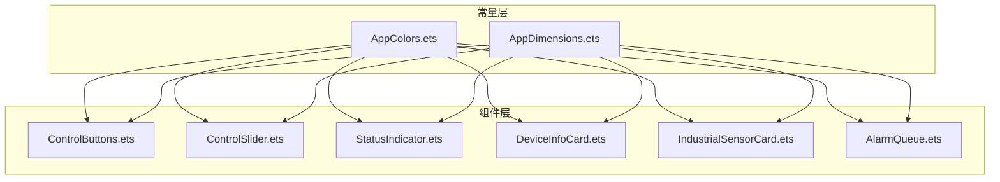
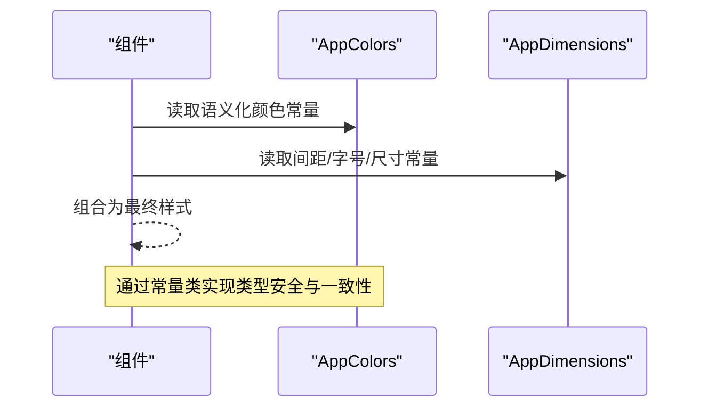
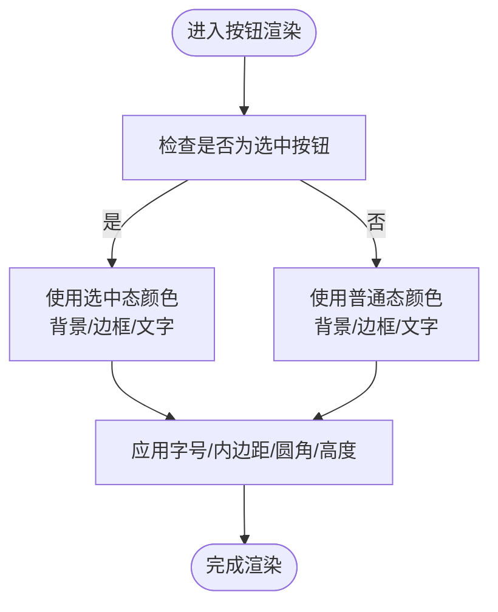
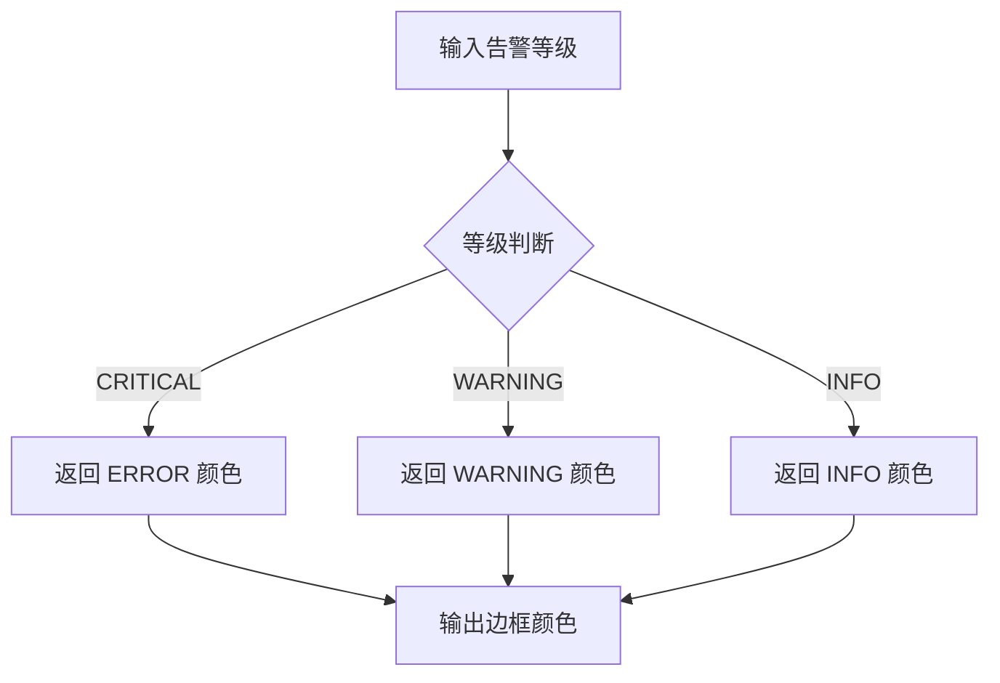
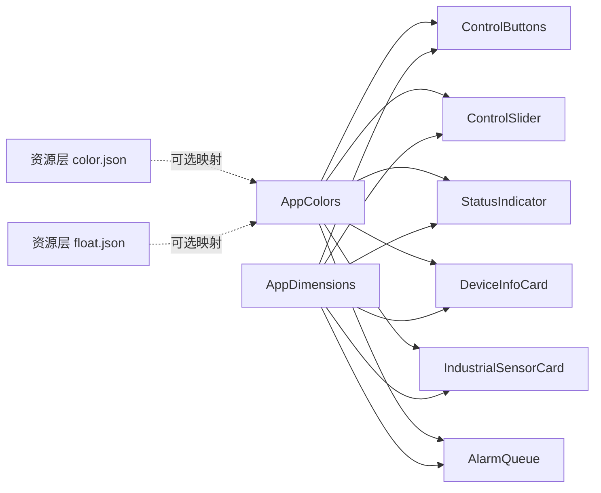

# 常量和样式管理

<cite>
**本文引用的文件**
- [AppColors.ets](file://entry/src/main/ets/constants/AppColors.ets)
- [AppDimensions.ets](file://entry/src/main/ets/constants/AppDimensions.ets)
- [ControlButtons.ets](file://entry/src/main/ets/components/control/ControlButtons.ets)
- [ControlSlider.ets](file://entry/src/main/ets/components/control/ControlSlider.ets)
- [StatusIndicator.ets](file://entry/src/main/ets/components/control/StatusIndicator.ets)
- [DeviceInfoCard.ets](file://entry/src/main/ets/components/device/DeviceInfoCard.ets)
- [IndustrialSensorCard.ets](file://entry/src/main/ets/components/sensor/IndustrialSensorCard.ets)
- [AlarmQueue.ets](file://entry/src/main/ets/components/log/AlarmQueue.ets)
- [ControlState.ets](file://entry/src/main/ets/models/ControlState.ets)
- [color.json（基础）](file://entry/src/main/resources/base/element/color.json)
- [color.json（深色）](file://entry/src/main/resources/dark/element/color.json)
- [float.json（基础）](file://entry/src/main/resources/base/element/float.json)
</cite>

## 目录
1. [引言](#引言)
2. [项目结构](#项目结构)
3. [核心组件](#核心组件)
4. [架构总览](#架构总览)
5. [详细组件分析](#详细组件分析)
6. [依赖分析](#依赖分析)
7. [性能考虑](#性能考虑)
8. [故障排查指南](#故障排查指南)
9. [结论](#结论)
10. [附录](#附录)

## 引言
本文件聚焦于常量与样式管理，系统性梳理 AppColors.ets 的颜色常量体系与语义化命名、AppDimensions.ets 的尺寸常量规范与分级体系，并总结其在组件中的使用模式、最佳实践、版本管理与变更追踪策略。同时给出扩展指导与性能优化建议，帮助开发者在保持类型安全、可维护性与一致性的前提下，高效构建统一的设计语言。

## 项目结构
常量与样式管理主要由两类文件构成：
- 类型安全的常量类：位于 constants 目录，提供颜色与尺寸的集中定义
- 组件层消费常量：各业务组件通过导入常量类实现样式一致性

图表来源
- [AppColors.ets:1-47](file://entry/src/main/ets/constants/AppColors.ets#L1-L47)
- [AppDimensions.ets:1-40](file://entry/src/main/ets/constants/AppDimensions.ets#L1-L40)
- [ControlButtons.ets:1-48](file://entry/src/main/ets/components/control/ControlButtons.ets#L1-L48)
- [ControlSlider.ets:1-56](file://entry/src/main/ets/components/control/ControlSlider.ets#L1-L56)
- [StatusIndicator.ets:1-39](file://entry/src/main/ets/components/control/StatusIndicator.ets#L1-L39)
- [DeviceInfoCard.ets:1-59](file://entry/src/main/ets/components/device/DeviceInfoCard.ets#L1-L59)
- [IndustrialSensorCard.ets:1-109](file://entry/src/main/ets/components/sensor/IndustrialSensorCard.ets#L1-L109)
- [AlarmQueue.ets:1-105](file://entry/src/main/ets/components/log/AlarmQueue.ets#L1-L105)

章节来源
- [AppColors.ets:1-47](file://entry/src/main/ets/constants/AppColors.ets#L1-L47)
- [AppDimensions.ets:1-40](file://entry/src/main/ets/constants/AppDimensions.ets#L1-L40)

## 核心组件
本节对 AppColors 与 AppDimensions 的职责、命名与组织方式进行深入解析。

- AppColors.ets
  - 职责：集中定义应用中使用的全部颜色，覆盖背景、文字、状态、控件、滑块、分隔线、圆环图与阴影等类别，便于主题切换与统一维护
  - 设计要点：采用静态只读属性，语义化命名（如 TEXT_PRIMARY、BUTTON_HOVER、SLIDER_PROGRESS），避免魔法值
  - 主题适配：当前未内置明暗主题映射逻辑，可在上层通过条件选择不同常量集或在资源层提供深色映射

- AppDimensions.ets
  - 职责：统一管理间距、圆角、字体大小、高度、滑块尺寸与图片尺寸等设计令牌
  - 设计要点：按功能域分组（SPACING、RADIUS、FONT_SIZE、SIZE 等），形成可复用的排版与布局规范
  - 响应式支持：当前为静态常量，建议在运行时结合屏幕密度或断点动态计算派生值

章节来源
- [AppColors.ets:5-47](file://entry/src/main/ets/constants/AppColors.ets#L5-L47)
- [AppDimensions.ets:5-40](file://entry/src/main/ets/constants/AppDimensions.ets#L5-L40)

## 架构总览
常量与组件之间的交互遵循“常量集中定义、组件按需消费”的原则，形成清晰的依赖关系与稳定的样式契约。

图表来源
- [ControlButtons.ets:17-47](file://entry/src/main/ets/components/control/ControlButtons.ets#L17-L47)
- [ControlSlider.ets:26-37](file://entry/src/main/ets/components/control/ControlSlider.ets#L26-L37)
- [StatusIndicator.ets:13-36](file://entry/src/main/ets/components/control/StatusIndicator.ets#L13-L36)
- [DeviceInfoCard.ets:18-57](file://entry/src/main/ets/components/device/DeviceInfoCard.ets#L18-L57)
- [IndustrialSensorCard.ets:25-62](file://entry/src/main/ets/components/sensor/IndustrialSensorCard.ets#L25-L62)
- [AlarmQueue.ets:50-103](file://entry/src/main/ets/components/log/AlarmQueue.ets#L50-L103)

## 详细组件分析

### AppColors 颜色常量体系
- 色彩系统设计
  - 背景类：PRIMARY_BG、SECONDARY_BG、CARD_BG、HEADER_BG、CONTENT_BG，满足容器与页面层级的视觉分层
  - 文字类：TEXT_PRIMARY、TEXT_SECONDARY、TEXT_TERTIARY、TEXT_DISABLED、TEXT_PLACEHOLDER，覆盖主次信息与禁用态
  - 状态类：SUCCESS、WARNING、ERROR、INFO，用于状态指示与告警体系
  - 控件类：BUTTON_NORMAL、BUTTON_HOVER、BUTTON_BORDER、BUTTON_TEXT，支撑按钮与交互元素
  - 滑块类：SLIDER_TRACK、SLIDER_PROGRESS、SLIDER_THUMB，保障控件一致性
  - 分隔线类：DIVIDER、DIVIDER_DASHED，区分区域与强调重点
  - 圆环图类：RING_BG、RING_ACTIVE，服务于可视化组件
  - 阴影类：SHADOW_COLOR，统一阴影风格

- 主题色配置与语义化命名
  - 使用语义化命名替代“蓝色”“红色”等直译，如 SUCCESS/ERROR/INFO/WARNING，降低上下文耦合
  - 建议在资源层提供深色映射（例如 color.json 的深色变体），并在运行时根据系统主题选择对应常量集

- 与资源层的关系
  - 资源层存在基础与深色的主题色映射文件，可作为 AppColors 的补充或替代来源
  - 若采用资源层主题切换，建议在常量层增加主题分支选择器，避免硬编码

章节来源
- [AppColors.ets:6-46](file://entry/src/main/ets/constants/AppColors.ets#L6-L46)
- [color.json（基础）:1-60](file://entry/src/main/resources/base/element/color.json#L1-L60)
- [color.json（深色）:1-8](file://entry/src/main/resources/dark/element/color.json#L1-L8)

### AppDimensions 尺寸常量体系
- 间距规范
  - SPACING_XS 到 SPACING_XXL 形成递增序列，覆盖微距到大间隔场景
- 圆角分级
  - RADIUS_SM/LG/XL/ROUND，满足不同元素的圆角需求
- 字体大小体系
  - FONT_SIZE_XS 到 FONT_SIZE_XXL，覆盖从注释到标题的完整层级
- 尺寸与组件适配
  - HEADER_HEIGHT、BUTTON_HEIGHT、SLIDER_HEIGHT、SLIDER_THUMB_SIZE，直接驱动头部、按钮与滑块的尺寸
- 图片尺寸
  - IMAGE_SIZE_SM/M/D/L/XL，统一头像、缩略图与占位图规格

- 响应式设计参数
  - 当前为静态常量，建议引入屏幕密度或断点映射，按设备类型派生实际尺寸

章节来源
- [AppDimensions.ets:6-39](file://entry/src/main/ets/constants/AppDimensions.ets#L6-L39)

### 组件中的使用模式与最佳实践
- 类型安全
  - 通过常量类的静态只读属性，编译期约束颜色与尺寸的可用集合，减少拼写错误与越界风险
- 可维护性
  - 统一入口修改，一处变更影响全站；新增样式只需在常量层定义新令牌
- 一致性
  - 组件内严格使用常量，避免重复定义相近值；跨组件共享的样式通过常量统一
- 最佳实践清单
  - 优先使用 AppDimensions 的 FONT_SIZE_* 与 SPACING_*，避免硬编码
  - 使用 AppColors 的语义化常量，避免直接传入字符串字面量
  - 对于需要动态主题切换的场景，建议在常量层增加主题选择器或在资源层提供主题映射

章节来源
- [ControlButtons.ets:17-47](file://entry/src/main/ets/components/control/ControlButtons.ets#L17-L47)
- [ControlSlider.ets:26-37](file://entry/src/main/ets/components/control/ControlSlider.ets#L26-L37)
- [StatusIndicator.ets:13-36](file://entry/src/main/ets/components/control/StatusIndicator.ets#L13-L36)
- [DeviceInfoCard.ets:18-57](file://entry/src/main/ets/components/device/DeviceInfoCard.ets#L18-L57)
- [IndustrialSensorCard.ets:25-62](file://entry/src/main/ets/components/sensor/IndustrialSensorCard.ets#L25-L62)
- [AlarmQueue.ets:50-103](file://entry/src/main/ets/components/log/AlarmQueue.ets#L50-L103)

### 关键流程与算法示意

#### 按钮组件样式决策流程

图表来源
- [ControlButtons.ets:27-47](file://entry/src/main/ets/components/control/ControlButtons.ets#L27-L47)

#### 告警等级到颜色映射

图表来源
- [AlarmQueue.ets:40-48](file://entry/src/main/ets/components/log/AlarmQueue.ets#L40-L48)

## 依赖分析
- 常量依赖关系
  - AppColors 与 AppDimensions 作为纯数据常量，被所有组件依赖
  - 组件之间不相互依赖常量，仅依赖常量类本身，降低耦合
- 组件内部依赖
  - 各组件通过 @Component 装饰器声明，内部组合使用常量进行布局与样式
- 资源层依赖
  - 资源层的 color.json 与 float.json 提供基础主题与字号资源，可与常量层互补

图表来源
- [AppColors.ets:1-47](file://entry/src/main/ets/constants/AppColors.ets#L1-L47)
- [AppDimensions.ets:1-40](file://entry/src/main/ets/constants/AppDimensions.ets#L1-L40)
- [ControlButtons.ets:1-48](file://entry/src/main/ets/components/control/ControlButtons.ets#L1-L48)
- [ControlSlider.ets:1-56](file://entry/src/main/ets/components/control/ControlSlider.ets#L1-L56)
- [StatusIndicator.ets:1-39](file://entry/src/main/ets/components/control/StatusIndicator.ets#L1-L39)
- [DeviceInfoCard.ets:1-59](file://entry/src/main/ets/components/device/DeviceInfoCard.ets#L1-L59)
- [IndustrialSensorCard.ets:1-109](file://entry/src/main/ets/components/sensor/IndustrialSensorCard.ets#L1-L109)
- [AlarmQueue.ets:1-105](file://entry/src/main/ets/components/log/AlarmQueue.ets#L1-L105)
- [color.json（基础）:1-60](file://entry/src/main/resources/base/element/color.json#L1-L60)
- [float.json（基础）:1-9](file://entry/src/main/resources/base/element/float.json#L1-L9)

章节来源
- [ControlState.ets:1-67](file://entry/src/main/ets/models/ControlState.ets#L1-L67)

## 性能考虑
- 常量访问成本
  - 常量类为静态只读，访问开销极低；建议在组件 build 内部直接使用，避免在每次渲染中重复计算
- 渲染优化
  - 使用常量统一尺寸与颜色，有助于减少样式抖动与布局回流
- 主题切换
  - 若启用深色主题，建议在常量层或资源层提供主题映射，避免在组件内做大量条件判断
- 响应式尺寸
  - 对于 AppDimensions，建议结合设备密度或断点生成派生值，减少重复计算

## 故障排查指南
- 常见问题
  - 组件中出现颜色不一致：检查是否绕过常量类直接使用字符串字面量
  - 尺寸不统一：检查是否混用硬编码像素值与常量
  - 主题切换异常：确认资源层 color.json 是否提供深色映射，或在常量层实现主题选择器
- 排查步骤
  - 定位组件中使用的颜色与尺寸来源，核对是否来自 AppColors 与 AppDimensions
  - 对照资源层 color.json 与 float.json，确认是否存在冲突或缺失
  - 在组件中打印关键样式值，验证是否符合预期

章节来源
- [color.json（基础）:1-60](file://entry/src/main/resources/base/element/color.json#L1-L60)
- [color.json（深色）:1-8](file://entry/src/main/resources/dark/element/color.json#L1-L8)
- [float.json（基础）:1-9](file://entry/src/main/resources/base/element/float.json#L1-L9)

## 结论
通过 AppColors 与 AppDimensions 的集中化管理，项目实现了颜色与尺寸的统一规范，提升了类型安全、可维护性与一致性。建议在现有基础上完善主题映射与响应式尺寸支持，并建立版本与变更追踪机制，持续演进设计令牌系统。

## 附录

### 常量组织结构与命名约定
- 颜色分类
  - 背景：PRIMARY_BG、SECONDARY_BG、CARD_BG、HEADER_BG、CONTENT_BG
  - 文字：TEXT_PRIMARY、TEXT_SECONDARY、TEXT_TERTIARY、TEXT_DISABLED、TEXT_PLACEHOLDER
  - 状态：SUCCESS、WARNING、ERROR、INFO
  - 控件：BUTTON_NORMAL、BUTTON_HOVER、BUTTON_BORDER、BUTTON_TEXT
  - 滑块：SLIDER_TRACK、SLIDER_PROGRESS、SLIDER_THUMB
  - 分隔线：DIVIDER、DIVIDER_DASHED
  - 圆环图：RING_BG、RING_ACTIVE
  - 阴影：SHADOW_COLOR
- 尺寸分级
  - 间距：SPACING_XS、SPACING_SM、SPACING_MD、SPACING_LG、SPACING_XL、SPACING_XXL
  - 圆角：RADIUS_SM、RADIUS_MD、RADIUS_LG、RADIUS_XL、RADIUS_ROUND
  - 字体：FONT_SIZE_XS、FONT_SIZE_SM、FONT_SIZE_MD、FONT_SIZE_LG、FONT_SIZE_XL、FONT_SIZE_XXL
  - 尺寸：HEADER_HEIGHT、BUTTON_HEIGHT、SLIDER_HEIGHT、SLIDER_THUMB_SIZE
  - 图片：IMAGE_SIZE_SM、IMAGE_SIZE_MD、IMAGE_SIZE_LG、IMAGE_SIZE_XL

章节来源
- [AppColors.ets:6-46](file://entry/src/main/ets/constants/AppColors.ets#L6-L46)
- [AppDimensions.ets:6-39](file://entry/src/main/ets/constants/AppDimensions.ets#L6-L39)

### 版本管理与变更追踪策略
- 版本号
  - 建议在常量文件顶部添加版本注释，如 “v1.0.0”，随设计令牌变更同步升级
- 变更记录
  - 新增：在变更日志中标注新增常量名与用途
  - 修改：标注旧值与新值，评估对组件的影响范围
  - 删除：评估弃用周期与迁移路径，避免破坏性变更
- 迁移工具
  - 提供自动化脚本扫描组件中对旧常量的引用，辅助批量替换

### 常量使用示例与性能优化技巧
- 示例定位
  - 控制按钮：[ControlButtons.ets:17-47](file://entry/src/main/ets/components/control/ControlButtons.ets#L17-L47)
  - 滑块组件：[ControlSlider.ets:26-37](file://entry/src/main/ets/components/control/ControlSlider.ets#L26-L37)
  - 状态指示器：[StatusIndicator.ets:13-36](file://entry/src/main/ets/components/control/StatusIndicator.ets#L13-L36)
  - 设备信息卡：[DeviceInfoCard.ets:18-57](file://entry/src/main/ets/components/device/DeviceInfoCard.ets#L18-L57)
  - 工业传感器卡：[IndustrialSensorCard.ets:25-62](file://entry/src/main/ets/components/sensor/IndustrialSensorCard.ets#L25-L62)
  - 告警队列：[AlarmQueue.ets:50-103](file://entry/src/main/ets/components/log/AlarmQueue.ets#L50-L103)
- 性能优化
  - 避免在渲染函数中重复计算常量表达式
  - 对频繁使用的常量进行局部缓存（在组件内部）
  - 主题切换时尽量使用资源层映射，减少运行时分支判断

### 扩展指导：自定义常量系统的构建
- 新增设计令牌
  - 在 AppDimensions 中新增 TOKEN_NAME，确保命名与现有分级一致
  - 在 AppColors 中新增 COLOR_NAME，确保语义明确且与状态/层级匹配
- 主题系统集成
  - 在资源层提供多套 color.json，或在常量层实现主题选择器
  - 对于响应式尺寸，建议引入断点映射表，按设备类型派生最终值
- 测试与校验
  - 编写单元测试，验证常量在组件中的使用是否符合预期
  - 建立样式回归检查，防止变更导致视觉不一致

章节来源
- [ControlState.ets:1-67](file://entry/src/main/ets/models/ControlState.ets#L1-L67)