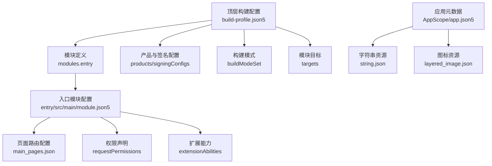
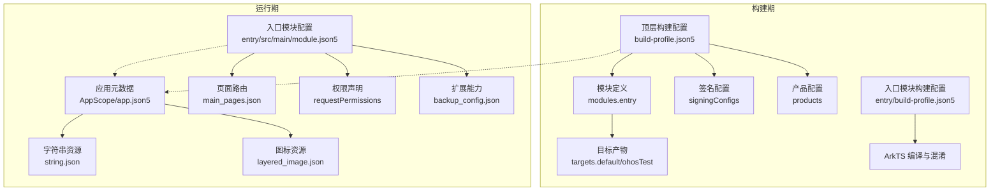
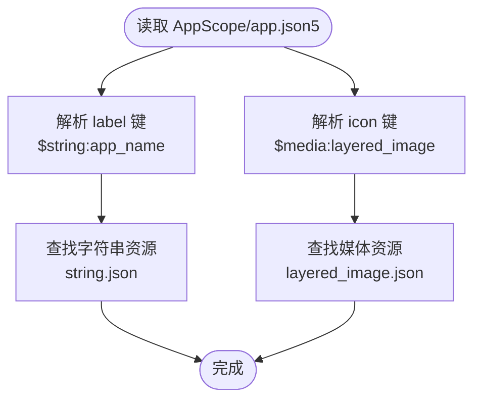
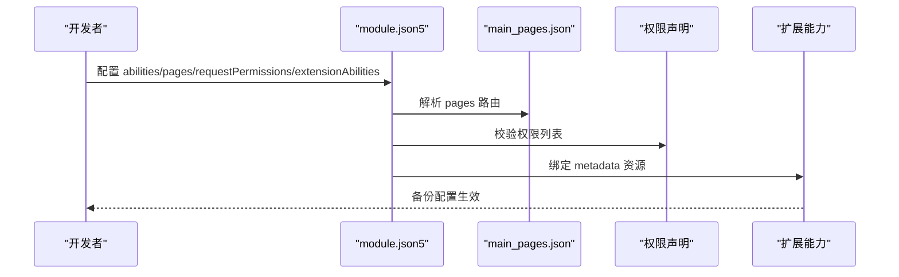
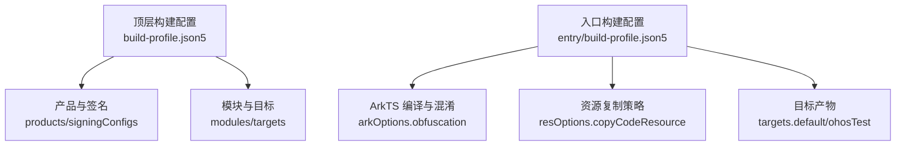
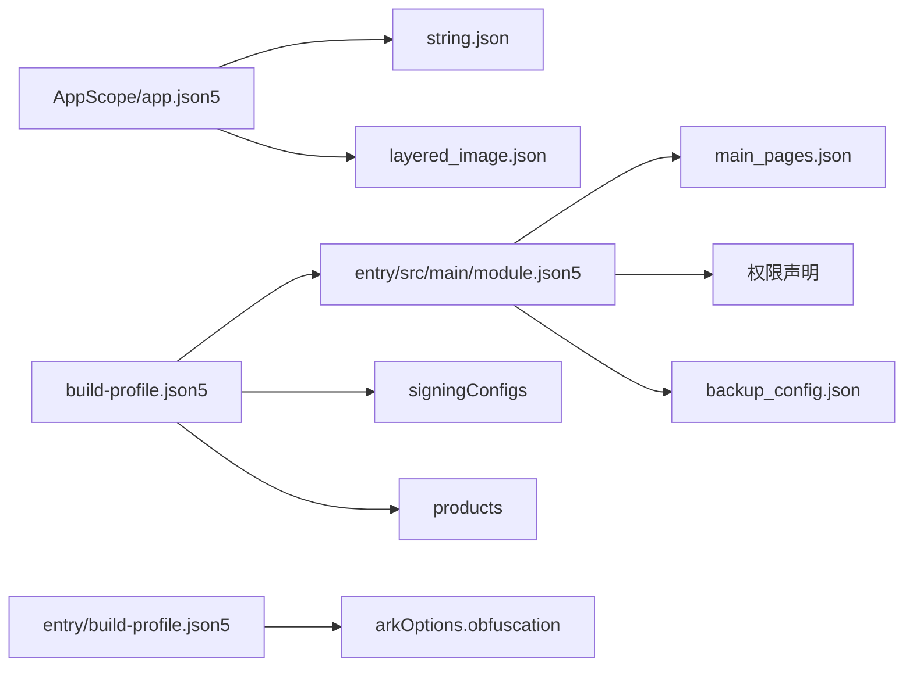

# 应用配置管理

<cite>
**本文引用的文件**
- [AppScope/app.json5](file://AppScope/app.json5)
- [AppScope/resources/base/element/string.json](file://AppScope/resources/base/element/string.json)
- [AppScope/resources/base/media/layered_image.json](file://AppScope/resources/base/media/layered_image.json)
- [entry/src/main/module.json5](file://entry/src/main/module.json5)
- [entry/src/main/resources/base/profile/main_pages.json](file://entry/src/main/resources/base/profile/main_pages.json)
- [entry/src/main/resources/base/profile/backup_config.json](file://entry/src/main/resources/base/profile/backup_config.json)
- [entry/build-profile.json5](file://entry/build-profile.json5)
- [build-profile.json5](file://build-profile.json5)
- [hvigorfile.ts](file://hvigorfile.ts)
- [hvigor/hvigor-config.json5](file://hvigor/hvigor-config.json5)
- [oh-package.json5](file://oh-package.json5)
- [oh-package-lock.json5](file://oh-package-lock.json5)
- [entry/obfuscation-rules.txt](file://entry/obfuscation-rules.txt)
</cite>

## 目录
1. [简介](#简介)
2. [项目结构](#项目结构)
3. [核心组件](#核心组件)
4. [架构总览](#架构总览)
5. [详细组件分析](#详细组件分析)
6. [依赖分析](#依赖分析)
7. [性能考虑](#性能考虑)
8. [故障排查指南](#故障排查指南)
9. [结论](#结论)
10. [附录](#附录)

## 简介
本文件系统性梳理 SmartController 项目的配置管理体系，覆盖以下方面：
- AppScope/app.json5 中的应用基本信息配置（包名、版本号、图标与标签）
- entry 模块的 module.json5 配置（能力声明、页面路由、权限声明、扩展能力）
- 构建配置 build-profile.json5（签名、编译选项、目标产物与打包策略）
- 配置文件间的关联关系与优先级规则
- 配置验证与调试方法
- 常见错误排查与最佳实践

## 项目结构
项目采用多模块分层组织，核心配置分布在 AppScope 与 entry 模块中，并通过顶层构建配置统一编排。

图表来源
- [build-profile.json5:26-72](file://build-profile.json5#L26-L72)
- [entry/src/main/module.json5:13-70](file://entry/src/main/module.json5#L13-L70)
- [entry/src/main/resources/base/profile/main_pages.json:1-6](file://entry/src/main/resources/base/profile/main_pages.json#L1-L6)
- [AppScope/app.json5:1-2](file://AppScope/app.json5#L1-L2)
- [AppScope/resources/base/element/string.json:1-9](file://AppScope/resources/base/element/string.json#L1-L9)
- [AppScope/resources/base/media/layered_image.json:1-7](file://AppScope/resources/base/media/layered_image.json#L1-L7)

章节来源
- [build-profile.json5:1-73](file://build-profile.json5#L1-L73)
- [entry/src/main/module.json5:1-71](file://entry/src/main/module.json5#L1-L71)
- [AppScope/app.json5:1-2](file://AppScope/app.json5#L1-L2)

## 核心组件
- 应用元数据与资源绑定：AppScope/app.json5 定义 bundleName、版本号、图标与标签；通过资源键引用实现本地化与媒体解耦。
- 入口模块能力与页面：entry/src/main/module.json5 声明主元素、设备类型、页面路由、能力与扩展能力、权限等。
- 构建与签名：顶层 build-profile.json5 统一管理产品、签名材料、SDK 版本与构建模式；entry/build-profile.json5 控制 ArkTS 编译与混淆策略。
- 工程编排：hvigorfile.ts 与 hvigor/hvigor-config.json5 提供构建任务与执行参数控制。

章节来源
- [AppScope/app.json5:1-2](file://AppScope/app.json5#L1-L2)
- [entry/src/main/module.json5:1-71](file://entry/src/main/module.json5#L1-L71)
- [build-profile.json5:26-58](file://build-profile.json5#L26-L58)
- [entry/build-profile.json5:1-33](file://entry/build-profile.json5#L1-L33)
- [hvigorfile.ts:1-6](file://hvigorfile.ts#L1-L6)
- [hvigor/hvigor-config.json5:1-24](file://hvigor/hvigor-config.json5#L1-L24)

## 架构总览
下图展示配置在构建与运行阶段的映射关系与依赖路径。

图表来源
- [build-profile.json5:26-72](file://build-profile.json5#L26-L72)
- [entry/build-profile.json5:1-33](file://entry/build-profile.json5#L1-L33)
- [entry/src/main/module.json5:1-71](file://entry/src/main/module.json5#L1-L71)
- [AppScope/app.json5:1-2](file://AppScope/app.json5#L1-L2)

## 详细组件分析

### AppScope/app.json5：应用基本信息与资源绑定
- 包名与版本：通过 bundleName、versionCode、versionName 定义应用标识与版本。
- 图标与标签：通过 icon 与 label 引用资源键，实际值来自资源文件。
- 资源解析链路：
  - 标签：$string:app_name → AppScope/resources/base/element/string.json 中的字符串资源。
  - 图标：$media:layered_image → AppScope/resources/base/media/layered_image.json 中的媒体资源。

图表来源
- [AppScope/app.json5:1-2](file://AppScope/app.json5#L1-L2)
- [AppScope/resources/base/element/string.json:1-9](file://AppScope/resources/base/element/string.json#L1-L9)
- [AppScope/resources/base/media/layered_image.json:1-7](file://AppScope/resources/base/media/layered_image.json#L1-L7)

章节来源
- [AppScope/app.json5:1-2](file://AppScope/app.json5#L1-L2)
- [AppScope/resources/base/element/string.json:1-9](file://AppScope/resources/base/element/string.json#L1-L9)
- [AppScope/resources/base/media/layered_image.json:1-7](file://AppScope/resources/base/media/layered_image.json#L1-L7)

### entry/src/main/module.json5：模块能力与页面路由
- 模块基础：name、type、description、mainElement、deviceTypes 等。
- 页面路由：通过 pages 引用 profile 路径，指向 main_pages.json。
- 能力声明：abilities 中定义 EntryAbility 的源码入口、图标、标签、启动窗口等。
- 权限声明：requestPermissions 列表按场景声明所需权限及理由。
- 扩展能力：extensionAbilities 中声明备份扩展，通过 metadata 关联 backup_config.json。

图表来源
- [entry/src/main/module.json5:1-71](file://entry/src/main/module.json5#L1-L71)
- [entry/src/main/resources/base/profile/main_pages.json:1-6](file://entry/src/main/resources/base/profile/main_pages.json#L1-L6)
- [entry/src/main/resources/base/profile/backup_config.json:1-3](file://entry/src/main/resources/base/profile/backup_config.json#L1-L3)

章节来源
- [entry/src/main/module.json5:1-71](file://entry/src/main/module.json5#L1-L71)
- [entry/src/main/resources/base/profile/main_pages.json:1-6](file://entry/src/main/resources/base/profile/main_pages.json#L1-L6)
- [entry/src/main/resources/base/profile/backup_config.json:1-3](file://entry/src/main/resources/base/profile/backup_config.json#L1-L3)

### 构建配置：build-profile.json5 与入口构建配置
- 顶层构建配置（build-profile.json5）：
  - products：定义默认产品及其 SDK 版本与运行时 OS。
  - buildModeSet：定义 debug/release 构建模式。
  - signingConfigs：提供签名材料（证书、密钥别名、密码等）。
  - modules：声明模块 entry 及其目标产物映射。
- 入口构建配置（entry/build-profile.json5）：
  - apiType：stageMode。
  - buildOption.resOptions.copyCodeResource：控制是否复制代码资源。
  - buildOptionSet.release.arkOptions.obfuscation：控制混淆规则启用与规则文件路径。
  - targets：定义 default 与 ohosTest 目标。

图表来源
- [build-profile.json5:26-72](file://build-profile.json5#L26-L72)
- [entry/build-profile.json5:1-33](file://entry/build-profile.json5#L1-L33)

章节来源
- [build-profile.json5:1-73](file://build-profile.json5#L1-L73)
- [entry/build-profile.json5:1-33](file://entry/build-profile.json5#L1-L33)

### 工程编排与工具链
- hvigorfile.ts：引入内置构建任务，不建议修改。
- hvigor/hvigor-config.json5：可选的执行参数（并行、增量、类型检查等）与日志级别等。
- 依赖管理：oh-package.json5 与 oh-package-lock.json5 管理开发与测试依赖。

章节来源
- [hvigorfile.ts:1-6](file://hvigorfile.ts#L1-L6)
- [hvigor/hvigor-config.json5:1-24](file://hvigor/hvigor-config.json5#L1-L24)
- [oh-package.json5:1-10](file://oh-package.json5#L1-L10)
- [oh-package-lock.json5:1-28](file://oh-package-lock.json5#L1-L28)

## 依赖分析
- 配置层级与耦合：
  - AppScope/app.json5 与资源文件解耦，通过键引用实现本地化与媒体复用。
  - entry/src/main/module.json5 依赖资源文件与 profile 文件，形成“配置-资源-页面”闭环。
  - 顶层 build-profile.json5 决定签名、SDK 与目标产物，entry/build-profile.json5 控制编译细节。
- 关联关系可视化：

图表来源
- [AppScope/app.json5:1-2](file://AppScope/app.json5#L1-L2)
- [AppScope/resources/base/element/string.json:1-9](file://AppScope/resources/base/element/string.json#L1-L9)
- [AppScope/resources/base/media/layered_image.json:1-7](file://AppScope/resources/base/media/layered_image.json#L1-L7)
- [entry/src/main/module.json5:1-71](file://entry/src/main/module.json5#L1-L71)
- [entry/src/main/resources/base/profile/main_pages.json:1-6](file://entry/src/main/resources/base/profile/main_pages.json#L1-L6)
- [entry/src/main/resources/base/profile/backup_config.json:1-3](file://entry/src/main/resources/base/profile/backup_config.json#L1-L3)
- [build-profile.json5:26-58](file://build-profile.json5#L26-L58)
- [entry/build-profile.json5:1-33](file://entry/build-profile.json5#L1-L33)

## 性能考虑
- 构建优化：可通过 hvigor/hvigor-config.json5 启用并行与增量编译以提升效率。
- 混淆策略：entry/build-profile.json5 中的混淆开关与规则文件可平衡产物体积与可维护性。
- 资源复制：根据业务需要调整 resOptions.copyCodeResource，避免冗余资源参与打包。

## 故障排查指南
- 资源键未解析：
  - 检查 AppScope/resources 下对应键是否存在，确保键名与引用一致。
  - 示例参考：[AppScope/resources/base/element/string.json:1-9](file://AppScope/resources/base/element/string.json#L1-L9)、[AppScope/resources/base/media/layered_image.json:1-7](file://AppScope/resources/base/media/layered_image.json#L1-L7)。
- 页面路由无效：
  - 确认 entry/src/main/module.json5 的 pages 指向的 profile 文件存在且格式正确。
  - 参考：[entry/src/main/resources/base/profile/main_pages.json:1-6](file://entry/src/main/resources/base/profile/main_pages.json#L1-L6)。
- 权限声明缺失或不生效：
  - 核对 requestPermissions 列表项与使用场景（abilities/when）。
  - 参考：[entry/src/main/module.json5:37-55](file://entry/src/main/module.json5#L37-L55)。
- 构建失败（签名相关）：
  - 确认 build-profile.json5 中 signingConfigs 的字段与路径有效。
  - 参考：[build-profile.json5:44-57](file://build-profile.json5#L44-L57)。
- 混淆规则未生效：
  - 检查 entry/build-profile.json5 的 arkOptions.obfuscation.ruleOptions.files 是否指向有效规则文件。
  - 参考：[entry/build-profile.json5:13-22](file://entry/build-profile.json5#L13-L22)、[entry/obfuscation-rules.txt:1-22](file://entry/obfuscation-rules.txt#L1-L22)。

章节来源
- [entry/src/main/resources/base/profile/main_pages.json:1-6](file://entry/src/main/resources/base/profile/main_pages.json#L1-L6)
- [entry/src/main/module.json5:37-55](file://entry/src/main/module.json5#L37-L55)
- [build-profile.json5:44-57](file://build-profile.json5#L44-L57)
- [entry/build-profile.json5:13-22](file://entry/build-profile.json5#L13-L22)
- [entry/obfuscation-rules.txt:1-22](file://entry/obfuscation-rules.txt#L1-L22)

## 结论
本项目通过清晰的配置分层实现了应用元数据、模块能力与构建策略的解耦。遵循资源键引用与 profile 文件约定，可实现跨语言与跨平台的稳定发布。建议在团队内固化配置校验流程与资源命名规范，以降低集成风险。

## 附录
- 配置验证清单
  - 应用元数据：bundleName、versionCode、versionName、icon、label 是否齐全且可解析。
  - 模块能力：abilities、pages、requestPermissions、extensionAbilities 是否与资源文件匹配。
  - 构建配置：products、signingConfigs、targets、arkOptions 是否满足当前环境。
- 最佳实践
  - 使用 profile 文件集中管理页面与元数据，减少硬编码。
  - 在 release 模式启用混淆并维护规则文件，兼顾安全与可追踪性。
  - 将签名材料纳入受控存储，避免泄露。