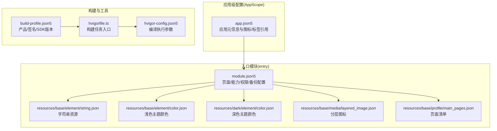
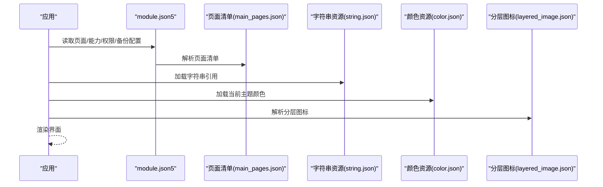
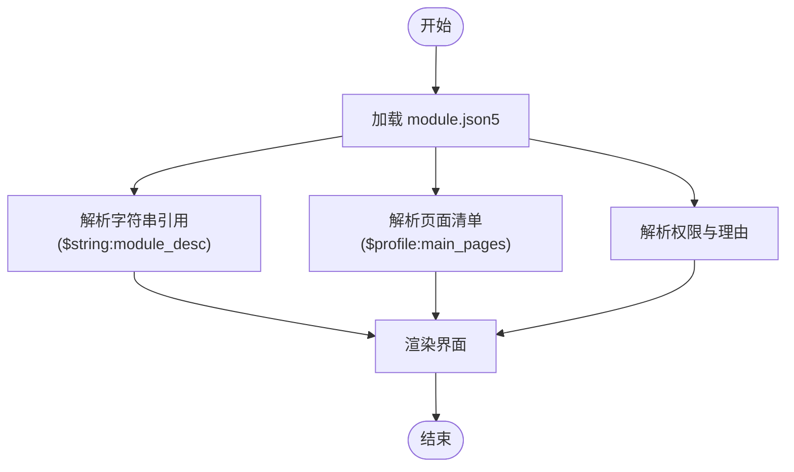
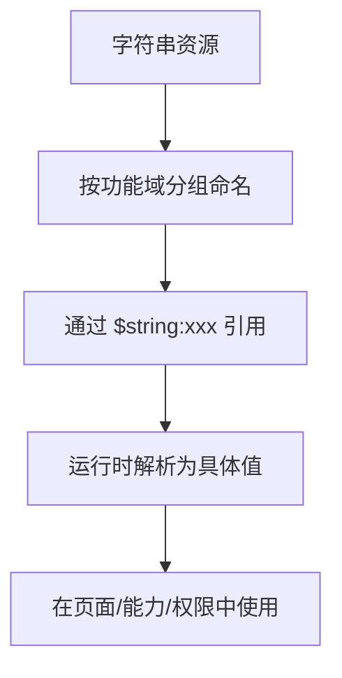
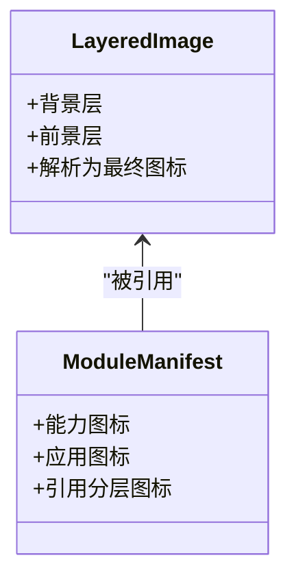
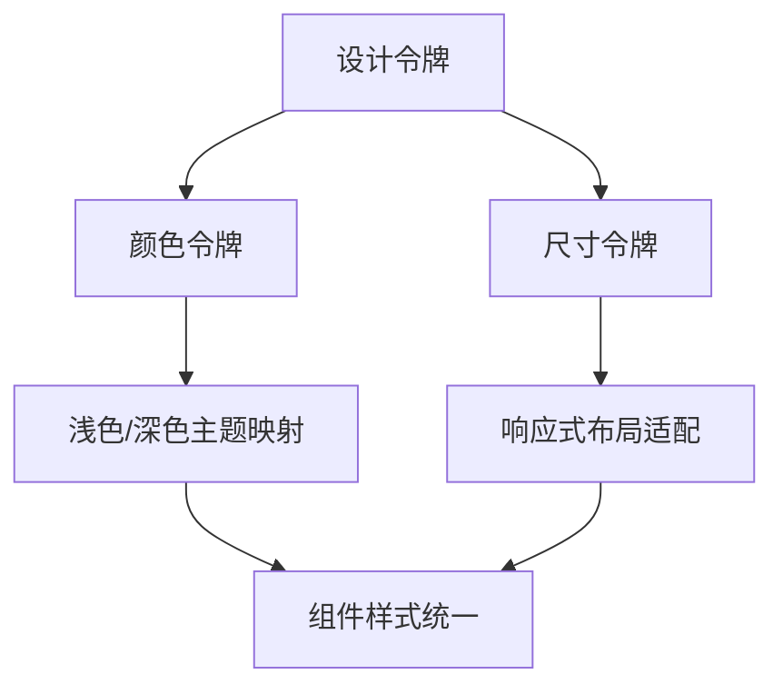
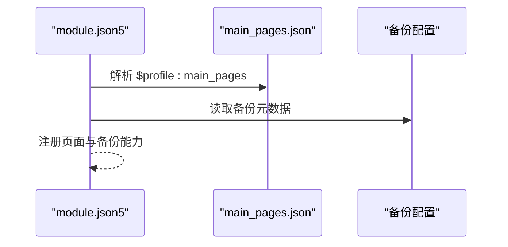
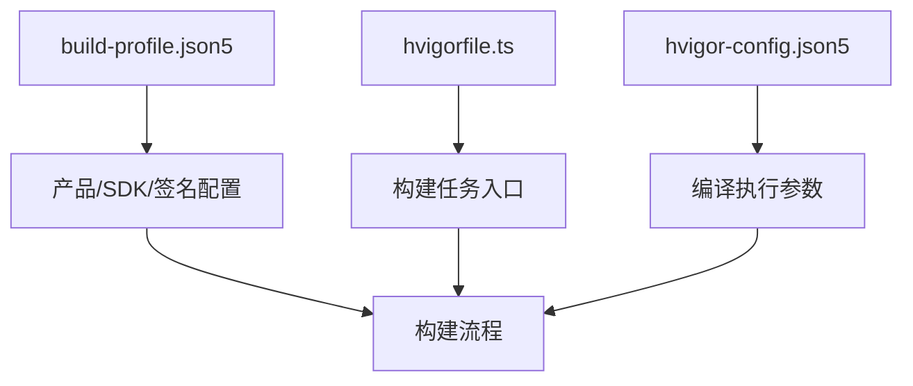
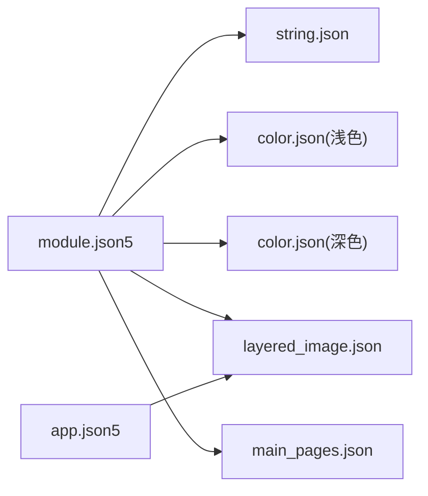

# 资源和配置管理

<cite>
**本文引用的文件**
- [AppScope/app.json5](file://AppScope/app.json5)
- [entry/src/main/module.json5](file://entry/src/main/module.json5)
- [entry/src/main/resources/base/element/string.json](file://entry/src/main/resources/base/element/string.json)
- [entry/src/main/resources/base/element/color.json](file://entry/src/main/resources/base/element/color.json)
- [entry/src/main/resources/dark/element/color.json](file://entry/src/main/resources/dark/element/color.json)
- [entry/src/main/resources/base/media/layered_image.json](file://entry/src/main/resources/base/media/layered_image.json)
- [entry/src/main/resources/base/profile/main_pages.json](file://entry/src/main/resources/base/profile/main_pages.json)
- [entry/src/main/ets/common/Constants.ets](file://entry/src/main/ets/common/Constants.ets)
- [build-profile.json5](file://build-profile.json5)
- [hvigorfile.ts](file://hvigorfile.ts)
- [hvigor/hvigor-config.json5](file://hvigor/hvigor-config.json5)
</cite>

## 目录
1. [简介](#简介)
2. [项目结构](#项目结构)
3. [核心组件](#核心组件)
4. [架构总览](#架构总览)
5. [详细组件分析](#详细组件分析)
6. [依赖分析](#依赖分析)
7. [性能考虑](#性能考虑)
8. [故障排查指南](#故障排查指南)
9. [结论](#结论)
10. [附录](#附录)

## 简介
本文件面向开发者与产品团队，系统性梳理本项目的资源与配置管理体系，覆盖以下方面：
- 应用配置组织：应用基本信息、权限声明、能力配置与页面清单
- 字符串资源：本地化支持策略、资源分类与动态加载
- 媒体资源：图片与图标组织、分层图层与多分辨率适配
- 颜色与尺寸常量：主题系统、设计令牌与响应式设计
- 配置文件版本与环境区分：构建产物与签名配置
- 资源优化与打包：压缩、按需加载与缓存策略
- 扩展与自定义：如何新增资源与配置项

## 项目结构
项目采用模块化的资源与配置布局，核心入口位于 entry 模块，AppScope 提供应用级基础资源与元信息。资源按“类型/语言/主题”分层组织，便于多语言与深浅色主题管理。

图表来源
- [AppScope/app.json5:1-2](file://AppScope/app.json5#L1-L2)
- [entry/src/main/module.json5:1-71](file://entry/src/main/module.json5#L1-L71)
- [entry/src/main/resources/base/element/string.json:1-1](file://entry/src/main/resources/base/element/string.json#L1-L1)
- [entry/src/main/resources/base/element/color.json:1-60](file://entry/src/main/resources/base/element/color.json#L1-L60)
- [entry/src/main/resources/dark/element/color.json:1-8](file://entry/src/main/resources/dark/element/color.json#L1-L8)
- [entry/src/main/resources/base/media/layered_image.json:1-7](file://entry/src/main/resources/base/media/layered_image.json#L1-L7)
- [entry/src/main/resources/base/profile/main_pages.json:1-6](file://entry/src/main/resources/base/profile/main_pages.json#L1-L6)
- [build-profile.json5:1-73](file://build-profile.json5#L1-L73)
- [hvigorfile.ts:1-6](file://hvigorfile.ts#L1-L6)
- [hvigor/hvigor-config.json5:1-24](file://hvigor/hvigor-config.json5#L1-L24)

章节来源
- [entry/src/main/module.json5:1-71](file://entry/src/main/module.json5#L1-L71)
- [entry/src/main/resources/base/element/string.json:1-1](file://entry/src/main/resources/base/element/string.json#L1-L1)
- [entry/src/main/resources/base/element/color.json:1-60](file://entry/src/main/resources/base/element/color.json#L1-L60)
- [entry/src/main/resources/dark/element/color.json:1-8](file://entry/src/main/resources/dark/element/color.json#L1-L8)
- [entry/src/main/resources/base/media/layered_image.json:1-7](file://entry/src/main/resources/base/media/layered_image.json#L1-L7)
- [entry/src/main/resources/base/profile/main_pages.json:1-6](file://entry/src/main/resources/base/profile/main_pages.json#L1-L6)
- [build-profile.json5:1-73](file://build-profile.json5#L1-L73)
- [hvigorfile.ts:1-6](file://hvigorfile.ts#L1-L6)
- [hvigor/hvigor-config.json5:1-24](file://hvigor/hvigor-config.json5#L1-L24)

## 核心组件
- 应用元信息与图标/标签引用：通过 AppScope 的 app.json5 将应用图标与名称指向资源引用，实现统一管理与复用。
- 模块配置与页面清单：entry 的 module.json5 定义页面、能力、权限与备份配置，并通过 profile 引用页面清单。
- 字符串资源：集中于 resources/base/element/string.json，提供多语言文案与权限说明等。
- 颜色资源：浅色与深色主题分别维护 color.json，实现主题切换与差异化渲染。
- 分层图标：通过 layered_image.json 组织背景与前景层，便于多分辨率与主题适配。
- 构建与签名：build-profile.json5 定义产品、SDK 版本与签名材料；hvigorfile.ts 作为构建任务入口；hvigor-config.json5 控制编译行为。

章节来源
- [AppScope/app.json5:1-2](file://AppScope/app.json5#L1-L2)
- [entry/src/main/module.json5:1-71](file://entry/src/main/module.json5#L1-L71)
- [entry/src/main/resources/base/element/string.json:1-1](file://entry/src/main/resources/base/element/string.json#L1-L1)
- [entry/src/main/resources/base/element/color.json:1-60](file://entry/src/main/resources/base/element/color.json#L1-L60)
- [entry/src/main/resources/dark/element/color.json:1-8](file://entry/src/main/resources/dark/element/color.json#L1-L8)
- [entry/src/main/resources/base/media/layered_image.json:1-7](file://entry/src/main/resources/base/media/layered_image.json#L1-L7)
- [entry/src/main/resources/base/profile/main_pages.json:1-6](file://entry/src/main/resources/base/profile/main_pages.json#L1-L6)
- [build-profile.json5:1-73](file://build-profile.json5#L1-L73)
- [hvigorfile.ts:1-6](file://hvigorfile.ts#L1-L6)
- [hvigor/hvigor-config.json5:1-24](file://hvigor/hvigor-config.json5#L1-L24)

## 架构总览
资源与配置的加载链路如下：应用启动时，系统根据 module.json5 的页面与能力配置加载对应页面；页面中通过资源引用访问字符串、颜色与媒体资源；图标通过 layered_image.json 组合背景与前景层；主题通过浅色/深色 color.json 切换；AppScope 的 app.json5 将应用图标与名称与资源绑定。

图表来源
- [entry/src/main/module.json5:1-71](file://entry/src/main/module.json5#L1-L71)
- [entry/src/main/resources/base/profile/main_pages.json:1-6](file://entry/src/main/resources/base/profile/main_pages.json#L1-L6)
- [entry/src/main/resources/base/element/string.json:1-1](file://entry/src/main/resources/base/element/string.json#L1-L1)
- [entry/src/main/resources/base/element/color.json:1-60](file://entry/src/main/resources/base/element/color.json#L1-L60)
- [entry/src/main/resources/dark/element/color.json:1-8](file://entry/src/main/resources/dark/element/color.json#L1-L8)
- [entry/src/main/resources/base/media/layered_image.json:1-7](file://entry/src/main/resources/base/media/layered_image.json#L1-L7)

## 详细组件分析

### 应用配置与权限声明
- 应用元信息：AppScope 的 app.json5 将应用图标与标签指向资源引用，确保图标与名称的一致性与可维护性。
- 模块描述与页面：entry 的 module.json5 使用字符串与页面清单引用，实现描述文本与页面列表的集中管理。
- 权限声明：通过 requestPermissions 声明所需权限，并在权限说明中引用字符串资源，提升国际化与一致性。

图表来源
- [entry/src/main/module.json5:1-71](file://entry/src/main/module.json5#L1-L71)
- [entry/src/main/resources/base/profile/main_pages.json:1-6](file://entry/src/main/resources/base/profile/main_pages.json#L1-L6)
- [entry/src/main/resources/base/element/string.json:1-1](file://entry/src/main/resources/base/element/string.json#L1-L1)

章节来源
- [AppScope/app.json5:1-2](file://AppScope/app.json5#L1-L2)
- [entry/src/main/module.json5:1-71](file://entry/src/main/module.json5#L1-L71)

### 字符串资源与本地化策略
- 资源分类：字符串资源集中于 resources/base/element/string.json，包含模块描述、能力标签、功能文案与权限说明等。
- 动态加载：通过 $string:xxx 引用，运行时由系统解析到具体值；建议按功能域分组命名，便于维护与查找。
- 本地化扩展：若需多语言支持，可在不同语言目录下维护对应 string.json，并通过构建工具或资源合并策略统一输出。

图表来源
- [entry/src/main/resources/base/element/string.json:1-1](file://entry/src/main/resources/base/element/string.json#L1-L1)
- [entry/src/main/module.json5:1-71](file://entry/src/main/module.json5#L1-L71)

章节来源
- [entry/src/main/resources/base/element/string.json:1-1](file://entry/src/main/resources/base/element/string.json#L1-L1)
- [entry/src/main/module.json5:1-71](file://entry/src/main/module.json5#L1-L71)

### 媒体资源与图标管理
- 分层图标：通过 layered_image.json 将背景与前景层组合，便于在不同主题与分辨率下保持清晰度与一致性。
- 图标引用：在 module.json5 中的能力与应用图标处引用 $media:layered_image，确保图标与资源解耦。
- 多分辨率适配：建议为不同密度提供对应媒体资源，并通过系统机制选择合适资源；分层结构有利于在高对比度场景下保持可读性。

图表来源
- [entry/src/main/resources/base/media/layered_image.json:1-7](file://entry/src/main/resources/base/media/layered_image.json#L1-L7)
- [entry/src/main/module.json5:1-71](file://entry/src/main/module.json5#L1-L71)

章节来源
- [entry/src/main/resources/base/media/layered_image.json:1-7](file://entry/src/main/resources/base/media/layered_image.json#L1-L7)
- [entry/src/main/module.json5:1-71](file://entry/src/main/module.json5#L1-L71)

### 颜色与尺寸常量
- 颜色资源：浅色与深色主题分别维护 color.json，实现主题切换；建议以语义化命名（如 primary、accent、status）提升可维护性。
- 尺寸常量：建议在 ETS 文件中定义尺寸常量，配合布局系统实现响应式设计；与颜色资源协同，形成统一的设计令牌体系。
- 设计令牌：将颜色、尺寸、字体等抽象为设计令牌，避免硬编码，便于主题扩展与一致性管理。

图表来源
- [entry/src/main/resources/base/element/color.json:1-60](file://entry/src/main/resources/base/element/color.json#L1-L60)
- [entry/src/main/resources/dark/element/color.json:1-8](file://entry/src/main/resources/dark/element/color.json#L1-L8)

章节来源
- [entry/src/main/resources/base/element/color.json:1-60](file://entry/src/main/resources/base/element/color.json#L1-L60)
- [entry/src/main/resources/dark/element/color.json:1-8](file://entry/src/main/resources/dark/element/color.json#L1-L8)

### 页面清单与备份配置
- 页面清单：通过 profile/main_pages.json 定义主页面路径，module.json5 中以 $profile:main_pages 引用，实现页面配置与清单分离。
- 备份配置：在 extensionAbilities 中通过 metadata 引用备份配置，便于数据迁移与恢复。

图表来源
- [entry/src/main/module.json5:1-71](file://entry/src/main/module.json5#L1-L71)
- [entry/src/main/resources/base/profile/main_pages.json:1-6](file://entry/src/main/resources/base/profile/main_pages.json#L1-L6)

章节来源
- [entry/src/main/module.json5:1-71](file://entry/src/main/module.json5#L1-L71)
- [entry/src/main/resources/base/profile/main_pages.json:1-6](file://entry/src/main/resources/base/profile/main_pages.json#L1-L6)

### 构建与环境区分
- 产品与签名：build-profile.json5 定义产品、SDK 版本与签名材料，支持 debug/release 等构建模式。
- 构建任务：hvigorfile.ts 指定系统构建任务，插件扩展由 plugins 字段预留。
- 编译参数：hvigor-config.json5 提供分析、并行、类型检查等编译选项，便于性能与内存优化。

图表来源
- [build-profile.json5:1-73](file://build-profile.json5#L1-L73)
- [hvigorfile.ts:1-6](file://hvigorfile.ts#L1-L6)
- [hvigor/hvigor-config.json5:1-24](file://hvigor/hvigor-config.json5#L1-L24)

章节来源
- [build-profile.json5:1-73](file://build-profile.json5#L1-L73)
- [hvigorfile.ts:1-6](file://hvigorfile.ts#L1-L6)
- [hvigor/hvigor-config.json5:1-24](file://hvigor/hvigor-config.json5#L1-L24)

## 依赖分析
- 资源引用关系：module.json5 依赖 string.json、color.json、layered_image.json 与 main_pages.json；AppScope 的 app.json5 依赖 layered_image.json。
- 主题依赖：深色主题 color.json 仅覆盖部分浅色主题字段，未覆盖项回退至浅色主题。
- 构建依赖：hvigor 任务与配置影响资源打包与优化策略。

图表来源
- [entry/src/main/module.json5:1-71](file://entry/src/main/module.json5#L1-L71)
- [entry/src/main/resources/base/element/string.json:1-1](file://entry/src/main/resources/base/element/string.json#L1-L1)
- [entry/src/main/resources/base/element/color.json:1-60](file://entry/src/main/resources/base/element/color.json#L1-L60)
- [entry/src/main/resources/dark/element/color.json:1-8](file://entry/src/main/resources/dark/element/color.json#L1-L8)
- [entry/src/main/resources/base/media/layered_image.json:1-7](file://entry/src/main/resources/base/media/layered_image.json#L1-L7)
- [entry/src/main/resources/base/profile/main_pages.json:1-6](file://entry/src/main/resources/base/profile/main_pages.json#L1-L6)
- [AppScope/app.json5:1-2](file://AppScope/app.json5#L1-L2)

章节来源
- [entry/src/main/module.json5:1-71](file://entry/src/main/module.json5#L1-L71)
- [entry/src/main/resources/base/element/string.json:1-1](file://entry/src/main/resources/base/element/string.json#L1-L1)
- [entry/src/main/resources/base/element/color.json:1-60](file://entry/src/main/resources/base/element/color.json#L1-L60)
- [entry/src/main/resources/dark/element/color.json:1-8](file://entry/src/main/resources/dark/element/color.json#L1-L8)
- [entry/src/main/resources/base/media/layered_image.json:1-7](file://entry/src/main/resources/base/media/layered_image.json#L1-L7)
- [entry/src/main/resources/base/profile/main_pages.json:1-6](file://entry/src/main/resources/base/profile/main_pages.json#L1-L6)
- [AppScope/app.json5:1-2](file://AppScope/app.json5#L1-L2)

## 性能考虑
- 资源压缩：对媒体资源进行无损/有损压缩，结合分层图标减少冗余像素；在 release 构建中启用压缩与混淆。
- 按需加载：将非首屏资源延迟加载，减少冷启动时间；对大图与动画资源采用懒加载策略。
- 缓存策略：利用系统缓存与本地存储缓存常用资源；对网络资源设置合理的缓存头与失效策略。
- 主题切换：避免频繁重建视图，通过主题变量与样式表切换降低重绘成本。
- 构建优化：启用并行编译与增量编译，合理划分模块，缩短构建时间。

## 故障排查指南
- 字符串未生效：检查 $string:xxx 引用是否正确，确认对应键名存在于 string.json；核对模块描述与能力标签的引用路径。
- 图标不显示：确认 layered_image.json 的背景与前景引用有效；检查 module.json5 中的图标引用路径。
- 主题颜色异常：确认当前主题 color.json 是否覆盖所需字段；未覆盖字段会回退至浅色主题。
- 页面未注册：检查 main_pages.json 的页面路径是否正确；确认 module.json5 中的 $profile:main_pages 引用无误。
- 构建失败：核对 build-profile.json5 的签名与 SDK 版本配置；检查 hvigor-config.json5 的编译参数是否合理。

章节来源
- [entry/src/main/resources/base/element/string.json:1-1](file://entry/src/main/resources/base/element/string.json#L1-L1)
- [entry/src/main/resources/base/media/layered_image.json:1-7](file://entry/src/main/resources/base/media/layered_image.json#L1-L7)
- [entry/src/main/resources/base/element/color.json:1-60](file://entry/src/main/resources/base/element/color.json#L1-L60)
- [entry/src/main/resources/dark/element/color.json:1-8](file://entry/src/main/resources/dark/element/color.json#L1-L8)
- [entry/src/main/resources/base/profile/main_pages.json:1-6](file://entry/src/main/resources/base/profile/main_pages.json#L1-L6)
- [build-profile.json5:1-73](file://build-profile.json5#L1-L73)
- [hvigor/hvigor-config.json5:1-24](file://hvigor/hvigor-config.json5#L1-L24)

## 结论
本项目通过模块化资源与配置管理，实现了应用元信息、权限、页面与媒体资源的统一组织。借助分层图标与主题颜色体系，兼顾了多分辨率与深浅色主题需求；通过 profile 与 $string/$media/$profile 引用，提升了资源的可维护性与可扩展性。建议在后续迭代中完善多语言支持、细化设计令牌体系，并持续优化构建与资源加载策略。

## 附录
- 新增字符串：在 string.json 中添加键值对，并在模块配置或页面中通过 $string:xxx 引用。
- 新增颜色：在浅色/深色 color.json 中添加颜色令牌，确保组件样式一致。
- 新增页面：在 main_pages.json 中追加页面路径，并在 module.json5 中确认 $profile:main_pages 引用。
- 新增图标：在 layered_image.json 中配置背景与前景层，并在模块配置中引用 $media:xxx。
- 自定义常量：在 ETS 文件中定义尺寸与常量，配合布局系统实现响应式设计。