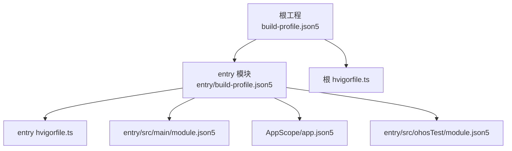
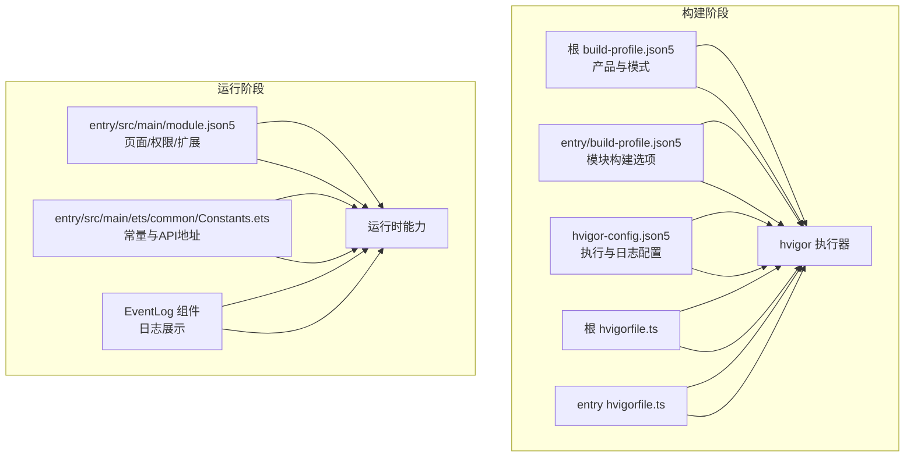
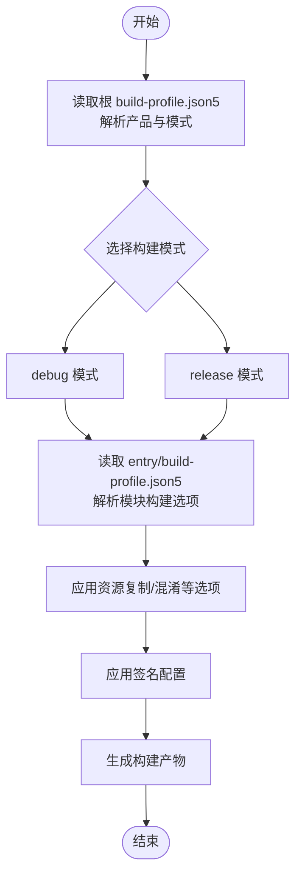
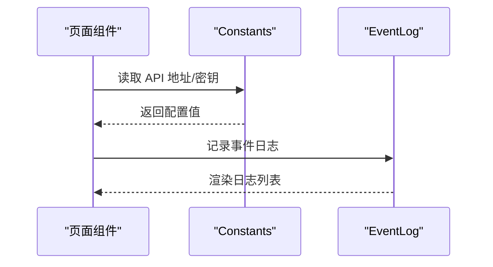
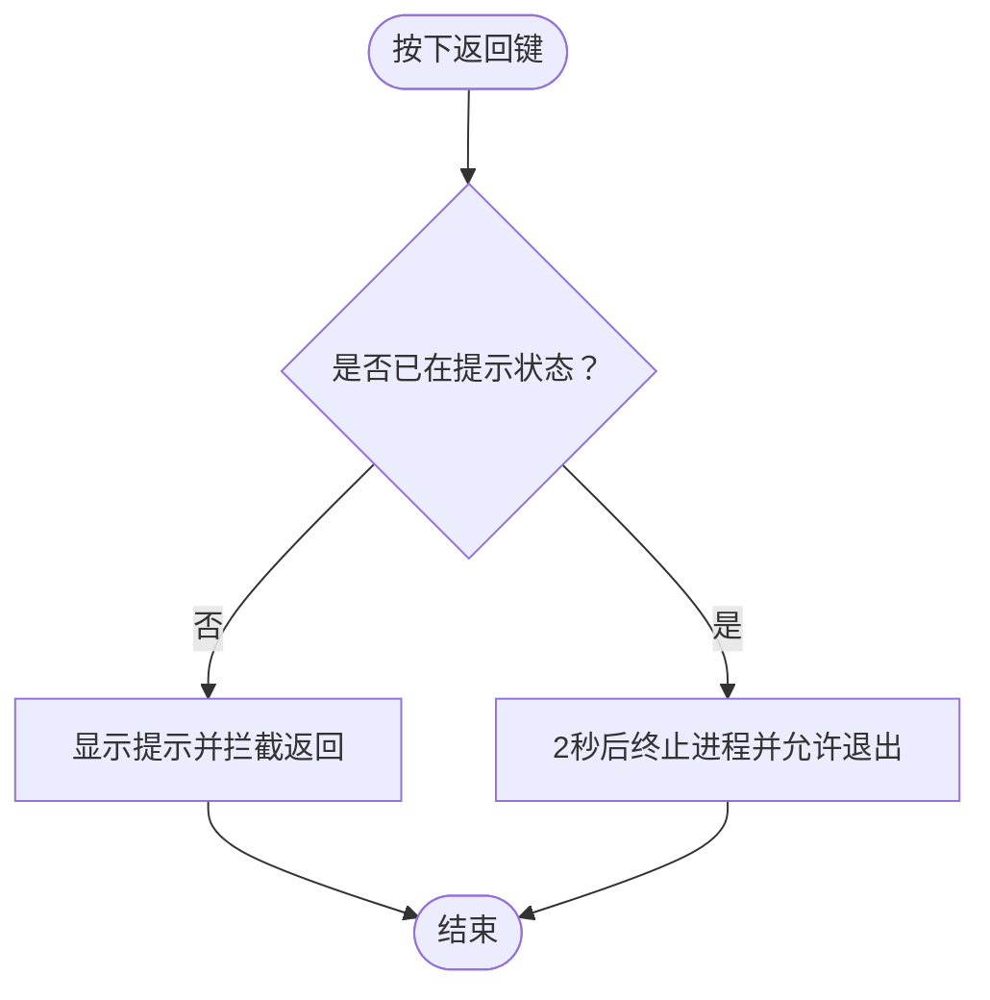
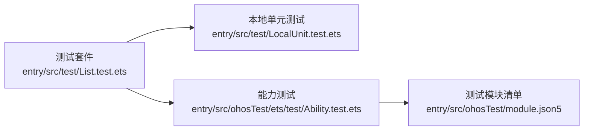
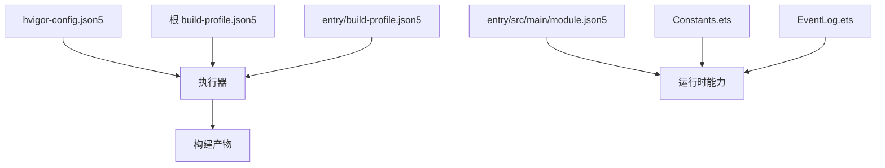

# 多环境部署

<cite>
**本文引用的文件**
- [build-profile.json5（根）](file://build-profile.json5)
- [build-profile.json5（entry 模块）](file://entry/build-profile.json5)
- [hvigorfile.ts（根）](file://hvigorfile.ts)
- [hvigorfile.ts（entry 模块）](file://entry/hvigorfile.ts)
- [hvigor-config.json5](file://hvigor/hvigor-config.json5)
- [AppScope/app.json5](file://AppScope/app.json5)
- [entry/src/main/module.json5](file://entry/src/main/module.json5)
- [entry/src/main/ets/common/Constants.ets](file://entry/src/main/ets/common/Constants.ets)
- [entry/src/main/ets/components/log/EventLog.ets](file://entry/src/main/ets/components/log/EventLog.ets)
- [entry/src/main/ets/pages/DataHomePage.ets](file://entry/src/main/ets/pages/DataHomePage.ets)
- [entry/src/main/ets/pages/DeviceHomePage.ets](file://entry/src/main/ets/pages/DeviceHomePage.ets)
- [.gitignore](file://.gitignore)
- [entry/.gitignore](file://entry/.gitignore)
- [entry/src/ohosTest/module.json5](file://entry/src/ohosTest/module.json5)
- [entry/src/test/List.test.ets](file://entry/src/test/List.test.ets)
- [entry/src/ohosTest/ets/test/Ability.test.ets](file://entry/src/ohosTest/ets/test/Ability.test.ets)
</cite>

## 目录
1. [简介](#简介)
2. [项目结构](#项目结构)
3. [核心组件](#核心组件)
4. [架构总览](#架构总览)
5. [详细组件分析](#详细组件分析)
6. [依赖分析](#依赖分析)
7. [性能考虑](#性能考虑)
8. [故障排查指南](#故障排查指南)
9. [结论](#结论)
10. [附录](#附录)

## 简介
本指南面向多环境部署场景，围绕开发、测试与生产三类环境，系统阐述以下主题：
- 构建模式与产物差异（调试/发布）
- API 地址与日志级别等运行时配置
- 环境变量与敏感信息的安全管理
- 配置文件的环境切换机制（条件编译与运行时选择）
- CI/CD 流水线的配置与自动化部署（检出、构建、测试、发布）
- 不同部署目标（应用商店、内部分发、OTA）的差异化配置要点
- 环境隔离与数据保护策略，以及多环境同步与一致性保障
- 团队协作中的最佳实践与工具推荐

## 项目结构
本项目采用 OpenHarmony/Hvigor 工程组织方式，根工程与模块化划分清晰：
- 根工程负责全局构建配置与签名配置
- entry 模块为应用入口模块，包含页面、组件、能力与测试模块
- AppScope 提供应用级元数据（包名、版本、图标等）

图表来源
- [build-profile.json5（根）:1-73](file://build-profile.json5#L1-L73)
- [build-profile.json5（entry 模块）:1-33](file://entry/build-profile.json5#L1-L33)
- [hvigorfile.ts（根）:1-6](file://hvigorfile.ts#L1-L6)
- [hvigorfile.ts（entry 模块）:1-6](file://entry/hvigorfile.ts#L1-L6)
- [entry/src/main/module.json5:1-71](file://entry/src/main/module.json5#L1-L71)
- [AppScope/app.json5:1-2](file://AppScope/app.json5#L1-L2)
- [entry/src/ohosTest/module.json5:1-12](file://entry/src/ohosTest/module.json5#L1-L12)

章节来源
- [build-profile.json5（根）:1-73](file://build-profile.json5#L1-L73)
- [build-profile.json5（entry 模块）:1-33](file://entry/build-profile.json5#L1-L33)
- [hvigorfile.ts（根）:1-6](file://hvigorfile.ts#L1-L6)
- [hvigorfile.ts（entry 模块）:1-6](file://entry/hvigorfile.ts#L1-L6)
- [entry/src/main/module.json5:1-71](file://entry/src/main/module.json5#L1-L71)
- [AppScope/app.json5:1-2](file://AppScope/app.json5#L1-L2)
- [entry/src/ohosTest/module.json5:1-12](file://entry/src/ohosTest/module.json5#L1-L12)

## 核心组件
- 构建配置与签名
  - 根工程的构建模式集合包含“debug”“release”，可据此区分调试与发布构建参数
  - 签名配置集中于根工程，便于统一管理
- 模块化配置
  - entry 模块的构建选项中包含资源复制与混淆规则开关，便于在不同环境启用或关闭
  - 模块清单定义了页面、权限、扩展能力等，是运行期行为的关键依据
- 运行时常量与日志
  - 常量集中定义，便于替换与统一管理
  - 日志组件提供事件日志展示，有助于问题定位与审计

章节来源
- [build-profile.json5（根）:36-43](file://build-profile.json5#L36-L43)
- [build-profile.json5（root）:44-57](file://build-profile.json5#L44-L57)
- [entry/build-profile.json5:3-24](file://entry/build-profile.json5#L3-L24)
- [entry/src/main/module.json5:1-71](file://entry/src/main/module.json5#L1-L71)
- [entry/src/main/ets/common/Constants.ets:1-82](file://entry/src/main/ets/common/Constants.ets#L1-L82)
- [entry/src/main/ets/components/log/EventLog.ets:1-77](file://entry/src/main/ets/components/log/EventLog.ets#L1-L77)

## 架构总览
下图展示了从构建到运行的关键路径，以及与配置文件的对应关系。

图表来源
- [build-profile.json5（根）:26-43](file://build-profile.json5#L26-L43)
- [entry/build-profile.json5:1-33](file://entry/build-profile.json5#L1-L33)
- [hvigor-config.json5:1-24](file://hvigor/hvigor-config.json5#L1-L24)
- [hvigorfile.ts（根）:1-6](file://hvigorfile.ts#L1-L6)
- [hvigorfile.ts（entry 模块）:1-6](file://entry/hvigorfile.ts#L1-L6)
- [entry/src/main/module.json5:1-71](file://entry/src/main/module.json5#L1-L71)
- [entry/src/main/ets/common/Constants.ets:1-82](file://entry/src/main/ets/common/Constants.ets#L1-L82)
- [entry/src/main/ets/components/log/EventLog.ets:1-77](file://entry/src/main/ets/components/log/EventLog.ets#L1-L77)

## 详细组件分析

### 构建与签名配置
- 根工程构建模式
  - 包含“debug”“release”两种模式，用于区分调试与发布构建参数
- 签名配置
  - 根工程集中维护签名材料，确保不同环境产物的一致性与合法性
- 模块构建选项
  - 资源复制与混淆规则可在模块级开启/关闭，便于在不同环境进行优化与调试

图表来源
- [build-profile.json5（根）:26-43](file://build-profile.json5#L26-L43)
- [build-profile.json5（entry 模块）:3-24](file://entry/build-profile.json5#L3-L24)

章节来源
- [build-profile.json5（根）:26-43](file://build-profile.json5#L26-L43)
- [build-profile.json5（entry 模块）:3-24](file://entry/build-profile.json5#L3-L24)

### 运行时配置与日志
- 常量与 API 地址
  - 常量集中定义，便于在不同环境通过替换常量值实现环境切换
- 日志组件
  - 事件日志组件提供统一的日志展示，便于问题定位与审计

图表来源
- [entry/src/main/ets/common/Constants.ets:1-82](file://entry/src/main/ets/common/Constants.ets#L1-L82)
- [entry/src/main/ets/components/log/EventLog.ets:1-77](file://entry/src/main/ets/components/log/EventLog.ets#L1-L77)

章节来源
- [entry/src/main/ets/common/Constants.ets:1-82](file://entry/src/main/ets/common/Constants.ets#L1-L82)
- [entry/src/main/ets/components/log/EventLog.ets:1-77](file://entry/src/main/ets/components/log/EventLog.ets#L1-L77)

### 页面与返回行为
- 页面返回行为通过统一的退出确认管理器实现，避免误操作退出
- 在首页等页面中，返回按键行为被拦截并提示“再按一次退出”

图表来源
- [entry/src/main/ets/common/Constants.ets:19-82](file://entry/src/main/ets/common/Constants.ets#L19-L82)
- [entry/src/main/ets/pages/DataHomePage.ets:53-59](file://entry/src/main/ets/pages/DataHomePage.ets#L53-L59)
- [entry/src/main/ets/pages/DeviceHomePage.ets:64-71](file://entry/src/main/ets/pages/DeviceHomePage.ets#L64-L71)

章节来源
- [entry/src/main/ets/common/Constants.ets:19-82](file://entry/src/main/ets/common/Constants.ets#L19-L82)
- [entry/src/main/ets/pages/DataHomePage.ets:53-59](file://entry/src/main/ets/pages/DataHomePage.ets#L53-L59)
- [entry/src/main/ets/pages/DeviceHomePage.ets:64-71](file://entry/src/main/ets/pages/DeviceHomePage.ets#L64-L71)

### 测试模块与断言
- 测试模块与本地测试套件定义清晰，便于在不同环境下执行单元测试与能力测试
- 测试框架支持断言与日志输出，有助于验证功能正确性

图表来源
- [entry/src/test/List.test.ets:1-5](file://entry/src/test/List.test.ets#L1-L5)
- [entry/src/ohosTest/ets/test/Ability.test.ets:23-35](file://entry/src/ohosTest/ets/test/Ability.test.ets#L23-L35)
- [entry/src/ohosTest/module.json5:1-12](file://entry/src/ohosTest/module.json5#L1-L12)

章节来源
- [entry/src/test/List.test.ets:1-5](file://entry/src/test/List.test.ets#L1-L5)
- [entry/src/ohosTest/ets/test/Ability.test.ets:23-35](file://entry/src/ohosTest/ets/test/Ability.test.ets#L23-L35)
- [entry/src/ohosTest/module.json5:1-12](file://entry/src/ohosTest/module.json5#L1-L12)

## 依赖分析
- 构建链路依赖
  - 根工程与模块工程通过各自的 hvigorfile.ts 与 build-profile.json5 协作
  - hvigor-config.json5 控制执行与日志级别，影响构建性能与可观测性
- 运行期依赖
  - 模块清单决定页面、权限与扩展能力
  - 常量与日志组件为运行期行为提供支撑

图表来源
- [hvigor-config.json5:1-24](file://hvigor/hvigor-config.json5#L1-L24)
- [build-profile.json5（根）:1-73](file://build-profile.json5#L1-L73)
- [entry/build-profile.json5:1-33](file://entry/build-profile.json5#L1-L33)
- [entry/src/main/module.json5:1-71](file://entry/src/main/module.json5#L1-L71)
- [entry/src/main/ets/common/Constants.ets:1-82](file://entry/src/main/ets/common/Constants.ets#L1-L82)
- [entry/src/main/ets/components/log/EventLog.ets:1-77](file://entry/src/main/ets/components/log/EventLog.ets#L1-L77)

章节来源
- [hvigor-config.json5:1-24](file://hvigor/hvigor-config.json5#L1-L24)
- [build-profile.json5（根）:1-73](file://build-profile.json5#L1-L73)
- [entry/build-profile.json5:1-33](file://entry/build-profile.json5#L1-L33)
- [entry/src/main/module.json5:1-71](file://entry/src/main/module.json5#L1-L71)
- [entry/src/main/ets/common/Constants.ets:1-82](file://entry/src/main/ets/common/Constants.ets#L1-L82)
- [entry/src/main/ets/components/log/EventLog.ets:1-77](file://entry/src/main/ets/components/log/EventLog.ets#L1-L77)

## 性能考虑
- 构建性能
  - 可通过 hvigor-config.json5 的执行选项（如并行、增量、类型检查等）进行调优
- 运行性能
  - 模块级构建选项可控制资源复制与混淆，发布构建建议开启混淆以减小体积并提升安全性
- 日志开销
  - 建议在调试环境提高日志级别，在生产环境降低日志级别以减少 I/O 开销

## 故障排查指南
- 构建失败
  - 检查根与模块的 build-profile.json5 配置是否一致，确认签名配置有效
- 运行异常
  - 使用事件日志组件记录关键路径日志，结合页面返回行为排查用户交互问题
- 测试失败
  - 查看测试断言与日志输出，定位具体用例与期望值不匹配的问题

章节来源
- [entry/src/main/ets/components/log/EventLog.ets:1-77](file://entry/src/main/ets/components/log/EventLog.ets#L1-L77)
- [entry/src/ohosTest/ets/test/Ability.test.ets:23-35](file://entry/src/ohosTest/ets/test/Ability.test.ets#L23-L35)

## 结论
本项目通过清晰的工程分层与配置文件，为多环境部署提供了基础能力。建议在现有基础上进一步完善：
- 将敏感信息与 API 地址迁移至安全的环境变量或配置中心
- 引入条件编译与运行时配置选择机制，实现更灵活的环境切换
- 完善 CI/CD 流水线，覆盖检出、构建、测试与发布全流程
- 明确不同部署目标（应用商店、内部分发、OTA）的差异化配置策略

## 附录

### 多环境配置指南（开发/测试/生产）
- 构建参数
  - 使用根 build-profile.json5 的“debug”“release”模式区分调试与发布
  - 在 entry/build-profile.json5 中根据需要开启/关闭资源复制与混淆
- API 地址与日志级别
  - 将 API 地址与日志级别定义为可替换常量，通过替换 Constants 文件或外部配置实现环境切换
- 环境变量与敏感信息
  - 将密钥与敏感参数放入安全的环境变量或配置中心，避免硬编码
- 配置文件切换
  - 通过条件编译与运行时配置选择实现环境切换；在模块清单中保持页面与权限一致
- CI/CD 流水线
  - 建议包含以下步骤：代码检出 → 依赖安装 → 构建（按模式） → 测试（单元/集成） → 打包 → 发布
- 部署目标差异化
  - 应用商店：严格遵循签名与版本策略
  - 内部分发：关注分发渠道与权限控制
  - OTA 更新：关注增量包与回滚策略
- 环境隔离与数据保护
  - 使用独立的数据库与存储空间，对敏感数据进行脱敏与加密
- 多环境同步与一致性
  - 通过版本号与变更日志保持一致性，定期校验配置与产物
- 最佳实践与工具推荐
  - 版本控制：Git（分支策略、标签）
  - 构建工具：Hvigor（配合 build-profile.json5 与 hvigor-config.json5）
  - 测试：内置测试框架（见测试模块）
  - 配置管理：环境变量与配置中心
  - CI/CD：流水线平台（如 Jenkins/GitLab CI/自建流水线）

章节来源
- [build-profile.json5（根）:36-43](file://build-profile.json5#L36-L43)
- [entry/build-profile.json5:3-24](file://entry/build-profile.json5#L3-L24)
- [hvigor-config.json5:1-24](file://hvigor/hvigor-config.json5#L1-L24)
- [entry/src/main/ets/common/Constants.ets:1-82](file://entry/src/main/ets/common/Constants.ets#L1-L82)
- [entry/src/main/module.json5:1-71](file://entry/src/main/module.json5#L1-L71)
- [entry/src/ohosTest/module.json5:1-12](file://entry/src/ohosTest/module.json5#L1-L12)