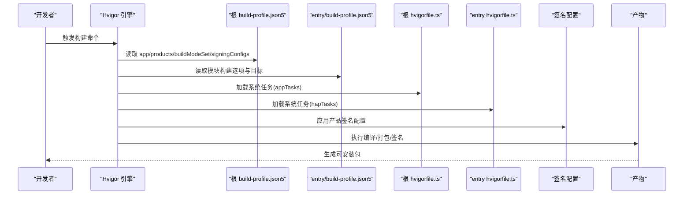
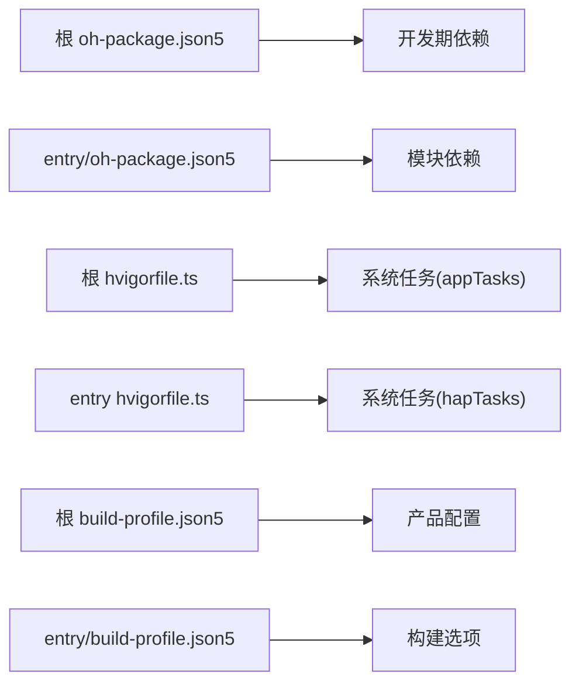

# 构建配置

<cite>
**本文引用的文件**
- [build-profile.json5](file://build-profile.json5)
- [entry/build-profile.json5](file://entry/build-profile.json5)
- [hvigorfile.ts](file://hvigorfile.ts)
- [entry/hvigorfile.ts](file://entry/hvigorfile.ts)
- [hvigor/hvigor-config.json5](file://hvigor/hvigor-config.json5)
- [oh-package.json5](file://oh-package.json5)
- [entry/oh-package.json5](file://entry/oh-package.json5)
- [entry/obfuscation-rules.txt](file://entry/obfuscation-rules.txt)
</cite>

## 目录
1. [简介](#简介)
2. [项目结构](#项目结构)
3. [核心组件](#核心组件)
4. [架构总览](#架构总览)
5. [详细组件分析](#详细组件分析)
6. [依赖分析](#依赖分析)
7. [性能考虑](#性能考虑)
8. [故障排除指南](#故障排除指南)
9. [结论](#结论)
10. [附录](#附录)

## 简介
本指南面向构建配置的使用者与维护者，系统讲解 SmartController 项目的构建配置体系，重点覆盖以下方面：
- build-profile.json5 的 app、modules、products 配置项含义与设置方法
- 编译 SDK 版本、兼容性版本、目标 SDK 版本的选择原则与影响
- 构建模式（debug 与 release）的差异与适用场景
- 模块化构建的配置方法（源码路径、目标产品、依赖关系）
- hvigorfile.ts 构建脚本的自定义配置（任务定义、插件集成、流程优化）
- 构建环境准备与常见问题排查

## 项目结构
该项目采用多模块（Module）与多产品（Product）的组织方式，顶层与模块级均存在构建配置文件，配合 hvigor 构建工具完成编译、打包与签名等流程。

```mermaid
graph TB
Root["根目录<br/>build-profile.json5"] --> Modules["模块列表<br/>modules[].name/srcPath/targets"]
Root --> Products["产品列表<br/>products[].name/versions/signingConfig"]
Root --> BuildModes["构建模式集合<br/>buildModeSet"]
Root --> Signing["签名配置集合<br/>signingConfigs"]
Entry["entry 模块<br/>entry/build-profile.json5"] --> EntryTargets["目标集合<br/>targets[].name"]
Entry --> EntryBuildOptions["构建选项集<br/>buildOptionSet[].name"]
Entry --> EntryArk["Ark 编译器混淆规则<br/>arkOptions.obfuscation.ruleOptions"]
HvigorRoot["根 hvigorfile.ts"] --> PluginsRoot["系统任务(appTasks)<br/>system: appTasks"]
HvigorEntry["entry hvigorfile.ts"] --> PluginsEntry["系统任务(hapTasks)<br/>system: hapTasks"]
HvigorConf["hvigor-config.json5"] --> Exec["执行策略<br/>execution.*"]
HvigorConf --> Log["日志级别<br/>logging.level"]
HvigorConf --> Debugging["调试相关<br/>debugging.stacktrace"]
HvigorConf --> NodeOpt["Node 选项<br/>nodeOptions.*"]
```

图表来源
- [build-profile.json5:1-73](file://build-profile.json5#L1-L73)
- [entry/build-profile.json5:1-33](file://entry/build-profile.json5#L1-L33)
- [hvigorfile.ts:1-6](file://hvigorfile.ts#L1-L6)
- [entry/hvigorfile.ts:1-6](file://entry/hvigorfile.ts#L1-L6)
- [hvigor/hvigor-config.json5:1-24](file://hvigor/hvigor-config.json5#L1-L24)

章节来源
- [build-profile.json5:1-73](file://build-profile.json5#L1-L73)
- [entry/build-profile.json5:1-33](file://entry/build-profile.json5#L1-L33)
- [hvigorfile.ts:1-6](file://hvigorfile.ts#L1-L6)
- [entry/hvigorfile.ts:1-6](file://entry/hvigorfile.ts#L1-L6)
- [hvigor/hvigor-config.json5:1-24](file://hvigor/hvigor-config.json5#L1-L24)

## 核心组件
本节聚焦于构建配置的核心要素：app、modules、products、buildModeSet、signingConfigs，以及模块级的 build-option 与 hvigor 脚本。

- app 配置
  - products：定义一个或多个产品配置，每个产品绑定签名配置、SDK 版本与运行时 OS。
  - buildModeSet：定义构建模式集合，如 debug 与 release。
  - signingConfigs：定义签名材料（证书、密钥别名、密码、签名算法等），供产品引用。
- modules 配置
  - name：模块名称（entry）。
  - srcPath：模块源码根路径（相对项目根）。
  - targets：模块可产出的目标（如 default、ohosTest），并可通过 applyToProducts 绑定到具体产品。
- 模块级构建选项
  - apiType：模块 API 类型（stageMode）。
  - buildOption.resOptions.copyCodeResource：控制是否复制代码资源。
  - buildOptionSet：按构建模式（如 release）配置 Ark 编译器混淆规则与文件来源。
  - targets：模块目标集合（default、ohosTest）。

章节来源
- [build-profile.json5:26-57](file://build-profile.json5#L26-L57)
- [build-profile.json5:59-72](file://build-profile.json5#L59-L72)
- [entry/build-profile.json5:2-32](file://entry/build-profile.json5#L2-L32)

## 架构总览
下图展示从配置到产物的关键流程：配置驱动 hvigor 执行系统任务，系统任务根据模块与产品配置调用编译、打包与签名流程，最终输出可安装包。

图表来源
- [build-profile.json5:26-57](file://build-profile.json5#L26-L57)
- [entry/build-profile.json5:10-24](file://entry/build-profile.json5#L10-L24)
- [hvigorfile.ts:1-6](file://hvigorfile.ts#L1-L6)
- [entry/hvigorfile.ts:1-6](file://entry/hvigorfile.ts#L1-L6)

## 详细组件分析

### app 配置详解
- products
  - name：产品标识符，用于区分不同构建产物。
  - signingConfig：引用 signingConfigs 中的签名配置名称。
  - compileSdkVersion/compatibleSdkVersion/targetSdkVersion：分别指定编译 SDK 版本、兼容性 SDK 版本与目标 SDK 版本。
  - runtimeOS：运行时操作系统类型（OpenHarmony）。
- buildModeSet
  - 定义构建模式集合，如 debug 与 release。不同模式可影响调试信息、代码混淆与优化策略。
- signingConfigs
  - material：包含证书路径、密钥别名、密钥密码、profile、签名算法、storeFile、storePassword 等字段，用于签名 APK/HAP。

章节来源
- [build-profile.json5:26-57](file://build-profile.json5#L26-L57)

### modules 配置详解
- name：模块名称（entry）。
- srcPath：模块源码根路径（相对项目根）。
- targets：模块目标集合，每个目标可绑定到一个或多个产品（applyToProducts）。

章节来源
- [build-profile.json5:59-72](file://build-profile.json5#L59-L72)

### 模块级构建选项详解
- apiType：模块 API 类型（stageMode）。
- buildOption.resOptions.copyCodeResource：控制是否复制代码资源。
- buildOptionSet：按构建模式（如 release）配置 Ark 编译器混淆规则与文件来源。
- targets：模块目标集合（default、ohosTest）。

章节来源
- [entry/build-profile.json5:2-32](file://entry/build-profile.json5#L2-L32)

### hvigorfile.ts 自定义配置
- 根 hvigorfile.ts
  - system: appTasks（应用系统任务，不可修改）。
  - plugins: []（预留自定义插件扩展点）。
- entry hvigorfile.ts
  - system: hapTasks（HAP 模块系统任务，不可修改）。
  - plugins: []（预留自定义插件扩展点）。

章节来源
- [hvigorfile.ts:1-6](file://hvigorfile.ts#L1-L6)
- [entry/hvigorfile.ts:1-6](file://entry/hvigorfile.ts#L1-L6)

### hvigor 执行配置
- execution：构建执行策略（analyze、daemon、incremental、parallel、typeCheck、optimizationStrategy）。
- logging：日志级别（debug/info/warn/error）。
- debugging：堆栈跟踪开关。
- nodeOptions：Node.js 运行时选项（如 maxOldSpaceSize、exposeGC）。

章节来源
- [hvigor/hvigor-config.json5:1-24](file://hvigor/hvigor-config.json5#L1-L24)

### 代码混淆与资源处理
- entry/obfuscation-rules.txt：定义 Ark 编译器混淆规则（属性名混淆、全局作用域混淆、文件名混淆、导出混淆等）。
- entry/build-profile.json5 中的 buildOptionSet.release.arkOptions.obfuscation.ruleOptions.files：指向混淆规则文件。

章节来源
- [entry/obfuscation-rules.txt:1-22](file://entry/obfuscation-rules.txt#L1-L22)
- [entry/build-profile.json5:10-24](file://entry/build-profile.json5#L10-L24)

## 依赖分析
- 项目依赖
  - 根级依赖：oh-package.json5 定义开发期依赖（如测试框架）。
  - 模块级依赖：entry/oh-package.json5 定义模块依赖（如加密库）。
- 构建依赖
  - hvigor 插件：通过 hvigorfile.ts 引入系统任务（appTasks/hapTasks）。
  - 配置依赖：build-profile.json5 决定产品、模式与签名；entry/build-profile.json5 决定模块构建选项。

图表来源
- [oh-package.json5:1-10](file://oh-package.json5#L1-L10)
- [entry/oh-package.json5:1-13](file://entry/oh-package.json5#L1-L13)
- [hvigorfile.ts:1-6](file://hvigorfile.ts#L1-L6)
- [entry/hvigorfile.ts:1-6](file://entry/hvigorfile.ts#L1-L6)
- [build-profile.json5:26-57](file://build-profile.json5#L26-L57)
- [entry/build-profile.json5:2-32](file://entry/build-profile.json5#L2-L32)

章节来源
- [oh-package.json5:1-10](file://oh-package.json5#L1-L10)
- [entry/oh-package.json5:1-13](file://entry/oh-package.json5#L1-L13)
- [hvigorfile.ts:1-6](file://hvigorfile.ts#L1-L6)
- [entry/hvigorfile.ts:1-6](file://entry/hvigorfile.ts#L1-L6)
- [build-profile.json5:26-57](file://build-profile.json5#L26-L57)
- [entry/build-profile.json5:2-32](file://entry/build-profile.json5#L2-L32)

## 性能考虑
- 并行与增量编译：在 hvigor-config.json5 中启用并行与增量编译可显著提升构建速度。
- 优化策略：根据内存与性能需求选择优化策略（memory/performance）。
- 日志级别：在开发阶段可提高日志级别以辅助定位问题，在 CI 环境中建议降低日志级别以减少输出。
- Node.js 内存：适当增大 maxOldSpaceSize 可缓解大项目构建时的内存压力。

章节来源
- [hvigor/hvigor-config.json5:6-22](file://hvigor/hvigor-config.json5#L6-L22)

## 故障排除指南
- 签名配置无效
  - 确认 products[].signingConfig 与 signingConfigs[].name 匹配。
  - 检查签名材料字段完整性与路径正确性。
- 构建模式未生效
  - 确认 buildModeSet 中包含所需模式（如 debug/release）。
  - 检查模块级 buildOptionSet 是否针对对应模式配置了混淆规则。
- 混淆规则未生效
  - 确认 entry/build-profile.json5 中的 ruleOptions.files 指向正确的规则文件。
  - 检查规则文件语法与注释状态。
- 依赖解析失败
  - 校验 oh-package.json5 与 entry/oh-package.json5 的依赖声明。
  - 清理缓存后重试（如删除 node_modules/oh_modules 后重新安装）。
- 构建缓慢
  - 在 hvigor-config.json5 中开启并行与增量编译。
  - 调整优化策略与日志级别。
  - 增加 Node.js 内存上限。

章节来源
- [build-profile.json5:26-57](file://build-profile.json5#L26-L57)
- [entry/build-profile.json5:10-24](file://entry/build-profile.json5#L10-L24)
- [entry/obfuscation-rules.txt:1-22](file://entry/obfuscation-rules.txt#L1-L22)
- [hvigor/hvigor-config.json5:6-22](file://hvigor/hvigor-config.json5#L6-L22)

## 结论
本指南系统梳理了 SmartController 项目的构建配置体系，明确了 app、modules、products、buildModeSet、signingConfigs 的职责与设置要点，并结合 hvigorfile.ts 与 hvigor-config.json5 提供了可操作的优化建议与排障路径。遵循本文档进行配置与优化，可有效提升构建效率与产物质量。

## 附录

### SDK 版本选择原则
- compileSdkVersion：决定编译时可用的 API 与特性集合。
- compatibleSdkVersion：决定兼容性检查范围，通常与 compileSdkVersion 保持一致。
- targetSdkVersion：决定运行时行为与权限策略，应尽量与 compileSdkVersion 对齐以获得一致体验。

章节来源
- [build-profile.json5:30-33](file://build-profile.json5#L30-L33)

### 构建模式差异与使用场景
- debug
  - 适合开发与联调阶段，便于调试与日志输出。
  - 通常不启用代码混淆，保留符号信息。
- release
  - 适合发布阶段，强调体积与性能优化。
  - 可启用 Ark 编译器混淆规则，减小包体并提升安全性。

章节来源
- [build-profile.json5:36-43](file://build-profile.json5#L36-L43)
- [entry/build-profile.json5:10-24](file://entry/build-profile.json5#L10-L24)

### 模块化构建配置步骤
- 在根 build-profile.json5 的 modules 中添加模块条目，设置 name、srcPath 与 targets。
- 在 targets.applyToProducts 中将模块目标绑定到具体产品。
- 如需模块级构建选项（如资源复制、混淆规则），在模块级 build-profile.json5 中配置。

章节来源
- [build-profile.json5:59-72](file://build-profile.json5#L59-L72)
- [entry/build-profile.json5:25-32](file://entry/build-profile.json5#L25-L32)

### hvigorfile.ts 自定义配置建议
- 根 hvigorfile.ts：保留 system: appTasks 不变，plugins 留空或按需扩展。
- entry hvigorfile.ts：保留 system: hapTasks 不变，plugins 留空或按需扩展。
- 如需自定义任务，可在 plugins 中引入第三方插件或编写自定义任务逻辑。

章节来源
- [hvigorfile.ts:1-6](file://hvigorfile.ts#L1-L6)
- [entry/hvigorfile.ts:1-6](file://entry/hvigorfile.ts#L1-L6)