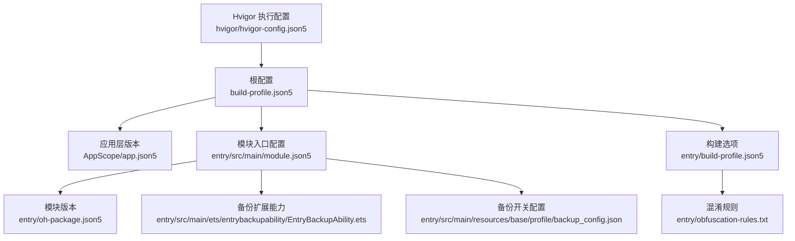
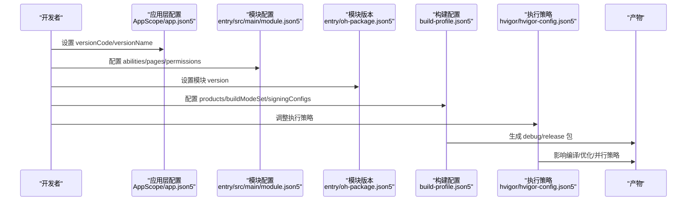
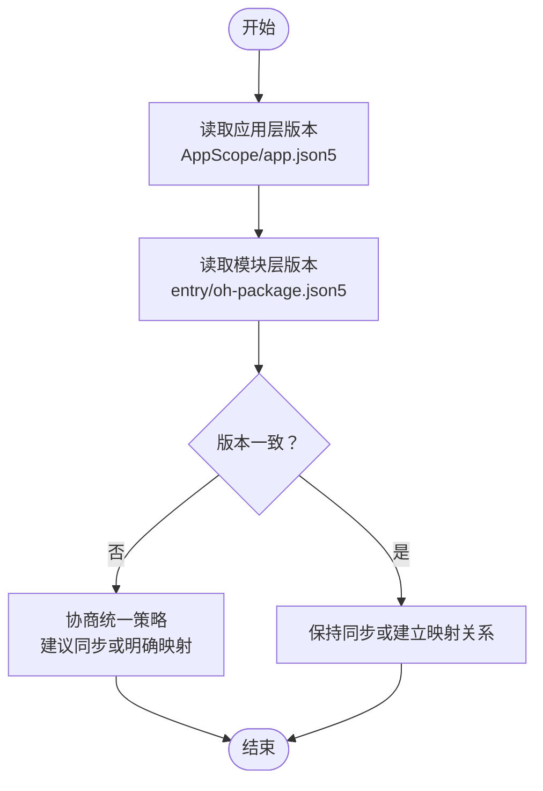
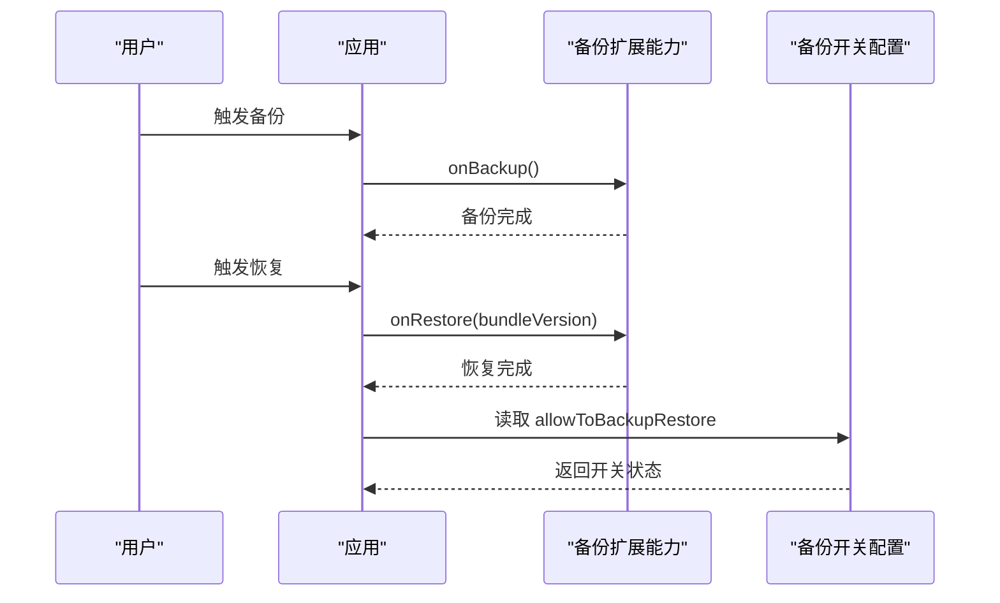
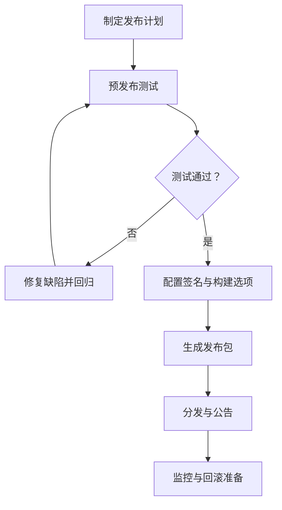
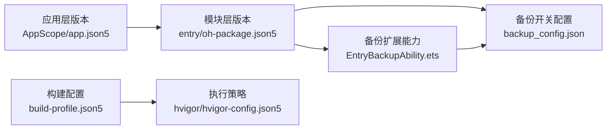

# 版本管理

<cite>
**本文引用的文件**
- [AppScope/app.json5](file://AppScope/app.json5)
- [entry/src/main/module.json5](file://entry/src/main/module.json5)
- [entry/oh-package.json5](file://entry/oh-package.json5)
- [build-profile.json5](file://build-profile.json5)
- [entry/build-profile.json5](file://entry/build-profile.json5)
- [hvigor/hvigor-config.json5](file://hvigor/hvigor-config.json5)
- [entry/src/main/resources/base/profile/backup_config.json](file://entry/src/main/resources/base/profile/backup_config.json)
- [entry/src/main/ets/entrybackupability/EntryBackupAbility.ets](file://entry/src/main/ets/entrybackupability/EntryBackupAbility.ets)
- [entry/obfuscation-rules.txt](file://entry/obfuscation-rules.txt)
- [.gitignore](file://.gitignore)
- [entry/.gitignore](file://entry/.gitignore)
</cite>

## 目录
1. [引言](#引言)
2. [项目结构](#项目结构)
3. [核心组件](#核心组件)
4. [架构总览](#架构总览)
5. [详细组件分析](#详细组件分析)
6. [依赖分析](#依赖分析)
7. [性能考量](#性能考量)
8. [故障排查指南](#故障排查指南)
9. [结论](#结论)
10. [附录](#附录)

## 引言
本指南面向开发者与发布团队，系统化梳理本项目的版本管理实践，覆盖版本号命名与语义化版本控制、应用版本字段（versionCode/versionName）的设置与关系、变更日志规范与维护策略、版本回滚与降级处理、发布流程（预发布测试、正式发布、紧急修复）、多渠道与差异化配置、以及最佳实践与常见陷阱。文档严格基于仓库现有配置文件进行分析与总结，确保可执行性与一致性。

## 项目结构
本项目采用模块化组织，根级配置与构建参数位于根目录与模块目录中，应用层版本信息集中在 AppScope 的 app.json5 中；模块入口能力与权限声明位于 entry 模块的 module.json5；模块级版本信息位于 entry 模块的 oh-package.json5；构建模式与签名等由 build-profile.json5 统一管理；hvigor 配置文件用于构建执行策略；备份扩展能力与备份开关位于模块资源与扩展能力文件中。

图表来源
- [build-profile.json5](file://build-profile.json5)
- [AppScope/app.json5](file://AppScope/app.json5)
- [entry/src/main/module.json5](file://entry/src/main/module.json5)
- [entry/oh-package.json5](file://entry/oh-package.json5)
- [entry/build-profile.json5](file://entry/build-profile.json5)
- [entry/obfuscation-rules.txt](file://entry/obfuscation-rules.txt)
- [entry/src/main/ets/entrybackupability/EntryBackupAbility.ets](file://entry/src/main/ets/entrybackupability/EntryBackupAbility.ets)
- [entry/src/main/resources/base/profile/backup_config.json](file://entry/src/main/resources/base/profile/backup_config.json)
- [hvigor/hvigor-config.json5](file://hvigor/hvigor-config.json5)

章节来源
- [build-profile.json5](file://build-profile.json5)
- [AppScope/app.json5](file://AppScope/app.json5)
- [entry/src/main/module.json5](file://entry/src/main/module.json5)
- [entry/oh-package.json5](file://entry/oh-package.json5)
- [entry/build-profile.json5](file://entry/build-profile.json5)
- [hvigor/hvigor-config.json5](file://hvigor/hvigor-config.json5)

## 核心组件
- 应用层版本：由 AppScope/app.json5 提供 bundleName、vendor、versionCode、versionName 等应用级版本元数据。
- 模块层版本：由 entry/oh-package.json5 提供模块级版本号，用于模块层面的版本标识与依赖管理。
- 构建与产品配置：由 build-profile.json5 定义产品维度（如 default）、编译/兼容/目标 SDK 版本、构建模式（debug/release）与签名配置。
- 模块入口与能力：由 entry/src/main/module.json5 描述模块类型、页面、能力、权限与扩展能力（含备份扩展）。
- 备份能力与开关：备份扩展能力类与备份开关配置共同决定备份/恢复行为。
- 构建执行策略：hvigor/hvigor-config.json5 控制构建分析、并行、增量编译等执行策略。
- 混淆规则：entry/obfuscation-rules.txt 定义混淆策略，影响产物体积与安全性。

章节来源
- [AppScope/app.json5](file://AppScope/app.json5)
- [entry/oh-package.json5](file://entry/oh-package.json5)
- [build-profile.json5](file://build-profile.json5)
- [entry/src/main/module.json5](file://entry/src/main/module.json5)
- [entry/src/main/ets/entrybackupability/EntryBackupAbility.ets](file://entry/src/main/ets/entrybackupability/EntryBackupAbility.ets)
- [entry/src/main/resources/base/profile/backup_config.json](file://entry/src/main/resources/base/profile/backup_config.json)
- [hvigor/hvigor-config.json5](file://hvigor/hvigor-config.json5)
- [entry/obfuscation-rules.txt](file://entry/obfuscation-rules.txt)

## 架构总览
下图展示版本相关配置在构建与发布阶段的交互路径，从应用层版本到模块层版本，再到构建模式与签名，最终形成可安装包。

图表来源
- [AppScope/app.json5](file://AppScope/app.json5)
- [entry/src/main/module.json5](file://entry/src/main/module.json5)
- [entry/oh-package.json5](file://entry/oh-package.json5)
- [build-profile.json5](file://build-profile.json5)
- [hvigor/hvigor-config.json5](file://hvigor/hvigor-config.json5)

## 详细组件分析

### 应用层版本与模块层版本的关系
- 应用层版本（AppScope/app.json5）提供应用级版本号（versionCode/versionName），用于系统识别与升级判断。
- 模块层版本（entry/oh-package.json5）提供模块级版本号（version），用于模块层面的版本标识与依赖管理。
- 在当前仓库中，两者均以“1.0.0”作为初始版本，建议在后续迭代中保持同步或建立明确映射关系，避免版本错配导致的升级异常。

图表来源
- [AppScope/app.json5](file://AppScope/app.json5)
- [entry/oh-package.json5](file://entry/oh-package.json5)

章节来源
- [AppScope/app.json5](file://AppScope/app.json5)
- [entry/oh-package.json5](file://entry/oh-package.json5)

### 语义化版本控制与版本号命名规范
- 建议采用语义化版本控制（SemVer）：主版本号.次版本号.修订号（MAJOR.MINOR.PATCH）。
- 主版本号：不兼容的变更（破坏性更新）。
- 次版本号：向后兼容的功能新增。
- 修订号：向后兼容的问题修复。
- 仓库当前版本均为“1.0.0”，建议在后续迭代中遵循 SemVer 并在变更日志中标注对应版本号。

章节来源
- [AppScope/app.json5](file://AppScope/app.json5)
- [entry/oh-package.json5](file://entry/oh-package.json5)

### 变更日志规范与维护策略
- 内容分类：功能更新（feat）、问题修复（fix）、安全补丁（security）、性能优化（perf）、重构（refactor）等。
- 版本标注：每次发布前在变更日志中新增对应版本条目，并与应用/模块版本号关联。
- 记录要点：简述变更内容、影响范围、风险提示、回退建议；必要时附带链接至问题单或 PR。
- 仓库未提供独立变更日志文件，建议在发布流程中强制维护变更日志并与版本号绑定。

章节来源
- [AppScope/app.json5](file://AppScope/app.json5)
- [entry/oh-package.json5](file://entry/oh-package.json5)

### 版本回滚与降级处理
- 回滚策略：优先采用“功能开关+灰度发布”降低风险；若必须回滚，应保留上一稳定版本的安装包与配置。
- 数据兼容性：通过备份扩展能力与备份开关保障用户数据迁移与恢复；在回滚前后验证数据完整性。
- 功能降级：在低版本客户端上启用降级逻辑，保证核心功能可用，非关键功能隐藏或禁用。

图表来源
- [entry/src/main/ets/entrybackupability/EntryBackupAbility.ets](file://entry/src/main/ets/entrybackupability/EntryBackupAbility.ets)
- [entry/src/main/resources/base/profile/backup_config.json](file://entry/src/main/resources/base/profile/backup_config.json)

章节来源
- [entry/src/main/ets/entrybackupability/EntryBackupAbility.ets](file://entry/src/main/ets/entrybackupability/EntryBackupAbility.ets)
- [entry/src/main/resources/base/profile/backup_config.json](file://entry/src/main/resources/base/profile/backup_config.json)

### 发布流程标准化
- 预发布测试：在 debug 模式下完成集成测试与回归测试，确保无严重缺陷。
- 正式发布：切换至 release 模式，配置签名与构建选项，生成发布包并上传分发平台。
- 紧急修复：发布后若出现高危问题，按“紧急修复”流程快速迭代并重新发布，同时更新变更日志与用户公告。

图表来源
- [build-profile.json5](file://build-profile.json5)
- [entry/build-profile.json5](file://entry/build-profile.json5)

章节来源
- [build-profile.json5](file://build-profile.json5)
- [entry/build-profile.json5](file://entry/build-profile.json5)

### 多渠道版本管理与差异化配置
- 渠道区分：可在构建配置中通过产品维度（products）与构建模式（buildModeSet）实现差异化打包。
- 差异化配置：通过模块配置与资源目录实现渠道特定的页面、权限、能力或资源差异。
- 当前仓库已定义默认产品与 debug/release 构建模式，建议在后续扩展中增加渠道维度并配套差异化配置文件。

章节来源
- [build-profile.json5](file://build-profile.json5)
- [entry/src/main/module.json5](file://entry/src/main/module.json5)

### 版本控制最佳实践与常见陷阱
- 最佳实践
  - 严格遵循语义化版本控制，明确版本号含义与升级策略。
  - 在发布前统一应用/模块版本，确保版本一致性。
  - 使用变更日志记录所有重要变更，便于审计与回溯。
  - 利用备份扩展能力保障数据安全，提供回滚与恢复路径。
  - 启用必要的混淆与安全策略，保护敏感信息与算法。
- 常见陷阱
  - 忽视版本号同步，导致升级异常或功能缺失。
  - 缺少变更日志，造成发布风险不可控。
  - 未充分测试回滚路径，导致回滚失败。
  - 过度依赖单一发布通道，缺乏多渠道备份。

章节来源
- [entry/obfuscation-rules.txt](file://entry/obfuscation-rules.txt)
- [entry/src/main/ets/entrybackupability/EntryBackupAbility.ets](file://entry/src/main/ets/entrybackupability/EntryBackupAbility.ets)

## 依赖分析
- 应用层版本与模块层版本：二者需保持一致或建立明确映射，避免升级与依赖冲突。
- 构建配置与执行策略：hvigor 配置影响编译性能与产物质量，需与构建模式协同调整。
- 备份能力与开关：备份扩展能力与备份开关共同决定数据迁移与恢复行为，需在回滚策略中重点考虑。

图表来源
- [AppScope/app.json5](file://AppScope/app.json5)
- [entry/oh-package.json5](file://entry/oh-package.json5)
- [build-profile.json5](file://build-profile.json5)
- [hvigor/hvigor-config.json5](file://hvigor/hvigor-config.json5)
- [entry/src/main/ets/entrybackupability/EntryBackupAbility.ets](file://entry/src/main/ets/entrybackupability/EntryBackupAbility.ets)
- [entry/src/main/resources/base/profile/backup_config.json](file://entry/src/main/resources/base/profile/backup_config.json)

章节来源
- [AppScope/app.json5](file://AppScope/app.json5)
- [entry/oh-package.json5](file://entry/oh-package.json5)
- [build-profile.json5](file://build-profile.json5)
- [hvigor/hvigor-config.json5](file://hvigor/hvigor-config.json5)
- [entry/src/main/ets/entrybackupability/EntryBackupAbility.ets](file://entry/src/main/ets/entrybackupability/EntryBackupAbility.ets)
- [entry/src/main/resources/base/profile/backup_config.json](file://entry/src/main/resources/base/profile/backup_config.json)

## 性能考量
- 构建性能：通过 hvigor 配置启用并行与增量编译，减少重复构建时间。
- 产物体积：结合混淆规则与资源裁剪，平衡安全性与体积。
- 测试效率：在 debug 模式下进行充分测试，在 release 模式下进行最终验证。

章节来源
- [hvigor/hvigor-config.json5](file://hvigor/hvigor-config.json5)
- [entry/obfuscation-rules.txt](file://entry/obfuscation-rules.txt)
- [entry/build-profile.json5](file://entry/build-profile.json5)

## 故障排查指南
- 版本不一致：检查应用层与模块层版本是否同步，避免升级异常。
- 构建失败：核对构建配置与签名材料，确认构建模式与产品维度正确。
- 回滚失败：验证备份扩展能力与备份开关配置，确保 onBackup/onRestore 正常执行。
- 发布包异常：检查混淆规则与资源拷贝配置，确认发布包完整性。

章节来源
- [AppScope/app.json5](file://AppScope/app.json5)
- [entry/oh-package.json5](file://entry/oh-package.json5)
- [build-profile.json5](file://build-profile.json5)
- [entry/src/main/ets/entrybackupability/EntryBackupAbility.ets](file://entry/src/main/ets/entrybackupability/EntryBackupAbility.ets)
- [entry/src/main/resources/base/profile/backup_config.json](file://entry/src/main/resources/base/profile/backup_config.json)
- [entry/obfuscation-rules.txt](file://entry/obfuscation-rules.txt)

## 结论
本指南基于仓库现有配置文件，建立了从版本号命名、应用/模块版本关系、变更日志、回滚与降级、发布流程到多渠道管理的完整实施框架。建议在后续迭代中补充独立的变更日志文件、完善版本同步机制与回滚演练，并持续优化构建与发布流程，以提升版本管理的稳定性与可追溯性。

## 附录
- 版本号命名建议：主版本号.次版本号.修订号（MAJOR.MINOR.PATCH），配合语义化变更描述。
- 发布清单：变更日志、版本号、签名材料、构建配置、回滚预案、监控指标。
- 差异化配置：通过产品维度与资源目录实现渠道差异化，确保一致性与可维护性。