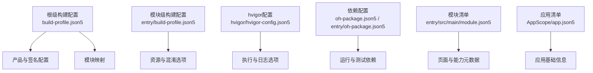
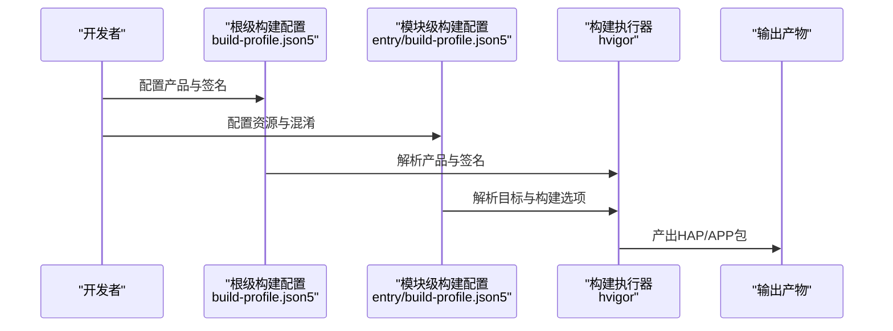
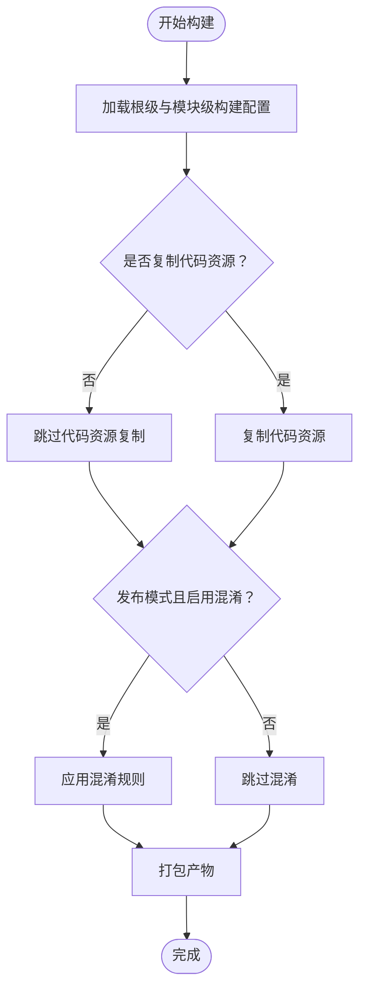
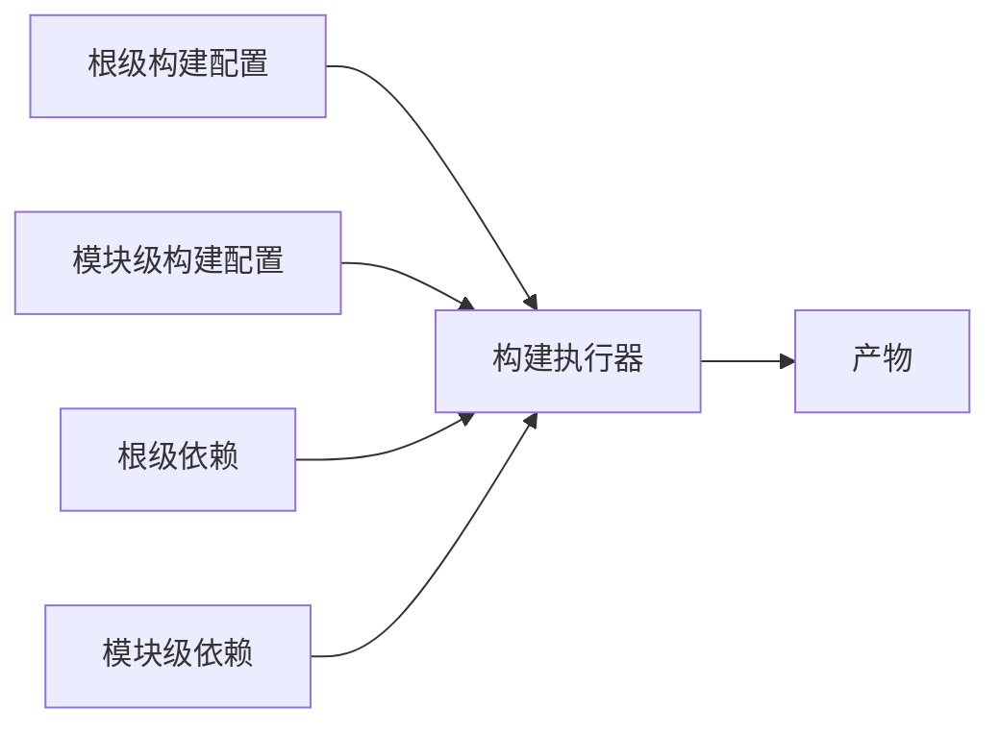

# 签名和打包

<cite>
**本文引用的文件**
- [build-profile.json5](file://build-profile.json5)
- [entry/build-profile.json5](file://entry/build-profile.json5)
- [hvigorfile.ts](file://hvigorfile.ts)
- [entry/hvigorfile.ts](file://entry/hvigorfile.ts)
- [hvigor/hvigor-config.json5](file://hvigor/hvigor-config.json5)
- [oh-package.json5](file://oh-package.json5)
- [entry/oh-package.json5](file://entry/oh-package.json5)
- [entry/obfuscation-rules.txt](file://entry/obfuscation-rules.txt)
- [entry/src/main/module.json5](file://entry/src/main/module.json5)
- [AppScope/app.json5](file://AppScope/app.json5)
</cite>

## 目录
1. [简介](#简介)
2. [项目结构](#项目结构)
3. [核心组件](#核心组件)
4. [架构总览](#架构总览)
5. [详细组件分析](#详细组件分析)
6. [依赖分析](#依赖分析)
7. [性能考虑](#性能考虑)
8. [故障排查指南](#故障排查指南)
9. [结论](#结论)
10. [附录](#附录)

## 简介
本指南面向OpenHarmony/HarmonyOS项目“SmartController”，提供从签名配置到打包输出的完整操作说明。内容涵盖：
- 签名材料与配置文件的生成与管理：证书文件(.cer)、密钥库(.p12)、配置文件(.p7b)的作用与创建要点
- 签名材料关键参数：证书路径、密钥别名、密钥密码、签名算法、存储文件与存储密码
- 不同构建模式下的签名策略：调试签名与发布签名的差异与配置
- 打包流程：资源打包、代码压缩与输出文件生成
- 依赖配置对打包的影响：oh-package.json5与构建配置的关系
- 签名验证与包文件检查方法
- 常见问题排查与企业签名、应用商店发布注意事项

## 项目结构
本项目采用多模块结构，根级与模块级均存在构建与依赖配置文件，签名与打包相关的关键位置如下：
- 根级构建配置：定义产品、构建模式、签名配置与模块映射
- 模块级构建配置：定义目标产物、资源处理与混淆规则
- 构建工具配置：hvigor执行选项与日志级别
- 依赖声明：根级与模块级npm风格依赖
- 模块清单：能力、页面、权限等元数据

图表来源
- [build-profile.json5:1-73](file://build-profile.json5#L1-L73)
- [entry/build-profile.json5:1-33](file://entry/build-profile.json5#L1-L33)
- [hvigor/hvigor-config.json5:1-24](file://hvigor/hvigor-config.json5#L1-L24)
- [oh-package.json5:1-10](file://oh-package.json5#L1-L10)
- [entry/oh-package.json5:1-13](file://entry/oh-package.json5#L1-L13)
- [entry/src/main/module.json5:1-71](file://entry/src/main/module.json5#L1-L71)
- [AppScope/app.json5:1-2](file://AppScope/app.json5#L1-L2)

章节来源
- [build-profile.json5:1-73](file://build-profile.json5#L1-L73)
- [entry/build-profile.json5:1-33](file://entry/build-profile.json5#L1-L33)
- [hvigor/hvigor-config.json5:1-24](file://hvigor/hvigor-config.json5#L1-L24)
- [oh-package.json5:1-10](file://oh-package.json5#L1-L10)
- [entry/oh-package.json5:1-13](file://entry/oh-package.json5#L1-L13)
- [entry/src/main/module.json5:1-71](file://entry/src/main/module.json5#L1-L71)
- [AppScope/app.json5:1-2](file://AppScope/app.json5#L1-L2)

## 核心组件
- 根级构建配置：定义产品名称、签名配置引用、SDK版本与构建模式集合，并声明模块映射关系
- 模块级构建配置：定义目标产物、资源复制策略与发布模式下的Ark混淆规则
- hvigor配置：控制构建分析、并行、增量编译等执行选项
- 依赖配置：根级与模块级的开发与运行依赖
- 模块清单：声明页面、能力、扩展能力与权限等元数据
- 应用清单：声明应用包名、版本号、图标与标签等基础信息

章节来源
- [build-profile.json5:26-57](file://build-profile.json5#L26-L57)
- [entry/build-profile.json5:1-33](file://entry/build-profile.json5#L1-L33)
- [hvigorfile.ts:1-6](file://hvigorfile.ts#L1-L6)
- [entry/hvigorfile.ts:1-6](file://entry/hvigorfile.ts#L1-L6)
- [hvigor/hvigor-config.json5:1-24](file://hvigor/hvigor-config.json5#L1-L24)
- [oh-package.json5:1-10](file://oh-package.json5#L1-L10)
- [entry/oh-package.json5:1-13](file://entry/oh-package.json5#L1-L13)
- [entry/src/main/module.json5:1-71](file://entry/src/main/module.json5#L1-L71)
- [AppScope/app.json5:1-2](file://AppScope/app.json5#L1-L2)

## 架构总览
下图展示从配置到产物的总体流程：根级构建配置选择签名与产品，模块级配置决定资源与混淆策略，hvigor执行器根据配置进行构建与打包。

图表来源
- [build-profile.json5:26-57](file://build-profile.json5#L26-L57)
- [entry/build-profile.json5:1-33](file://entry/build-profile.json5#L1-L33)
- [hvigorfile.ts:1-6](file://hvigorfile.ts#L1-L6)
- [entry/hvigorfile.ts:1-6](file://entry/hvigorfile.ts#L1-L6)

## 详细组件分析

### 签名配置与材料
- 签名配置位置与引用
  - 根级构建配置中定义了签名配置数组与产品对签名配置的引用，确保不同产品可复用或独立签名
- 签名材料字段说明
  - 证书路径(certpath)：指向.cer证书文件
  - 密钥别名(keyAlias)：用于标识密钥库中的特定密钥条目
  - 密钥密码(keyPassword)：访问密钥库中私钥所需的口令
  - 配置文件(profile)：指向.p7b签名配置文件
  - 签名算法(signAlg)：如SHA256withECDSA
  - 存储文件(storeFile)：指向.p12密钥库文件
  - 存储密码(storePassword)：访问.p12密钥库的口令
- 创建与管理要点
  - .cer：由CA签发的应用证书，用于校验签名有效性
  - .p12：包含私钥与证书链的密钥库，需妥善保管与加密传输
  - .p7b：PKCS#7格式的证书链配置，配合签名流程使用
  - 建议在CI/CD中以安全方式注入证书与密码，避免硬编码

章节来源
- [build-profile.json5:44-57](file://build-profile.json5#L44-L57)

### 构建模式与签名策略
- 调试签名
  - 在调试模式下通常使用默认签名配置，便于快速安装与调试
- 发布签名
  - 在发布模式下应使用正式证书与密钥库，确保应用长期可信
- 模式切换
  - 根级构建配置提供debug与release两种构建模式集合，模块级配置可针对release启用混淆规则

章节来源
- [build-profile.json5:36-43](file://build-profile.json5#L36-L43)
- [entry/build-profile.json5:10-24](file://entry/build-profile.json5#L10-L24)

### 打包流程
- 资源打包
  - 模块级构建配置中可控制是否复制代码资源，避免重复打包
- 代码压缩与混淆
  - 发布模式下可启用Ark混淆规则，混淆规则文件位于模块目录
- 输出文件生成
  - hvigor根据配置生成最终包文件，模块类型为entry时通常输出HAP

图表来源
- [entry/build-profile.json5:3-9](file://entry/build-profile.json5#L3-L9)
- [entry/build-profile.json5:13-22](file://entry/build-profile.json5#L13-L22)
- [hvigorfile.ts:1-6](file://hvigorfile.ts#L1-L6)
- [entry/hvigorfile.ts:1-6](file://entry/hvigorfile.ts#L1-L6)

章节来源
- [entry/build-profile.json5:1-33](file://entry/build-profile.json5#L1-L33)
- [entry/obfuscation-rules.txt:1-22](file://entry/obfuscation-rules.txt#L1-L22)
- [hvigorfile.ts:1-6](file://hvigorfile.ts#L1-L6)
- [entry/hvigorfile.ts:1-6](file://entry/hvigorfile.ts#L1-L6)

### 依赖配置对打包的影响
- 根级与模块级依赖
  - 根级依赖主要服务于测试与开发工具链
  - 模块级依赖影响运行期功能与打包阶段的资源解析
- 与构建的关系
  - 依赖变更可能影响资源打包与混淆阶段的行为，建议在CI中锁定依赖版本

章节来源
- [oh-package.json5:1-10](file://oh-package.json5#L1-L10)
- [entry/oh-package.json5:1-13](file://entry/oh-package.json5#L1-L13)

### 模块与应用清单
- 模块清单
  - 定义页面、能力、扩展能力与权限，影响打包后的能力暴露与安装条件
- 应用清单
  - 定义应用的基础信息，如包名、版本号、图标与标签

章节来源
- [entry/src/main/module.json5:1-71](file://entry/src/main/module.json5#L1-L71)
- [AppScope/app.json5:1-2](file://AppScope/app.json5#L1-L2)

## 依赖分析
- 组件耦合
  - 根级构建配置与模块级配置通过产品与目标名称关联
  - hvigor执行器读取配置并驱动打包流程
- 外部依赖
  - 测试与模拟框架依赖存在于根级依赖中
  - 模块运行期依赖在模块级依赖中声明

图表来源
- [build-profile.json5:59-72](file://build-profile.json5#L59-L72)
- [hvigorfile.ts:1-6](file://hvigorfile.ts#L1-L6)
- [entry/hvigorfile.ts:1-6](file://entry/hvigorfile.ts#L1-L6)
- [oh-package.json5:1-10](file://oh-package.json5#L1-L10)
- [entry/oh-package.json5:1-13](file://entry/oh-package.json5#L1-L13)

章节来源
- [build-profile.json5:59-72](file://build-profile.json5#L59-L72)
- [hvigorfile.ts:1-6](file://hvigorfile.ts#L1-L6)
- [entry/hvigorfile.ts:1-6](file://entry/hvigorfile.ts#L1-L6)
- [oh-package.json5:1-10](file://oh-package.json5#L1-L10)
- [entry/oh-package.json5:1-13](file://entry/oh-package.json5#L1-L13)

## 性能考虑
- 并行与增量编译
  - hvigor支持并行与增量编译选项，可在配置中开启以提升构建速度
- 日志级别
  - 合理设置日志级别有助于定位问题，同时避免过多日志开销
- 混淆策略
  - 发布模式下谨慎启用混淆，平衡安全性与性能

章节来源
- [hvigor/hvigor-config.json5:5-11](file://hvigor/hvigor-config.json5#L5-L11)
- [hvigor/hvigor-config.json5:13-15](file://hvigor/hvigor-config.json5#L13-L15)
- [entry/build-profile.json5:13-22](file://entry/build-profile.json5#L13-L22)

## 故障排查指南
- 签名相关问题
  - 证书与密钥库不匹配：确认certpath、storeFile与profile指向正确的证书链与密钥库
  - 密码错误：核对keyPassword与storePassword是否正确
  - 签名算法不一致：确保signAlg与证书类型匹配
- 构建模式问题
  - 调试/发布模式混淆不一致：检查模块级构建配置中对应模式的混淆开关
- 依赖问题
  - 依赖缺失或版本冲突：核对根级与模块级依赖声明，必要时更新锁文件
- 包文件检查
  - 使用官方工具验证HAP/APP包完整性与签名有效性
- 企业签名与应用商店发布
  - 企业签名：遵循企业证书颁发机构的规范，妥善管理.p12与密码
  - 应用商店发布：确保签名有效期、证书链完整与包名版本号符合平台要求

章节来源
- [build-profile.json5:44-57](file://build-profile.json5#L44-L57)
- [entry/build-profile.json5:13-22](file://entry/build-profile.json5#L13-L22)
- [oh-package.json5:1-10](file://oh-package.json5#L1-L10)
- [entry/oh-package.json5:1-13](file://entry/oh-package.json5#L1-L13)

## 结论
本指南基于项目现有配置，系统梳理了OpenHarmony/HarmonyOS项目的签名与打包流程。实际落地时，请结合团队安全策略与发布平台要求，完善证书管理、密码保护与CI/CD集成，确保签名与打包过程的安全性与可追溯性。

## 附录
- 关键配置路径参考
  - 根级构建配置：[build-profile.json5](file://build-profile.json5)
  - 模块级构建配置：[entry/build-profile.json5](file://entry/build-profile.json5)
  - 构建工具配置：[hvigor/hvigor-config.json5](file://hvigor/hvigor-config.json5)
  - 依赖配置（根级）：[oh-package.json5](file://oh-package.json5)
  - 依赖配置（模块级）：[entry/oh-package.json5](file://entry/oh-package.json5)
  - 模块清单：[entry/src/main/module.json5](file://entry/src/main/module.json5)
  - 应用清单：[AppScope/app.json5](file://AppScope/app.json5)
- 参考流程图与序列图已在前文给出，可直接对照配置文件定位问题