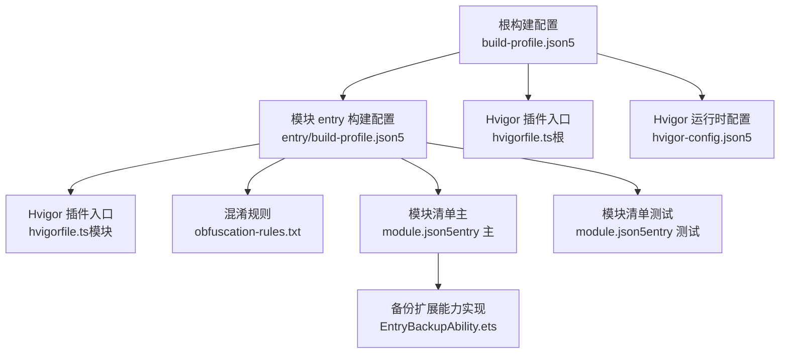
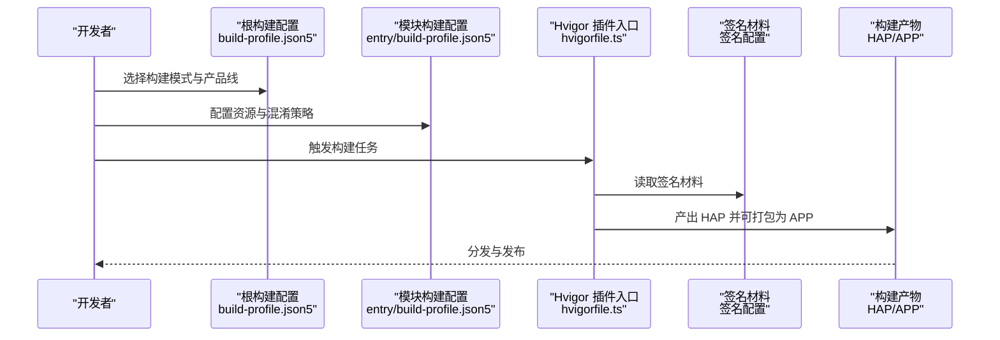
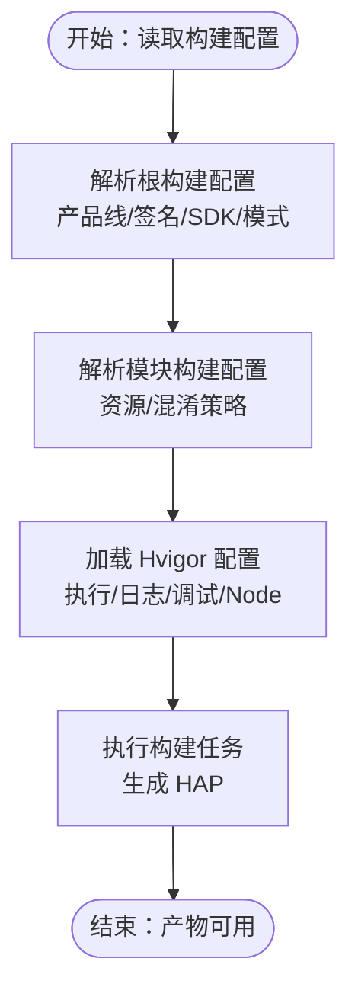
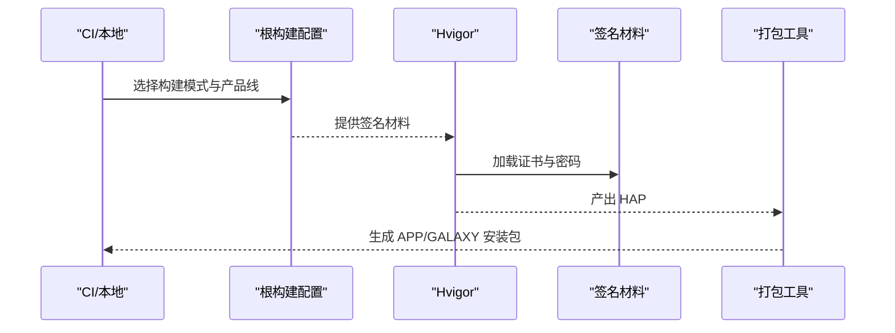
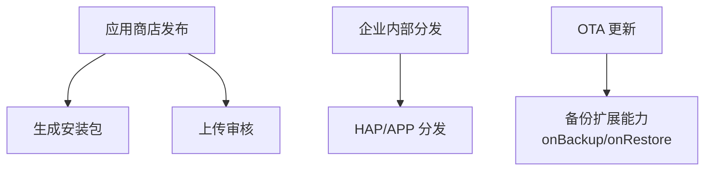
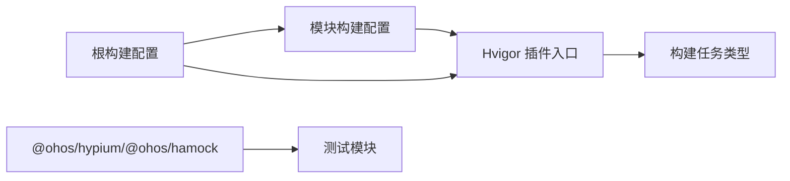

# 部署和发布

<cite>
**本文引用的文件**
- [build-profile.json5（根）](file://build-profile.json5)
- [build-profile.json5（模块 entry）](file://entry/build-profile.json5)
- [hvigorfile.ts（根）](file://hvigorfile.ts)
- [hvigorfile.ts（模块 entry）](file://entry/hvigorfile.ts)
- [hvigor-config.json5](file://hvigor/hvigor-config.json5)
- [obfuscation-rules.txt（模块 entry）](file://entry/obfuscation-rules.txt)
- [module.json5（模块 entry 主）](file://entry/src/main/module.json5)
- [module.json5（模块 entry 测试）](file://entry/src/ohosTest/module.json5)
- [EntryBackupAbility.ets](file://entry/src/main/ets/entrybackupability/EntryBackupAbility.ets)
- [string.json（AppScope 字符串资源）](file://AppScope/resources/base/element/string.json)
- [.gitignore（项目根）](file://.gitignore)
- [.gitignore（模块 entry）](file://entry/.gitignore)
</cite>

## 目录
1. [简介](#简介)
2. [项目结构](#项目结构)
3. [核心组件](#核心组件)
4. [架构总览](#架构总览)
5. [详细组件分析](#详细组件分析)
6. [依赖分析](#依赖分析)
7. [性能考虑与包体积控制](#性能考虑与包体积控制)
8. [故障排查指南](#故障排查指南)
9. [结论](#结论)
10. [附录：操作指南与最佳实践](#附录操作指南与最佳实践)

## 简介
本指南面向部署与发布阶段，围绕 OpenHarmony/HarmonyOS 应用的构建配置、签名与打包、发布与分发策略、版本与回滚、性能优化、多环境配置以及自动化与持续集成进行系统化说明。结合仓库中的构建配置文件与模块定义，给出可落地的实施步骤与注意事项。

## 项目结构
本项目采用多模块结构，根目录包含应用级构建配置与全局插件入口，模块 entry 负责应用主体与测试模块的构建任务。关键配置文件如下：
- 根级构建配置：定义产品线、构建模式、签名材料等
- 模块级构建配置：定义编译选项、资源处理、混淆规则等
- 插件入口：声明使用 Hvigor 内置任务类型
- 模块清单：定义能力、权限、扩展能力等元数据
- 资源与备份：字符串资源与备份扩展能力实现

图表来源
- [build-profile.json5（根）:1-73](file://build-profile.json5#L1-L73)
- [build-profile.json5（模块 entry）:1-33](file://entry/build-profile.json5#L1-L33)
- [hvigorfile.ts（根）:1-6](file://hvigorfile.ts#L1-L6)
- [hvigorfile.ts（模块 entry）:1-6](file://entry/hvigorfile.ts#L1-L6)
- [hvigor-config.json5:1-24](file://hvigor/hvigor-config.json5#L1-L24)
- [obfuscation-rules.txt（模块 entry）:1-22](file://entry/obfuscation-rules.txt#L1-L22)
- [module.json5（模块 entry 主）:1-71](file://entry/src/main/module.json5#L1-L71)
- [module.json5（模块 entry 测试）:1-12](file://entry/src/ohosTest/module.json5#L1-L12)
- [EntryBackupAbility.ets:1-16](file://entry/src/main/ets/entrybackupability/EntryBackupAbility.ets#L1-L16)

章节来源
- [build-profile.json5（根）:1-73](file://build-profile.json5#L1-L73)
- [build-profile.json5（模块 entry）:1-33](file://entry/build-profile.json5#L1-L33)
- [hvigorfile.ts（根）:1-6](file://hvigorfile.ts#L1-L6)
- [hvigorfile.ts（模块 entry）:1-6](file://entry/hvigorfile.ts#L1-L6)
- [hvigor-config.json5:1-24](file://hvigor/hvigor-config.json5#L1-L24)
- [obfuscation-rules.txt（模块 entry）:1-22](file://entry/obfuscation-rules.txt#L1-L22)
- [module.json5（模块 entry 主）:1-71](file://entry/src/main/module.json5#L1-L71)
- [module.json5（模块 entry 测试）:1-12](file://entry/src/ohosTest/module.json5#L1-L12)
- [EntryBackupAbility.ets:1-16](file://entry/src/main/ets/entrybackupability/EntryBackupAbility.ets#L1-L16)

## 核心组件
- 应用构建配置（根）
  - 定义产品线名称、签名配置引用、SDK 版本、运行时 OS
  - 声明构建模式（debug/release），用于不同环境的差异化构建
  - 提供默认签名材料（证书路径、别名、密码、签名算法等）
- 模块构建配置（entry）
  - API 类型为 stageMode，适配模块化开发范式
  - 资源处理：关闭复制代码资源开关，避免重复打包
  - 发布模式下的 Ark 编译器混淆规则：当前未启用，但保留规则文件路径
- Hvigor 插件入口
  - 根级使用 appTasks，模块级使用 hapTasks，分别对应应用与 HAP 包构建
- 模块清单（entry）
  - 定义主能力、页面、权限、扩展能力（如备份）
  - 声明安装交付方式与是否免安装
- 备份扩展能力实现
  - 提供 onBackup/onRestore 生命周期钩子，便于数据迁移与恢复

章节来源
- [build-profile.json5（根）:26-57](file://build-profile.json5#L26-L57)
- [build-profile.json5（模块 entry）:2-24](file://entry/build-profile.json5#L2-L24)
- [hvigorfile.ts（根）:3-6](file://hvigorfile.ts#L3-L6)
- [hvigorfile.ts（模块 entry）:3-6](file://entry/hvigorfile.ts#L3-L6)
- [module.json5（模块 entry 主）:1-71](file://entry/src/main/module.json5#L1-L71)
- [EntryBackupAbility.ets:6-15](file://entry/src/main/ets/entrybackupability/EntryBackupAbility.ets#L6-L15)

## 架构总览
下图展示从配置到产物的关键流程：根构建配置选择产品与签名，模块构建配置决定资源与混淆策略，Hvigor 插件执行具体任务，最终生成 HAP 包并可进一步打包为 APP/GALAXY 安装包。

图表来源
- [build-profile.json5（根）:26-57](file://build-profile.json5#L26-L57)
- [build-profile.json5（模块 entry）:2-24](file://entry/build-profile.json5#L2-L24)
- [hvigorfile.ts（根）:3-6](file://hvigorfile.ts#L3-L6)
- [hvigorfile.ts（模块 entry）:3-6](file://entry/hvigorfile.ts#L3-L6)

## 详细组件分析

### 组件一：构建配置与编译选项
- 根构建配置
  - 产品线：default，绑定签名配置 default
  - SDK 版本：compileSdkVersion、compatibleSdkVersion、targetSdkVersion 均为 12，runtimeOS 为 OpenHarmony
  - 构建模式：debug 与 release
  - 签名材料：包含证书路径、密钥别名、密钥密码、profile、签名算法、storeFile、storePassword
- 模块构建配置
  - apiType：stageMode
  - resOptions.copyCodeResource：false，避免将代码资源复制进包体
  - buildOptionSet.release：Ark 编译器混淆 ruleOptions.enable 默认为 false，但保留规则文件路径
- Hvigor 配置
  - hvigor-config.json5 提供执行、日志、调试、Node 选项的注释化开关，便于在 CI 中按需启用

图表来源
- [build-profile.json5（根）:26-57](file://build-profile.json5#L26-L57)
- [build-profile.json5（模块 entry）:2-24](file://entry/build-profile.json5#L2-L24)
- [hvigor-config.json5:5-22](file://hvigor/hvigor-config.json5#L5-L22)

章节来源
- [build-profile.json5（根）:26-57](file://build-profile.json5#L26-L57)
- [build-profile.json5（模块 entry）:2-24](file://entry/build-profile.json5#L2-L24)
- [hvigor-config.json5:5-22](file://hvigor/hvigor-config.json5#L5-L22)

### 组件二：签名与打包流程
- 签名材料
  - 在根构建配置中提供默认签名材料，包含证书、别名、密码、签名算法、profile、storeFile、storePassword
  - 使用前请替换为实际证书路径与密码
- 打包流程
  - Hvigor 依据构建模式与产品线选择对应签名配置
  - 生成 HAP 后可进一步打包为 APP/GALAXY 安装包（具体命令由工程约定或 CI 步骤补充）

图表来源
- [build-profile.json5（根）:44-57](file://build-profile.json5#L44-L57)
- [hvigorfile.ts（根）:3-6](file://hvigorfile.ts#L3-L6)

章节来源
- [build-profile.json5（根）:44-57](file://build-profile.json5#L44-L57)
- [hvigorfile.ts（根）:3-6](file://hvigorfile.ts#L3-L6)

### 组件三：发布与分发策略
- 应用商店发布
  - 通过打包工具生成符合应用商店要求的安装包，并上传审核
- 企业内部分发
  - 可使用 HAP 或 APP 包进行内网分发，结合权限与安全策略
- OTA 更新
  - 结合备份扩展能力与业务逻辑，实现数据迁移与版本切换；备份扩展能力已提供生命周期钩子

图表来源
- [module.json5（模块 entry 主）:56-68](file://entry/src/main/module.json5#L56-L68)
- [EntryBackupAbility.ets:6-15](file://entry/src/main/ets/entrybackupability/EntryBackupAbility.ets#L6-L15)

章节来源
- [module.json5（模块 entry 主）:56-68](file://entry/src/main/module.json5#L56-L68)
- [EntryBackupAbility.ets:6-15](file://entry/src/main/ets/entrybackupability/EntryBackupAbility.ets#L6-L15)

### 组件四：版本管理与回滚策略
- 版本号规则
  - 建议遵循语义化版本（主.次.修订），并在构建脚本中注入版本信息
- 变更日志
  - 建议在发布前维护 CHANGELOG，记录功能、修复与破坏性变更
- 回滚策略
  - 利用备份扩展能力在版本切换时进行数据迁移与恢复，确保回滚过程稳定

章节来源
- [module.json5（模块 entry 主）:56-68](file://entry/src/main/module.json5#L56-L68)
- [EntryBackupAbility.ets:6-15](file://entry/src/main/ets/entrybackupability/EntryBackupAbility.ets#L6-L15)

### 组件五：多环境部署配置
- 开发环境
  - debug 模式，可开启日志与调试选项
- 测试环境
  - release 模式，可启用混淆以模拟线上行为
- 生产环境
  - release 模式，使用正式签名材料与最小化资源

章节来源
- [build-profile.json5（根）:36-43](file://build-profile.json5#L36-L43)
- [hvigor-config.json5:13-22](file://hvigor/hvigor-config.json5#L13-L22)

## 依赖分析
- 组件耦合
  - 根构建配置与模块构建配置通过产品线与签名配置耦合
  - Hvigor 插件入口决定任务类型，影响产物形态
- 外部依赖
  - @ohos/hvigor-ohos-plugin 提供构建任务支持
  - @ohos/hypium、@ohos/hamock 为测试框架依赖

图表来源
- [build-profile.json5（根）:59-72](file://build-profile.json5#L59-L72)
- [hvigorfile.ts（根）:3-6](file://hvigorfile.ts#L3-L6)
- [hvigorfile.ts（模块 entry）:3-6](file://entry/hvigorfile.ts#L3-L6)
- [oh-package.json5:5-8](file://oh-package.json5#L5-L8)

章节来源
- [build-profile.json5（根）:59-72](file://build-profile.json5#L59-L72)
- [hvigorfile.ts（根）:3-6](file://hvigorfile.ts#L3-L6)
- [hvigorfile.ts（模块 entry）:3-6](file://entry/hvigorfile.ts#L3-L6)
- [oh-package.json5:5-8](file://oh-package.json5#L5-L8)

## 性能考虑与包体积控制
- 代码压缩与混淆
  - Ark 编译器混淆 ruleOptions.enable 当前为 false，建议在 release 模式启用并配合规则文件
  - 规则文件提供属性名、全局名、文件名、导出项混淆选项
- 资源优化
  - 关闭 resOptions.copyCodeResource，避免将代码资源重复打包
  - 合理组织媒体与字符串资源，移除未使用资源
- 依赖精简
  - 审核 devDependencies 与依赖树，移除未使用包
  - 使用 Hvigor 的并行与增量编译提升构建效率

章节来源
- [entry/build-profile.json5:13-22](file://entry/build-profile.json5#L13-L22)
- [entry/obfuscation-rules.txt:19-22](file://entry/obfuscation-rules.txt#L19-L22)
- [hvigor-config.json5:7-11](file://hvigor/hvigor-config.json5#L7-L11)

## 故障排查指南
- 构建失败
  - 检查根构建配置中的签名材料路径与密码是否正确
  - 确认模块构建配置中资源复制与混淆策略设置
- 产物异常
  - 确认 Hvigor 插件入口使用了正确的任务类型（appTasks/hapTasks）
  - 查看 Hvigor 运行时配置的日志级别与调试开关
- 忽略目录与文件
  - 项目与模块均配置了忽略目录（build、node_modules、oh_modules 等），避免误打包

章节来源
- [build-profile.json5（根）:44-57](file://build-profile.json5#L44-L57)
- [entry/build-profile.json5:2-24](file://entry/build-profile.json5#L2-L24)
- [hvigorfile.ts（根）:3-6](file://hvigorfile.ts#L3-L6)
- [hvigorfile.ts（模块 entry）:3-6](file://entry/hvigorfile.ts#L3-L6)
- [hvigor-config.json5:13-17](file://hvigor/hvigor-config.json5#L13-L17)
- [.gitignore（项目根）:1-12](file://.gitignore#L1-L12)
- [.gitignore（模块 entry）:1-6](file://entry/.gitignore#L1-L6)

## 结论
本项目已具备完善的构建与发布基础：明确的产品线与签名配置、模块化的资源与混淆策略、以及 Hvigor 插件的任务类型划分。建议在 release 模式启用混淆、严格管理签名材料、完善版本与回滚策略，并结合备份扩展能力实现 OTA 场景的数据保障。

## 附录：操作指南与最佳实践
- 构建与打包
  - 选择构建模式与产品线，确保签名材料有效
  - 生成 HAP 后使用打包工具产出 APP/GALAXY 安装包
- 签名与证书
  - 将默认签名材料替换为实际证书路径与密码
  - 在 CI 中安全地注入证书与密码
- 发布与分发
  - 应用商店：按平台要求准备安装包并上传
  - 企业内部分发：使用 HAP/APP 包并控制访问范围
  - OTA：结合备份扩展能力实现数据迁移与回滚
- 版本与回滚
  - 采用语义化版本，维护变更日志
  - 在备份扩展能力中实现 onBackup/onRestore
- 性能与体积
  - release 模式启用 Ark 混淆与规则文件
  - 关闭不必要的资源复制，清理未使用依赖
- 多环境配置
  - 开发：debug 模式，开启日志与调试
  - 测试：release 模式，启用混淆
  - 生产：release 模式，使用正式签名
- 自动化与持续集成
  - 在 CI 中按需启用 Hvigor 的并行、增量与类型检查
  - 将签名材料与密码以机密变量形式注入

章节来源
- [build-profile.json5（根）:26-57](file://build-profile.json5#L26-L57)
- [build-profile.json5（模块 entry）:13-22](file://entry/build-profile.json5#L13-L22)
- [hvigor-config.json5:7-11](file://hvigor/hvigor-config.json5#L7-L11)
- [module.json5（模块 entry 主）:56-68](file://entry/src/main/module.json5#L56-L68)
- [EntryBackupAbility.ets:6-15](file://entry/src/main/ets/entrybackupability/EntryBackupAbility.ets#L6-L15)
- [string.json（AppScope 字符串资源）:1-8](file://AppScope/resources/base/element/string.json#L1-L8)