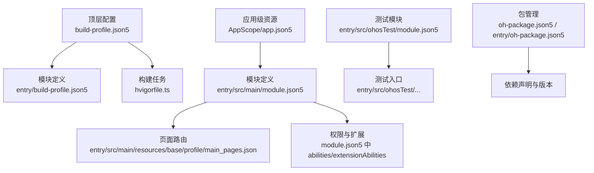
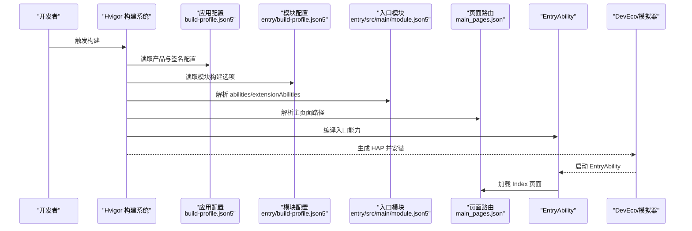
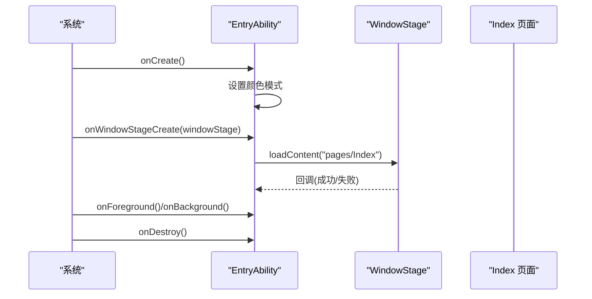
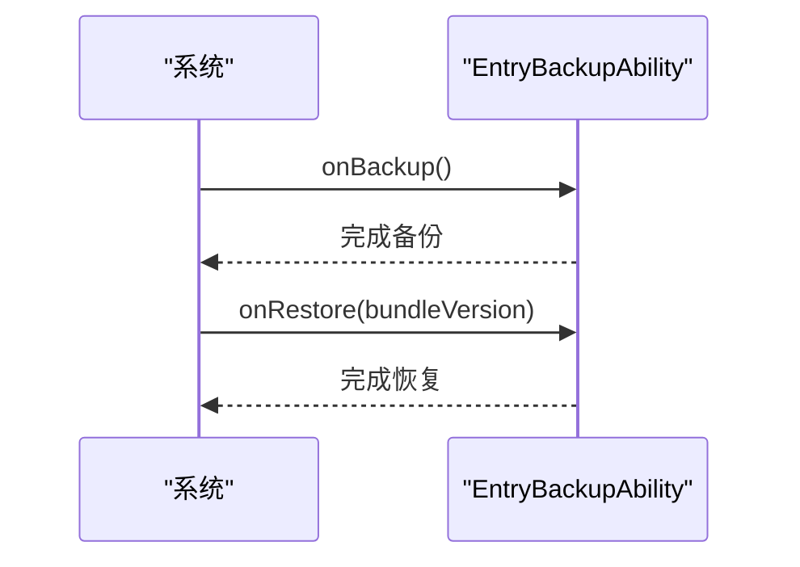
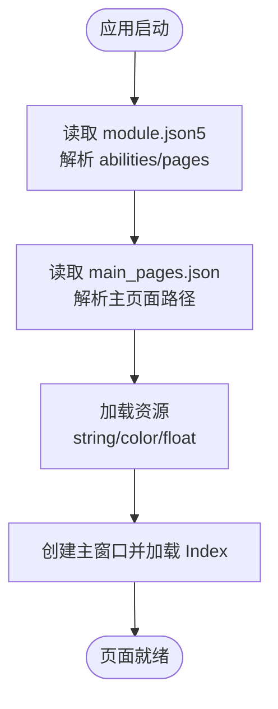
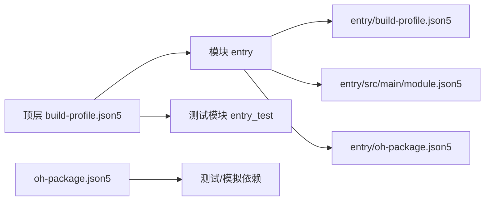

# 快速开始

<cite>
**本文引用的文件**
- [build-profile.json5](file://build-profile.json5)
- [entry/build-profile.json5](file://entry/build-profile.json5)
- [hvigorfile.ts](file://hvigorfile.ts)
- [entry/hvigorfile.ts](file://entry/hvigorfile.ts)
- [AppScope/app.json5](file://AppScope/app.json5)
- [entry/src/main/module.json5](file://entry/src/main/module.json5)
- [entry/src/ohosTest/module.json5](file://entry/src/ohosTest/module.json5)
- [entry/src/main/ets/entryability/EntryAbility.ets](file://entry/src/main/ets/entryability/EntryAbility.ets)
- [entry/src/main/ets/entrybackupability/EntryBackupAbility.ets](file://entry/src/main/ets/entrybackupability/EntryBackupAbility.ets)
- [entry/src/main/resources/base/profile/main_pages.json](file://entry/src/main/resources/base/profile/main_pages.json)
- [entry/src/main/resources/base/profile/backup_config.json](file://entry/src/main/resources/base/profile/backup_config.json)
- [entry/src/main/resources/base/element/string.json](file://entry/src/main/resources/base/element/string.json)
- [entry/src/main/resources/base/element/color.json](file://entry/src/main/resources/base/element/color.json)
- [entry/src/main/resources/base/element/float.json](file://entry/src/main/resources/base/element/float.json)
- [oh-package.json5](file://oh-package.json5)
- [entry/oh-package.json5](file://entry/oh-package.json5)
</cite>

## 目录
1. [简介](#简介)
2. [项目结构](#项目结构)
3. [核心组件](#核心组件)
4. [架构总览](#架构总览)
5. [详细组件分析](#详细组件分析)
6. [依赖分析](#依赖分析)
7. [性能考虑](#性能考虑)
8. [故障排查指南](#故障排查指南)
9. [结论](#结论)
10. [附录](#附录)

## 简介
本指南面向首次接触 SmartController 项目的开发者，目标是帮助你在最短时间内完成开发环境准备、项目克隆与依赖安装、首次构建与运行，并理解关键配置文件与目录结构。项目基于 OpenHarmony 应用框架，采用 ArkTS/ETS 开发语言与 HAP 模块化结构。

## 项目结构
SmartController 采用“应用级 + 模块级”双层配置与多模块组织方式：
- 应用级配置：顶层 build-profile.json5 定义产品配置、签名与模块映射；hvigorfile.ts 提供构建任务系统。
- 模块级配置：entry 模块为应用入口模块，包含页面、资源、权限、扩展能力等定义；ohosTest 模块用于测试。
- AppScope：应用级资源与全局配置，如 bundle 信息、图标与标签等。
- 资源与国际化：通过 resources/base 下的 element 与 profile 文件管理字符串、颜色、尺寸与页面路由等。

图表来源
- [build-profile.json5:1-73](file://build-profile.json5#L1-L73)
- [entry/build-profile.json5:1-33](file://entry/build-profile.json5#L1-L33)
- [hvigorfile.ts:1-6](file://hvigorfile.ts#L1-L6)
- [entry/src/main/module.json5:1-71](file://entry/src/main/module.json5#L1-L71)
- [entry/src/main/resources/base/profile/main_pages.json:1-6](file://entry/src/main/resources/base/profile/main_pages.json#L1-L6)
- [entry/src/ohosTest/module.json5:1-12](file://entry/src/ohosTest/module.json5#L1-L12)
- [oh-package.json5:1-10](file://oh-package.json5#L1-L10)
- [entry/oh-package.json5:1-13](file://entry/oh-package.json5#L1-L13)

章节来源
- [build-profile.json5:1-73](file://build-profile.json5#L1-L73)
- [entry/build-profile.json5:1-33](file://entry/build-profile.json5#L1-L33)
- [hvigorfile.ts:1-6](file://hvigorfile.ts#L1-L6)
- [entry/hvigorfile.ts:1-6](file://entry/hvigorfile.ts#L1-L6)
- [AppScope/app.json5:1-2](file://AppScope/app.json5#L1-L2)
- [entry/src/main/module.json5:1-71](file://entry/src/main/module.json5#L1-L71)
- [entry/src/ohosTest/module.json5:1-12](file://entry/src/ohosTest/module.json5#L1-L12)
- [entry/src/main/resources/base/profile/main_pages.json:1-6](file://entry/src/main/resources/base/profile/main_pages.json#L1-L6)

## 核心组件
- 构建与打包
  - 顶层 build-profile.json5：定义产品名称、签名配置、SDK 版本（编译/兼容/目标）、运行时 OS（OpenHarmony），以及模块映射。
  - 模块 build-profile.json5：定义 API 类型（stageMode）、资源复制策略、构建选项集（如 release 的 ArkTS 混淆规则）。
  - hvigorfile.ts：应用级与模块级构建任务系统，分别由 @ohos/hvigor-ohos-plugin 提供的 appTasks/hapTasks 驱动。
- 应用入口与页面
  - EntryAbility：应用入口 Ability，负责窗口生命周期与加载主页面 Index。
  - 主页面路由：通过 main_pages.json 指定入口页面路径。
- 权限与扩展
  - module.json5 声明入口 Ability、扩展能力（如备份扩展）、请求权限（麦克风、网络、WIFI 等）。
  - 备份扩展 EntryBackupAbility：实现备份与恢复流程。
- 资源与国际化
  - string.json、color.json、float.json：集中管理字符串、颜色与尺寸等资源。
- 包管理
  - 顶层与模块级 oh-package.json5：声明依赖与开发依赖，entry 模块引入加密相关依赖。

章节来源
- [build-profile.json5:26-57](file://build-profile.json5#L26-L57)
- [entry/build-profile.json5:2-24](file://entry/build-profile.json5#L2-L24)
- [hvigorfile.ts:1-6](file://hvigorfile.ts#L1-L6)
- [entry/hvigorfile.ts:1-6](file://entry/hvigorfile.ts#L1-L6)
- [entry/src/main/ets/entryability/EntryAbility.ets:1-48](file://entry/src/main/ets/entryability/EntryAbility.ets#L1-L48)
- [entry/src/main/resources/base/profile/main_pages.json:1-6](file://entry/src/main/resources/base/profile/main_pages.json#L1-L6)
- [entry/src/main/module.json5:15-70](file://entry/src/main/module.json5#L15-L70)
- [entry/src/main/ets/entrybackupability/EntryBackupAbility.ets:1-16](file://entry/src/main/ets/entrybackupability/EntryBackupAbility.ets#L1-L16)
- [entry/src/main/resources/base/element/string.json:1-1](file://entry/src/main/resources/base/element/string.json#L1-L1)
- [entry/src/main/resources/base/element/color.json:1-60](file://entry/src/main/resources/base/element/color.json#L1-L60)
- [entry/src/main/resources/base/element/float.json:1-9](file://entry/src/main/resources/base/element/float.json#L1-L9)
- [oh-package.json5:1-10](file://oh-package.json5#L1-L10)
- [entry/oh-package.json5:1-13](file://entry/oh-package.json5#L1-L13)

## 架构总览
下图展示了从构建到运行的关键流程：Hvigor 读取顶层与模块级配置，解析模块映射与页面路由，最终生成 HAP 并在模拟器/设备上安装运行。

图表来源
- [build-profile.json5:26-72](file://build-profile.json5#L26-L72)
- [entry/build-profile.json5:1-33](file://entry/build-profile.json5#L1-L33)
- [entry/src/main/module.json5:15-36](file://entry/src/main/module.json5#L15-L36)
- [entry/src/main/resources/base/profile/main_pages.json:1-6](file://entry/src/main/resources/base/profile/main_pages.json#L1-L6)
- [entry/src/main/ets/entryability/EntryAbility.ets:21-32](file://entry/src/main/ets/entryability/EntryAbility.ets#L21-L32)

章节来源
- [hvigorfile.ts:1-6](file://hvigorfile.ts#L1-L6)
- [entry/hvigorfile.ts:1-6](file://entry/hvigorfile.ts#L1-L6)
- [entry/src/main/ets/entryability/EntryAbility.ets:1-48](file://entry/src/main/ets/entryability/EntryAbility.ets#L1-L48)

## 详细组件分析

### 入口能力与窗口生命周期
- EntryAbility 负责 Ability 生命周期事件处理与主窗口创建，加载 Index 页面作为应用首页。
- 关键点：设置应用上下文颜色模式、记录日志、按需处理前台/后台切换。

图表来源
- [entry/src/main/ets/entryability/EntryAbility.ets:7-48](file://entry/src/main/ets/entryability/EntryAbility.ets#L7-L48)

章节来源
- [entry/src/main/ets/entryability/EntryAbility.ets:1-48](file://entry/src/main/ets/entryability/EntryAbility.ets#L1-L48)

### 备份扩展能力
- EntryBackupAbility 实现备份与恢复流程，便于用户迁移或恢复应用状态。
- 关键点：onBackup/onRestore 日志输出，遵循扩展能力接口规范。

图表来源
- [entry/src/main/ets/entrybackupability/EntryBackupAbility.ets:6-16](file://entry/src/main/ets/entrybackupability/EntryBackupAbility.ets#L6-L16)

章节来源
- [entry/src/main/ets/entrybackupability/EntryBackupAbility.ets:1-16](file://entry/src/main/ets/entrybackupability/EntryBackupAbility.ets#L1-L16)

### 页面路由与资源加载
- main_pages.json 指定入口页面路径，配合 module.json5 的 mainElement 与 abilities 配置共同决定应用启动页。
- 字符串、颜色、尺寸等资源通过对应 JSON 文件集中管理，支持多主题与多语言基础。

图表来源
- [entry/src/main/module.json5:6-13](file://entry/src/main/module.json5#L6-L13)
- [entry/src/main/resources/base/profile/main_pages.json:1-6](file://entry/src/main/resources/base/profile/main_pages.json#L1-L6)
- [entry/src/main/resources/base/element/string.json:1-1](file://entry/src/main/resources/base/element/string.json#L1-L1)
- [entry/src/main/resources/base/element/color.json:1-60](file://entry/src/main/resources/base/element/color.json#L1-L60)
- [entry/src/main/resources/base/element/float.json:1-9](file://entry/src/main/resources/base/element/float.json#L1-L9)

章节来源
- [entry/src/main/module.json5:1-71](file://entry/src/main/module.json5#L1-L71)
- [entry/src/main/resources/base/profile/main_pages.json:1-6](file://entry/src/main/resources/base/profile/main_pages.json#L1-L6)
- [entry/src/main/resources/base/element/string.json:1-1](file://entry/src/main/resources/base/element/string.json#L1-L1)
- [entry/src/main/resources/base/element/color.json:1-60](file://entry/src/main/resources/base/element/color.json#L1-L60)
- [entry/src/main/resources/base/element/float.json:1-9](file://entry/src/main/resources/base/element/float.json#L1-L9)

## 依赖分析
- 顶层与模块级包管理
  - 顶层 oh-package.json5：声明测试与模拟相关开发依赖。
  - entry/oh-package.json5：声明业务依赖（如加密库）。
- 构建与模块关系
  - build-profile.json5 将模块名映射到实际源码路径，entry/build-profile.json5 控制构建选项集与资源复制策略。

图表来源
- [build-profile.json5:59-72](file://build-profile.json5#L59-L72)
- [entry/build-profile.json5:25-32](file://entry/build-profile.json5#L25-L32)
- [entry/src/main/module.json5:1-71](file://entry/src/main/module.json5#L1-L71)
- [oh-package.json5:1-10](file://oh-package.json5#L1-L10)
- [entry/oh-package.json5:1-13](file://entry/oh-package.json5#L1-L13)

章节来源
- [build-profile.json5:59-72](file://build-profile.json5#L59-L72)
- [entry/build-profile.json5:25-32](file://entry/build-profile.json5#L25-L32)
- [oh-package.json5:1-10](file://oh-package.json5#L1-L10)
- [entry/oh-package.json5:1-13](file://entry/oh-package.json5#L1-L13)

## 性能考虑
- 构建优化
  - 在 release 构建中可启用 ArkTS 混淆规则（见模块 build-profile.json5 的 buildOptionSet），以减小包体并提升运行时性能。
- 资源管理
  - 使用统一的资源文件集中管理字符串、颜色与尺寸，避免硬编码，提高维护性与一致性。
- 日志与诊断
  - EntryAbility 中使用性能分析 Kit 记录关键生命周期事件，便于定位问题。

章节来源
- [entry/build-profile.json5:10-24](file://entry/build-profile.json5#L10-L24)
- [entry/src/main/ets/entryability/EntryAbility.ets:5-19](file://entry/src/main/ets/entryability/EntryAbility.ets#L5-L19)

## 故障排查指南
- 构建失败
  - 检查顶层 build-profile.json5 的产品与签名配置是否正确，确认 SDK 版本与 runtimeOS 设置一致。
  - 确认模块 build-profile.json5 的 apiType 与构建选项集配置无误。
- 页面无法加载
  - 检查 module.json5 的 mainElement 与 main_pages.json 的页面路径是否匹配。
  - 查看 EntryAbility 的窗口创建回调错误日志，确认 Index 页面路径有效。
- 权限相关问题
  - 确认 module.json5 中的 requestPermissions 已正确声明所需权限（如麦克风、网络、WIFI）。
- 备份/恢复异常
  - 检查 EntryBackupAbility 的日志输出，确认 onBackup/onRestore 流程未抛出异常。
- 资源缺失
  - 确认 string.json、color.json、float.json 等资源文件存在且键值正确。

章节来源
- [build-profile.json5:26-57](file://build-profile.json5#L26-L57)
- [entry/build-profile.json5:2-24](file://entry/build-profile.json5#L2-L24)
- [entry/src/main/module.json5:15-70](file://entry/src/main/module.json5#L15-L70)
- [entry/src/main/resources/base/profile/main_pages.json:1-6](file://entry/src/main/resources/base/profile/main_pages.json#L1-L6)
- [entry/src/main/ets/entryability/EntryAbility.ets:21-32](file://entry/src/main/ets/entryability/EntryAbility.ets#L21-L32)
- [entry/src/main/ets/entrybackupability/EntryBackupAbility.ets:6-16](file://entry/src/main/ets/entrybackupability/EntryBackupAbility.ets#L6-L16)

## 结论
通过本指南，你已经了解了 SmartController 的整体结构、关键配置文件与运行流程。建议先完成环境与工具链准备，再进行首次构建与运行，随后逐步深入模块与页面细节，结合资源与权限配置完善功能。

## 附录

### 开发环境与工具准备
- DevEco Studio
  - 安装最新稳定版 DevEco Studio。
  - 在首选项中配置 OpenHarmony SDK 与模拟器镜像，确保 SDK 版本与项目配置一致（参考 build-profile.json5 中 compileSdkVersion/compatibleSdkVersion/targetSdkVersion）。
- 模拟器
  - 推荐使用 OpenHarmony 模拟器，确保系统版本与 runtimeOS 匹配。
- Node.js 与包管理
  - 安装 Node.js，确保 npm/yarn 可用，用于安装项目依赖（根据 oh-package.json5 的依赖声明）。

### 项目克隆、依赖安装与首次构建
- 克隆仓库后，先在顶层执行依赖安装（依据 oh-package.json5 与 entry/oh-package.json5 的依赖声明）。
- 打开 DevEco Studio，导入项目根目录。
- 在 DevEco Studio 的终端中执行构建命令（如 hvigorw build），或直接使用菜单触发构建。
- 构建完成后，选择模拟器/设备进行运行。

### 首次运行与调试
- 在 DevEco Studio 中选择目标设备（模拟器或真机），点击运行按钮。
- 若出现页面加载失败，检查 EntryAbility 的窗口创建回调与 main_pages.json 的页面路径。
- 如需调试，可在 EntryAbility 的生命周期方法中设置断点，观察日志输出。

### 关键配置文件说明
- 顶层 build-profile.json5
  - 产品与签名：定义产品名称、签名配置与 SDK 版本。
  - 模块映射：将模块名映射到源码路径。
- 模块 build-profile.json5（entry）
  - API 类型：stageMode。
  - 构建选项集：release 构建中的 ArkTS 混淆规则。
  - 目标：default 与 ohosTest。
- AppScope/app.json5
  - 应用基本信息：bundle 名称、图标、标签、版本号等。
- entry/src/main/module.json5
  - 模块类型：entry。
  - 入口能力：EntryAbility，含页面、图标、标签、技能（Home 入口）。
  - 请求权限：麦克风、网络、WIFI 等。
  - 扩展能力：备份扩展 EntryBackupAbility。
- entry/src/ohosTest/module.json5
  - 测试模块配置：默认设备类型与交付策略。
- entry/src/main/resources/base/profile/main_pages.json
  - 主页面路由：指定入口页面路径。
- entry/src/main/resources/base/profile/backup_config.json
  - 备份/恢复开关：允许备份与恢复。
- entry/src/main/resources/base/element/string.json、color.json、float.json
  - 字符串、颜色、尺寸等资源集中管理。

章节来源
- [build-profile.json5:26-72](file://build-profile.json5#L26-L72)
- [entry/build-profile.json5:1-33](file://entry/build-profile.json5#L1-L33)
- [AppScope/app.json5:1-2](file://AppScope/app.json5#L1-L2)
- [entry/src/main/module.json5:1-71](file://entry/src/main/module.json5#L1-L71)
- [entry/src/ohosTest/module.json5:1-12](file://entry/src/ohosTest/module.json5#L1-L12)
- [entry/src/main/resources/base/profile/main_pages.json:1-6](file://entry/src/main/resources/base/profile/main_pages.json#L1-L6)
- [entry/src/main/resources/base/profile/backup_config.json:1-3](file://entry/src/main/resources/base/profile/backup_config.json#L1-L3)
- [entry/src/main/resources/base/element/string.json:1-1](file://entry/src/main/resources/base/element/string.json#L1-L1)
- [entry/src/main/resources/base/element/color.json:1-60](file://entry/src/main/resources/base/element/color.json#L1-L60)
- [entry/src/main/resources/base/element/float.json:1-9](file://entry/src/main/resources/base/element/float.json#L1-L9)