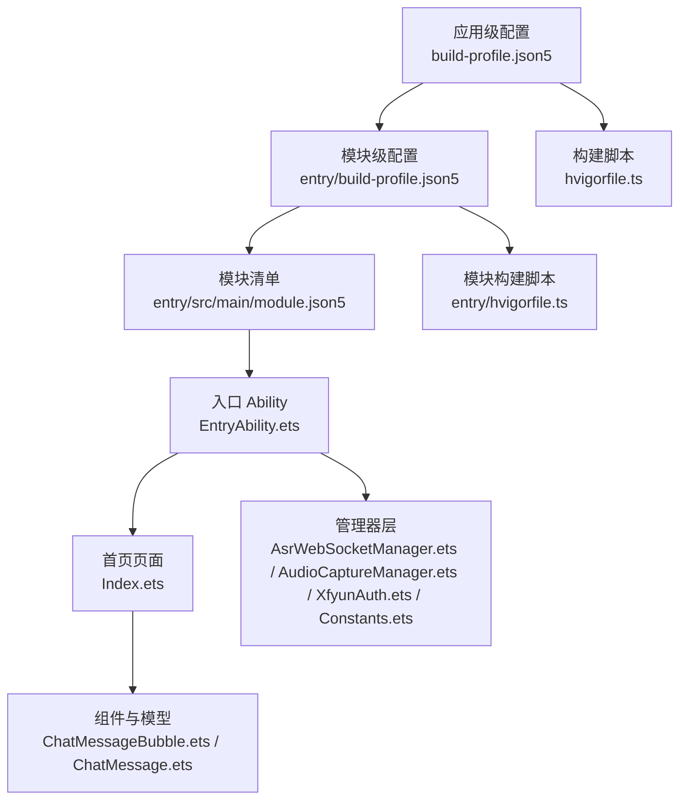
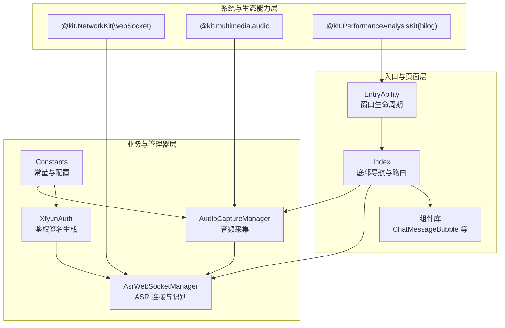
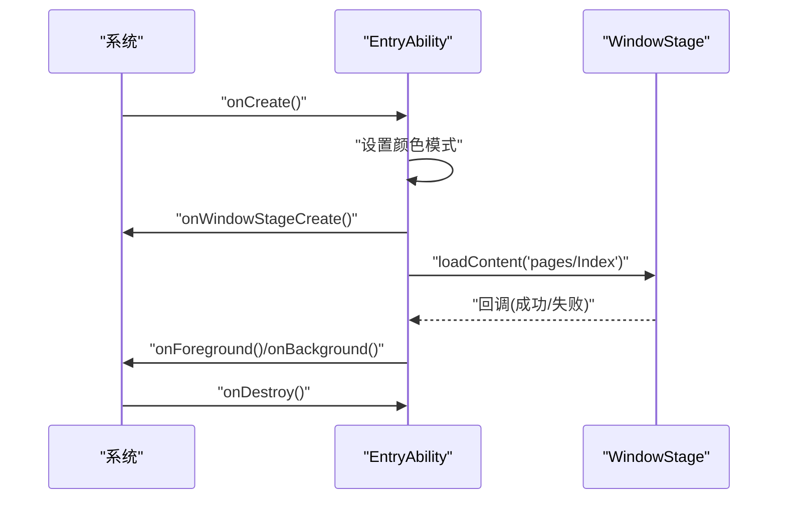
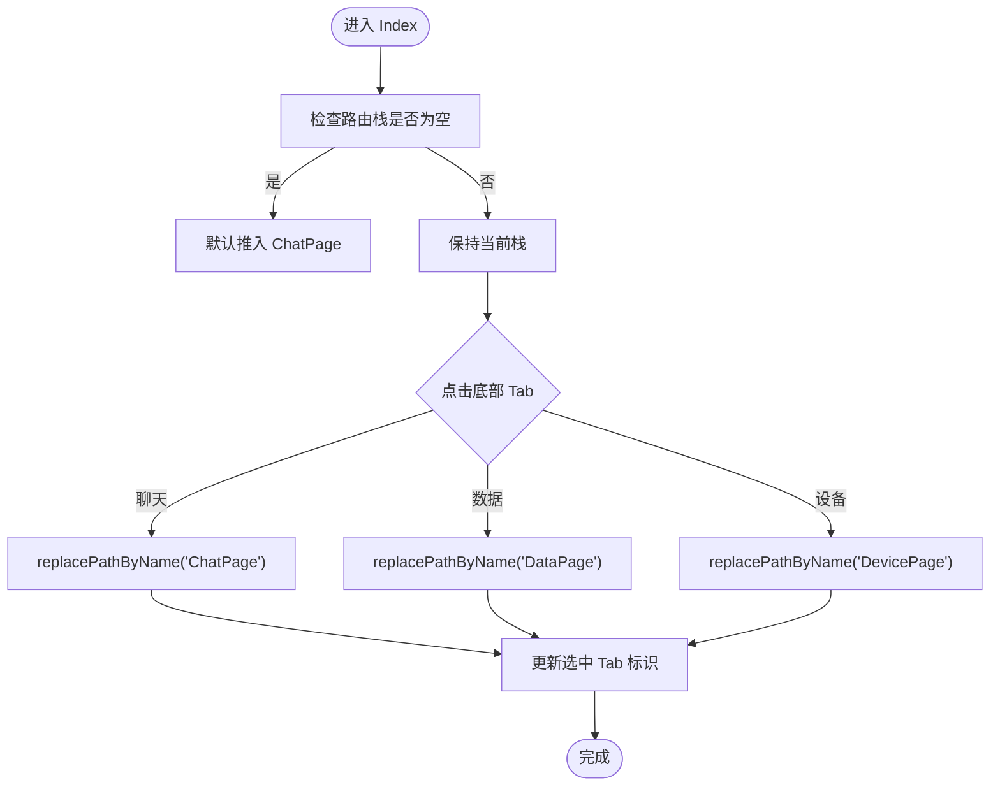
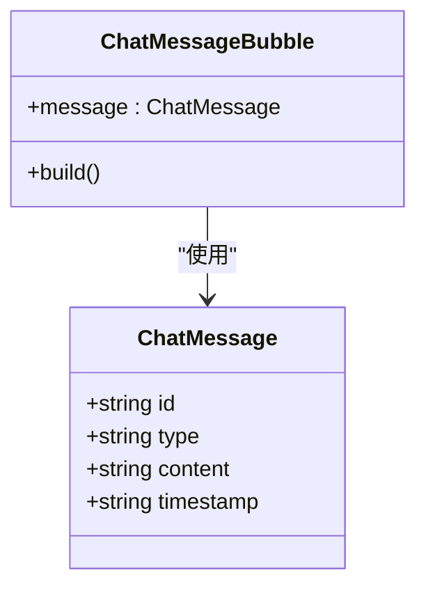
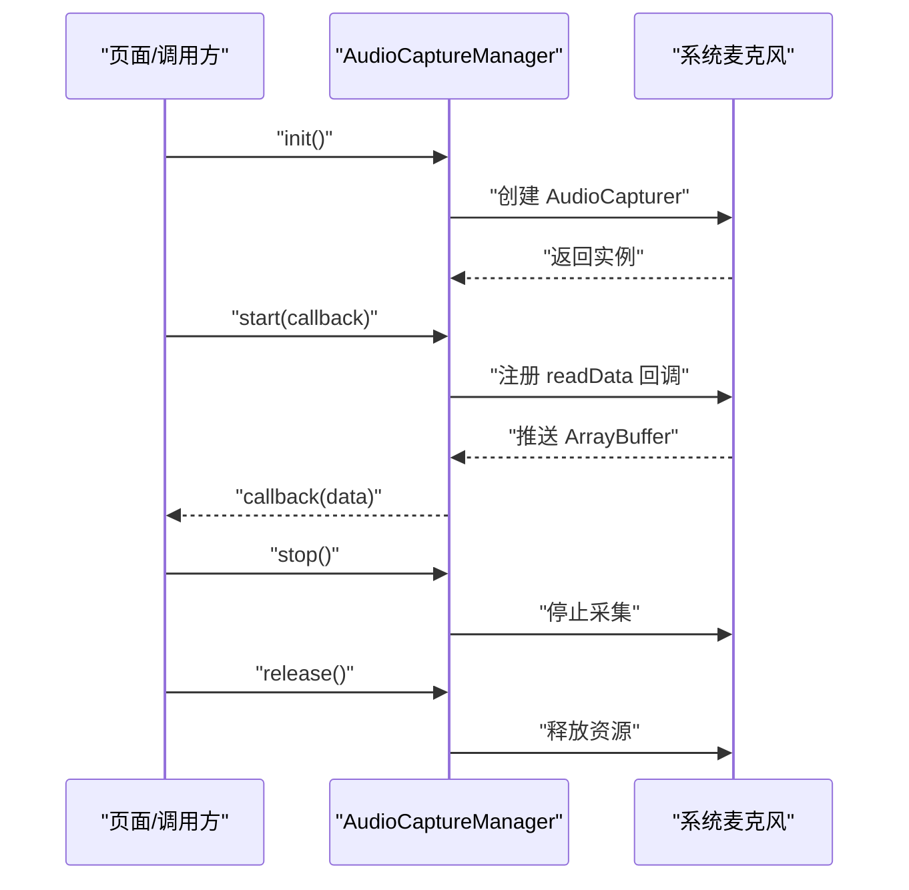
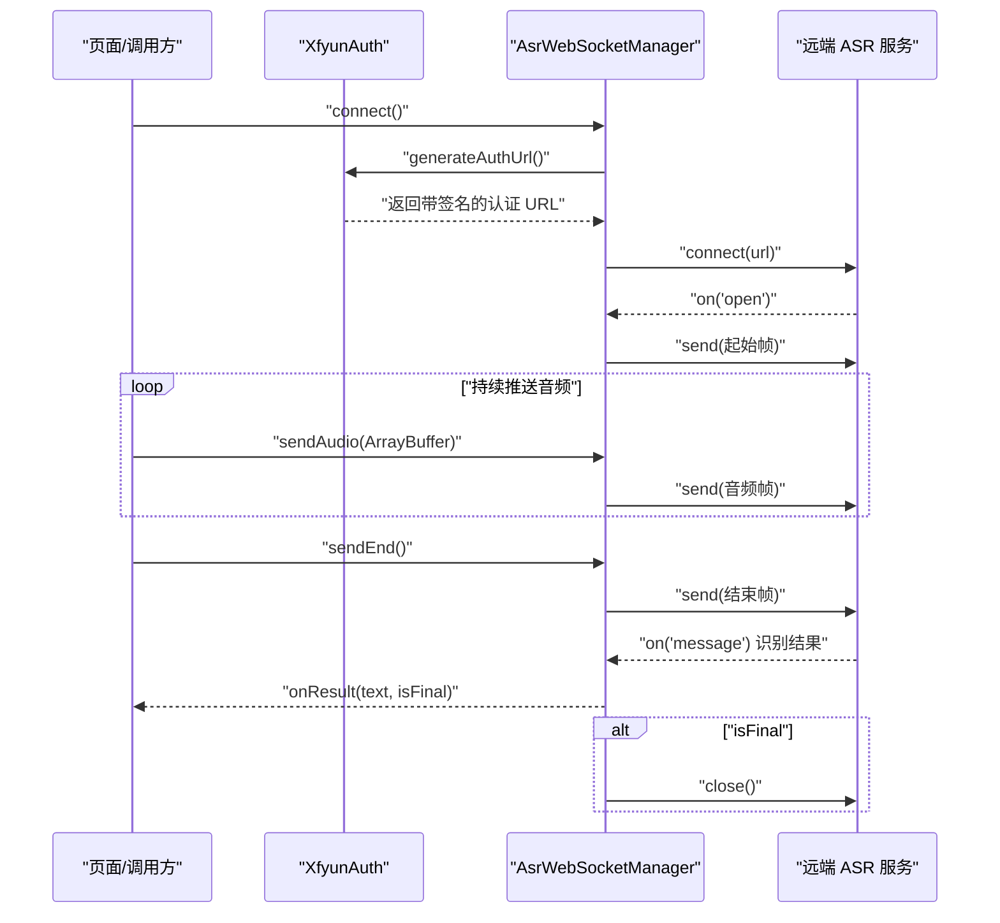
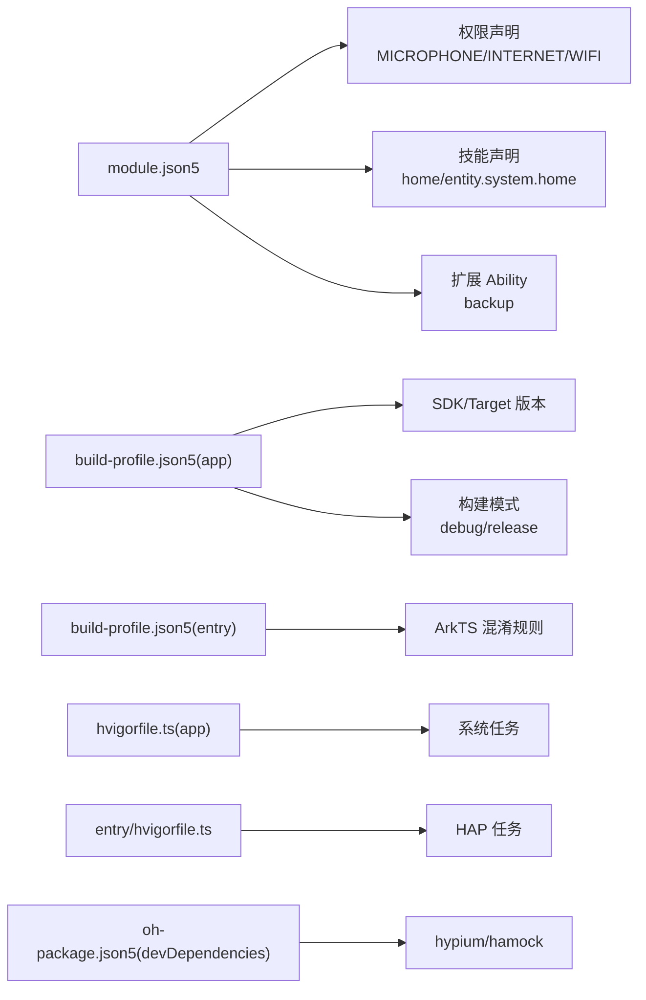

# 技术栈概览

<cite>
**本文引用的文件**
- [build-profile.json5](file://build-profile.json5)
- [hvigorfile.ts](file://hvigorfile.ts)
- [entry/build-profile.json5](file://entry/build-profile.json5)
- [entry/hvigofile.ts](file://entry/hvigorfile.ts)
- [entry/src/main/module.json5](file://entry/src/main/module.json5)
- [entry/src/main/ets/entryability/EntryAbility.ets](file://entry/src/main/ets/entryability/EntryAbility.ets)
- [entry/src/main/ets/common/Constants.ets](file://entry/src/main/ets/common/Constants.ets)
- [entry/src/main/ets/managers/XfyunAuth.ets](file://entry/src/main/ets/managers/XfyunAuth.ets)
- [entry/src/main/ets/models/ChatMessage.ets](file://entry/src/main/ets/models/ChatMessage.ets)
- [entry/src/main/ets/pages/Index.ets](file://entry/src/main/ets/pages/Index.ets)
- [entry/src/main/ets/components/chat/ChatMessageBubble.ets](file://entry/src/main/ets/components/chat/ChatMessageBubble.ets)
- [entry/src/main/ets/managers/AsrWebSocketManager.ets](file://entry/src/main/ets/managers/AsrWebSocketManager.ets)
- [entry/src/main/ets/managers/AudioCaptureManager.ets](file://entry/src/main/ets/managers/AudioCaptureManager.ets)
- [oh-package.json5](file://oh-package.json5)
</cite>

## 目录
1. [简介](#简介)
2. [项目结构](#项目结构)
3. [核心组件](#核心组件)
4. [架构总览](#架构总览)
5. [详细组件分析](#详细组件分析)
6. [依赖分析](#依赖分析)
7. [性能考量](#性能考量)
8. [故障排查指南](#故障排查指南)
9. [结论](#结论)
10. [附录：学习路径与前置知识](#附录学习路径与前置知识)

## 简介
本项目基于 OpenHarmony 生态进行开发，采用 ArkTS/TypeScript 为主要开发语言，结合 ArkUI 框架实现跨设备的用户界面与交互体验。项目围绕语音识别（ASR）能力展开，通过音频采集、WebSocket 认证连接、实时流式识别与 UI 展示形成完整的端到端链路。构建工具链采用 Hvigor（Hivision），模块化配置清晰，便于多产品形态与多构建模式的统一管理。

## 项目结构
项目采用“应用级 + 模块级”两级配置与构建结构：
- 应用级配置：顶层 build-profile.json5 定义 SDK 版本、签名、产品与构建模式等全局信息；hvigorfile.ts 引入系统任务。
- 模块级配置：entry 模块内含 build-profile.json5（模块级构建选项）、hvigorfile.ts（模块级任务）、module.json5（模块能力声明与权限声明）以及源代码目录。

图表来源
- [build-profile.json5:1-73](file://build-profile.json5#L1-L73)
- [hvigorfile.ts:1-6](file://hvigorfile.ts#L1-L6)
- [entry/build-profile.json5:1-33](file://entry/build-profile.json5#L1-L33)
- [entry/hvigorfile.ts:1-6](file://entry/hvigorfile.ts#L1-L6)
- [entry/src/main/module.json5:1-71](file://entry/src/main/module.json5#L1-L71)

章节来源
- [build-profile.json5:1-73](file://build-profile.json5#L1-L73)
- [hvigorfile.ts:1-6](file://hvigorfile.ts#L1-L6)
- [entry/build-profile.json5:1-33](file://entry/build-profile.json5#L1-L33)
- [entry/hvigorfile.ts:1-6](file://entry/hvigorfile.ts#L1-L6)
- [entry/src/main/module.json5:1-71](file://entry/src/main/module.json5#L1-L71)

## 核心组件
- 开发语言与框架
  - ArkTS/TypeScript：强类型、现代化语法、与 JS 生态互通，适合构建高性能、可维护的 UI 与业务逻辑。
  - ArkUI：声明式 UI 框架，支持跨设备适配与组件化复用，配合 Navigation、状态装饰器等实现复杂交互。
- 能力与生态
  - Ability 机制：以 UIAbility 为入口，承载窗口生命周期与页面加载；支持备份 Ability 与技能声明，提升可用性与发现性。
  - 分布式能力：通过模块清单与权限声明，为后续分布式任务、多设备协同打下基础。
- 关键依赖与功能
  - 性能分析：PerformanceAnalysisKit 提供 hilog 日志接口，便于运行期诊断与性能观测。
  - 网络通信：NetworkKit（webSocket）用于与远端服务建立长连接，传输音频数据与接收识别结果。
  - 媒体能力：multimedia.audio 提供麦克风采集、采样率与格式控制，支撑 ASR 输入。
  - 工具库：util（TextDecoder、Base64Helper）与 crypto-js（HMAC-SHA256、Base64）用于数据编解码与鉴权签名。
- 技术选型考量
  - 性能：ArkTS/ArkUI 在渲染与状态更新上具备良好表现；媒体与网络操作采用异步与事件驱动，降低主线程阻塞风险。
  - 兼容性：OpenHarmony SDK 版本统一，模块化权限与能力声明确保在不同设备形态上的稳定运行。
  - 开发效率：TypeScript 类型约束减少运行期错误；ArkUI 组件化与声明式语法提升 UI 开发速度。

章节来源
- [entry/src/main/ets/entryability/EntryAbility.ets:1-48](file://entry/src/main/ets/entryability/EntryAbility.ets#L1-L48)
- [entry/src/main/ets/managers/AsrWebSocketManager.ets:1-271](file://entry/src/main/ets/managers/AsrWebSocketManager.ets#L1-L271)
- [entry/src/main/ets/managers/AudioCaptureManager.ets:1-80](file://entry/src/main/ets/managers/AudioCaptureManager.ets#L1-L80)
- [entry/src/main/ets/managers/XfyunAuth.ets:1-34](file://entry/src/main/ets/managers/XfyunAuth.ets#L1-L34)
- [entry/src/main/ets/common/Constants.ets:1-82](file://entry/src/main/ets/common/Constants.ets#L1-L82)

## 架构总览
整体架构自顶向下分为三层：入口与页面层、业务与管理器层、系统与生态能力层。入口 Ability 负责窗口生命周期与页面加载；页面层通过 Navigation 管理子页路由；管理器层封装音频采集、WebSocket 连接与鉴权逻辑；系统能力通过 @kit.* 与 @ohos.* 模块接入。

图表来源
- [entry/src/main/ets/entryability/EntryAbility.ets:1-48](file://entry/src/main/ets/entryability/EntryAbility.ets#L1-L48)
- [entry/src/main/ets/pages/Index.ets:1-115](file://entry/src/main/ets/pages/Index.ets#L1-L115)
- [entry/src/main/ets/components/chat/ChatMessageBubble.ets:1-38](file://entry/src/main/ets/components/chat/ChatMessageBubble.ets#L1-L38)
- [entry/src/main/ets/managers/AsrWebSocketManager.ets:1-271](file://entry/src/main/ets/managers/AsrWebSocketManager.ets#L1-L271)
- [entry/src/main/ets/managers/AudioCaptureManager.ets:1-80](file://entry/src/main/ets/managers/AudioCaptureManager.ets#L1-L80)
- [entry/src/main/ets/managers/XfyunAuth.ets:1-34](file://entry/src/main/ets/managers/XfyunAuth.ets#L1-L34)
- [entry/src/main/ets/common/Constants.ets:1-82](file://entry/src/main/ets/common/Constants.ets#L1-L82)

## 详细组件分析

### 入口 Ability 与窗口生命周期
- 职责：初始化颜色模式、记录日志、加载主页面 Index，并响应前后台切换。
- 关键点：通过 hilog 输出运行期信息；onWindowStageCreate 中加载页面并处理错误回调；前台/后台切换事件可用于资源释放或恢复。

图表来源
- [entry/src/main/ets/entryability/EntryAbility.ets:1-48](file://entry/src/main/ets/entryability/EntryAbility.ets#L1-L48)

章节来源
- [entry/src/main/ets/entryability/EntryAbility.ets:1-48](file://entry/src/main/ets/entryability/EntryAbility.ets#L1-L48)

### 首页路由与底部导航
- 职责：定义底部 Tab 列表、维护路由栈、根据选中项替换当前页面。
- 关键点：Navigation + navDestination 实现按需构建子页；通过 NavPathStack 控制页面栈深度；状态装饰器驱动 UI 更新。

图表来源
- [entry/src/main/ets/pages/Index.ets:1-115](file://entry/src/main/ets/pages/Index.ets#L1-L115)

章节来源
- [entry/src/main/ets/pages/Index.ets:1-115](file://entry/src/main/ets/pages/Index.ets#L1-L115)

### 对话消息组件
- 职责：根据消息类型渲染不同风格的消息气泡，支持系统消息与用户消息的差异化展示。
- 关键点：通过 @Prop 接收数据模型；使用容器组件与样式属性实现布局与主题色。

图表来源
- [entry/src/main/ets/models/ChatMessage.ets:1-9](file://entry/src/main/ets/models/ChatMessage.ets#L1-L9)
- [entry/src/main/ets/components/chat/ChatMessageBubble.ets:1-38](file://entry/src/main/ets/components/chat/ChatMessageBubble.ets#L1-L38)

章节来源
- [entry/src/main/ets/models/ChatMessage.ets:1-9](file://entry/src/main/ets/models/ChatMessage.ets#L1-L9)
- [entry/src/main/ets/components/chat/ChatMessageBubble.ets:1-38](file://entry/src/main/ets/components/chat/ChatMessageBubble.ets#L1-L38)

### 音频采集管理器
- 职责：创建并配置 AudioCapturer，启动/停止采集，监听 readData 回调推送原始音频数据。
- 关键点：采样率、通道数、采样格式与编码类型严格匹配 ASR 要求；错误回调与状态标记保障稳定性。

图表来源
- [entry/src/main/ets/managers/AudioCaptureManager.ets:1-80](file://entry/src/main/ets/managers/AudioCaptureManager.ets#L1-L80)

章节来源
- [entry/src/main/ets/managers/AudioCaptureManager.ets:1-80](file://entry/src/main/ets/managers/AudioCaptureManager.ets#L1-L80)

### WebSocket ASR 管理器
- 职责：与远端建立 WebSocket 连接，发送起始帧、音频数据帧与结束帧，解析识别结果并回调上层。
- 关键点：遵循讯飞 ASR 协议的数据结构；乱序结果缓存与拼接；动态替换（rpl）处理；最终结果触发断开连接。

图表来源
- [entry/src/main/ets/managers/AsrWebSocketManager.ets:1-271](file://entry/src/main/ets/managers/AsrWebSocketManager.ets#L1-L271)
- [entry/src/main/ets/managers/XfyunAuth.ets:1-34](file://entry/src/main/ets/managers/XfyunAuth.ets#L1-L34)

章节来源
- [entry/src/main/ets/managers/AsrWebSocketManager.ets:1-271](file://entry/src/main/ets/managers/AsrWebSocketManager.ets#L1-L271)
- [entry/src/main/ets/managers/XfyunAuth.ets:1-34](file://entry/src/main/ets/managers/XfyunAuth.ets#L1-L34)

### 常量与鉴权
- 常量：集中管理采样率、通道数、缓冲大小与讯飞 ASR 的 AppID、API Key/Secret、Host、URL 等。
- 鉴权：生成 Authorization 与 Base64 编码，拼接认证 URL，满足远端鉴权要求。

章节来源
- [entry/src/main/ets/common/Constants.ets:1-82](file://entry/src/main/ets/common/Constants.ets#L1-L82)
- [entry/src/main/ets/managers/XfyunAuth.ets:1-34](file://entry/src/main/ets/managers/XfyunAuth.ets#L1-L34)

## 依赖分析
- 模块能力与权限
  - 模块类型为 entry，声明主元素为 EntryAbility，支持平板等设备类型；声明备份 Ability 与技能（home）。
  - 请求权限包含麦克风、网络、WiFi 信息与 MAC 查询，覆盖 ASR 与网络通信需求。
- 构建与测试
  - 应用级与模块级 build-profile.json5 定义了 SDK 版本、目标 OS、构建模式与 ArkTS 混淆规则。
  - hvigorfile.ts 引入系统任务，模块级 hvigorfile.ts 引入 HAP 任务，支持默认与 ohosTest 目标。
- 开发依赖
  - hypium 与 hamock 用于单元测试与模拟环境。

图表来源
- [entry/src/main/module.json5:1-71](file://entry/src/main/module.json5#L1-L71)
- [build-profile.json5:1-73](file://build-profile.json5#L1-L73)
- [entry/build-profile.json5:1-33](file://entry/build-profile.json5#L1-L33)
- [hvigorfile.ts:1-6](file://hvigorfile.ts#L1-L6)
- [entry/hvigorfile.ts:1-6](file://entry/hvigorfile.ts#L1-L6)
- [oh-package.json5:1-10](file://oh-package.json5#L1-L10)

章节来源
- [entry/src/main/module.json5:1-71](file://entry/src/main/module.json5#L1-L71)
- [build-profile.json5:1-73](file://build-profile.json5#L1-L73)
- [entry/build-profile.json5:1-33](file://entry/build-profile.json5#L1-L33)
- [hvigorfile.ts:1-6](file://hvigorfile.ts#L1-L6)
- [entry/hvigorfile.ts:1-6](file://entry/hvigorfile.ts#L1-L6)
- [oh-package.json5:1-10](file://oh-package.json5#L1-L10)

## 性能考量
- 渲染与状态更新
  - ArkUI 声明式语法与细粒度状态更新有助于降低重绘成本；建议避免在渲染函数中执行耗时计算，将数据预处理移至管理器层。
- 网络与音频
  - WebSocket 连接与音频推送采用事件驱动与异步回调，避免阻塞主线程；注意在 onBackground/onDestroy 中及时释放资源。
- 构建优化
  - ArkTS 混淆规则可按需启用；发布模式下建议开启混淆与压缩，平衡体积与安全性。
- 日志与诊断
  - hilog 提供高效日志输出，建议在关键路径埋点，区分 info/error 级别，便于问题定位。

## 故障排查指南
- 能力与权限
  - 若出现麦克风不可用或权限被拒，检查 module.json5 中的权限声明与使用场景；确保在使用前完成权限申请流程。
- 网络连接
  - WebSocket 连接失败时，优先检查鉴权 URL 生成逻辑与网络连通性；关注 on('error') 回调中的错误码与原因。
- 音频采集
  - start/stop/release 回调中若报错，确认 AudioCapturer 创建参数与设备状态；避免重复 start 导致的状态冲突。
- 页面加载
  - loadContent 回调返回错误时，检查页面路径与资源打包情况；确认 Index 页面路由映射正确。

章节来源
- [entry/src/main/ets/entryability/EntryAbility.ets:1-48](file://entry/src/main/ets/entryability/EntryAbility.ets#L1-L48)
- [entry/src/main/ets/managers/AsrWebSocketManager.ets:1-271](file://entry/src/main/ets/managers/AsrWebSocketManager.ets#L1-L271)
- [entry/src/main/ets/managers/AudioCaptureManager.ets:1-80](file://entry/src/main/ets/managers/AudioCaptureManager.ets#L1-L80)
- [entry/src/main/module.json5:1-71](file://entry/src/main/module.json5#L1-L71)

## 结论
本项目以 ArkTS/ArkUI 为核心，结合 OpenHarmony 的 Ability 机制与系统能力，构建了从音频采集到语音识别再到 UI 展示的完整链路。通过模块化配置与 Hvigor 构建体系，兼顾性能、兼容性与开发效率。后续可在分布式能力、多设备协同与安全加固方面进一步拓展。

## 附录：学习路径与前置知识
- 前置知识
  - TypeScript/JavaScript 基础、面向对象与异步编程（Promise/回调）
  - OpenHarmony 基础概念：Ability、模块、权限、分布式任务
  - ArkUI 声明式 UI 语法、组件化与状态管理
- 学习路径
  1) 掌握 ArkTS/TypeScript 与 ArkUI 基础语法与组件体系
  2) 熟悉 OpenHarmony Ability 生命周期与模块配置
  3) 了解 @ohos/@kit 常用模块（multimedia/audio、net/webSocket、util、base 等）
  4) 实践本项目中的音频采集、WebSocket 连接与鉴权流程
  5) 学习 Hvigor 构建与调试方法，理解多产品与多构建模式配置
  6) 探索分布式能力与多设备协同场景