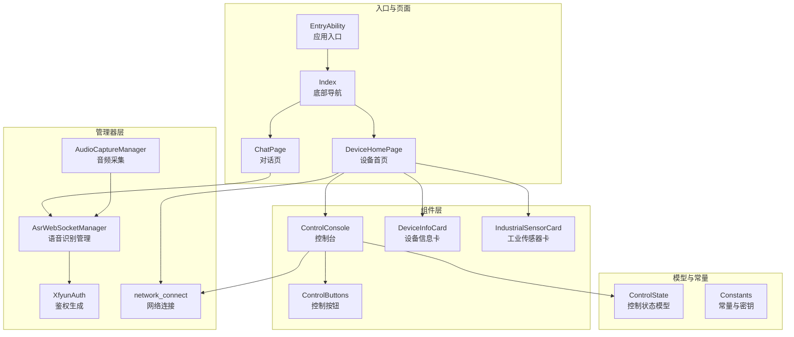
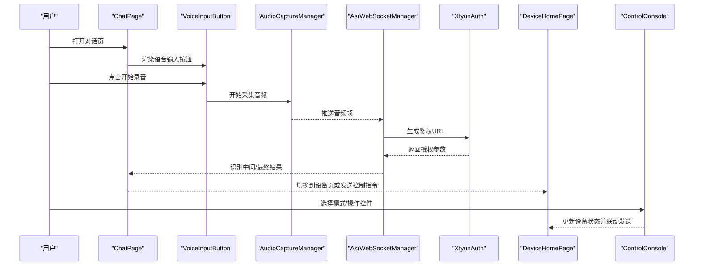
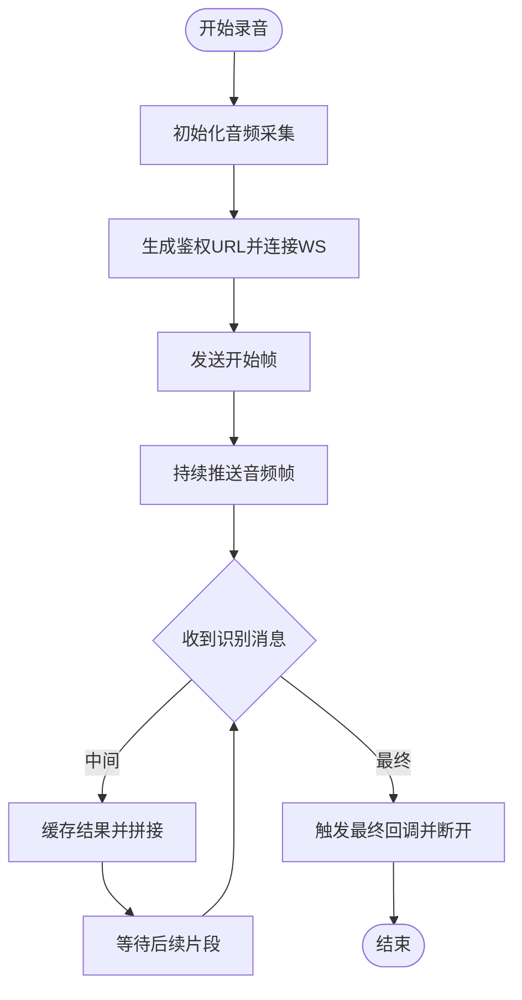
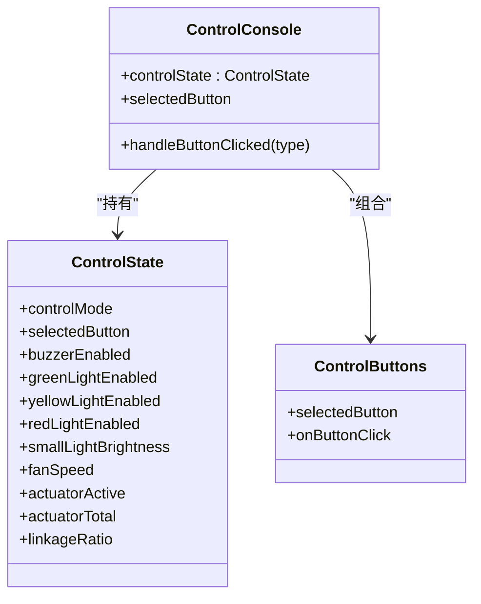
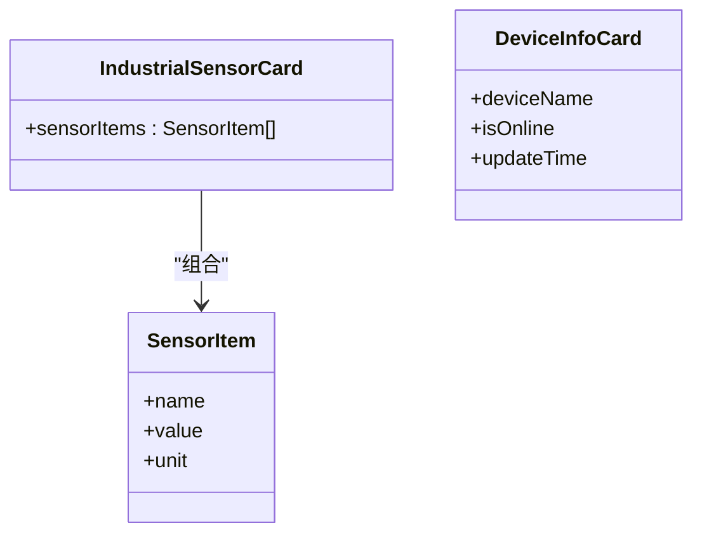
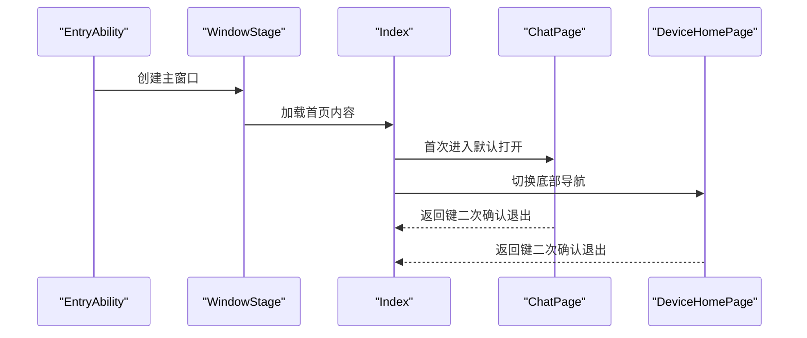
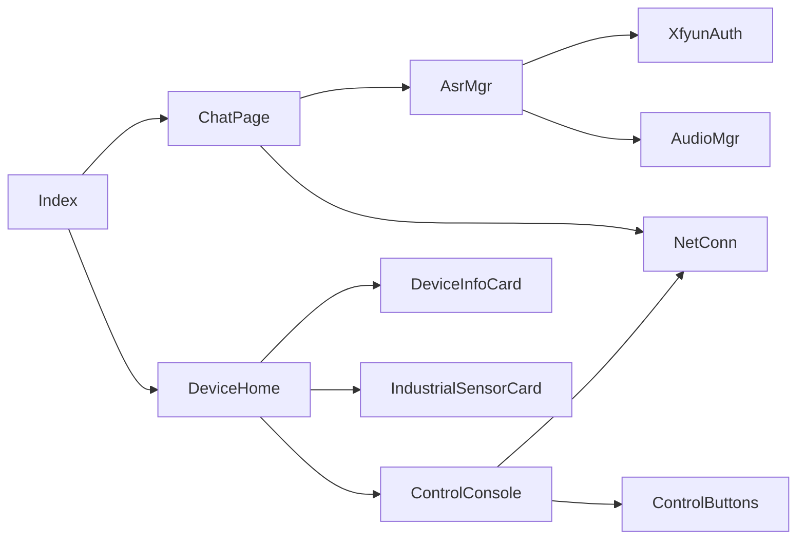

# 项目介绍

<cite>
**本文引用的文件**
- [EntryAbility.ets](file://entry/src/main/ets/entryability/EntryAbility.ets)
- [Index.ets](file://entry/src/main/ets/pages/Index.ets)
- [ChatPage.ets](file://entry/src/main/ets/pages/ChatPage.ets)
- [DeviceHomePage.ets](file://entry/src/main/ets/pages/DeviceHomePage.ets)
- [ControlConsole.ets](file://entry/src/main/ets/components/control/ControlConsole.ets)
- [ControlButtons.ets](file://entry/src/main/ets/components/control/ControlButtons.ets)
- [ControlState.ets](file://entry/src/main/ets/models/ControlState.ets)
- [AsrWebSocketManager.ets](file://entry/src/main/ets/managers/AsrWebSocketManager.ets)
- [AudioCaptureManager.ets](file://entry/src/main/ets/managers/AudioCaptureManager.ets)
- [XfyunAuth.ets](file://entry/src/main/ets/managers/XfyunAuth.ets)
- [Constants.ets](file://entry/src/main/ets/common/Constants.ets)
- [IndustrialSensorCard.ets](file://entry/src/main/ets/components/sensor/IndustrialSensorCard.ets)
- [DeviceInfoCard.ets](file://entry/src/main/ets/components/device/DeviceInfoCard.ets)
- [network_connect.ets](file://entry/src/main/ets/pages/network_connect.ets)
</cite>

## 目录
1. [简介](#简介)
2. [项目结构](#项目结构)
3. [核心组件](#核心组件)
4. [架构总览](#架构总览)
5. [详细组件分析](#详细组件分析)
6. [依赖关系分析](#依赖关系分析)
7. [性能考虑](#性能考虑)
8. [故障排查指南](#故障排查指南)
9. [结论](#结论)
10. [附录](#附录)

## 简介
SmartController 是一款基于 OpenHarmony 的智能设备控制应用，旨在为工业与消费级用户提供一体化的语音交互、设备监控与多模式控制体验。项目围绕“语音控制 + 设备联动 + 实时监控”的核心目标，结合讯飞语音识别能力与本地化控制组件，实现从“听懂指令”到“执行动作”的闭环。

在 OpenHarmony 生态中，SmartController 的独特定位体现在：
- 以 ArkTS/ArkUI 为统一开发语言与界面框架，适配多终端形态
- 将语音 ASR 与设备控制解耦为可插拔模块，便于扩展与替换
- 提供工业级传感器数据卡片与设备状态可视化，满足工业场景对实时性与稳定性的要求

本项目解决的实际问题与典型场景包括：
- 工业设备远程监控与快速启停控制，降低人工巡检成本
- 智能家居场景下的语音控制与灯光/风扇联动
- 多设备协同与事件日志、告警队列的可视化呈现

目标用户群体覆盖：
- 普通消费者：通过语音快速控制家电与灯光
- 工业用户：通过设备卡片与传感器面板进行集中监控与应急处置

技术创新点与竞争优势：
- 低延迟音频采集与 WebSocket 推流，配合讯飞云端识别，提升语音交互体验
- 控制状态模型与联动控制台的组合，支持场景/开关/模拟量三种控制模式
- 事件日志与告警队列组件化封装，便于在不同页面复用

## 项目结构
项目采用按功能域划分的目录组织方式，主要包含入口能力、页面层、组件层、模型层、管理器层与公共资源。整体结构如下：

图表来源
- [EntryAbility.ets:1-48](file://entry/src/main/ets/entryability/EntryAbility.ets#L1-L48)
- [Index.ets:1-115](file://entry/src/main/ets/pages/Index.ets#L1-L115)
- [ChatPage.ets:1-76](file://entry/src/main/ets/pages/ChatPage.ets#L1-L76)
- [DeviceHomePage.ets:1-73](file://entry/src/main/ets/pages/DeviceHomePage.ets#L1-L73)
- [ControlConsole.ets:1-172](file://entry/src/main/ets/components/control/ControlConsole.ets#L1-L172)
- [ControlButtons.ets:1-48](file://entry/src/main/ets/components/control/ControlButtons.ets#L1-L48)
- [ControlState.ets:1-67](file://entry/src/main/ets/models/ControlState.ets#L1-L67)
- [AsrWebSocketManager.ets:1-271](file://entry/src/main/ets/managers/AsrWebSocketManager.ets#L1-L271)
- [AudioCaptureManager.ets:1-80](file://entry/src/main/ets/managers/AudioCaptureManager.ets#L1-L80)
- [XfyunAuth.ets:1-34](file://entry/src/main/ets/managers/XfyunAuth.ets#L1-L34)
- [Constants.ets:1-82](file://entry/src/main/ets/common/Constants.ets#L1-L82)
- [IndustrialSensorCard.ets:1-109](file://entry/src/main/ets/components/sensor/IndustrialSensorCard.ets#L1-L109)
- [DeviceInfoCard.ets:1-59](file://entry/src/main/ets/components/device/DeviceInfoCard.ets#L1-L59)
- [network_connect.ets](file://entry/src/main/ets/pages/network_connect.ets)

章节来源
- [EntryAbility.ets:1-48](file://entry/src/main/ets/entryability/EntryAbility.ets#L1-L48)
- [Index.ets:1-115](file://entry/src/main/ets/pages/Index.ets#L1-L115)

## 核心组件
- 应用入口与窗口生命周期：负责设置颜色模式、加载首页内容、前台/后台切换日志记录。
- 页面导航与路由：底部三栏导航（对话/数据/设备），首屏默认打开对话页。
- 语音对话页：展示消息列表与语音输入按钮，支持返回键二次确认退出。
- 设备首页：设备信息卡、快捷控制台、执行器占用率、事件日志与告警队列。
- 控制台：场景/开关/模拟量三种模式，状态指示器与滑块控件，联动网络发送控制命令。
- 语音识别：音频采集、WebSocket 连接、讯飞鉴权、识别结果解析与回调。
- 工业传感器卡：展示多路传感器数据，支持空态提示与单位显示。
- 设备信息卡：设备名称、在线状态、更新时间与占位图。
- 控制状态模型：统一管理控制模式、按钮选择、灯与风扇等状态字段。

章节来源
- [ChatPage.ets:1-76](file://entry/src/main/ets/pages/ChatPage.ets#L1-L76)
- [DeviceHomePage.ets:1-73](file://entry/src/main/ets/pages/DeviceHomePage.ets#L1-L73)
- [ControlConsole.ets:1-172](file://entry/src/main/ets/components/control/ControlConsole.ets#L1-L172)
- [ControlButtons.ets:1-48](file://entry/src/main/ets/components/control/ControlButtons.ets#L1-L48)
- [ControlState.ets:1-67](file://entry/src/main/ets/models/ControlState.ets#L1-L67)
- [AsrWebSocketManager.ets:1-271](file://entry/src/main/ets/managers/AsrWebSocketManager.ets#L1-L271)
- [AudioCaptureManager.ets:1-80](file://entry/src/main/ets/managers/AudioCaptureManager.ets#L1-L80)
- [IndustrialSensorCard.ets:1-109](file://entry/src/main/ets/components/sensor/IndustrialSensorCard.ets#L1-L109)
- [DeviceInfoCard.ets:1-59](file://entry/src/main/ets/components/device/DeviceInfoCard.ets#L1-L59)

## 架构总览
SmartController 采用“页面-组件-模型-管理器”的分层架构，页面负责编排与交互，组件负责 UI 与状态展示，模型负责状态与规则，管理器负责外部服务对接（如语音识别、音频采集、网络通信）。整体流程围绕“语音输入 -> 识别 -> 命令下发 -> 状态更新 -> 反馈展示”展开。

图表来源
- [ChatPage.ets:1-76](file://entry/src/main/ets/pages/ChatPage.ets#L1-L76)
- [AudioCaptureManager.ets:1-80](file://entry/src/main/ets/managers/AudioCaptureManager.ets#L1-L80)
- [AsrWebSocketManager.ets:1-271](file://entry/src/main/ets/managers/AsrWebSocketManager.ets#L1-L271)
- [XfyunAuth.ets:1-34](file://entry/src/main/ets/managers/XfyunAuth.ets#L1-L34)
- [DeviceHomePage.ets:1-73](file://entry/src/main/ets/pages/DeviceHomePage.ets#L1-L73)
- [ControlConsole.ets:1-172](file://entry/src/main/ets/components/control/ControlConsole.ets#L1-L172)

## 详细组件分析

### 语音识别与音频采集
- 音频采集：配置采样率、通道数、编码格式，从麦克风源采集原始音频数据，提供 start/stop/release 生命周期管理。
- WebSocket 识别：构造讯飞 ASR 请求帧，建立长连接，接收识别结果并按序拼接，区分中间与最终结果，异常时回调错误。
- 讯飞鉴权：生成 Authorization 与日期头，拼装 WebSocket URL，确保连接安全与合规。
- 关键常量：采样率、通道数、缓冲大小与讯飞 API 凭据集中管理，便于维护与替换。

图表来源
- [AudioCaptureManager.ets:1-80](file://entry/src/main/ets/managers/AudioCaptureManager.ets#L1-L80)
- [AsrWebSocketManager.ets:1-271](file://entry/src/main/ets/managers/AsrWebSocketManager.ets#L1-L271)
- [XfyunAuth.ets:1-34](file://entry/src/main/ets/managers/XfyunAuth.ets#L1-L34)
- [Constants.ets:1-82](file://entry/src/main/ets/common/Constants.ets#L1-L82)

章节来源
- [AudioCaptureManager.ets:1-80](file://entry/src/main/ets/managers/AudioCaptureManager.ets#L1-L80)
- [AsrWebSocketManager.ets:1-271](file://entry/src/main/ets/managers/AsrWebSocketManager.ets#L1-L271)
- [XfyunAuth.ets:1-34](file://entry/src/main/ets/managers/XfyunAuth.ets#L1-L34)
- [Constants.ets:1-82](file://entry/src/main/ets/common/Constants.ets#L1-L82)

### 设备控制台与多模式控制
- 控制模式：场景模式、开关模式、模拟量模式，分别适用于不同业务场景。
- 按钮类型：展示模式、告警模式、静音模式，支持单选高亮与状态同步。
- 状态指示器：蜂鸣器、绿灯、黄灯、红灯，支持点击切换并联动发送控制命令。
- 滑块控件：小灯亮度与风扇转速，范围 0-100，实时更新控制状态。
- 状态变更：通过 onStateChange 回调通知上层，保证 UI 与业务状态一致。

图表来源
- [ControlState.ets:1-67](file://entry/src/main/ets/models/ControlState.ets#L1-L67)
- [ControlConsole.ets:1-172](file://entry/src/main/ets/components/control/ControlConsole.ets#L1-L172)
- [ControlButtons.ets:1-48](file://entry/src/main/ets/components/control/ControlButtons.ets#L1-L48)

章节来源
- [ControlState.ets:1-67](file://entry/src/main/ets/models/ControlState.ets#L1-L67)
- [ControlConsole.ets:1-172](file://entry/src/main/ets/components/control/ControlConsole.ets#L1-L172)
- [ControlButtons.ets:1-48](file://entry/src/main/ets/components/control/ControlButtons.ets#L1-L48)

### 工业传感器与设备信息展示
- 工业传感器卡：支持多路传感器数据展示，包含名称、数值与单位，空态提示与圆角背景增强可读性。
- 设备信息卡：展示设备名称、在线状态标签与更新时间，右侧时间显示，左侧设备名称与在线状态组合布局。

图表来源
- [IndustrialSensorCard.ets:1-109](file://entry/src/main/ets/components/sensor/IndustrialSensorCard.ets#L1-L109)
- [DeviceInfoCard.ets:1-59](file://entry/src/main/ets/components/device/DeviceInfoCard.ets#L1-L59)

章节来源
- [IndustrialSensorCard.ets:1-109](file://entry/src/main/ets/components/sensor/IndustrialSensorCard.ets#L1-L109)
- [DeviceInfoCard.ets:1-59](file://entry/src/main/ets/components/device/DeviceInfoCard.ets#L1-L59)

### 页面与导航
- 应用入口：设置颜色模式、加载首页 Index、记录生命周期日志。
- 首页 Index：底部三栏导航，首次进入默认打开对话页，支持 Tab 切换与路由映射。
- 对话页 ChatPage：消息列表渲染、语音输入按钮、返回键二次确认退出。
- 设备首页 DeviceHomePage：设备信息卡、快捷控制台、执行器占用率、事件日志与告警队列。

图表来源
- [EntryAbility.ets:1-48](file://entry/src/main/ets/entryability/EntryAbility.ets#L1-L48)
- [Index.ets:1-115](file://entry/src/main/ets/pages/Index.ets#L1-L115)
- [ChatPage.ets:1-76](file://entry/src/main/ets/pages/ChatPage.ets#L1-L76)
- [DeviceHomePage.ets:1-73](file://entry/src/main/ets/pages/DeviceHomePage.ets#L1-L73)

章节来源
- [EntryAbility.ets:1-48](file://entry/src/main/ets/entryability/EntryAbility.ets#L1-L48)
- [Index.ets:1-115](file://entry/src/main/ets/pages/Index.ets#L1-L115)
- [ChatPage.ets:1-76](file://entry/src/main/ets/pages/ChatPage.ets#L1-L76)
- [DeviceHomePage.ets:1-73](file://entry/src/main/ets/pages/DeviceHomePage.ets#L1-L73)

## 依赖关系分析
- 页面依赖：Index 作为入口，依赖 ChatPage 与 DeviceHomePage；ChatPage 依赖语音输入按钮与网络连接；DeviceHomePage 依赖设备信息卡、控制台与日志/告警组件。
- 组件依赖：ControlConsole 依赖 ControlButtons、状态指示器与滑块控件；工业传感器卡与设备信息卡为纯展示型组件，依赖主题常量与尺寸常量。
- 管理器依赖：AsrWebSocketManager 依赖 XfyunAuth 与音频采集管理器；网络连接模块与控制台联动，实现设备控制命令下发。
- 模型依赖：ControlState 作为状态中心，被控制台与各组件共享，保证状态一致性。

图表来源
- [Index.ets:1-115](file://entry/src/main/ets/pages/Index.ets#L1-L115)
- [ChatPage.ets:1-76](file://entry/src/main/ets/pages/ChatPage.ets#L1-L76)
- [DeviceHomePage.ets:1-73](file://entry/src/main/ets/pages/DeviceHomePage.ets#L1-L73)
- [ControlConsole.ets:1-172](file://entry/src/main/ets/components/control/ControlConsole.ets#L1-L172)
- [ControlButtons.ets:1-48](file://entry/src/main/ets/components/control/ControlButtons.ets#L1-L48)
- [AsrWebSocketManager.ets:1-271](file://entry/src/main/ets/managers/AsrWebSocketManager.ets#L1-L271)
- [AudioCaptureManager.ets:1-80](file://entry/src/main/ets/managers/AudioCaptureManager.ets#L1-L80)
- [XfyunAuth.ets:1-34](file://entry/src/main/ets/managers/XfyunAuth.ets#L1-L34)
- [DeviceInfoCard.ets:1-59](file://entry/src/main/ets/components/device/DeviceInfoCard.ets#L1-L59)
- [IndustrialSensorCard.ets:1-109](file://entry/src/main/ets/components/sensor/IndustrialSensorCard.ets#L1-L109)
- [network_connect.ets](file://entry/src/main/ets/pages/network_connect.ets)

章节来源
- [Index.ets:1-115](file://entry/src/main/ets/pages/Index.ets#L1-L115)
- [DeviceHomePage.ets:1-73](file://entry/src/main/ets/pages/DeviceHomePage.ets#L1-L73)
- [ControlConsole.ets:1-172](file://entry/src/main/ets/components/control/ControlConsole.ets#L1-L172)
- [AsrWebSocketManager.ets:1-271](file://entry/src/main/ets/managers/AsrWebSocketManager.ets#L1-L271)

## 性能考虑
- 音频采集与识别：合理设置采样率与缓冲大小，避免过大的音频块导致识别延迟；WebSocket 连接成功后再推送音频，减少无效传输。
- UI 响应：控制台状态更新采用局部刷新与响应式绑定，避免全量重绘；列表渲染使用 ForEach 并提供稳定 key。
- 网络稳定性：设备页在进入时主动重连网络，确保控制命令可靠下发；对异常状态进行降级提示。
- 资源释放：音频采集与 WebSocket 连接在停止或销毁时及时释放，防止资源泄漏。

## 故障排查指南
- 无法连接语音识别：检查讯飞鉴权参数与网络连通性；查看 WebSocket 错误回调与日志输出。
- 录音无声或识别失败：确认麦克风权限与音频采集初始化是否成功；验证采样率与编码格式配置。
- 控制命令未生效：检查网络连接状态与控制台联动发送逻辑；核对设备端对命令的解析与执行。
- 返回键退出异常：确认二次确认逻辑与定时器清理；避免重复注册监听导致的状态错乱。

章节来源
- [AsrWebSocketManager.ets:1-271](file://entry/src/main/ets/managers/AsrWebSocketManager.ets#L1-L271)
- [AudioCaptureManager.ets:1-80](file://entry/src/main/ets/managers/AudioCaptureManager.ets#L1-L80)
- [Constants.ets:1-82](file://entry/src/main/ets/common/Constants.ets#L1-L82)
- [DeviceHomePage.ets:1-73](file://entry/src/main/ets/pages/DeviceHomePage.ets#L1-L73)

## 结论
SmartController 通过清晰的分层架构与模块化设计，将语音识别、设备控制与数据展示有机结合，既满足消费级用户的便捷操作，也能支撑工业场景对稳定性与可视化的更高要求。项目在 OpenHarmony 生态中具备良好的可移植性与扩展性，为后续接入更多设备协议与第三方服务提供了坚实基础。

## 附录
- 快速上手建议
  - 熟悉页面与组件：先从 Index 与两个核心页面入手，理解导航与数据流向。
  - 掌握控制模型：学习 ControlState 的字段与控制台联动机制，便于扩展新设备。
  - 集成语音能力：参考 AsrWebSocketManager 的连接与鉴权流程，替换为实际后端服务。
  - 规范命名与常量：将讯飞密钥与业务常量集中在 Constants 中，便于维护与迁移。