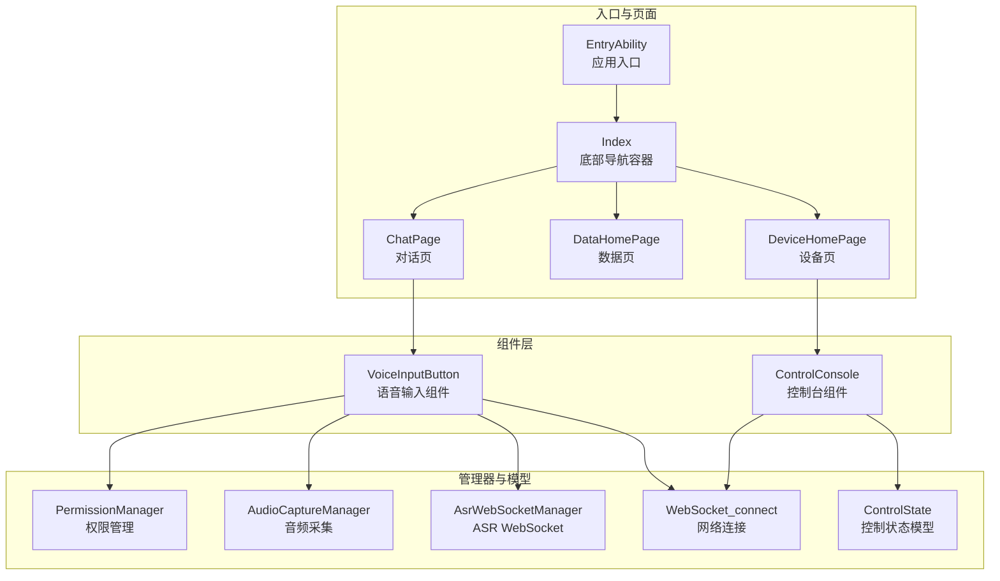
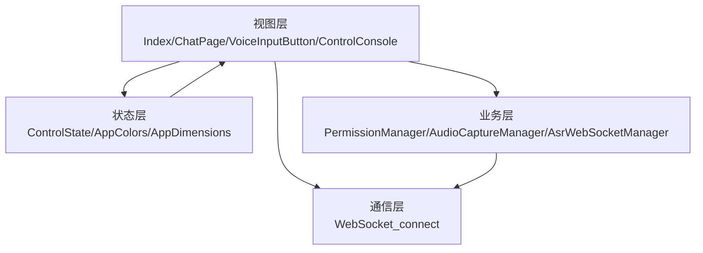
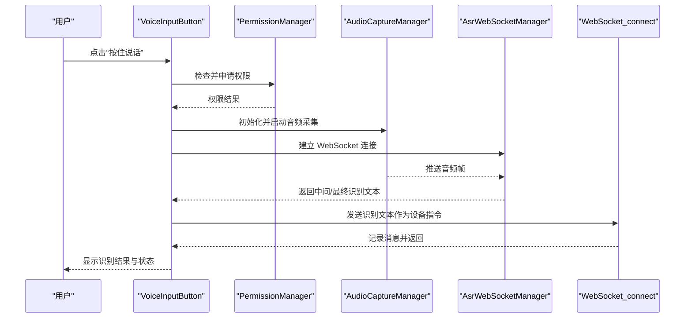
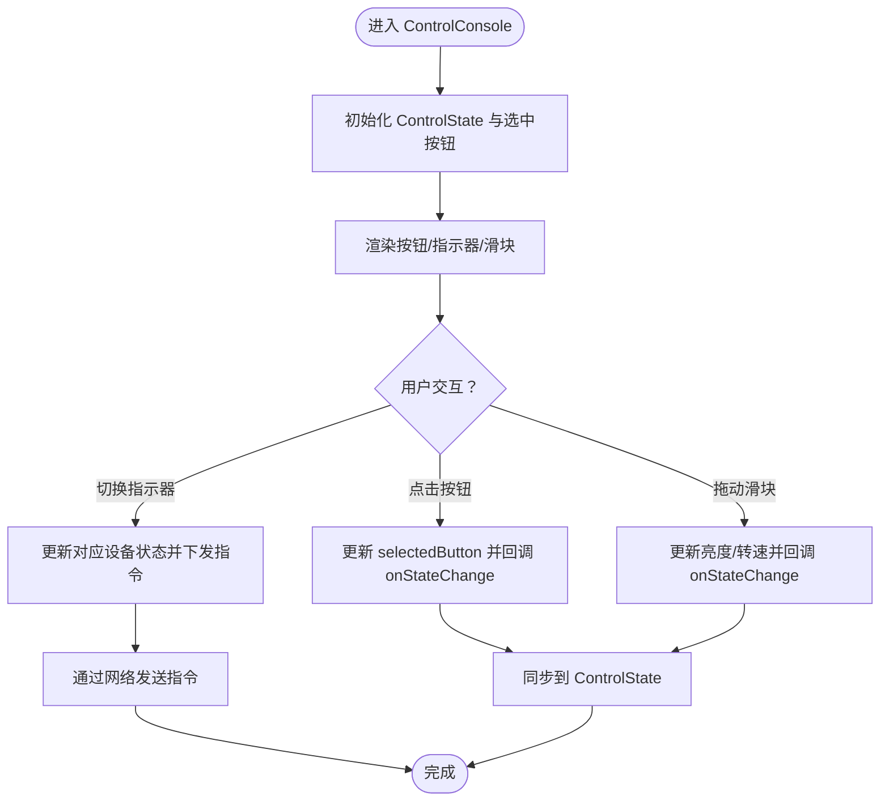
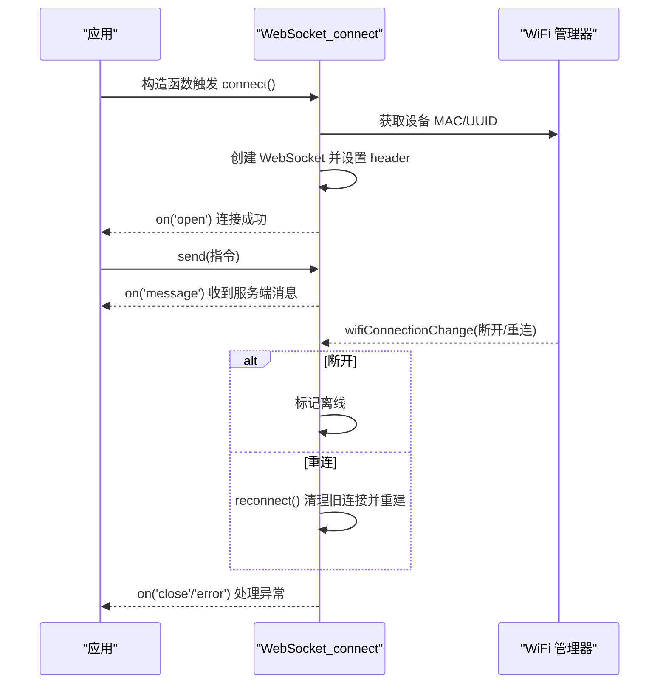
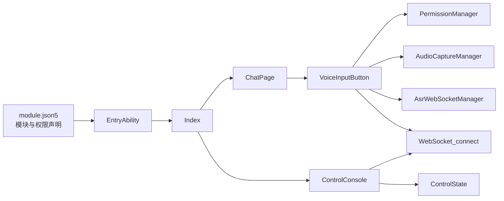

# 项目概述

<cite>
**本文引用的文件**
- [EntryAbility.ets](file://entry/src/main/ets/entryability/EntryAbility.ets)
- [Index.ets](file://entry/src/main/ets/pages/Index.ets)
- [ChatPage.ets](file://entry/src/main/ets/pages/ChatPage.ets)
- [network_connect.ets](file://entry/src/main/ets/pages/network_connect.ets)
- [VoiceInputButton.ets](file://entry/src/main/ets/components/chat/VoiceInputButton.ets)
- [AudioCaptureManager.ets](file://entry/src/main/ets/managers/AudioCaptureManager.ets)
- [AsrWebSocketManager.ets](file://entry/src/main/ets/managers/AsrWebSocketManager.ets)
- [PermissionManager.ets](file://entry/src/main/ets/managers/PermissionManager.ets)
- [ControlConsole.ets](file://entry/src/main/ets/components/control/ControlConsole.ets)
- [ControlState.ets](file://entry/src/main/ets/models/ControlState.ets)
- [AppColors.ets](file://entry/src/main/ets/constants/AppColors.ets)
- [AppDimensions.ets](file://entry/src/main/ets/constants/AppDimensions.ets)
- [module.json5](file://entry/src/main/module.json5)
</cite>

## 目录
1. [简介](#简介)
2. [项目结构](#项目结构)
3. [核心组件](#核心组件)
4. [架构总览](#架构总览)
5. [详细组件分析](#详细组件分析)
6. [依赖关系分析](#依赖关系分析)
7. [性能考虑](#性能考虑)
8. [故障排查指南](#故障排查指南)
9. [结论](#结论)
10. [附录](#附录)

## 简介
SmartController 是一款面向 OpenHarmony 的智能设备控制应用，围绕“语音控制 + 设备监控 + 多模式控制”的核心目标构建。项目采用 ArkTS/TypeScript 开发语言，基于 OpenHarmony SDK，结合 WebSocket 实现与云端网关通信，并通过语音识别（ASR）与音频采集能力，提供自然的人机交互体验。应用在 UI 层采用组件化架构，支持多 Tab 切换与本地状态管理，同时通过统一的颜色与尺寸常量实现一致的主题风格。

本项目在 OpenHarmony 生态中的定位是：以简洁直观的界面承载设备控制与数据展示，配合语音输入降低操作门槛，满足工业/环境监测类场景下的远程控制与可视化需求。目标用户包括工程师、运维人员与对语音交互有偏好的终端用户；核心价值在于“低门槛语音控制 + 实时数据反馈 + 可扩展的多模式控制”。

## 项目结构
项目采用“模块化 + 组件化”组织方式，入口模块为 entry，核心页面与组件分布在 pages 与 components 下，业务支撑能力集中在 managers 与 models，通用常量与资源位于 constants 与 resources。模块清单在 module.json5 中声明，包含主 Ability、备份 Ability、权限声明与页面配置。

**图表来源**
- [EntryAbility.ets:1-48](file://entry/src/main/ets/entryability/EntryAbility.ets#L1-L48)
- [Index.ets:1-115](file://entry/src/main/ets/pages/Index.ets#L1-L115)
- [ChatPage.ets:1-83](file://entry/src/main/ets/pages/ChatPage.ets#L1-L83)
- [VoiceInputButton.ets:1-125](file://entry/src/main/ets/components/chat/VoiceInputButton.ets#L1-L125)
- [AudioCaptureManager.ets:1-80](file://entry/src/main/ets/managers/AudioCaptureManager.ets#L1-L80)
- [AsrWebSocketManager.ets:1-271](file://entry/src/main/ets/managers/AsrWebSocketManager.ets#L1-L271)
- [network_connect.ets:1-321](file://entry/src/main/ets/pages/network_connect.ets#L1-L321)
- [ControlConsole.ets:1-172](file://entry/src/main/ets/components/control/ControlConsole.ets#L1-L172)
- [ControlState.ets:1-67](file://entry/src/main/ets/models/ControlState.ets#L1-L67)

**章节来源**
- [module.json5:1-71](file://entry/src/main/module.json5#L1-L71)
- [EntryAbility.ets:1-48](file://entry/src/main/ets/entryability/EntryAbility.ets#L1-L48)
- [Index.ets:1-115](file://entry/src/main/ets/pages/Index.ets#L1-L115)

## 核心组件
- 应用入口与窗口生命周期：EntryAbility 负责 Ability 生命周期与主窗口加载，设置颜色模式并加载首页 Index。
- 导航与页面：Index 提供底部三栏导航（对话/数据/设备），通过 Navigation 与 NavDestination 管理子页路由。
- 对话页：ChatPage 展示消息列表与语音输入区域，集成网络连接与返回键确认退出逻辑。
- 语音输入组件：VoiceInputButton 负责麦克风权限检查、音频采集、ASR 连接与识别结果处理，并将识别文本作为设备指令发送。
- 网络连接：WebSocket_connect 封装 WebSocket 连接、消息收发、WiFi 状态监听与自动重连机制。
- 音频与 ASR：AudioCaptureManager 负责音频采集；AsrWebSocketManager 负责与讯飞 ASR 服务的 WebSocket 通信与结果解析。
- 控制台组件：ControlConsole 整合按钮、状态指示器与滑块，驱动设备联动控制并通过网络发送指令。
- 控制状态模型：ControlState 定义控制模式、按钮类型与设备状态字段，支撑 UI 与业务逻辑。
- 主题与尺寸：AppColors 与 AppDimensions 提供统一的颜色与尺寸规范，保证视觉一致性。

**章节来源**
- [EntryAbility.ets:1-48](file://entry/src/main/ets/entryability/EntryAbility.ets#L1-L48)
- [Index.ets:1-115](file://entry/src/main/ets/pages/Index.ets#L1-L115)
- [ChatPage.ets:1-83](file://entry/src/main/ets/pages/ChatPage.ets#L1-L83)
- [VoiceInputButton.ets:1-125](file://entry/src/main/ets/components/chat/VoiceInputButton.ets#L1-L125)
- [network_connect.ets:1-321](file://entry/src/main/ets/pages/network_connect.ets#L1-L321)
- [AudioCaptureManager.ets:1-80](file://entry/src/main/ets/managers/AudioCaptureManager.ets#L1-L80)
- [AsrWebSocketManager.ets:1-271](file://entry/src/main/ets/managers/AsrWebSocketManager.ets#L1-L271)
- [ControlConsole.ets:1-172](file://entry/src/main/ets/components/control/ControlConsole.ets#L1-L172)
- [ControlState.ets:1-67](file://entry/src/main/ets/models/ControlState.ets#L1-L67)
- [AppColors.ets:1-47](file://entry/src/main/ets/constants/AppColors.ets#L1-L47)
- [AppDimensions.ets:1-40](file://entry/src/main/ets/constants/AppDimensions.ets#L1-L40)

## 架构总览
项目采用“MVVM 风格”的组件化架构：
- 视图层（View）：ArkUI 组件（如 Index、ChatPage、VoiceInputButton、ControlConsole）负责 UI 呈现与用户交互。
- 状态层（State/Model）：ControlState、AppColors、AppDimensions 等提供状态与配置，部分页面通过 ObservedV2 类型对象暴露可观察状态。
- 业务层（Manager/Service）：PermissionManager、AudioCaptureManager、AsrWebSocketManager、WebSocket_connect 提供权限、音频、语音识别与网络通信能力。
- 通信层：WebSocket_connect 与云端网关通信，VoiceInputButton 通过 ASR 将语音转文本并下发控制指令。

**图表来源**
- [Index.ets:1-115](file://entry/src/main/ets/pages/Index.ets#L1-L115)
- [ChatPage.ets:1-83](file://entry/src/main/ets/pages/ChatPage.ets#L1-L83)
- [VoiceInputButton.ets:1-125](file://entry/src/main/ets/components/chat/VoiceInputButton.ets#L1-L125)
- [ControlConsole.ets:1-172](file://entry/src/main/ets/components/control/ControlConsole.ets#L1-L172)
- [ControlState.ets:1-67](file://entry/src/main/ets/models/ControlState.ets#L1-L67)
- [AppColors.ets:1-47](file://entry/src/main/ets/constants/AppColors.ets#L1-L47)
- [AppDimensions.ets:1-40](file://entry/src/main/ets/constants/AppDimensions.ets#L1-L40)
- [PermissionManager.ets:1-28](file://entry/src/main/ets/managers/PermissionManager.ets#L1-L28)
- [AudioCaptureManager.ets:1-80](file://entry/src/main/ets/managers/AudioCaptureManager.ets#L1-L80)
- [AsrWebSocketManager.ets:1-271](file://entry/src/main/ets/managers/AsrWebSocketManager.ets#L1-L271)
- [network_connect.ets:1-321](file://entry/src/main/ets/pages/network_connect.ets#L1-L321)

## 详细组件分析

### 语音输入与 ASR 流程
语音输入组件 VoiceInputButton 负责完整的语音识别链路：权限校验 → 音频采集 → ASR 连接 → 识别结果 → 指令下发。

**图表来源**
- [VoiceInputButton.ets:1-125](file://entry/src/main/ets/components/chat/VoiceInputButton.ets#L1-L125)
- [PermissionManager.ets:1-28](file://entry/src/main/ets/managers/PermissionManager.ets#L1-L28)
- [AudioCaptureManager.ets:1-80](file://entry/src/main/ets/managers/AudioCaptureManager.ets#L1-L80)
- [AsrWebSocketManager.ets:1-271](file://entry/src/main/ets/managers/AsrWebSocketManager.ets#L1-L271)
- [network_connect.ets:1-321](file://entry/src/main/ets/pages/network_connect.ets#L1-L321)

**章节来源**
- [VoiceInputButton.ets:1-125](file://entry/src/main/ets/components/chat/VoiceInputButton.ets#L1-L125)
- [PermissionManager.ets:1-28](file://entry/src/main/ets/managers/PermissionManager.ets#L1-L28)
- [AudioCaptureManager.ets:1-80](file://entry/src/main/ets/managers/AudioCaptureManager.ets#L1-L80)
- [AsrWebSocketManager.ets:1-271](file://entry/src/main/ets/managers/AsrWebSocketManager.ets#L1-L271)
- [network_connect.ets:1-321](file://entry/src/main/ets/pages/network_connect.ets#L1-L321)

### 设备控制台与状态同步
ControlConsole 整合多种控制元素，统一管理设备状态并通过网络下发指令，同时将状态变化通知上层。

**图表来源**
- [ControlConsole.ets:1-172](file://entry/src/main/ets/components/control/ControlConsole.ets#L1-L172)
- [ControlState.ets:1-67](file://entry/src/main/ets/models/ControlState.ets#L1-L67)
- [network_connect.ets:1-321](file://entry/src/main/ets/pages/network_connect.ets#L1-L321)

**章节来源**
- [ControlConsole.ets:1-172](file://entry/src/main/ets/components/control/ControlConsole.ets#L1-L172)
- [ControlState.ets:1-67](file://entry/src/main/ets/models/ControlState.ets#L1-L67)

### WebSocket 连接与自动重连
WebSocket_connect 负责与云端网关建立长连接，处理消息收发、WiFi 状态监听与自动重连，保障在网络波动时的稳定性。

**图表来源**
- [network_connect.ets:1-321](file://entry/src/main/ets/pages/network_connect.ets#L1-L321)

**章节来源**
- [network_connect.ets:1-321](file://entry/src/main/ets/pages/network_connect.ets#L1-L321)

## 依赖关系分析
- 模块声明：module.json5 声明入口模块、主 Ability、备份 Ability、页面与权限，确保应用在 OpenHarmony 上正确安装与运行。
- 组件耦合：VoiceInputButton 依赖 PermissionManager、AudioCaptureManager、AsrWebSocketManager 与 WebSocket_connect；ControlConsole 依赖 ControlState 与 WebSocket_connect。
- 外部依赖：OpenHarmony SDK 提供 Ability、窗口、网络、WebSocket、权限、音频、WiFi 等能力；讯飞 ASR 通过 WebSocket 与鉴权服务对接。

**图表来源**
- [module.json5:1-71](file://entry/src/main/module.json5#L1-L71)
- [EntryAbility.ets:1-48](file://entry/src/main/ets/entryability/EntryAbility.ets#L1-L48)
- [Index.ets:1-115](file://entry/src/main/ets/pages/Index.ets#L1-L115)
- [ChatPage.ets:1-83](file://entry/src/main/ets/pages/ChatPage.ets#L1-L83)
- [VoiceInputButton.ets:1-125](file://entry/src/main/ets/components/chat/VoiceInputButton.ets#L1-L125)
- [PermissionManager.ets:1-28](file://entry/src/main/ets/managers/PermissionManager.ets#L1-L28)
- [AudioCaptureManager.ets:1-80](file://entry/src/main/ets/managers/AudioCaptureManager.ets#L1-L80)
- [AsrWebSocketManager.ets:1-271](file://entry/src/main/ets/managers/AsrWebSocketManager.ets#L1-L271)
- [network_connect.ets:1-321](file://entry/src/main/ets/pages/network_connect.ets#L1-L321)
- [ControlConsole.ets:1-172](file://entry/src/main/ets/components/control/ControlConsole.ets#L1-L172)
- [ControlState.ets:1-67](file://entry/src/main/ets/models/ControlState.ets#L1-L67)

**章节来源**
- [module.json5:1-71](file://entry/src/main/module.json5#L1-L71)

## 性能考虑
- 音频采集与传输：合理设置采样率与音频帧大小，避免过大导致延迟；在录音结束时及时释放资源，减少内存与 CPU 占用。
- ASR 连接与结果缓存：利用乱序结果缓存与动态修正机制提升识别鲁棒性；在最终结果出现后及时断开连接，节省网络与电量。
- WebSocket 重连策略：引入防抖锁与延迟重连，避免频繁重连造成资源浪费；在网络恢复后延迟重建连接，等待路由稳定。
- UI 渲染优化：使用局部状态与 @State/@Local 控制最小化重绘；组件内聚状态，避免跨层级频繁传递。
- 权限与安全：仅在需要时申请权限，避免阻塞主线程；对异常进行降级处理，保证用户体验。

## 故障排查指南
- 无法连接 ASR：检查权限是否授予、网络是否可用、WebSocket URL 与鉴权参数是否正确；查看回调中的错误码与日志。
- 录音无输出：确认麦克风权限、音频采集初始化是否成功、start 回调是否触发；检查音频通道与采样格式配置。
- WebSocket 断连：关注 WiFi 状态变化与异常关闭事件，启用自动重连；检查 header 参数与服务端握手流程。
- 指令未下发：确认网络状态、消息队列与 pendingRequests 状态；检查消息格式与 session_id 生命周期。
- 返回键行为异常：检查 ExitConfirmManager 的状态重置与定时器清理逻辑，确保在切换 Tab 时正确复位。

**章节来源**
- [VoiceInputButton.ets:1-125](file://entry/src/main/ets/components/chat/VoiceInputButton.ets#L1-L125)
- [AsrWebSocketManager.ets:1-271](file://entry/src/main/ets/managers/AsrWebSocketManager.ets#L1-L271)
- [AudioCaptureManager.ets:1-80](file://entry/src/main/ets/managers/AudioCaptureManager.ets#L1-L80)
- [network_connect.ets:1-321](file://entry/src/main/ets/pages/network_connect.ets#L1-L321)
- [Constants.ets:1-82](file://entry/src/main/ets/common/Constants.ets#L1-L82)

## 结论
SmartController 以 OpenHarmony 为基础，结合 ArkTS/TypeScript 与 ArkUI 组件化架构，实现了“语音控制 + 设备监控 + 多模式控制”的完整闭环。通过清晰的模块划分与职责分离，项目在易维护性与扩展性方面具备良好基础。建议后续在以下方向持续演进：完善单元测试与集成测试覆盖、引入状态持久化与离线策略、增强主题与无障碍能力、以及对网络与语音链路进行更细粒度的可观测性与日志体系。

## 附录
- 技术栈概览
  - 开发语言：ArkTS/TypeScript
  - UI 框架：ArkUI
  - 系统框架：OpenHarmony SDK
  - 网络通信：WebSocket（NetworkKit）
  - 音频与权限：multimedia.audio、abilityAccessCtrl
  - 语音识别：WebSocket（讯飞 ASR）
  - 资源与模块：module.json5 声明入口、页面与权限

- 应用场景与用户
  - 工业/环境监测：通过语音快速下发控制指令，实时查看传感器数据与设备状态。
  - 运维与巡检：在复杂环境中以语音与可视化方式管理设备，降低操作门槛。
  - 终端用户：偏好语音交互的普通用户，通过简单指令实现设备联动。

- 核心价值主张
  - 低门槛：语音输入降低学习成本，适合非专业用户。
  - 实时性：WebSocket 实时推送数据与状态，保障响应速度。
  - 可扩展：组件化与模块化设计便于新增功能与接入更多设备。